# dbridge — Qt + SQLite + Excel 批量导入导出动态库

> 一份**面向新手**的详细架构文档。所有图都使用 Mermaid 语法（GitHub 网页端直接渲染），
> 配套有大量"为什么这么设计"的注释。建议从上到下顺序阅读。

---

## 目录

- [1. 我们要解决什么问题？](#1-我们要解决什么问题)
- [2. 快速开始](#2-快速开始)
- [3. 目录结构与文件分工](#3-目录结构与文件分工)
- [4. 核心术语词典](#4-核心术语词典)
- [5. 整体架构](#5-整体架构)
- [6. 整体流程图](#6-整体流程图)
- [7. 整体时序图](#7-整体时序图)
- [8. 局部架构（按模块）](#8-局部架构按模块)
- [9. 局部流程图](#9-局部流程图)
- [10. 局部时序图](#10-局部时序图)
- [11. 关键算法详解](#11-关键算法详解)
- [12. 三种 Profile 模式对比](#12-三种-profile-模式对比)
- [13. 错误码体系](#13-错误码体系)

---

## 1. 我们要解决什么问题？

业务场景：用户给你一个 Excel 文件，里面是数据；你要把这些数据**写入 SQLite 数据库**。
或者反过来，从数据库里把数据**导出成 Excel** 给用户。

听起来很简单？真做的时候你会遇到一堆问题：

| 痛点 | 朴素做法的后果 | dbridge 的处理 |
|---|---|---|
| 已有数据怎么办？ | `INSERT` 会撞主键报错；`INSERT OR REPLACE` 会**删掉旧行再插入**，破坏外键级联和未映射列 | 使用 `INSERT … ON CONFLICT(...) DO UPDATE`，原地更新 |
| 用户数据格式错了怎么办？ | 写到一半才发现，已经写了一半的脏数据进 DB | 导入前**全量校验**，错就整体回滚，DB 零落库 |
| 表结构是运行期临时建的怎么办？ | 必须改 C++ 代码重新编译 | 运行期**自省表结构**自动生成 Profile |
| 一行 Excel 数据要拆到多张表怎么办？ | 手写一堆 if-else | Profile 里描述映射关系，**声明式**搞定 |
| 一个 Sheet 里 A/B/C 三种行混编？ | 一堆 if-else | Profile 用 `discriminator` + `classes` 声明 |

**dbridge 是一个 C++ 动态库**，对外只暴露 3 个公开头文件（`DataBridge.h` / `Types.h` / `Errors.h`），
宿主程序链接 `dbridge` 即可使用。

---

## 2. 快速开始

```bash
# 1. 配置（需要 Qt 5.12.12 + CMake >= 3.16 + GCC 9+）
cmake -S . -B build \
  -DCMAKE_BUILD_TYPE=Debug \
  -DBUILD_TESTING=ON \
  -DCMAKE_PREFIX_PATH=/opt/Qt5.12.12/5.12.12/gcc_64

# 2. 编译（同时构建库、测试、examples/cli）
cmake --build build -j$(nproc)

# 3. 运行测试
cd build && ctest --output-on-failure

# 4. 试用 CLI 示例
./build/examples/cli/dbridge-cli \
  mydata.db \
  tests/data/profiles/customer_basic.json \
  customers.xlsx \
  import
```

最小代码示例：

```cpp
#include "dbridge/DataBridge.h"

dbridge::DataBridge bridge;
dbridge::ConnectionSpec cs;
cs.sqlitePath = "mydata.db";

QString err;
bridge.open(cs, &err);                                 // 打开 SQLite
bridge.loadProfile("profile.json", &err);              // 加载 Profile（描述 Excel↔DB 映射）

dbridge::ImportOptions opts;
opts.profileName = "customer_basic";                   // Profile 的逻辑名
auto result = bridge.importExcel("customers.xlsx", opts);

if (!result.ok) {
    for (const auto& e : result.errors) {
        qWarning() << e.code << e.row << e.column << e.message;
    }
}
```

---

## 3. 目录结构与文件分工

```text
dbridge/
├── include/dbridge/                    ← 公开头（只有这 3 个文件对外）
│   ├── DataBridge.h                    ← 门面类，宿主只 #include 这个
│   ├── Types.h                         ← ConnectionSpec/ImportOptions/RowError 等结构体
│   └── Errors.h                        ← E_OPEN_DB / E_VALIDATE_NULL ... 错误码常量
│
├── src/                                ← 实现细节（宿主看不到）
│   ├── DataBridge.cpp                  ← PImpl 外壳，把请求转给具体 Service
│   ├── DataBridgePrivate.h             ← PImpl 内部字段（QSqlDatabase / SchemaCatalog ...）
│   │
│   ├── profile/                        ← "Profile 是什么" 由这里负责
│   │   ├── ProfileSpec.h               ← 内部数据结构（解析后的 Profile）
│   │   ├── ProfileLoader.*             ← 把 JSON 解析成 ProfileSpec
│   │   ├── ProfileValidator.*          ← 三方对账：Profile vs DB 表结构 vs Excel 表头
│   │   └── AutoProfileBuilder.*        ← 根据表结构自动生成 Profile 草稿
│   │
│   ├── schema/                         ← "DB 里有哪些表/列/索引" 由这里负责
│   │   ├── SchemaCatalog.h             ← 全部表结构的缓存（TableInfo/ColumnInfo/IndexInfo/FkInfo）
│   │   └── SchemaIntrospector.*        ← 用 PRAGMA table_xinfo 等读 SQLite 元数据
│   │
│   ├── excel/                          ← "Excel 怎么读写" 由这里负责
│   │   ├── ExcelReader.*               ← 封装 QXlsx 读单元格
│   │   └── ExcelWriter.*               ← 封装 QXlsx 写单元格
│   │
│   ├── validation/                     ← "一个值合不合法" 由这里负责
│   │   ├── Validators.*                ← 9 个内置校验器（notNull/int/regex/...）
│   │   ├── ValidatorChain.*            ← 多个校验器串成一条链
│   │   └── ForeignKeyPreflight.*       ← 外键存在性预校验（导入前查 DB）
│   │
│   ├── mapping/                        ← "Excel 一行怎么变成多张表的多行" 由这里负责
│   │   ├── RowPayload.h                ← RoutePayload（一张表的一行数据） + RowContext
│   │   ├── Router.*                    ← 混编模式下根据鉴别列判断行属于 A/B/C 哪类
│   │   ├── Mapper.*                    ← 把 Excel 一行拆成 N 个 RoutePayload
│   │   ├── TopoSorter.*                ← 多表写入顺序排序（Kahn 算法）
│   │   ├── FkInjector.*                ← 把父表业务键注入到子表 payload
│   │   └── BatchUniqueness.*           ← 本批内 conflict key 重复检测
│   │
│   ├── sql/                            ← "怎么写 SQL" 由这里负责
│   │   └── SqlBuilder.*                ← 生成 Upsert SQL 和导出 SELECT
│   │
│   └── service/                        ← "整个流程怎么编排" 由这里负责
│       ├── ErrorCollector.*            ← 错误聚合容器
│       ├── ImportService.*             ← 导入主流程（Phase A/B/C/D）
│       └── ExportService.*             ← 导出主流程
│
├── 3rdparty/QXlsx/                     ← QXlsx 第三方库（vendored）
├── tests/                              ← 单元 + 集成测试
└── examples/cli/                       ← 命令行示例程序
```

**新手提示**：看代码先看 `service/`，那里是主流程；看主流程时遇到不懂的模块（比如 `Mapper`），
再跳到对应目录看，**不要从字母顺序看起**，否则你会迷失方向。

---

## 4. 核心术语词典

在看图之前先把行话搞懂，**这是入门第一关**。

| 术语 | 通俗解释 | 举例 |
|---|---|---|
| **Profile** | 一份"翻译说明书"，告诉库 Excel 的 `Name` 列对应数据库 `customer.name` 列 | `customer_basic.json` |
| **Route** | Profile 里描述"一张目标表怎么写"的小节 | "把数据写到 orders 表，用 order_no 当主键" |
| **Sheet** | Excel 里的一个工作表（左下角那个 tab） | "Customers"、"Orders" |
| **Source** | Excel 表头名（数据从哪个列来） | `"CustomerNo"`、`"Phone"` |
| **dbColumn** | 数据库列名（数据写到哪个列去） | `customer_no`、`phone` |
| **Conflict Key** | 用来判断"这行在 DB 里是不是已经有了"的列 | `customer_no` 是主键 → 用它做 conflict key |
| **Upsert** | "Update or Insert"——有就改、没有就插 | SQL: `INSERT ... ON CONFLICT(...) DO UPDATE SET ...` |
| **fkInject** | 把父表的业务键自动注入到子表行 | 父 `orders.order_no=O001` → 子 `order_items.order_no=O001` |
| **Discriminator** | 混编模式下用来识别"这行是 A/B/C 哪一类"的列 | Excel 第一列叫 `Type`，值是 `A/B/C` |
| **PImpl** | C++ 隐藏实现细节的惯用法 | `DataBridge` 公开类里只有一个 `unique_ptr<Private>` 指针 |
| **Topology Sort** | 拓扑排序——按依赖顺序排表 | `orders` 必须在 `order_items` 之前写 |

---

## 5. 整体架构

dbridge 是**分层 + 模块化**架构。**自上而下分 5 层**，每层只调用下层，不允许反向调用。

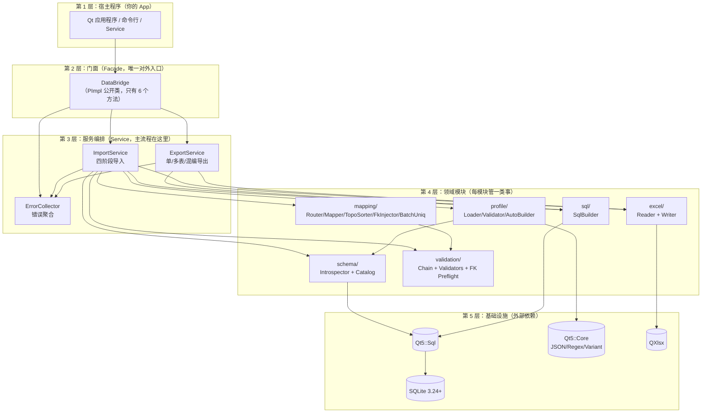

### 5.1 为什么要分层？

| 分层好处 | 反例 |
|---|---|
| 公开头零依赖，宿主不被迫 `#include` 全部 Qt-Sql | 如果 `DataBridge.h` 里写 `QSqlDatabase db_;`，宿主必须自己装 Qt-Sql |
| 模块单元测试容易写（每个模块依赖小） | 一个大类装一切，单测要 mock 一堆东西 |
| 模块可以独立替换（比如未来换成 MySQL） | SQL 代码散落各处，换数据库要改几十处 |

### 5.2 设计模式速查

| 用的模式 | 出现在哪 | 作用 |
|---|---|---|
| **Facade**（门面） | `DataBridge` | 给宿主一个简单接口，藏住内部 7 个模块 |
| **PImpl**（指针实现） | `DataBridge` + `DataBridgePrivate` | 公开头零私有依赖，改实现不破 ABI |
| **Pipeline**（流水线） | `ImportService` 的 Phase A/B/C/D | 每阶段输入输出明确，失败立刻终止 |
| **Strategy**（策略） | `ProfileMode::SingleTable/MultiTable/Mixed` | 一份 API 三种行为 |
| **Builder**（构造器） | `SqlBuilder` / `AutoProfileBuilder` | 把"组装"逻辑独立出来 |
| **Collector**（聚合器） | `ErrorCollector` | 一次收集所有错误，给宿主完整反馈 |

---

## 6. 整体流程图

### 6.1 importExcel：导入大流程


**关键约束（这是 MVP 的命门）：**
- Phase A/B/C **绝不允许**写 DB；只要 Phase B 或 C 报错，**根本不开事务**。
- Phase D 一旦任意一行失败，立刻 `ROLLBACK`，`writtenRows` 重置为 0。
- 这就是规格里反复强调的 "All or Nothing"。

### 6.2 exportExcel：导出大流程

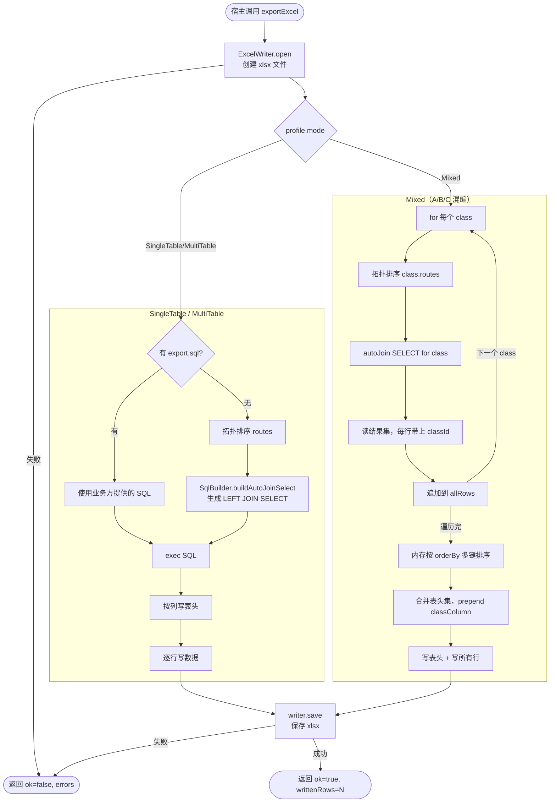

---

## 7. 整体时序图

宿主程序与 dbridge 之间的高层交互：

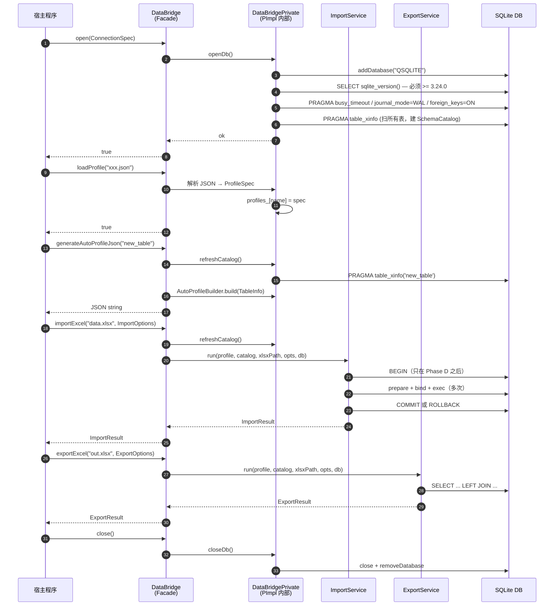

**新手提示**：序号能帮你追踪"谁先谁后"。Phase D 的 `BEGIN/COMMIT/ROLLBACK` 出现在调用 17、20、22——
这就是"事务只包住写阶段"的可视化证据。

---

## 8. 局部架构（按模块）

下面**逐个模块**讲清楚"它的内部长啥样、依赖谁、被谁调用"。

### 8.1 Profile 模块（`src/profile/`）

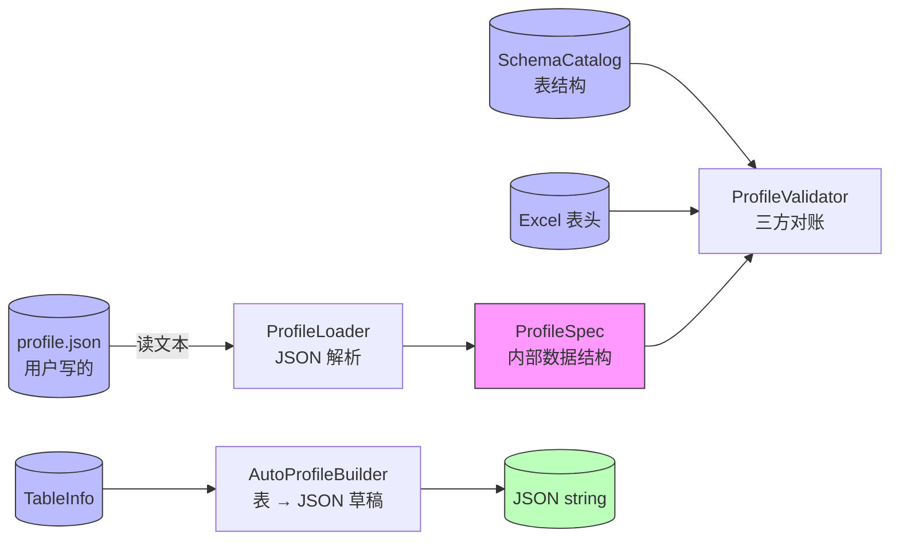

**职责拆分**：
- **`ProfileLoader`**：只做"字符串→结构体"，不查 DB 不查 Excel。这样**单测可纯字符串测**。
- **`ProfileValidator`**：拿到 `ProfileSpec` 后，对比真实 DB schema 和真实 Excel 表头，找出"声明的列在 DB 不存在"这种问题。
- **`AutoProfileBuilder`**：反向——已知 DB 表结构，自动生成一份 Profile JSON 草稿。

### 8.2 Schema 模块（`src/schema/`）

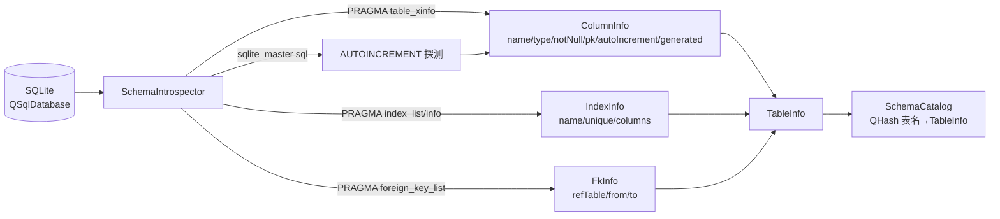

**为什么用 `table_xinfo` 而不是 `table_info`？**
- `table_info` 不返回"generated columns"（生成列），会被当成普通列处理。
- `table_xinfo` 多一列 `hidden`，值 `2/3` 表示 VIRTUAL/STORED 生成列。生成列**不能被 INSERT**，所以必须识别。

### 8.3 Validation 模块（`src/validation/`）

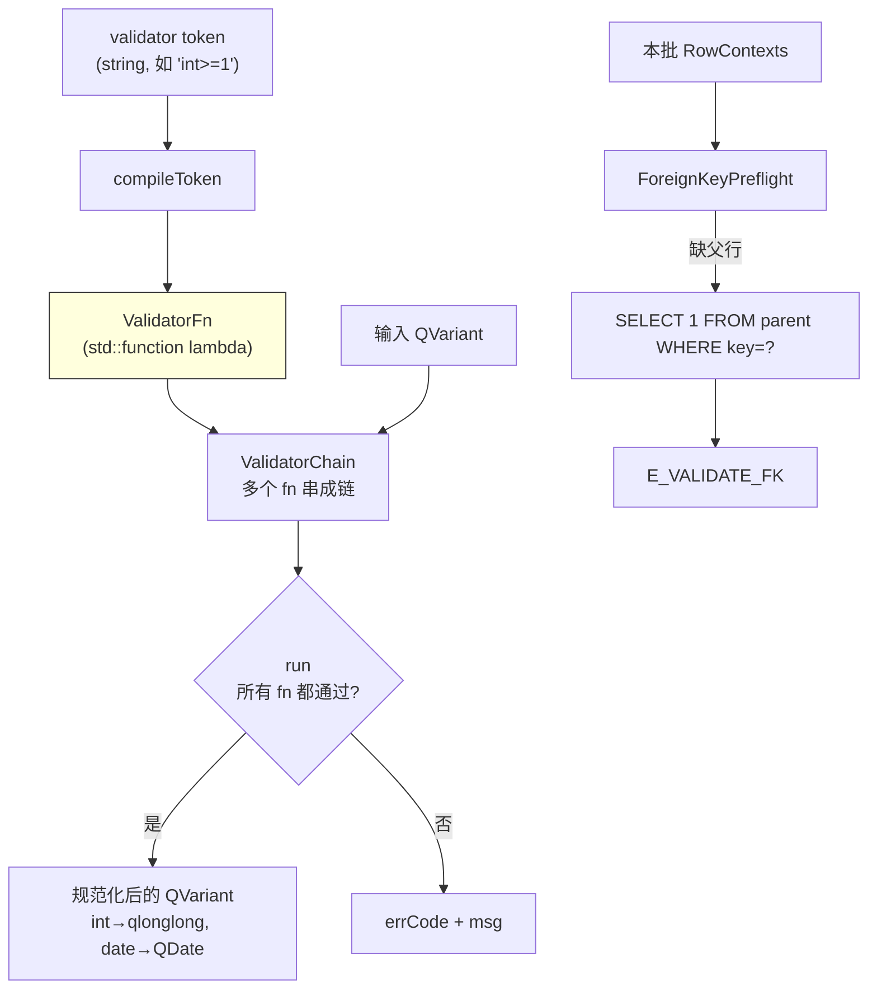

**注释**：
- "编译"一次 = 解析 token 字符串生成 lambda；之后每行只调 lambda，**不再 parse 字符串**——性能关键。
- `regex` 用 `anchoredPattern` 强制全匹配，避免"包含匹配"的陷阱。
- "互斥类型 token" 检测：`int` 与 `date:` 不能并存，编译期就报错。

### 8.4 Mapping 模块（`src/mapping/`）

这是**最复杂的模块**，单独画一张内部依赖图：

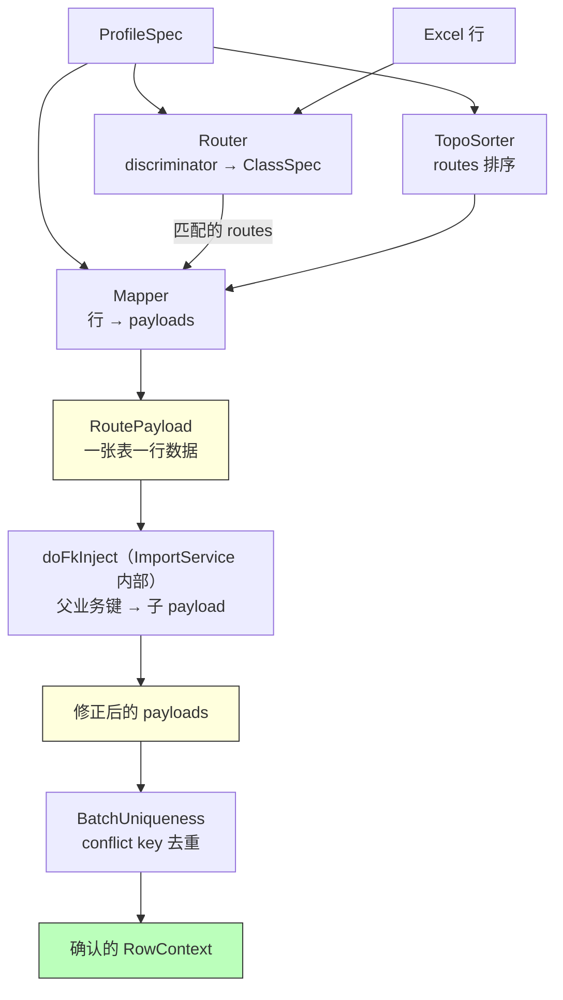

> **实现注意**：`FkInjector.cpp` 中的 `inject()` 方法是一个空存根（直接返回 `true`）。
> 真正的注入逻辑通过 `ImportService.cpp` 内的静态函数 `doFkInject()` 实现，
> 这样可以直接访问 `RouteSpec` 中的 `fkInject` 字段，无需额外传参。
> 上图中 `doFkInject` 在逻辑上归属于 ImportService，而非独立模块调用。

**为什么 FK 注入要在 `BatchUniqueness` 之前？**
- 子表的 conflict key 通常包含父业务键（如 `order_items` 的 `(order_no, line_no)`）。
- 必须先把父 `order_no` 注入到子 payload，才能算出完整的 conflict key 去查重。
- 顺序错了 → 子 payload 的 conflict 值有空洞 → 去重失效。

### 8.5 SQL 模块（`src/sql/`）

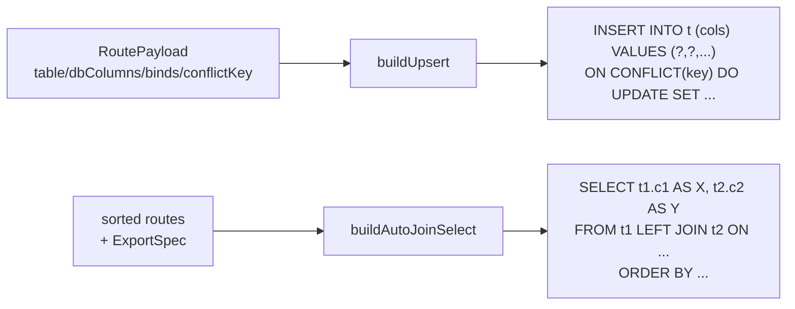

**安全性约定**：
- **标识符**（表/列名）直接拼接到 SQL——但已被 `ProfileLoader` 用正则 `^[A-Za-z_]\w*$` 验证过，**不可能有注入字符**。
- **值**全部走 `QSqlQuery::addBindValue`，**绝不拼接**。

### 8.6 Service 模块（`src/service/`）

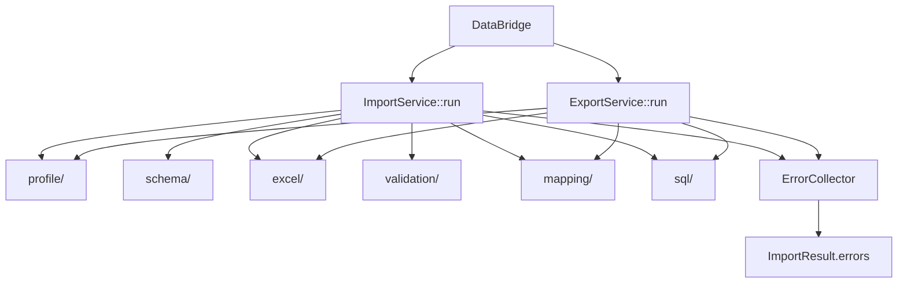

`Service` 层就是**编排**：它不实现任何业务规则，只调用其他模块、按顺序串起来、聚合错误。

---

## 9. 局部流程图

### 9.1 Phase A：打开 xlsx + 读表头

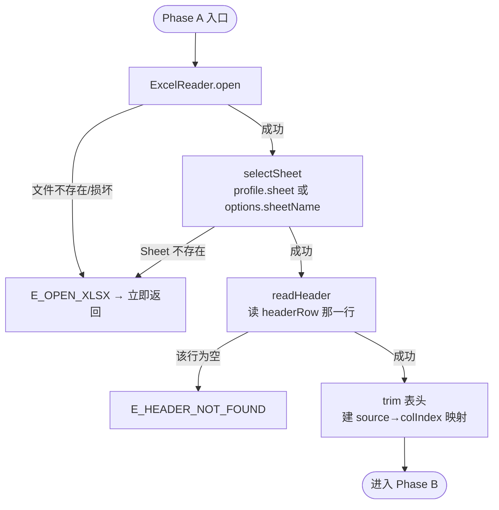

### 9.2 Phase B：Profile 校验（三方对账）


**关键细节**：Phase B 校验**尽量不提前 return**，把所有错误一次性收集，给用户一次看完，避免改一次跑一次。

### 9.3 Phase C：行级映射 + 校验


### 9.4 Phase D：单事务落库


**为什么 prepare 要缓存？**
- 同一张表的 N 行用**同一条 SQL**（列序不变）。
- prepare 一次，反复 bind+exec，性能比每行重新 prepare 提升 5~10 倍。

### 9.5 Upsert SQL 生成

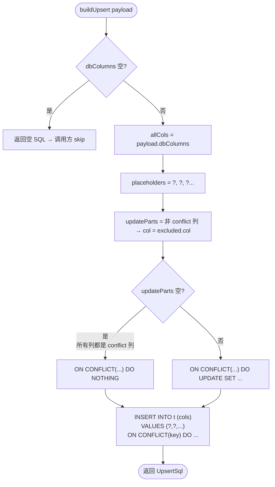

### 9.6 拓扑排序（Kahn 算法）


**新手提示**：Kahn 算法本质就是"先做没人依赖的，做完后释放依赖它的，循环到全部做完"。
如果还有节点没做完但 queue 空了 → 一定存在环（A 依赖 B，B 依赖 A）。

### 9.7 FK 业务键注入


---

## 10. 局部时序图

### 10.1 importExcel 详细时序

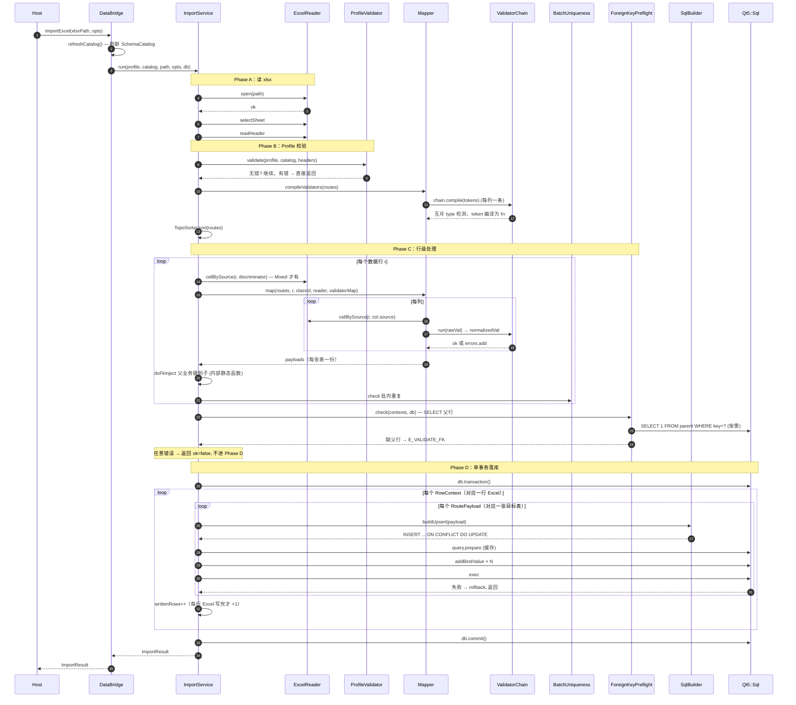

### 10.2 exportExcel 详细时序（Mixed 模式最复杂）

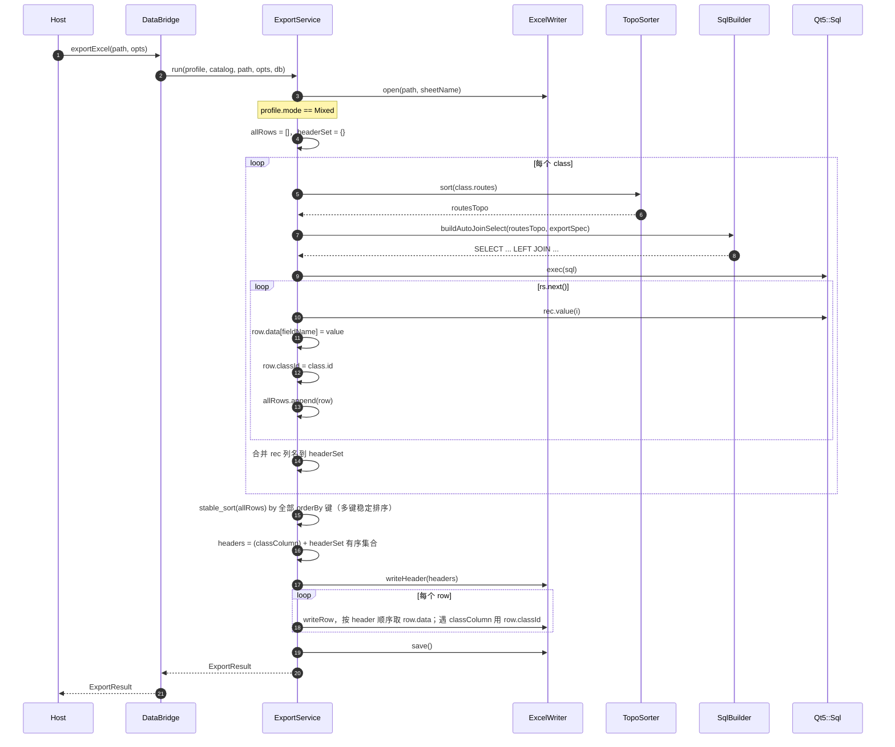

### 10.3 generateAutoProfileJson 时序

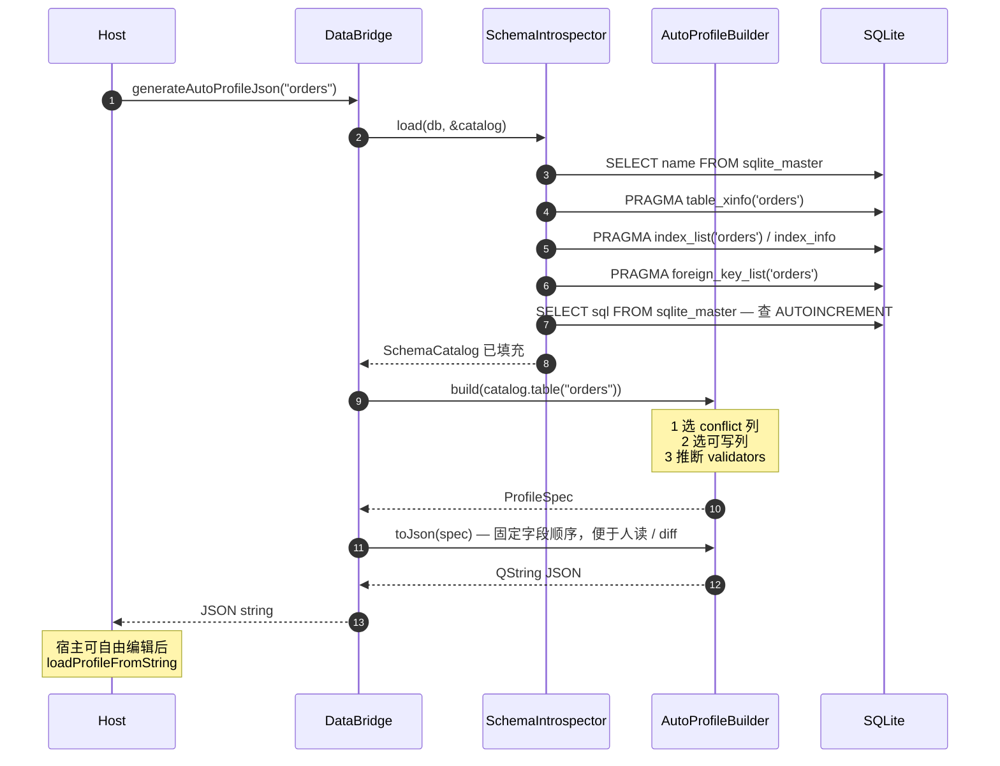

---

## 11. 关键算法详解

### 11.1 SQLite Upsert（规格 §8）

```sql
INSERT INTO orders (order_no, customer, amount)
VALUES (?, ?, ?)
ON CONFLICT(order_no) DO UPDATE SET
  customer = excluded.customer,
  amount   = excluded.amount;
```

**为什么不用 `INSERT OR REPLACE`？**
- `REPLACE` = DELETE 旧行 + INSERT 新行。
- DELETE 旧行会**触发外键级联删除**，把子表数据也带走。
- DELETE 旧行会让"Profile 没映射但 DB 里有的列"丢失值。
- `ON CONFLICT DO UPDATE` 是**原地更新**，不动这些列。

### 11.2 批内唯一性的 length-prefixed 编码（规格 §6.4）

朴素拼接：`"abc" + "|" + "d"` 与 `"ab" + "|" + "cd"` 都等于 `"abc|d"`，**会撞键**。

length-prefixed：
- `["abc", "d"]` → `"3|abc|1|d|"`
- `["ab", "cd"]` → `"2|ab|2|cd|"`
- 两者**永远不可能相等**。

代码（`BatchUniqueness.cpp:9-16`）：
```cpp
for (const auto& v : vals) {
    QString s = v.isNull() ? QStringLiteral("<null>") : v.toString();
    encoded += QString::number(s.length()) + "|" + s + "|";
}
```

### 11.3 多键稳定排序（导出 Mixed 模式）

```cpp
std::stable_sort(allRows.begin(), allRows.end(),
    [&sortKeys](const MixedRow& a, const MixedRow& b) {
        for (const QString& k : sortKeys) {
            QString va = a.data.value(k).toString();
            QString vb = b.data.value(k).toString();
            if (va != vb) return va < vb;
        }
        return false;
    });
```

- `stable_sort` 保证相等元素相对顺序不变。
- 逐键比较：第一个键相等则比第二个，依此类推（类似 SQL `ORDER BY a, b, c`）。

### 11.4 autoIncrement 三条件检测（规格 §5.2）

```text
列被认定为 AUTOINCREMENT 必须同时满足：
1. 列类型 (case-insensitive) 等于 INTEGER
2. 是单列主键 (pkOrder == 1)
3. CREATE TABLE 的 SQL 中包含 "AUTOINCREMENT" 关键字
```

**为什么 (3) 不可省？**
- SQLite 把所有 `INTEGER PRIMARY KEY` 列都当作 ROWID alias，但不一定是 AUTOINCREMENT。
- 没有 AUTOINCREMENT 时，删除行后 rowid 会重用；有 AUTOINCREMENT 时**严格单调递增**。
- `AutoProfileBuilder` 区分这两种：AUTOINCREMENT 列**默认不从 Excel 写入**。

---

## 12. 三种 Profile 模式对比

| 维度 | SingleTable | MultiTable | Mixed |
|---|---|---|---|
| **典型场景** | 一个 Sheet 对应一张表 | 一个 Sheet 拆到多张父子表 | 一个 Sheet 混杂 A/B/C 三类行 |
| **Profile 关键字段** | `table` + `conflict` + `columns` | `routes[]` + 每个 route 有 `parent` / `fkInject` | `discriminator` + `classes[]` |
| **Router 是否参与** | 否 | 否 | 是 |
| **TopoSorter 是否参与** | 退化（只有一个 route） | 是 | 每个 class 内部各自排序 |
| **FkInjector 是否参与** | 否 | 是 | 是（class 内） |
| **导出 SQL** | `SELECT FROM t` 或 explicitSql | LEFT JOIN 或 explicitSql | 每 class 各一条 SQL，内存合并 |
| **classColumn 表头** | 无 | 无 | 有（写入 `Type` 列等） |

### 12.1 SingleTable Profile 示例

```json
{
  "profileName": "customer_basic",
  "sheet": "Customers",
  "headerRow": 1,
  "mode": "singleTable",
  "table": "customer",
  "conflict": { "columns": ["customer_no"] },
  "columns": {
    "customer_no": { "source": "CustomerNo", "validators": ["notNull", "len<=32"] },
    "name":        { "source": "Name",       "validators": ["notNull"] },
    "phone":       { "source": "Phone",      "validators": ["regex:^[-0-9+ ]*$"] }
  }
}
```

### 12.2 MultiTable Profile（一行 Excel → orders + order_items 各一行）

```json
{
  "profileName": "order_m_set",
  "sheet": "Orders",
  "mode": "multiTable",
  "routes": [
    {
      "table": "orders",
      "conflict": { "columns": ["order_no"] },
      "columns": { "order_no": { "source": "OrderNo" }, "amount": { "source": "Amount" } }
    },
    {
      "table": "order_items",
      "parent": "orders",
      "fkInject": { "from": "orders.order_no", "to": "order_items.order_no" },
      "conflict": { "columns": ["order_no", "line_no"] },
      "columns": { "line_no": { "source": "LineNo" }, "sku": { "source": "Sku" } }
    }
  ]
}
```

### 12.3 Mixed Profile（A/B/C 混编）

```json
{
  "profileName": "mixed_abc",
  "sheet": "Mixed",
  "mode": "mixed",
  "discriminator": { "source": "Type" },
  "classes": [
    { "id": "A", "match": { "equals": "A" }, "routes": [...] },
    { "id": "B", "match": { "equals": "B" }, "routes": [...] },
    { "id": "C", "match": { "equals": "C" }, "routes": [...] }
  ],
  "export": { "classColumn": "Type", "orderBy": ["sort_no"] }
}
```

---

## 13. 错误码体系

所有错误码集中在 `include/dbridge/Errors.h`，按"问题发生在哪个阶段"分组：

```mermaid
graph LR
    subgraph IO["I/O 错误（基础设施）"]
        e1[E_OPEN_DB<br/>打不开 SQLite]
        e2[E_OPEN_XLSX<br/>打不开 xlsx]
        e3[E_WRITE_XLSX<br/>写 xlsx 失败]
    end

    subgraph Prof["Profile 错误（声明问题）"]
        e4[E_PROFILE_PARSE<br/>JSON 格式错]
        e5[E_PROFILE_TABLE_NOT_FOUND<br/>声明的表不在 DB]
        e6[E_PROFILE_COLUMN_NOT_FOUND<br/>声明的列不在 DB]
        e7[E_PROFILE_NO_CONFLICT_KEY<br/>无可用 Upsert 键]
        e8[E_PROFILE_TOPOLOGY_CYCLE<br/>多表依赖成环]
    end

    subgraph Data["数据错误（值问题）"]
        e9[E_HEADER_NOT_FOUND<br/>Excel 缺表头]
        e10[E_ROUTE_UNMATCHED<br/>Mixed 行未匹配 class]
        e11[E_VALIDATE_NULL<br/>必填空]
        e12[E_VALIDATE_TYPE<br/>类型/长度/枚举错]
        e13[E_VALIDATE_REGEX<br/>正则不匹配]
        e14[E_VALIDATE_DUPLICATE<br/>批内 conflict key 重复]
        e15[E_VALIDATE_FK<br/>父行不存在]
    end

    subgraph Run["运行期错误"]
        e16[E_DB_UPSERT<br/>SQLite 写失败]
        e17[E_EXPORT_QUERY<br/>导出 SELECT 失败]
    end
```

每条错误带 5 个上下文字段（`RowError`）：
- `sheet`：哪个 Sheet
- `row`：第几行（Excel 1-based）；表级错误为 0
- `column`：哪个表头列；表级错误为空
- `rawValue`：用户原本写的什么
- `message`：人类可读的描述

宿主拿到 `errors` 列表后，可以一次性高亮全部错误单元格，**不需要让用户改一处跑一次**。

---

## 附录：常见疑问

**Q1：为什么不用 ORM（QtSql ORM / sqlpp11）？**
A：ORM 假设 DB schema 编译期已知；本库的核心需求是**运行期才知道有哪些表**（用户随时新建）。

**Q2：为什么不流式读 xlsx（处理百万行）？**
A：MVP 范围内 QXlsx 普通读写够用。流式读 = 自研 zip + `QXmlStreamReader`，
工作量大，留给长期演进（见 `specs/长期架构演进*.md`）。

**Q3：能不能开多线程并行写？**
A：MVP 单线程写。`QSqlDatabase` 不能跨线程共享，多线程要么多连接 + 分库分表，
要么写者-队列模型。MVP 不做。

**Q4：Profile 加密怎么搞？**
A：MVP 不做。Profile 是声明文件，由开发/运维管控；如需加密，建议宿主侧做。

**Q5：表 schema 变更怎么办？**
A：调 `generateAutoProfileJson` 重新生成草稿，diff 旧的、合并到新的。

---

## License & 贡献

详见仓库根目录（如有）。Bug 与改进建议请提 Issue / PR。

🤖 文档由 Claude Code 协助生成。
