# dbridge — Qt + SQLite + Excel 批量导入导出动态库

> 一份**面向新手**的详细架构文档。所有图都使用 Mermaid 语法（GitHub 网页端直接渲染），
> 配套有大量"为什么这么设计"的注释。建议从上到下顺序阅读。

---

## 目录

- [1. 我们要解决什么问题？](#1-我们要解决什么问题)
- [2. 快速开始](#2-快速开始)
- [3. 目录结构与文件分工](#3-目录结构与文件分工)
- [4. 核心术语词典](#4-核心术语词典)
- [5. 整体架构](#5-整体架构)
- [6. 整体流程图](#6-整体流程图)
- [7. 整体时序图](#7-整体时序图)
- [8. 局部架构（按模块）](#8-局部架构按模块)
- [9. 局部流程图](#9-局部流程图)
- [10. 局部时序图](#10-局部时序图)
- [11. 关键算法详解](#11-关键算法详解)
- [12. 三种 Profile 模式对比](#12-三种-profile-模式对比)
- [13. 错误码体系](#13-错误码体系)
- [14. 完整使用指南（手把手）](#14-完整使用指南手把手)
  - [14.1 系统要求与依赖](#141-系统要求与依赖)
  - [14.2 从源码构建 dbridge](#142-从源码构建-dbridge)
  - [14.3 集成到你的 Qt 项目](#143-集成到你的-qt-项目)
  - [14.4 公共 API 参考（6 个方法）](#144-公共-api-参考6-个方法)
  - [14.5 配置结构体详解](#145-配置结构体详解)
  - [14.6 第一个完整示例：从零到成功导入](#146-第一个完整示例从零到成功导入)
  - [14.7 编写 Profile JSON](#147-编写-profile-json)
  - [14.8 验证器（Validators）完整清单](#148-验证器validators完整清单)
  - [14.9 三种导入模式分步教程](#149-三种导入模式分步教程)
  - [14.10 导出 Excel 教程](#1410-导出-excel-教程)
  - [14.11 自动生成 Profile（AutoProfile）](#1411-自动生成-profileautoprofile)
  - [14.12 错误处理模式](#1412-错误处理模式)
  - [14.13 CLI 工具完整参考](#1413-cli-工具完整参考)
  - [14.14 性能调优与实用技巧](#1414-性能调优与实用技巧)
  - [14.15 常见坑与排查](#1415-常见坑与排查)

---

## 1. 我们要解决什么问题？

业务场景：用户给你一个 Excel 文件，里面是数据；你要把这些数据**写入 SQLite 数据库**。
或者反过来，从数据库里把数据**导出成 Excel** 给用户。

听起来很简单？真做的时候你会遇到一堆问题：

| 痛点 | 朴素做法的后果 | dbridge 的处理 |
|---|---|---|
| 已有数据怎么办？ | `INSERT` 会撞主键报错；`INSERT OR REPLACE` 会**删掉旧行再插入**，破坏外键级联和未映射列 | 使用 `INSERT … ON CONFLICT(...) DO UPDATE`，原地更新 |
| 用户数据格式错了怎么办？ | 写到一半才发现，已经写了一半的脏数据进 DB | 导入前**全量校验**，错就整体回滚，DB 零落库 |
| 表结构是运行期临时建的怎么办？ | 必须改 C++ 代码重新编译 | 运行期**自省表结构**自动生成 Profile |
| 一行 Excel 数据要拆到多张表怎么办？ | 手写一堆 if-else | Profile 里描述映射关系，**声明式**搞定 |
| 一个 Sheet 里 A/B/C 三种行混编？ | 一堆 if-else | Profile 用 `discriminator` + `classes` 声明 |

**dbridge 是一个 C++ 动态库**，对外只暴露 3 个公开头文件（`DataBridge.h` / `Types.h` / `Errors.h`），
宿主程序链接 `dbridge` 即可使用。

---

## 2. 快速开始

```bash
# 1. 配置（需要 Qt 5.12.12 + CMake >= 3.16 + GCC 9+）
cmake -S . -B build \
  -DCMAKE_BUILD_TYPE=Debug \
  -DBUILD_TESTING=ON \
  -DCMAKE_PREFIX_PATH=/opt/Qt5.12.12/5.12.12/gcc_64

# 2. 编译（同时构建库、测试、examples/cli）
cmake --build build -j$(nproc)

# 3. 运行测试
cd build && ctest --output-on-failure

# 4. 试用 CLI 示例
./build/examples/cli/dbridge-cli \
  mydata.db \
  tests/data/profiles/customer_basic.json \
  customers.xlsx \
  import
```

最小代码示例：

```cpp
#include "dbridge/DataBridge.h"

dbridge::DataBridge bridge;
dbridge::ConnectionSpec cs;
cs.sqlitePath = "mydata.db";

QString err;
bridge.open(cs, &err);                                 // 打开 SQLite
bridge.loadProfile("profile.json", &err);              // 加载 Profile（描述 Excel↔DB 映射）

dbridge::ImportOptions opts;
opts.profileName = "customer_basic";                   // Profile 的逻辑名
auto result = bridge.importExcel("customers.xlsx", opts);

if (!result.ok) {
    for (const auto& e : result.errors) {
        qWarning() << e.code << e.row << e.column << e.message;
    }
}
```

---

## 3. 目录结构与文件分工

```text
dbridge/
├── include/dbridge/                    ← 公开头（只有这 3 个文件对外）
│   ├── DataBridge.h                    ← 门面类，宿主只 #include 这个
│   ├── Types.h                         ← ConnectionSpec/ImportOptions/RowError 等结构体
│   └── Errors.h                        ← E_OPEN_DB / E_VALIDATE_NULL ... 错误码常量
│
├── src/                                ← 实现细节（宿主看不到）
│   ├── DataBridge.cpp                  ← PImpl 外壳，把请求转给具体 Service
│   ├── DataBridgePrivate.h             ← PImpl 内部字段（QSqlDatabase / SchemaCatalog ...）
│   │
│   ├── profile/                        ← "Profile 是什么" 由这里负责
│   │   ├── ProfileSpec.h               ← 内部数据结构（解析后的 Profile）
│   │   ├── ProfileLoader.*             ← 把 JSON 解析成 ProfileSpec
│   │   ├── ProfileValidator.*          ← 三方对账：Profile vs DB 表结构 vs Excel 表头
│   │   └── AutoProfileBuilder.*        ← 根据表结构自动生成 Profile 草稿
│   │
│   ├── schema/                         ← "DB 里有哪些表/列/索引" 由这里负责
│   │   ├── SchemaCatalog.h             ← 全部表结构的缓存（TableInfo/ColumnInfo/IndexInfo/FkInfo）
│   │   └── SchemaIntrospector.*        ← 用 PRAGMA table_xinfo 等读 SQLite 元数据
│   │
│   ├── excel/                          ← "Excel 怎么读写" 由这里负责
│   │   ├── ExcelReader.*               ← 封装 QXlsx 读单元格
│   │   └── ExcelWriter.*               ← 封装 QXlsx 写单元格
│   │
│   ├── validation/                     ← "一个值合不合法" 由这里负责
│   │   ├── Validators.*                ← 9 个内置校验器（notNull/int/regex/...）
│   │   ├── ValidatorChain.*            ← 多个校验器串成一条链
│   │   └── ForeignKeyPreflight.*       ← 外键存在性预校验（导入前查 DB）
│   │
│   ├── mapping/                        ← "Excel 一行怎么变成多张表的多行" 由这里负责
│   │   ├── RowPayload.h                ← RoutePayload（一张表的一行数据） + RowContext
│   │   ├── Router.*                    ← 混编模式下根据鉴别列判断行属于 A/B/C 哪类
│   │   ├── Mapper.*                    ← 把 Excel 一行拆成 N 个 RoutePayload
│   │   ├── TopoSorter.*                ← 多表写入顺序排序（Kahn 算法）
│   │   ├── FkInjector.*                ← 把父表业务键注入到子表 payload
│   │   └── BatchUniqueness.*           ← 本批内 conflict key 重复检测
│   │
│   ├── sql/                            ← "怎么写 SQL" 由这里负责
│   │   └── SqlBuilder.*                ← 生成 Upsert SQL 和导出 SELECT
│   │
│   └── service/                        ← "整个流程怎么编排" 由这里负责
│       ├── ErrorCollector.*            ← 错误聚合容器
│       ├── ImportService.*             ← 导入主流程（Phase A/B/C/D）
│       └── ExportService.*             ← 导出主流程
│
├── 3rdparty/QXlsx/                     ← QXlsx 第三方库（vendored）
│
├── tests/                              ← 单元 + 集成测试（9 套，CMake 列在 tests/CMakeLists.txt）
│   ├── unit/                           ← 模块级单元测试（Profile/Schema/Validators/SqlBuilder/Mapper/Router/TopoSorter/FkPreflight ...）
│   ├── integration/                    ← DataBridge 端到端集成
│   └── data/                           ← 测试夹具
│       ├── sql/                        ← schema 初始化 SQL（01_customer / 02_orders / 03_mixed / 04_mixed_multitable）
│       └── profiles/                   ← Profile JSON 夹具（customer_basic / order_m_set / mixed_abc / mixed_abc_multitable）
│
├── examples/cli/                       ← 命令行示例程序（dbridge-cli）
│
├── tools/                              ← 配套脚本（独立于库本体）
│   └── xlsx2csv.py                     ← 纯 Python stdlib，xlsx → CSV，用于导出对账（详见 §14.13.2）
│
└── docs/
    └── validation/
        └── row-to-multitable.md        ← 端到端验证流程（场景 I / II，详见 §14.16）
```

**新手提示**：看代码先看 `service/`，那里是主流程；看主流程时遇到不懂的模块（比如 `Mapper`），
再跳到对应目录看，**不要从字母顺序看起**，否则你会迷失方向。

---

## 4. 核心术语词典

在看图之前先把行话搞懂，**这是入门第一关**。

| 术语 | 通俗解释 | 举例 |
|---|---|---|
| **Profile** | 一份"翻译说明书"，告诉库 Excel 的 `Name` 列对应数据库 `customer.name` 列 | `customer_basic.json` |
| **Route** | Profile 里描述"一张目标表怎么写"的小节 | "把数据写到 orders 表，用 order_no 当主键" |
| **Sheet** | Excel 里的一个工作表（左下角那个 tab） | "Customers"、"Orders" |
| **Source** | Excel 表头名（数据从哪个列来） | `"CustomerNo"`、`"Phone"` |
| **dbColumn** | 数据库列名（数据写到哪个列去） | `customer_no`、`phone` |
| **Conflict Key** | 用来判断"这行在 DB 里是不是已经有了"的列 | `customer_no` 是主键 → 用它做 conflict key |
| **Upsert** | "Update or Insert"——有就改、没有就插 | SQL: `INSERT ... ON CONFLICT(...) DO UPDATE SET ...` |
| **fkInject** | 把父表的业务键自动注入到子表行 | 父 `orders.order_no=O001` → 子 `order_items.order_no=O001` |
| **Discriminator** | 混编模式下用来识别"这行是 A/B/C 哪一类"的列 | Excel 第一列叫 `Type`，值是 `A/B/C` |
| **PImpl** | C++ 隐藏实现细节的惯用法 | `DataBridge` 公开类里只有一个 `unique_ptr<Private>` 指针 |
| **Topology Sort** | 拓扑排序——按依赖顺序排表 | `orders` 必须在 `order_items` 之前写 |

---

## 5. 整体架构

dbridge 是**分层 + 模块化**架构。**自上而下分 5 层**，每层只调用下层，不允许反向调用。

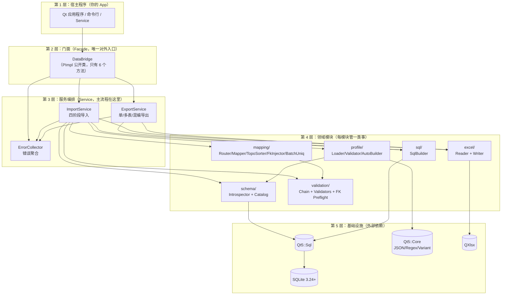

### 5.1 为什么要分层？

| 分层好处 | 反例 |
|---|---|
| 公开头零依赖，宿主不被迫 `#include` 全部 Qt-Sql | 如果 `DataBridge.h` 里写 `QSqlDatabase db_;`，宿主必须自己装 Qt-Sql |
| 模块单元测试容易写（每个模块依赖小） | 一个大类装一切，单测要 mock 一堆东西 |
| 模块可以独立替换（比如未来换成 MySQL） | SQL 代码散落各处，换数据库要改几十处 |

### 5.2 设计模式速查

| 用的模式 | 出现在哪 | 作用 |
|---|---|---|
| **Facade**（门面） | `DataBridge` | 给宿主一个简单接口，藏住内部 7 个模块 |
| **PImpl**（指针实现） | `DataBridge` + `DataBridgePrivate` | 公开头零私有依赖，改实现不破 ABI |
| **Pipeline**（流水线） | `ImportService` 的 Phase A/B/C/D | 每阶段输入输出明确，失败立刻终止 |
| **Strategy**（策略） | `ProfileMode::SingleTable/MultiTable/Mixed` | 一份 API 三种行为 |
| **Builder**（构造器） | `SqlBuilder` / `AutoProfileBuilder` | 把"组装"逻辑独立出来 |
| **Collector**（聚合器） | `ErrorCollector` | 一次收集所有错误，给宿主完整反馈 |

---

## 6. 整体流程图

### 6.1 importExcel：导入大流程


**关键约束（这是 MVP 的命门）：**
- Phase A/B/C **绝不允许**写 DB；只要 Phase B 或 C 报错，**根本不开事务**。
- Phase D 一旦任意一行失败，立刻 `ROLLBACK`，`writtenRows` 重置为 0。
- 这就是规格里反复强调的 "All or Nothing"。

### 6.2 exportExcel：导出大流程


---

## 7. 整体时序图

宿主程序与 dbridge 之间的高层交互：

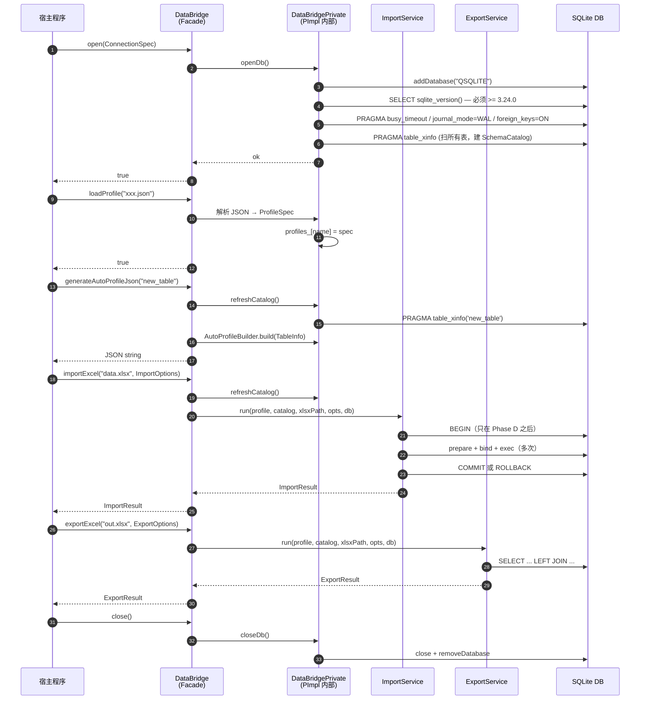

**新手提示**：序号能帮你追踪"谁先谁后"。Phase D 的 `BEGIN/COMMIT/ROLLBACK` 出现在调用 17、20、22——
这就是"事务只包住写阶段"的可视化证据。

---

## 8. 局部架构（按模块）

下面**逐个模块**讲清楚"它的内部长啥样、依赖谁、被谁调用"。

### 8.1 Profile 模块（`src/profile/`）

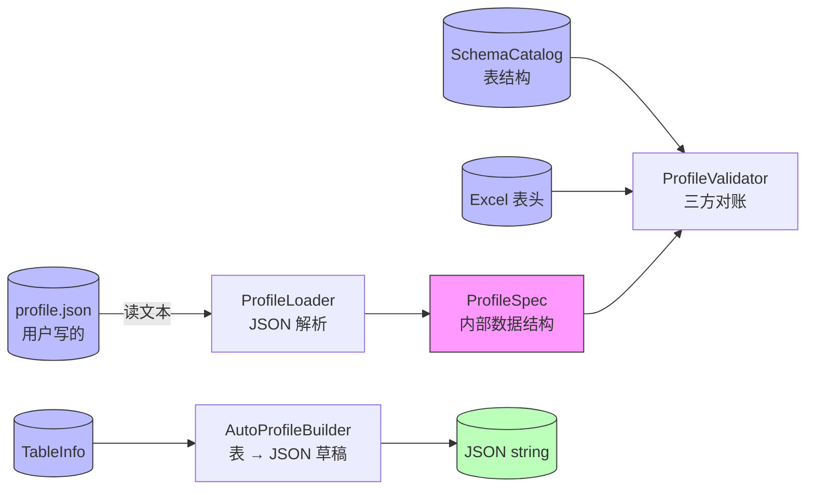

**职责拆分**：
- **`ProfileLoader`**：只做"字符串→结构体"，不查 DB 不查 Excel。这样**单测可纯字符串测**。
- **`ProfileValidator`**：拿到 `ProfileSpec` 后，对比真实 DB schema 和真实 Excel 表头，找出"声明的列在 DB 不存在"这种问题。
- **`AutoProfileBuilder`**：反向——已知 DB 表结构，自动生成一份 Profile JSON 草稿。

### 8.2 Schema 模块（`src/schema/`）

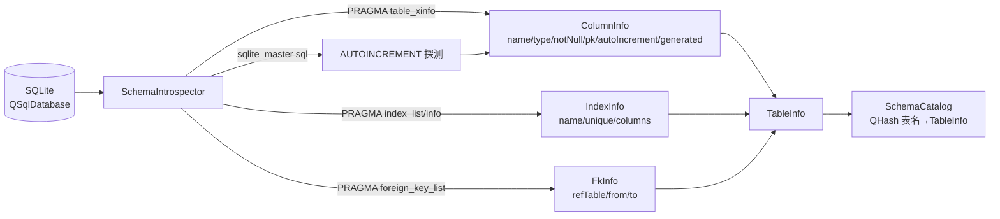

**为什么用 `table_xinfo` 而不是 `table_info`？**
- `table_info` 不返回"generated columns"（生成列），会被当成普通列处理。
- `table_xinfo` 多一列 `hidden`，值 `2/3` 表示 VIRTUAL/STORED 生成列。生成列**不能被 INSERT**，所以必须识别。

### 8.3 Validation 模块（`src/validation/`）

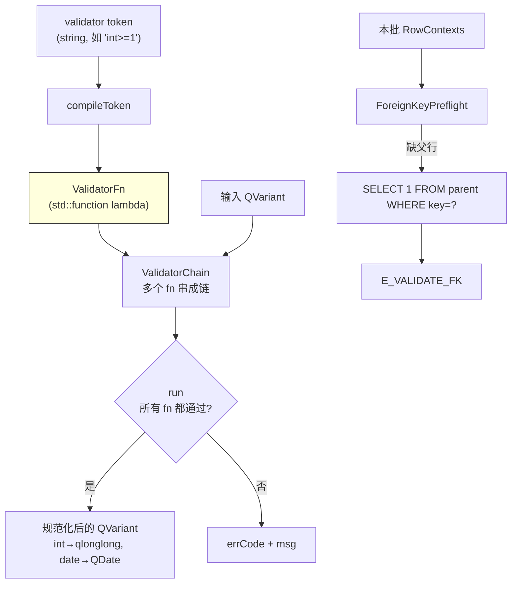

**注释**：
- "编译"一次 = 解析 token 字符串生成 lambda；之后每行只调 lambda，**不再 parse 字符串**——性能关键。
- `regex` 用 `anchoredPattern` 强制全匹配，避免"包含匹配"的陷阱。
- "互斥类型 token" 检测：`int` 与 `date:` 不能并存，编译期就报错。

### 8.4 Mapping 模块（`src/mapping/`）

这是**最复杂的模块**，单独画一张内部依赖图：

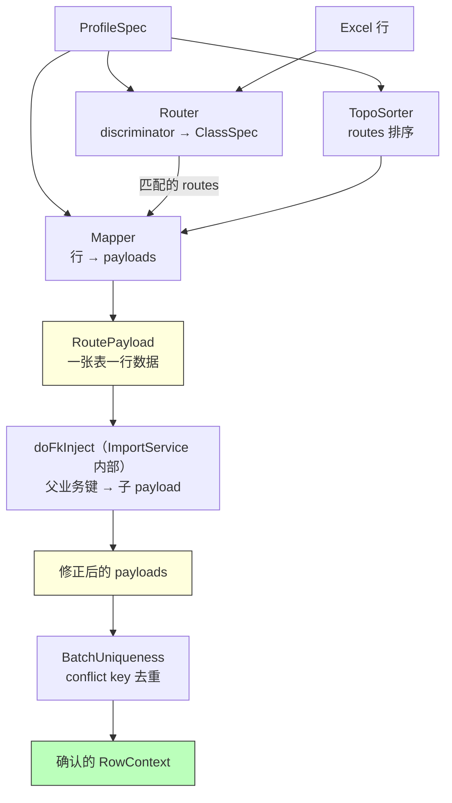

> **实现注意**：`FkInjector.cpp` 中的 `inject()` 方法是一个空存根（直接返回 `true`）。
> 真正的注入逻辑通过 `ImportService.cpp` 内的静态函数 `doFkInject()` 实现，
> 这样可以直接访问 `RouteSpec` 中的 `fkInject` 字段，无需额外传参。
> 上图中 `doFkInject` 在逻辑上归属于 ImportService，而非独立模块调用。

**为什么 FK 注入要在 `BatchUniqueness` 之前？**
- 子表的 conflict key 通常包含父业务键（如 `order_items` 的 `(order_no, line_no)`）。
- 必须先把父 `order_no` 注入到子 payload，才能算出完整的 conflict key 去查重。
- 顺序错了 → 子 payload 的 conflict 值有空洞 → 去重失效。

### 8.5 SQL 模块（`src/sql/`）

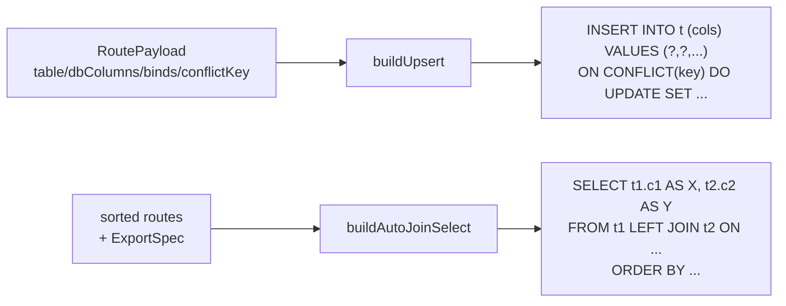

**安全性约定**：
- **标识符**（表/列名）直接拼接到 SQL——但已被 `ProfileLoader` 用正则 `^[A-Za-z_]\w*$` 验证过，**不可能有注入字符**。
- **值**全部走 `QSqlQuery::addBindValue`，**绝不拼接**。

### 8.6 Service 模块（`src/service/`）

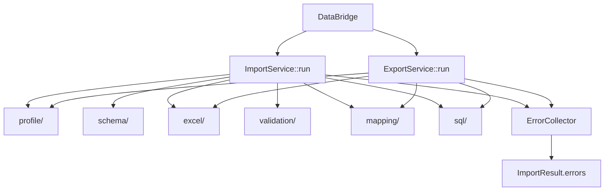

`Service` 层就是**编排**：它不实现任何业务规则，只调用其他模块、按顺序串起来、聚合错误。

---

## 9. 局部流程图

### 9.1 Phase A：打开 xlsx + 读表头


### 9.2 Phase B：Profile 校验（三方对账）

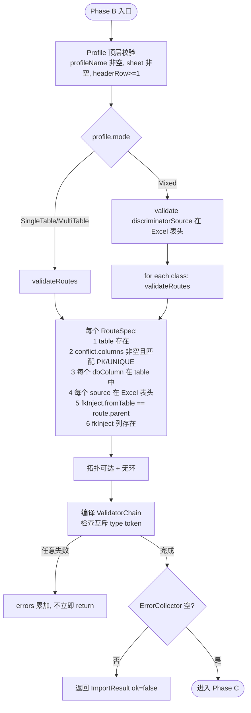

**关键细节**：Phase B 校验**尽量不提前 return**，把所有错误一次性收集，给用户一次看完，避免改一次跑一次。

### 9.3 Phase C：行级映射 + 校验

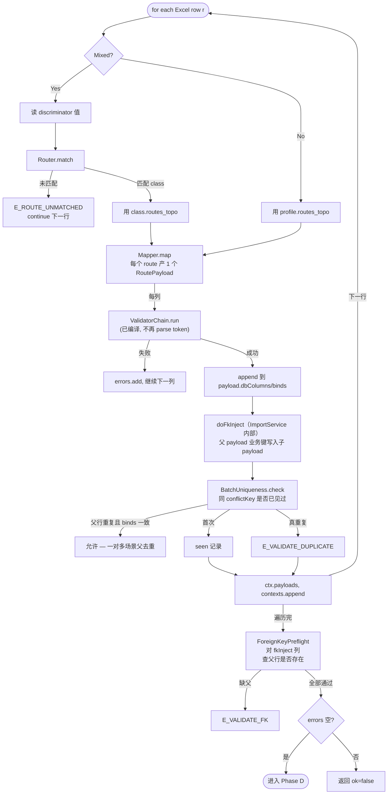

### 9.4 Phase D：单事务落库


**为什么 prepare 要缓存？**
- 同一张表的 N 行用**同一条 SQL**（列序不变）。
- prepare 一次，反复 bind+exec，性能比每行重新 prepare 提升 5~10 倍。

### 9.5 Upsert SQL 生成


### 9.6 拓扑排序（Kahn 算法）

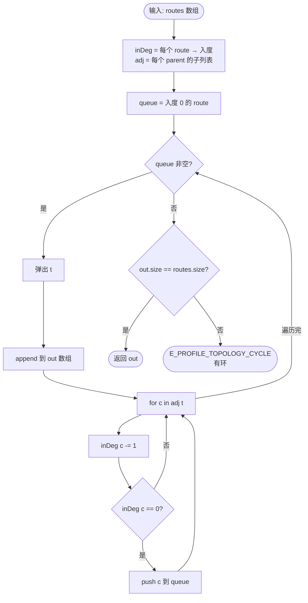

**新手提示**：Kahn 算法本质就是"先做没人依赖的，做完后释放依赖它的，循环到全部做完"。
如果还有节点没做完但 queue 空了 → 一定存在环（A 依赖 B，B 依赖 A）。

### 9.7 FK 业务键注入


---

## 10. 局部时序图

### 10.1 importExcel 详细时序

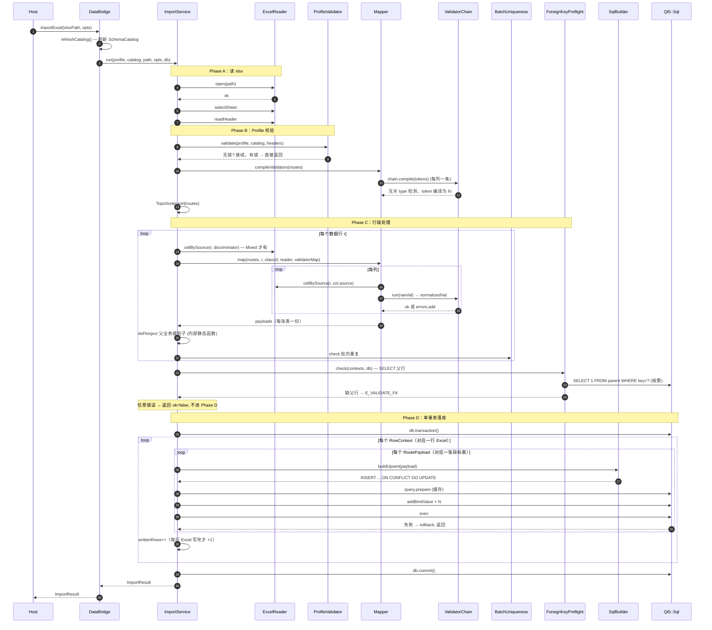

### 10.2 exportExcel 详细时序（Mixed 模式最复杂）

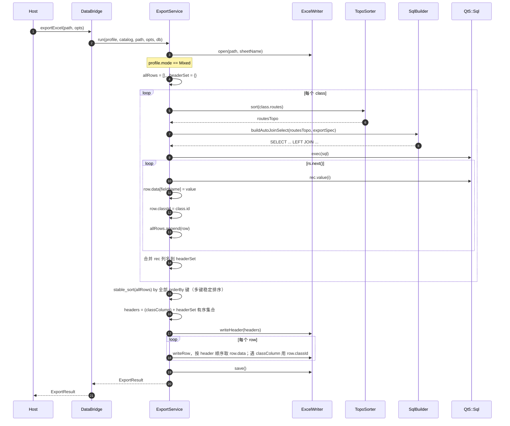

### 10.3 generateAutoProfileJson 时序

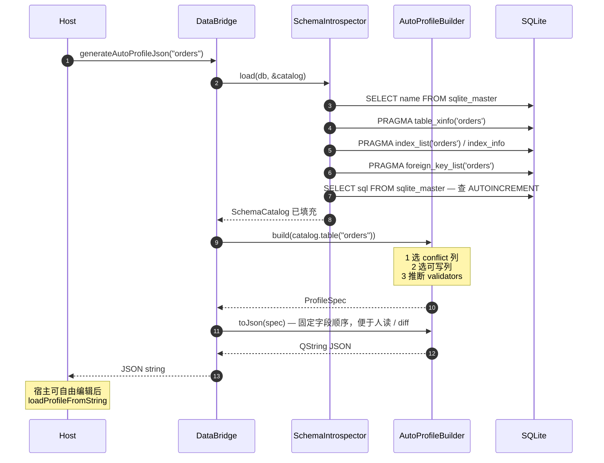

---

## 11. 关键算法详解

### 11.1 SQLite Upsert（规格 §8）

```sql
INSERT INTO orders (order_no, customer, amount)
VALUES (?, ?, ?)
ON CONFLICT(order_no) DO UPDATE SET
  customer = excluded.customer,
  amount   = excluded.amount;
```

**为什么不用 `INSERT OR REPLACE`？**
- `REPLACE` = DELETE 旧行 + INSERT 新行。
- DELETE 旧行会**触发外键级联删除**，把子表数据也带走。
- DELETE 旧行会让"Profile 没映射但 DB 里有的列"丢失值。
- `ON CONFLICT DO UPDATE` 是**原地更新**，不动这些列。

### 11.2 批内唯一性的 length-prefixed 编码（规格 §6.4）

朴素拼接：`"abc" + "|" + "d"` 与 `"ab" + "|" + "cd"` 都等于 `"abc|d"`，**会撞键**。

length-prefixed：
- `["abc", "d"]` → `"3|abc|1|d|"`
- `["ab", "cd"]` → `"2|ab|2|cd|"`
- 两者**永远不可能相等**。

代码（`BatchUniqueness.cpp:9-16`）：
```cpp
for (const auto& v : vals) {
    QString s = v.isNull() ? QStringLiteral("<null>") : v.toString();
    encoded += QString::number(s.length()) + "|" + s + "|";
}
```

### 11.3 多键稳定排序（导出 Mixed 模式）

```cpp
std::stable_sort(allRows.begin(), allRows.end(),
    [&sortKeys](const MixedRow& a, const MixedRow& b) {
        for (const QString& k : sortKeys) {
            QString va = a.data.value(k).toString();
            QString vb = b.data.value(k).toString();
            if (va != vb) return va < vb;
        }
        return false;
    });
```

- `stable_sort` 保证相等元素相对顺序不变。
- 逐键比较：第一个键相等则比第二个，依此类推（类似 SQL `ORDER BY a, b, c`）。

### 11.4 autoIncrement 三条件检测（规格 §5.2）

```text
列被认定为 AUTOINCREMENT 必须同时满足：
1. 列类型 (case-insensitive) 等于 INTEGER
2. 是单列主键 (pkOrder == 1)
3. CREATE TABLE 的 SQL 中包含 "AUTOINCREMENT" 关键字
```

**为什么 (3) 不可省？**
- SQLite 把所有 `INTEGER PRIMARY KEY` 列都当作 ROWID alias，但不一定是 AUTOINCREMENT。
- 没有 AUTOINCREMENT 时，删除行后 rowid 会重用；有 AUTOINCREMENT 时**严格单调递增**。
- `AutoProfileBuilder` 区分这两种：AUTOINCREMENT 列**默认不从 Excel 写入**。

---

## 12. 三种 Profile 模式对比

| 维度 | SingleTable | MultiTable | Mixed |
|---|---|---|---|
| **典型场景** | 一个 Sheet 对应一张表 | 一个 Sheet 拆到多张父子表 | 一个 Sheet 混杂 A/B/C 三类行 |
| **Profile 关键字段** | `table` + `conflict` + `columns` | `routes[]` + 每个 route 有 `parent` / `fkInject` | `discriminator` + `classes[]` |
| **Router 是否参与** | 否 | 否 | 是 |
| **TopoSorter 是否参与** | 退化（只有一个 route） | 是 | 每个 class 内部各自排序 |
| **FkInjector 是否参与** | 否 | 是 | 是（class 内） |
| **导出 SQL** | `SELECT FROM t` 或 explicitSql | LEFT JOIN 或 explicitSql | 每 class 各一条 SQL，内存合并 |
| **classColumn 表头** | 无 | 无 | 有（写入 `Type` 列等） |

### 12.1 SingleTable Profile 示例

```json
{
  "profileName": "customer_basic",
  "sheet": "Customers",
  "headerRow": 1,
  "mode": "singleTable",
  "table": "customer",
  "conflict": { "columns": ["customer_no"] },
  "columns": {
    "customer_no": { "source": "CustomerNo", "validators": ["notNull", "len<=32"] },
    "name":        { "source": "Name",       "validators": ["notNull"] },
    "phone":       { "source": "Phone",      "validators": ["regex:^[-0-9+ ]*$"] }
  }
}
```

### 12.2 MultiTable Profile（一行 Excel → orders + order_items 各一行）

```json
{
  "profileName": "order_m_set",
  "sheet": "Orders",
  "mode": "multiTable",
  "routes": [
    {
      "table": "orders",
      "conflict": { "columns": ["order_no"] },
      "columns": { "order_no": { "source": "OrderNo" }, "amount": { "source": "Amount" } }
    },
    {
      "table": "order_items",
      "parent": "orders",
      "fkInject": { "from": "orders.order_no", "to": "order_items.order_no" },
      "conflict": { "columns": ["order_no", "line_no"] },
      "columns": { "line_no": { "source": "LineNo" }, "sku": { "source": "Sku" } }
    }
  ]
}
```

### 12.3 Mixed Profile（A/B/C 混编）

```json
{
  "profileName": "mixed_abc",
  "sheet": "Mixed",
  "mode": "mixed",
  "discriminator": { "source": "Type" },
  "classes": [
    { "id": "A", "match": { "equals": "A" }, "routes": [...] },
    { "id": "B", "match": { "equals": "B" }, "routes": [...] },
    { "id": "C", "match": { "equals": "C" }, "routes": [...] }
  ],
  "export": { "classColumn": "Type", "orderBy": ["sort_no"] }
}
```

---

## 13. 错误码体系

所有错误码集中在 `include/dbridge/Errors.h`，按"问题发生在哪个阶段"分组：

```mermaid
graph LR
    subgraph IO["I/O 错误（基础设施）"]
        e1[E_OPEN_DB<br/>打不开 SQLite]
        e2[E_OPEN_XLSX<br/>打不开 xlsx]
        e3[E_WRITE_XLSX<br/>写 xlsx 失败]
    end

    subgraph Prof["Profile 错误（声明问题）"]
        e4[E_PROFILE_PARSE<br/>JSON 格式错]
        e5[E_PROFILE_TABLE_NOT_FOUND<br/>声明的表不在 DB]
        e6[E_PROFILE_COLUMN_NOT_FOUND<br/>声明的列不在 DB]
        e7[E_PROFILE_NO_CONFLICT_KEY<br/>无可用 Upsert 键]
        e8[E_PROFILE_TOPOLOGY_CYCLE<br/>多表依赖成环]
    end

    subgraph Data["数据错误（值问题）"]
        e9[E_HEADER_NOT_FOUND<br/>Excel 缺表头]
        e10[E_ROUTE_UNMATCHED<br/>Mixed 行未匹配 class]
        e11[E_VALIDATE_NULL<br/>必填空]
        e12[E_VALIDATE_TYPE<br/>类型/长度/枚举错]
        e13[E_VALIDATE_REGEX<br/>正则不匹配]
        e14[E_VALIDATE_DUPLICATE<br/>批内 conflict key 重复]
        e15[E_VALIDATE_FK<br/>父行不存在]
    end

    subgraph Run["运行期错误"]
        e16[E_DB_UPSERT<br/>SQLite 写失败]
        e17[E_EXPORT_QUERY<br/>导出 SELECT 失败]
    end
```

每条错误带 5 个上下文字段（`RowError`）：
- `sheet`：哪个 Sheet
- `row`：第几行（Excel 1-based）；表级错误为 0
- `column`：哪个表头列；表级错误为空
- `rawValue`：用户原本写的什么
- `message`：人类可读的描述

宿主拿到 `errors` 列表后，可以一次性高亮全部错误单元格，**不需要让用户改一处跑一次**。

---

## 14. 完整使用指南（手把手）

> 这一节是给**完全没接触过这个库的人**写的。从环境准备到第一次跑通示例，每一步都讲清楚。
> 如果你只想跑通一个 demo，直接看 [14.6 第一个完整示例](#146-第一个完整示例从零到成功导入)。

### 14.1 系统要求与依赖

| 依赖 | 最低版本 | 说明 |
|---|---|---|
| **操作系统** | Linux / macOS / Windows | MVP 在 Linux 上验证；其他平台理论可行 |
| **编译器** | GCC 9+ / Clang 10+ / MSVC 2019+ | 必须支持 C++17 |
| **CMake** | 3.16+ | 项目使用现代 CMake target 写法 |
| **Qt** | **5.12.12 LTS** | 必须包含 `Core` + `Sql` + `Gui` 三个模块；运行测试还需 `Test` |
| **SQLite** | **3.24.0+** | 因为依赖 `INSERT ... ON CONFLICT(...) DO UPDATE`，库会在 `open()` 时检查版本，低版本直接报 `E_OPEN_DB` |
| **QXlsx** | 已 vendored 在 `3rdparty/QXlsx/`（QtExcel/QXlsx，BSD-2） | **不需要单独安装**，构建系统会自动编译。注意它依赖 Qt 的 `QtGui/private/qzipreader_p.h`——这要求 Qt 安装包含 GUI 私有头文件（Qt 官方 Online Installer 默认带；某些 Linux 发行版的 `qtbase-private-dev` 包要额外装） |

**怎么检查环境是否满足？**

```bash
# 1. 编译器
g++ --version                  # 应 >= 9.0

# 2. CMake
cmake --version                # 应 >= 3.16

# 3. Qt（看你装在哪）
ls /opt/Qt5.12.12/5.12.12/gcc_64/lib/libQt5Core.so* 2>/dev/null

# 4. SQLite（命令行工具版本通常和 lib 版本一致）
sqlite3 --version              # 应 >= 3.24
# 也可以用 SQL 查询库内置版本：
sqlite3 :memory: 'SELECT sqlite_version();'
```

> **新手提示**：本库不依赖系统的 `libsqlite3`——Qt5::Sql 内置 SQLite 驱动。
> 但 ON CONFLICT DO UPDATE 是 SQLite 3.24+ 才有的语法，**Qt 5.12 自带的 SQLite 一般是 3.x**，
> 大多数情况下没问题。报错就升级 Qt 或者用系统 SQLite。

### 14.2 从源码构建 dbridge

#### 14.2.1 克隆仓库 + 子模块

```bash
git clone <your-repo-url>
cd <repo-root>
# 如果 QXlsx 是 submodule（本项目是 vendored 的，可跳过这步）
git submodule update --init --recursive
```

#### 14.2.2 配置 CMake

```bash
# Debug 构建 + 启用测试 + 启用 examples
cmake -S . -B build \
  -DCMAKE_BUILD_TYPE=Debug \
  -DBUILD_TESTING=ON \
  -DDBRIDGE_BUILD_EXAMPLES=ON \
  -DCMAKE_PREFIX_PATH=/opt/Qt5.12.12/5.12.12/gcc_64
```

**CMake 选项详解：**

| 选项 | 默认值 | 作用 |
|---|---|---|
| `CMAKE_BUILD_TYPE` | 空 | 推荐 `Debug` 或 `Release`；调试时用 Debug，发布用 Release |
| `BUILD_TESTING` | `ON`（CTest 默认） | 关掉可减少构建时间：`-DBUILD_TESTING=OFF` |
| `DBRIDGE_BUILD_EXAMPLES` | `ON` | 关掉就不会构建 `dbridge-cli`：`-DDBRIDGE_BUILD_EXAMPLES=OFF` |
| `CMAKE_PREFIX_PATH` | 系统默认 | 必须指向你 Qt5.12 的 `gcc_64` 目录（即包含 `lib/cmake/Qt5/` 的那一层） |
| `CMAKE_INSTALL_PREFIX` | `/usr/local` | 如果你打算 `make install`，改成你想装的路径 |

#### 14.2.3 编译

```bash
cmake --build build -j$(nproc)
# 或：cd build && make -j$(nproc)
```

构建产物：
- `build/libdbridge.so`（Linux） / `dbridge.dll`（Windows） / `libdbridge.dylib`（macOS）
- `build/examples/cli/dbridge-cli`（CLI 工具）
- `build/tests/*`（单元 + 集成测试）

#### 14.2.4 运行测试

```bash
cd build
ctest --output-on-failure          # 全部 9 个测试套件
ctest --output-on-failure -V       # 详细日志
ctest -R tst_profile_loader        # 只跑某个测试（套件名见 tests/CMakeLists.txt）
```

完整套件清单见 `tests/CMakeLists.txt`；其中 `tst_fk_preflight` 锁定 mixed 模式 FK 预校验回归（详见 §14.16 端到端验证流程）。

#### 14.2.5 安装（可选）

```bash
cmake --install build --prefix /opt/dbridge
# 会装到：
# /opt/dbridge/lib/libdbridge.so
# /opt/dbridge/include/dbridge/*.h
```

> 注意：当前 `CMakeLists.txt` **未配置 `install()` 规则**——MVP 阶段建议直接以源码集成（见 14.3）。

### 14.3 集成到你的 Qt 项目

#### 方式 A：CMake `add_subdirectory`（推荐）

把 `dbridge` 仓库放到你项目下，比如 `third_party/dbridge`：

```cmake
# your_project/CMakeLists.txt
cmake_minimum_required(VERSION 3.16)
project(my_app LANGUAGES CXX)

set(CMAKE_CXX_STANDARD 17)
set(CMAKE_AUTOMOC ON)

find_package(Qt5 5.12 REQUIRED COMPONENTS Core Sql Gui Widgets)

# 把 dbridge 当成子目录纳入
add_subdirectory(third_party/dbridge)

add_executable(my_app main.cpp MainWindow.cpp)
target_link_libraries(my_app PRIVATE dbridge Qt5::Widgets)
```

**好处**：
- 不需要先编译安装 dbridge
- 你项目里 `#include "dbridge/DataBridge.h"` 就能用
- `dbridge` 是 PRIVATE/PUBLIC 透传 Qt5::Core + Qt5::Sql 的，无需重复 `target_link_libraries`

#### 方式 B：CMake `find_package`（库已安装时）

```cmake
find_package(dbridge REQUIRED)        # 需要 dbridge 提供 dbridgeConfig.cmake
target_link_libraries(my_app PRIVATE dbridge::dbridge)
```

> 当前 MVP 未生成 `dbridgeConfig.cmake`，方式 B 暂不可用。

#### 方式 C：qmake 项目（旧式 .pro 文件）

```pro
QT += core sql gui
CONFIG += c++17

INCLUDEPATH += /path/to/dbridge/include /path/to/dbridge/build/include
LIBS += -L/path/to/dbridge/build -ldbridge
LIBS += -Wl,-rpath,/path/to/dbridge/build  # 让运行时能找到 .so

SOURCES += main.cpp
```

记得 `main.cpp` 里 `#include "dbridge/DataBridge.h"`。

### 14.4 公共 API 参考（6 个方法）

整个公开头只有 1 个类 `DataBridge`，6 个方法。**这就是你需要掌握的全部 API**。

```cpp
class DataBridge {
public:
    DataBridge();                                  // ① 构造
    ~DataBridge();                                 //    析构

    bool open(const ConnectionSpec& spec, QString* err = nullptr);   // ② 打开 SQLite
    void close();                                                    // ③ 关闭

    bool loadProfile(const QString& jsonPath, QString* err = nullptr);
    bool loadProfileFromString(const QString& json, QString* err = nullptr);   // ④ 加载 Profile

    QString generateAutoProfileJson(const QString& table, QString* err = nullptr);  // ⑤ 自动生成 Profile

    ImportResult importExcel(const QString& xlsxPath, const ImportOptions& options);   // ⑥ 导入
    ExportResult exportExcel(const QString& xlsxPath, const ExportOptions& options);   // ⑦ 导出
};
```

> 注：①②③ + ④（两个加载方法算一个）+ ⑤ + ⑥ + ⑦ = **核心 6 个对外行为**。

#### ① `open(spec, err) → bool`

**作用**：打开 SQLite 数据库连接，校验版本，配置 PRAGMA，刷新 SchemaCatalog。

**入参**：
- `spec.sqlitePath`：DB 文件路径（如 `"mydata.db"`；不存在会自动创建空库）
- `spec.busyTimeoutMs`：SQLite 忙等待毫秒数（默认 5000）
- `spec.enableWal`：是否开启 WAL 日志（默认 `true`，强烈推荐）

**返回**：
- `true`：成功，库可以用了
- `false`：失败，`*err` 里有可读的错误描述（含错误码 `E_OPEN_DB`）

**失败常见原因**：
- 路径不可写（权限）
- SQLite 版本 < 3.24
- 文件不是合法 SQLite 数据库

```cpp
dbridge::DataBridge bridge;
dbridge::ConnectionSpec cs;
cs.sqlitePath = "/data/app.db";
cs.busyTimeoutMs = 10000;
cs.enableWal = true;

QString err;
if (!bridge.open(cs, &err)) {
    qFatal("打开 DB 失败：%s", qPrintable(err));
}
```

#### ② `close()`

**作用**：关闭 DB 连接，从 Qt 全局连接池中移除。

**注意**：析构时会自动调用，一般不需要手动调。

#### ③ `loadProfile(jsonPath, err) / loadProfileFromString(json, err) → bool`

**作用**：把一份 Profile JSON 解析并存到内部 `profiles_` 表（用 `profileName` 当 key）。

**返回**：
- `true`：解析+校验通过，Profile 可用
- `false`：`*err` 含错误码 `E_PROFILE_PARSE` / `E_PROFILE_TABLE_NOT_FOUND` 等

```cpp
QString err;
bridge.loadProfile("profiles/customer_basic.json", &err);
// 也可以从字符串加载（适合从配置中心读 / 加密后解密）：
QString jsonStr = readMyEncryptedProfile();
bridge.loadProfileFromString(jsonStr, &err);
```

**多个 Profile？** 多次调用即可。每个 Profile 内必须有不同的 `profileName`，否则后加载的会覆盖前者。

#### ④ `generateAutoProfileJson(table, err) → QString`

**作用**：自动从 SQLite 表结构生成一份 SingleTable Profile JSON 草稿。返回 JSON 字符串。

```cpp
QString err;
QString json = bridge.generateAutoProfileJson("customer", &err);
if (json.isEmpty()) {
    qWarning() << "生成失败:" << err;
} else {
    QFile f("draft.json"); f.open(QIODevice::WriteOnly); f.write(json.toUtf8());
    // 编辑 draft.json 后再 loadProfile
}
```

**典型用法**：你装好了 DB 但还没 Profile，先用 AutoProfile 生成草稿，改 source/validators 后再加载。

#### ⑤ `importExcel(xlsxPath, options) → ImportResult`

**作用**：4 阶段流水线把 Excel 导入 DB。Phase A/B/C 任何错误都不写库，Phase D 单事务写入。

```cpp
dbridge::ImportOptions opts;
opts.profileName = "customer_basic";     // 必填：在 loadProfile 之后才能引用
opts.sheetName = "";                     // 可选：覆盖 Profile 的 sheet 字段
opts.abortOnError = true;                // MVP 必须 true（all-or-nothing）

auto r = bridge.importExcel("data.xlsx", opts);
if (!r.ok) {
    qWarning() << "导入失败 errors=" << r.errors.size();
    for (const auto& e : r.errors) {
        qWarning() << e.code << "row=" << e.row << "col=" << e.column << e.message;
    }
} else {
    qInfo() << "导入成功，写入" << r.writtenRows << "行";
}
```

#### ⑥ `exportExcel(xlsxPath, options) → ExportResult`

**作用**：根据 Profile 的 `exportSpec`（或 routes 隐含的 LEFT JOIN）从 DB 查询并写入 Excel。

```cpp
dbridge::ExportOptions eopts;
eopts.profileName = "orders_full";
auto er = bridge.exportExcel("orders_export.xlsx", eopts);
if (!er.ok) {
    for (const auto& e : er.errors) qWarning() << e.code << e.message;
}
```

### 14.5 配置结构体详解

#### `ConnectionSpec`

```cpp
struct ConnectionSpec {
    QString sqlitePath;          // 必填：DB 文件路径
    int busyTimeoutMs = 5000;    // SQLite 锁等待毫秒（默认 5 秒）
    bool enableWal = true;       // 是否开 WAL 模式（强烈建议 true）
};
```

**WAL 是什么？** 默认 `journal_mode=DELETE`，写期间读会被阻塞；`WAL` 模式下读写不互斥，性能高得多。生产环境一律 `true`。

#### `ImportOptions`

```cpp
struct ImportOptions {
    QString profileName;         // 必填：要用哪份 Profile
    QString sheetName;           // 可选：覆盖 Profile 里的 sheet，为空则用 Profile 的
    bool abortOnError = true;    // MVP 必须 true，false 行为未实现
};
```

#### `ExportOptions`

```cpp
struct ExportOptions {
    QString profileName;         // 必填
    QString sheetName;           // 可选
};
```

#### `ImportResult` / `ExportResult` / `RowError`

```cpp
struct ImportResult {
    bool ok = false;             // 全部成功才 true
    int readRows = 0;            // 从 Excel 读到的行数
    int writtenRows = 0;         // 成功写入 DB 的行数；失败时为 0（all-or-nothing）
    QList<RowError> errors;      // 所有错误（不止一个！）
};

struct RowError {
    QString sheet;               // 哪个 sheet
    int row = 0;                 // Excel 第几行（1-based）；0 表示表级错误
    QString column;              // 哪个表头列名；空表示行/表级错误
    QString rawValue;            // 出问题的原始单元格值（便于显示）
    QString code;                // 错误码（见 Errors.h，如 "E_VALIDATE_TYPE"）
    QString message;             // 人类可读描述
};
```

### 14.6 第一个完整示例：从零到成功导入

我们走一遍**最小完整流程**，从准备数据到运行成功。

#### 步骤 1：准备 SQLite 表

```bash
sqlite3 demo.db <<'SQL'
CREATE TABLE customer (
    id          INTEGER PRIMARY KEY AUTOINCREMENT,
    customer_no TEXT    NOT NULL UNIQUE,
    name        TEXT    NOT NULL,
    phone       TEXT,
    age         INTEGER
);
SQL
```

#### 步骤 2：准备 Excel（`customers.xlsx`）

| CustomerNo | Name | Phone | Age |
|---|---|---|---|
| C001 | 张三 | 13800000001 | 28 |
| C002 | 李四 | 13800000002 | 35 |
| C003 | 王五 |  | 42 |

#### 步骤 3：写 Profile（`customer_basic.json`）

```json
{
  "profileName": "customer_basic",
  "sheet": "Customers",
  "headerRow": 1,
  "mode": "singleTable",
  "table": "customer",
  "conflict": { "columns": ["customer_no"] },
  "columns": {
    "customer_no": { "source": "CustomerNo", "validators": ["notNull", "len<=32"] },
    "name":        { "source": "Name",       "validators": ["notNull"] },
    "phone":       { "source": "Phone",      "validators": ["regex:^1\\d{10}$"] },
    "age":         { "source": "Age",        "validators": ["int>=0"] }
  }
}
```

**JSON 字段速记**：
- `profileName`：你给这份 Profile 起的名字，后面 `ImportOptions.profileName` 要填这个
- `sheet`：Excel 里的 Sheet 标签名（Excel 左下角 tab 名）
- `headerRow`：哪一行是表头（1-based，通常是 1）
- `mode`：`singleTable` / `multiTable` / `mixed` 三选一
- `table`：目标表名（SQLite 里的表）
- `conflict.columns`：用哪些列做 upsert 的 conflict key（通常是主键/唯一键）
- `columns`：`数据库列 → { source: Excel 表头, validators: [校验规则] }`

#### 步骤 4：写 C++ 代码

```cpp
// main.cpp
#include "dbridge/DataBridge.h"
#include "dbridge/Errors.h"

#include <QCoreApplication>
#include <QDebug>

int main(int argc, char* argv[]) {
    QCoreApplication app(argc, argv);

    dbridge::DataBridge bridge;
    QString err;

    // 1. 打开数据库
    dbridge::ConnectionSpec cs;
    cs.sqlitePath = "demo.db";
    if (!bridge.open(cs, &err)) {
        qCritical() << "open failed:" << err;
        return 1;
    }

    // 2. 加载 Profile
    if (!bridge.loadProfile("customer_basic.json", &err)) {
        qCritical() << "load profile failed:" << err;
        return 1;
    }

    // 3. 导入 Excel
    dbridge::ImportOptions opts;
    opts.profileName = "customer_basic";
    auto r = bridge.importExcel("customers.xlsx", opts);

    if (r.ok) {
        qInfo() << "导入成功，写入" << r.writtenRows << "行";
    } else {
        qWarning() << "导入失败，共" << r.errors.size() << "条错误:";
        for (const auto& e : r.errors) {
            qWarning().noquote()
                << QString("  [%1] row=%2 col=%3 raw='%4' msg=%5")
                       .arg(e.code).arg(e.row).arg(e.column).arg(e.rawValue).arg(e.message);
        }
        return 1;
    }

    return 0;
}
```

#### 步骤 5：CMake 链接

```cmake
add_subdirectory(third_party/dbridge)
add_executable(demo main.cpp)
target_link_libraries(demo PRIVATE dbridge Qt5::Core)
```

#### 步骤 6：编译运行

```bash
cmake --build build -j$(nproc)
./build/demo
# 期望输出：导入成功，写入 3 行
```

#### 步骤 7：验证结果

```bash
sqlite3 demo.db 'SELECT * FROM customer;'
# 1|C001|张三|13800000001|28
# 2|C002|李四|13800000002|35
# 3|C003|王五||42
```

**恭喜，你已经跑通完整流程！** 后面几节是进阶。

### 14.7 编写 Profile JSON

#### Profile 顶层字段（通用）

```jsonc
{
  "profileName": "<给这份 Profile 起的名字>",     // 必填，唯一
  "sheet":       "<Excel Sheet 标签名>",           // 必填
  "headerRow":   1,                                // 表头在第几行，1-based
  "mode":        "singleTable | multiTable | mixed", // 必填

  // 根据 mode 不同，下面写不同字段：
  // — singleTable: table / conflict / columns
  // — multiTable:  routes
  // — mixed:       discriminator / classes

  "exportSpec": { ... }                            // 可选：导出专用配置
}
```

#### SingleTable mode 字段

```jsonc
{
  "mode": "singleTable",
  "table": "<DB 表名>",
  "conflict": { "columns": ["<conflict 列1>", "<conflict 列2>"] },
  "columns": {
    "<DB 列名>": {
      "source": "<Excel 表头列名>",     // 也可以为空（用于自动填充 FK 等）
      "validators": ["notNull", "int>=0", "regex:^\\d+$"]
    }
  }
}
```

#### MultiTable mode 字段

```jsonc
{
  "mode": "multiTable",
  "routes": [
    {
      "table": "orders",
      "conflict": { "columns": ["order_no"] },
      "columns": { ... }
    },
    {
      "table": "order_items",
      "parent": "orders",                                   // 父表名（必须先于本表写）
      "fkInject": {
        "from": "orders.order_no",                          // 父表 .业务键列
        "to":   "order_items.order_no"                      // 子表 .对应列
      },
      "conflict": { "columns": ["order_no", "line_no"] },
      "columns": { ... }
    }
  ]
}
```

#### Mixed mode 字段

```jsonc
{
  "mode": "mixed",
  "discriminator": "Type",                                  // Excel 用哪一列判断分类
  "classes": [
    {
      "id": "A",                                            // 这类的标识
      "matchEquals": "TypeA",                               // discriminator 列等于此值 → 走这一类
      "routes": [
        { "table": "table_a", "conflict": {...}, "columns": {...} }
      ]
    },
    {
      "id": "B",
      "matchEquals": "TypeB",
      "routes": [...]
    }
  ]
}
```

#### `exportSpec`（可选）

```jsonc
{
  "exportSpec": {
    "explicitSql": "SELECT ...",         // 用这条 SQL 而非自动 JOIN
    "headerOrder": ["CustomerNo", "Name", "Phone"],   // 列顺序
    "orderBy": ["table.col ASC", "..."],              // 排序键
    "headerAlias": {                                  // DB 列名 → Excel 表头别名
      "customer_no": "CustomerNo"
    }
  }
}
```

### 14.8 验证器（Validators）完整清单

`columns[col].validators` 是一个字符串数组，按顺序应用。

| Token | 作用 | 失败错误码 | 例子 |
|---|---|---|---|
| `notNull` | 值不能为空（空字符串视为空） | `E_VALIDATE_NULL` | `["notNull"]` |
| `len<=N` | 字符串长度 ≤ N | `E_VALIDATE_TYPE` | `["len<=32"]` |
| `len>=N` | 字符串长度 ≥ N | `E_VALIDATE_TYPE` | `["len>=8"]` |
| `int` | 必须能解析为整数（输出转 int） | `E_VALIDATE_TYPE` | `["int"]` |
| `int>=N` | 整数且 ≥ N | `E_VALIDATE_TYPE` | `["int>=0"]` |
| `int<=N` | 整数且 ≤ N | `E_VALIDATE_TYPE` | `["int<=150"]` |
| `decimal` | 必须能解析为浮点数 | `E_VALIDATE_TYPE` | `["decimal"]` |
| `date:FORMAT` | 按指定格式解析日期 | `E_VALIDATE_TYPE` | `["date:yyyy-MM-dd"]` |
| `regex:PATTERN` | 完整匹配正则 | `E_VALIDATE_REGEX` | `["regex:^[A-Z]\\d{4}$"]` |
| `enum:A\|B\|C` | 必须是枚举值之一 | `E_VALIDATE_TYPE` | `["enum:Active\|Disabled"]` |

**写组合验证**：

```json
"validators": ["notNull", "regex:^1\\d{10}$"]
// 先校验非空，再校验正则
```

**冲突检测**：`int` / `int>=N` / `decimal` / `date:` 这些**类型规范化**的 token 在同一列里**最多只能有一个**（否则输出类型互相冲突）。违规会在 `loadProfile` 阶段直接报 `E_PROFILE_PARSE`。

> 这是为了避免你写 `["int", "decimal"]` 然后两个 token 互相覆盖最终值。

### 14.9 三种导入模式分步教程

#### 14.9.1 SingleTable：一个 Sheet → 一张表

**适用场景**：Excel 一行 = DB 一张表的一行。最常用。

**例子**：见 14.6。

#### 14.9.2 MultiTable：一个 Sheet → 多张父子表

**适用场景**：Excel 一行包含**订单头**和**订单明细**信息，要拆到两张表。

**SQLite 表：**
```sql
CREATE TABLE orders (
    order_no   TEXT PRIMARY KEY,
    customer   TEXT NOT NULL,
    total      INTEGER NOT NULL
);
CREATE TABLE order_items (
    order_no   TEXT NOT NULL,
    line_no    INTEGER NOT NULL,
    sku        TEXT NOT NULL,
    qty        INTEGER NOT NULL,
    PRIMARY KEY (order_no, line_no),
    FOREIGN KEY (order_no) REFERENCES orders(order_no)
);
```

**Excel：**

| OrderNo | Customer | Total | LineNo | Sku | Qty |
|---|---|---|---|---|---|
| O001 | 张三 | 200 | 1 | A1 | 2 |
| O001 | 张三 | 200 | 2 | B2 | 3 |
| O002 | 李四 | 100 | 1 | A1 | 1 |

注意 `O001` 重复两次（订单头部分相同，明细不同）——这是合法的。

**Profile：**

```json
{
  "profileName": "orders_with_items",
  "sheet": "Orders",
  "headerRow": 1,
  "mode": "multiTable",
  "routes": [
    {
      "table": "orders",
      "conflict": { "columns": ["order_no"] },
      "columns": {
        "order_no": { "source": "OrderNo", "validators": ["notNull"] },
        "customer": { "source": "Customer", "validators": ["notNull"] },
        "total":    { "source": "Total",    "validators": ["int>=0"] }
      }
    },
    {
      "table": "order_items",
      "parent": "orders",
      "fkInject": { "from": "orders.order_no", "to": "order_items.order_no" },
      "conflict": { "columns": ["order_no", "line_no"] },
      "columns": {
        "line_no": { "source": "LineNo", "validators": ["int>=1"] },
        "sku":     { "source": "Sku",    "validators": ["notNull"] },
        "qty":     { "source": "Qty",    "validators": ["int>=1"] }
      }
    }
  ]
}
```

**流程**：
1. Excel 一行 → Mapper 拆成 2 个 RoutePayload（一个写 orders，一个写 order_items）
2. FK Injection：`orders.order_no` 注入到 `order_items.order_no`（即使 Excel 列名相同也会做这一步，确保一致）
3. BatchUniqueness：因为 `O001` 重复出现，orders 的两次去重会合并；order_items 因为 `(order_no, line_no)` 不同，不去重
4. Phase D：先写 orders（拓扑前），再写 order_items

#### 14.9.3 Mixed：一个 Sheet → A/B/C 多类行

**适用场景**：Excel 第一列是 `Type`，根据值不同走不同表组。

**Excel：**

| Type | ColA1 | ColA2 | ColB1 |
|---|---|---|---|
| A | a1-1 | a2-1 |  |
| B |  |  | b1-1 |
| A | a1-2 | a2-2 |  |

**Profile：**

```json
{
  "profileName": "mixed_a_b",
  "sheet": "Data",
  "headerRow": 1,
  "mode": "mixed",
  "discriminator": "Type",
  "classes": [
    {
      "id": "A",
      "matchEquals": "A",
      "routes": [
        {
          "table": "table_a",
          "conflict": { "columns": ["col_a1"] },
          "columns": {
            "col_a1": { "source": "ColA1", "validators": ["notNull"] },
            "col_a2": { "source": "ColA2" }
          }
        }
      ]
    },
    {
      "id": "B",
      "matchEquals": "B",
      "routes": [
        {
          "table": "table_b",
          "conflict": { "columns": ["col_b1"] },
          "columns": {
            "col_b1": { "source": "ColB1", "validators": ["notNull"] }
          }
        }
      ]
    }
  ]
}
```

**注意**：`matchEquals` 在所有 classes 内**必须唯一**——重复会在 Router init 时报错。

### 14.10 导出 Excel 教程

#### 14.10.1 最简：SingleTable 全表导出

```cpp
dbridge::ExportOptions opts;
opts.profileName = "customer_basic";
auto r = bridge.exportExcel("out.xlsx", opts);
```

会生成 SQL：`SELECT customer_no AS CustomerNo, name AS Name, phone AS Phone, age AS Age FROM customer`，然后写入 xlsx。

#### 14.10.2 自定义列顺序 / 排序

在 Profile 加 `exportSpec`：

```json
{
  ...
  "exportSpec": {
    "headerOrder": ["Name", "Phone", "CustomerNo", "Age"],
    "orderBy": ["customer.customer_no ASC"]
  }
}
```

#### 14.10.3 用自定义 SQL（最灵活）

```json
{
  "exportSpec": {
    "explicitSql": "SELECT c.customer_no AS CustomerNo, c.name AS Name, COUNT(o.order_no) AS OrderCount FROM customer c LEFT JOIN orders o ON o.customer = c.name GROUP BY c.customer_no ORDER BY OrderCount DESC"
  }
}
```

此时 columns 字段被忽略，列顺序按 SELECT 的别名顺序。

#### 14.10.4 MultiTable 导出（自动 LEFT JOIN）

`exportSpec.explicitSql` 不填时，库会按 routes 的 `parent` + `fkInject` 自动生成 LEFT JOIN。

```sql
SELECT o.order_no AS OrderNo, o.customer AS Customer, oi.line_no AS LineNo, oi.sku AS Sku
FROM orders o
LEFT JOIN order_items oi ON oi.order_no = o.order_no
```

#### 14.10.5 Mixed 导出

每个 class 跑一次 SELECT，结果按 `classColumn` 合并到一个表里，按 `orderBy` 多键稳定排序。

### 14.11 自动生成 Profile（AutoProfile）

适用场景：你的表已经在 DB 里了，懒得手写 Profile JSON。

```cpp
QString err;
QString draft = bridge.generateAutoProfileJson("customer", &err);
if (draft.isEmpty()) {
    qWarning() << "生成失败：" << err;
    return;
}

// 写到文件让运维 / DBA 编辑
QFile f("draft.json");
f.open(QIODevice::WriteOnly);
f.write(draft.toUtf8());
```

**AutoProfile 的默认决策规则**：

| 自动行为 | 触发条件 |
|---|---|
| `conflict.columns` 选主键 | 主键不是 AUTOINCREMENT 单列时 |
| `conflict.columns` 选 UNIQUE 索引 | 没有可用主键时退而求其次 |
| 跳过 AUTOINCREMENT 列 | 该列既不在 conflict 也不在 columns 里（让 DB 自增） |
| 跳过 GENERATED 列 | 一律不写 |
| validators 自动推断 | 类型是 INTEGER → `["int"]`；NOT NULL → 加 `notNull`；TEXT 且有长度 → `len<=N` |

生成后**强烈建议人工 review**：
- source 列名（库里默认用 `dbColumn` 转 PascalCase，可能不对）
- 缺失的业务校验（如手机号正则）

### 14.12 错误处理模式

#### 14.12.1 区分表级错误和行级错误

```cpp
auto r = bridge.importExcel(path, opts);
for (const auto& e : r.errors) {
    if (e.row == 0) {
        // 表级错误：profile/schema 问题，整体不可继续
        qCritical() << "[TABLE]" << e.code << e.message;
    } else {
        // 行级错误：第 e.row 行某列出问题
        qWarning() << "[ROW]" << e.row << e.column << e.code << e.message;
    }
}
```

#### 14.12.2 把错误回填给用户（UI 高亮）

```cpp
// 假设 ui.table 是 QTableWidget 已经把 Excel 内容显示出来
for (const auto& e : r.errors) {
    if (e.row >= 1 && !e.column.isEmpty()) {
        int colIdx = findColumnByHeader(ui.table, e.column);
        if (colIdx >= 0) {
            auto* item = ui.table->item(e.row - 1, colIdx);  // Excel 1-based → Qt 0-based
            item->setBackground(QBrush(Qt::red));
            item->setToolTip(e.code + ": " + e.message);
        }
    }
}
```

#### 14.12.3 失败重试策略

dbridge 是 **all-or-nothing**：失败时 `writtenRows = 0`，DB 没有任何写入。用户改完 Excel 直接重跑即可，**不需要回滚**。

### 14.13 CLI 与辅助工具完整参考

仓库提供两个命令行工具：`examples/cli/dbridge-cli`（库自带的最小示例）与 `tools/xlsx2csv.py`（验证流程配套对账脚本）。

#### 14.13.1 `dbridge-cli`（库示例）

CMake 构建后会生成 `build/examples/cli/dbridge-cli`。

```bash
dbridge-cli <db_path> <profile_json> <xlsx_path> [import|export]
```

| 参数 | 含义 | 例子 |
|---|---|---|
| `db_path` | SQLite 文件路径，不存在则创建 | `demo.db` |
| `profile_json` | Profile JSON 文件路径 | `customer_basic.json` |
| `xlsx_path` | Excel 文件路径 | `customers.xlsx` |
| `import\|export` | 模式（默认 `import`） | `import` |

**例子**：

```bash
# 导入
./build/examples/cli/dbridge-cli demo.db customer_basic.json customers.xlsx import

# 导出
./build/examples/cli/dbridge-cli demo.db customer_basic.json out.xlsx export
```

返回值：
- `0`：成功
- `1`：失败（stderr 打印错误详情）

#### 14.13.2 `tools/xlsx2csv.py`（验证对账脚本）

xlsx → CSV 转储器，**纯 Python 标准库**实现（`zipfile` + `xml.etree`），不需要 `pip install`。
读 `xl/styles.xml` 识别日期/时间样式，把序列号还原为 ISO 字符串。

```bash
python3 tools/xlsx2csv.py <path.xlsx> [--sheet <name>]
```

主要用途：在导入 + 导出之后把两份 xlsx 拉平成 CSV，`sort | sha256sum` 做对账（用例见 §14.16）。

**详细解析能力、日期换算、局限、对账配方**见 `docs/validation/row-to-multitable.md` 的 [§工具：`tools/xlsx2csv.py`](docs/validation/row-to-multitable.md#工具toolsxlsx2csvpy)（这里不重复）。

### 14.14 性能调优与实用技巧

#### 14.14.1 提速建议（按收益排序）

1. **保持 `enableWal = true`**：默认就开，别关。
2. **批量大小**：MVP 单批最多 N 行（受内存约束）；如要导入百万行，考虑分批写多个 Excel（每批 5 万-10 万行）。
3. **预编译查询缓存**：库内部已经对每张表的 upsert SQL 缓存了 `QSqlQuery`，无需手动优化。
4. **关闭 `foreign_keys`**：如果你**完全信任** Excel 数据的外键完整性，可在 `open()` 后手动 `PRAGMA foreign_keys = OFF`（但 dbridge 默认开启，不建议关）。
5. **建好索引**：conflict 列必须是主键或 UNIQUE 索引，否则 ON CONFLICT 不工作。

#### 14.14.2 内存控制

QXlsx 全量内存读取，**百万行 Excel 可能爆内存**。当前 MVP 没有流式读，超大数据请：
- 拆成多个文件分批导
- 或直接用 `sqlite3 .import csv` 跳过 dbridge

#### 14.14.3 并发模式

`QSqlDatabase` **不能跨线程共享**。如果要在工作线程导入：

```cpp
// 工作线程内：
dbridge::DataBridge bridge;          // 这个线程独享
dbridge::ConnectionSpec cs;
cs.sqlitePath = "demo.db";
bridge.open(cs);                     // 这个连接是本线程的
// ... 后续操作 ...
```

每个线程一个 `DataBridge` + 一个 SQLite 连接。WAL 模式下多读单写不冲突。

### 14.15 常见坑与排查

| 现象 | 原因 | 解决 |
|---|---|---|
| `open()` 返回 `E_OPEN_DB: SQLite version X < 3.24.0` | Qt 自带 SQLite 太旧 | 升级 Qt 到 5.12+ 或重编 Qt5::Sql 链接系统 SQLite |
| `loadProfile` 返回 `E_PROFILE_TABLE_NOT_FOUND` | Profile 声明的表 DB 里没有 | 先建表 / 修正 Profile 的 `table` 字段 |
| `loadProfile` 返回 `E_PROFILE_NO_CONFLICT_KEY` | `conflict.columns` 不是主键 / UNIQUE | 给目标列加 UNIQUE 约束 |
| 导入时所有行都 `E_HEADER_NOT_FOUND` | `headerRow` 写错（如表头在第 2 行但 Profile 写了 `1`） | 修 Profile `headerRow` |
| 大量 `E_VALIDATE_DUPLICATE` | conflict key 在 Excel 内重复 | 检查 Excel 是否真的有重复，或 conflict 列选错 |
| Mixed 模式 `E_ROUTE_UNMATCHED` | discriminator 值没有对应 class | 加 class 或检查值 |
| 导入成功但 `writtenRows == 0` | Phase C 校验全错（不进 Phase D） | 看 `errors` 列表，逐条修 |
| 中文表头打不开 / 乱码 | Excel 文件不是 UTF-8 | 用 LibreOffice / Excel 另存为 `.xlsx`（而非 .xls） |
| `query.prepare failed: no such table` | Phase D 写表时 DB 表名错 | 复检 Profile `table` 与实际 DB 表名（区分大小写） |
| 外键报错 `E_VALIDATE_FK` 但父行明明在 Excel 里 | Mixed/MultiTable 中父表晚于子表声明 | TopoSorter 是按 `parent` 字段排序的——检查父表声明顺序，或父表没填 conflict 列 |

#### 调试技巧

1. **先用 CLI 试**：把代码集成前，用 `dbridge-cli` 验证 Profile + Excel + DB 三者能否跑通。
2. **看 SQL**：在 `QSqlQuery::exec` 前打开 `QT_DEBUG_PLUGINS=1`，或在 ImportService 临时插 `qDebug() << sql` 看实际生成的 SQL。
3. **小数据迭代**：先用 3 行 Excel 跑通整个流程，再扩展到真实数据。
4. **用 `generateAutoProfileJson` 兜底**：手写 Profile 错了，让库帮你生成一份"标准答案"对照。

### 14.16 端到端验证流程

dbridge 在仓库内提供两个独立可复跑的端到端验证场景，对应 MVP 的两个硬需求：

- **场景 I**：单类行 → 多表集合（一行 Excel 同时进 `orders` + `order_items`）
- **场景 II**：多类行 → 各自不同的表集合（A/B/C 三类行分别落入 m / n / o 集合）

完整步骤、数据准备、SQL 断言、负向用例与对账配方见 `docs/validation/row-to-multitable.md`。

仓库已签入的夹具（可直接使用）：

| 文件 | 用途 |
|---|---|
| `tests/data/sql/02_orders.sql` | 场景 I schema |
| `tests/data/profiles/order_m_set.json` | 场景 I Profile（multiTable） |
| `tests/data/sql/04_mixed_multitable.sql` | 场景 II schema（6 张表，3 个集合） |
| `tests/data/profiles/mixed_abc_multitable.json` | 场景 II Profile（mixed + 每个 class 父子 routes） |
| `tools/xlsx2csv.py` | 导出对账脚本 |

`Orders.xlsx` 与 `Mixed.xlsx`（输入 Excel）按惯例不签入仓库；按验证文档 §I-3.2 / §II-3.2 的表格内容在本地构造即可。回归点 `tst_fk_preflight` 单元测试已锁住 mixed 模式 FK 预校验路径，避免历史 bug 复发。

---

## 附录：常见疑问

**Q1：为什么不用 ORM（QtSql ORM / sqlpp11）？**
A：ORM 假设 DB schema 编译期已知；本库的核心需求是**运行期才知道有哪些表**（用户随时新建）。

**Q2：为什么不流式读 xlsx（处理百万行）？**
A：MVP 范围内 QXlsx 普通读写够用。流式读 = 自研 zip + `QXmlStreamReader`，
工作量大，留给长期演进（见 `specs/长期架构演进*.md`）。

**Q3：能不能开多线程并行写？**
A：MVP 单线程写。`QSqlDatabase` 不能跨线程共享，多线程要么多连接 + 分库分表，
要么写者-队列模型。MVP 不做。

**Q4：Profile 加密怎么搞？**
A：MVP 不做。Profile 是声明文件，由开发/运维管控；如需加密，建议宿主侧做。

**Q5：表 schema 变更怎么办？**
A：调 `generateAutoProfileJson` 重新生成草稿，diff 旧的、合并到新的。

**Q6：从 Excel 读取的数据，会按表字段类型自动转换吗？**
A：**不会自动按 DB schema 转换。** 读取层只回传 QXlsx 给出的原始 `QVariant`，类型化由列上的 validator 决定。

- 读取层（`src/excel/ExcelReader.cpp:75`）：`cellBySource(row, source)` 直接返回 `impl_->doc->read(row, col)`，拿到什么是什么 —— 数字单元格大多是 `double`、文本是 `QString`、被识别为日期样式的是 `QDate/QDateTime`（参见 commit `c6dc2d5`），空单元格是 `QVariant()`。
- 映射层（`src/mapping/Mapper.cpp:43`）：把原值喂给 `ValidatorChain`，得到 `normalizedVal` 再绑到 SQL。只有"类型化"validator 会真正改写值类型：
  - `int` / `int>=N` → `QVariant(qlonglong)`（`Validators.cpp:74,101`）
  - `decimal` → `QVariant(double)`（`Validators.cpp:121`）
  - `date:fmt` → `QVariant(QDate)`，若已是 `QDate/QDateTime` 则直通（`Validators.cpp:133,146`）
- 其余 token（`notNull` / `len<=` / `len>=` / `regex:` / `enum:`）只做校验，**不改类型**。

**结论**：最终绑定到 SQL 的值类型 = QXlsx 原始 `QVariant` 类型，**叠加** profile 里该列声明的类型化 validator 所做的强制转换。

**Q7：不指定字段类型直接导入 SQLite，有什么风险？**
A：能跑通，但有几类隐患需要清楚。

**为什么不会立刻出错**

SQLite 是"类型亲和（type affinity）"，列没有强类型；任何 `QVariant` 都能通过 `QSqlQuery::addBindValue` 写进去（`src/service/ImportService.cpp:278`）。即使建表把列写成 `INTEGER`，SQLite 也允许往里塞 TEXT/REAL；除非用 `STRICT` 表（SQLite ≥ 3.37）。

**实际会踩的坑**

1. **整数列变 REAL/带小数**：Excel "123" 被 QXlsx 当 `double`，绑到无 validator 的列里就是 `123.0`。INTEGER affinity 通常会把无小数部分的 REAL 收敛成 INTEGER，但 TEXT 列会直接存成 `"123"` 或 `"123.0"`。
2. **长数字精度丢失**：身份证号、订单号、银行卡号等 ≥ 2^53 的整数，被当 `double` 读进来就已经丢精度了。**必须**在 Excel 端按"文本"格式录入，且 profile 里**不要**加 `int`，挂 `regex:` / `len>=` 走字符串路径。
3. **前导零丢失**：Excel 单元格若是数字格式，"00123" 在 QXlsx 那一层就只剩 `123`，读出来已经无法恢复。同样要源头按文本格式存。
4. **日期格式不统一**：未在识别白名单中的日期样式仍可能返回原始 serial 数字；即便识别为 `QDate`，SQLite 没有 DATE 类型，Qt 驱动写入时会序列化成 ISO 字符串。下游若按 "yyyy/M/d" 比对会匹配不上。建议日期列必挂 `date:yyyy-MM-dd` 之类做归一化。
5. **唯一键 / 外键比对失效**：同一逻辑值在两张表里一边是 `123`（INTEGER）、一边是 `"123"`（TEXT），SQLite 不会自动等价（`123 = '123'` 为 false）。这是 UPSERT、FK 预检最容易出现的隐藏 bug。
6. **TEXT 列拿到非字符串**：能存，但后续 `LIKE`、长度比对、CSV 导出顺序可能与预期不一致。

**实务建议**

- 关键列（主键、外键、`conflict.columns`、日期、长编号）一律在 profile 里挂对应 validator，让类型显式化。
- 建表 DDL 明确写 `INTEGER/REAL/TEXT/NUMERIC`，强约束场景考虑 `STRICT` 表。
- 长数字字段在 Excel 源头就按"文本"格式录入，不要指望读完再补救。

**Q8：如何在 Profile 配置中显式声明字段类型？**
A：本项目里"字段类型"不是单独字段，而是通过列上的 `validators` token 数组隐式声明的 —— 把对应的**类型化 validator** 加到列里，绑定到 SQLite 时就会变成那种 QVariant 类型。完整 token 清单见 §14.8。

**类型化 token 速查**

| Token | 实际效果（`Validators.cpp`） | 写进 SQLite 的 QVariant 类型 |
|---|---|---|
| `int` | `toLongLong` → `QVariant(qlonglong)` | INTEGER |
| `int>=N` / `int<=N` | 同上并加上下限校验 | INTEGER |
| `decimal` | `toDouble` → `QVariant(double)` | REAL |
| `date:yyyy-MM-dd` | `QDate::fromString(fmt)` → `QVariant(QDate)` | TEXT（Qt SQLite 驱动按 ISO 序列化） |
| 其它（`notNull` / `len<=N` / `regex:` / `enum:` / ...） | 仅校验，保留原 `QVariant` | 由 QXlsx 给出的原型决定 |

> 没有 `string` / `text` token —— 不挂任何类型化 token 就是"按 QXlsx 原型走"（数字单元格 → double，文本单元格 → QString）。若想强制按字符串入库，目前只能在 Excel 源头把单元格设为文本格式，profile 这边用 `regex:.*` / `len<=N` 做约束。
>
> 此外，同一列里类型化 token（`int` / `int>=` / `decimal` / `date:`）**最多只能挂一个**，否则 `loadProfile` 直接报 `E_PROFILE_PARSE`（参见 §14.8）。

**示例：把 `tests/data/profiles/order_m_set.json` 里的每种类型显式化**

```json
{
    "profileName": "orders_typed",
    "sheet": "Orders",
    "headerRow": 1,
    "mode": "multiTable",
    "routes": [
        {
            "table": "orders",
            "conflict": { "columns": ["order_no"] },
            "columns": {
                "order_no":   { "source": "OrderNo",   "validators": ["notNull", "len<=32", "regex:^[A-Z0-9-]+$"] },
                "customer":   { "source": "Customer",  "validators": ["notNull", "len<=128"] },
                "amount":     { "source": "Amount",    "validators": ["decimal"] },
                "order_date": { "source": "OrderDate", "validators": ["notNull", "date:yyyy-MM-dd"] },
                "status":     { "source": "Status",    "validators": ["enum:NEW|PAID|SHIPPED|DONE"] }
            }
        },
        {
            "table": "order_items",
            "parent": "orders",
            "fkInject": { "from": "orders.order_no", "to": "order_items.order_no" },
            "conflict": { "columns": ["order_no", "line_no"] },
            "columns": {
                "line_no": { "source": "LineNo", "validators": ["int>=1"] },
                "sku":     { "source": "Sku",    "validators": ["notNull", "len<=64"] },
                "qty":     { "source": "Qty",    "validators": ["int>=1"] },
                "price":   { "source": "Price",  "validators": ["decimal"] }
            }
        }
    ],
    "export": { "orderBy": ["orders.order_no", "order_items.line_no"] }
}
```

**几个实务要点**

- 顺序无关功能，但建议 `notNull` 放最前（短路），类型 token 紧随其后，限值 / 正则放后。Validator 链一旦失败会用原始值占位（`Mapper.cpp:52`），所以先后顺序影响错误消息但不影响最终绑定。
- **长编号**（身份证、银行卡、长订单号）**不要**加 `int`，否则会被转 `qlonglong` 后超精度风险；让它走 `QString` 路径，配 `len<=N` + `regex:`。Excel 源头务必按"文本"格式录入。
- **日期**列建议必挂 `date:fmt`：即便 QXlsx 已识别为 `QDate` 也会原样直通；若返回的是字符串 / serial 会被强制归一化，下游对账才不会因格式差异错配。
- **conflict.columns / FK 列**尤其要显式声明类型，避免一边 INTEGER 一边 TEXT 导致 UPSERT / 外键比对失效（参见 Q7 第 5 条）。
- 目前 profile 里**没有** `type: "integer"` 这样的字段；若想往"声明式类型"路线扩展，需要在 `ProfileSpec::ColumnSpec` 上加 `dbType` 字段，并在 `Validators::compileToken` 或 `Mapper` 里据此派生默认 validator。属于功能扩展，不是当前已支持的能力。

---

## License & 贡献

详见仓库根目录（如有）。Bug 与改进建议请提 Issue / PR。

🤖 文档由 Claude Code 协助生成。
