# dbridge — Qt + SQLite 数据动态库（Excel 批量导入导出 · 多节点增量同步）

> 一份**面向新手**的详细架构文档。所有图都使用 Mermaid 语法（GitHub 网页端直接渲染），
> 配套有大量"为什么这么设计"的注释。建议从上到下顺序阅读。
>
> **本文档覆盖 dbridge 的两个子系统**（编译进**同一个** `libdbridge`，功能正交）：
> - **子系统 A — Excel 批量导入导出**（§1–§14）：Profile 驱动的 Excel ↔ SQLite 受控搬运（字段映射、Upsert、三级校验、多表/混编、反向 lookup、时间类型）。
> - **子系统 B — SQLite 多节点增量同步**（§15）：以 SQLite **变更集（changeset）** 为载体，在星型拓扑的多个节点间做基线 + 增量同步，传输层无关（基于文件 inbox/outbox）。
>
> 只关心 Excel 导入导出，看 §1–§14 即可；只关心多节点同步，先读 §4/§5 建立分层心智，再直接跳 §15。

---

## 目录

- [1. 我们要解决什么问题？](#1-我们要解决什么问题)
- [2. 快速开始](#2-快速开始)
- [3. 目录结构与文件分工](#3-目录结构与文件分工)
- [4. 核心术语词典](#4-核心术语词典)
- [5. 整体架构](#5-整体架构)
- [6. 整体流程图](#6-整体流程图)
- [7. 整体时序图](#7-整体时序图)
- [8. 局部架构（按模块）](#8-局部架构按模块)
- [9. 局部流程图](#9-局部流程图)
- [10. 局部时序图](#10-局部时序图)
- [11. 关键算法详解](#11-关键算法详解)
- [12. 三种 Profile 模式对比](#12-三种-profile-模式对比)
- [13. 错误码体系](#13-错误码体系)
- [14. 完整使用指南（手把手）](#14-完整使用指南手把手)
  - [14.1 系统要求与依赖](#141-系统要求与依赖)
  - [14.2 从源码构建 dbridge](#142-从源码构建-dbridge)
  - [14.3 集成到你的 Qt 项目](#143-集成到你的-qt-项目)
  - [14.4 公共 API 参考（6 个方法）](#144-公共-api-参考6-个方法)
  - [14.5 配置结构体详解](#145-配置结构体详解)
  - [14.6 第一个完整示例：从零到成功导入](#146-第一个完整示例从零到成功导入)
  - [14.7 编写 Profile JSON](#147-编写-profile-json)
  - [14.8 验证器（Validators）完整清单](#148-验证器validators完整清单)
  - [14.9 三种导入模式分步教程](#149-三种导入模式分步教程)
  - [14.10 导出 Excel 教程](#1410-导出-excel-教程)
  - [14.11 自动生成 Profile（AutoProfile）](#1411-自动生成-profileautoprofile)
  - [14.12 错误处理模式](#1412-错误处理模式)
  - [14.13 CLI 工具完整参考](#1413-cli-工具完整参考)
  - [14.14 性能调优与实用技巧](#1414-性能调优与实用技巧)
  - [14.15 常见坑与排查](#1415-常见坑与排查)
- [15. SQLite 同步工具（多节点增量同步）](#15-sqlite-同步工具多节点增量同步)
  - [15.1 这个子系统要解决什么问题？](#151-这个子系统要解决什么问题)
  - [15.2 核心术语词典（同步篇）](#152-核心术语词典同步篇)
  - [15.3 整体架构（四层）](#153-整体架构四层)
  - [15.4 线程与连接模型](#154-线程与连接模型)
  - [15.5 端到端同步流程](#155-端到端同步流程)
  - [15.6 局部架构（按模块）](#156-局部架构按模块)
  - [15.7 关键算法与机制](#157-关键算法与机制)
  - [15.8 公共 API 与配置](#158-公共-api-与配置)
  - [15.9 同步元数据表（11 张 `__sync_*`）](#159-同步元数据表11-张-__sync_)
  - [15.10 同步错误码（`E_SYNC_*` / `W_SYNC_*`）](#1510-同步错误码e_sync_--w_sync_)
  - [15.11 与 Excel 子系统的关系](#1511-与-excel-子系统的关系)
  - [15.12 构建、测试与实现状态](#1512-构建测试与实现状态)
  - [15.13 可靠 UDP 分片传输（拆包与组包 ARQ）](#1513-可靠-udp-分片传输拆包与组包-arq)
  - [15.14 QSQLITE Session 插件集成](#1514-qsqlite-session-插件集成)

---

## 1. 我们要解决什么问题？

业务场景：用户给你一个 Excel 文件，里面是数据；你要把这些数据**写入 SQLite 数据库**。
或者反过来，从数据库里把数据**导出成 Excel** 给用户。

听起来很简单？真做的时候你会遇到一堆问题：

| 痛点 | 朴素做法的后果 | dbridge 的处理 |
|---|---|---|
| 已有数据怎么办？ | `INSERT` 会撞主键报错；`INSERT OR REPLACE` 会**删掉旧行再插入**，破坏外键级联和未映射列 | 使用 `INSERT … ON CONFLICT(...) DO UPDATE`，原地更新 |
| 用户数据格式错了怎么办？ | 写到一半才发现，已经写了一半的脏数据进 DB | 导入前**全量校验**，错就整体回滚，DB 零落库 |
| 表结构是运行期临时建的怎么办？ | 必须改 C++ 代码重新编译 | 运行期**自省表结构**自动生成 Profile |
| 一行 Excel 数据要拆到多张表怎么办？ | 手写一堆 if-else | Profile 里描述映射关系，**声明式**搞定 |
| 一个 Sheet 里 A/B/C 三种行混编？ | 一堆 if-else | Profile 用 `discriminator` + `classes` 声明 |

**dbridge 是一个 C++ 动态库**。Excel 导入导出子系统对外只暴露 `DataBridge.h` / `Types.h` /
`RowPayload.h` / `Errors.h`，宿主程序链接 `dbridge` 即可使用。

**还有第二类问题：数据不只在一台机器上。** 同一份业务数据被分发到多个 SQLite 节点（一个中心 + 若干子节点），
各自离线增删改，过一段时间要把它们**合并对齐**。直接互相覆盖整库会丢改动、破外键、撞主键；网络又可能只有
2Mbps 的窄带、甚至只能靠 U 盘/文件交换。dbridge 的**第二个子系统**就解决这个：把本地变更打包成 SQLite
**变更集（changeset）**，在节点间做基线 + 增量同步，自动仲裁冲突、补全外键依赖、断点续传、防回声。
它和 Excel 子系统**编译进同一个库**，但接口独立（`include/dbridge/sync/*` 与 `IBatchTransfer.h`），
详见 [§15](#15-sqlite-同步工具多节点增量同步)。

---

## 2. 快速开始

```bash
# 1. 配置（需要 Qt 5.12.12 + CMake >= 3.16 + GCC 9+）
cmake -S . -B build \
  -DCMAKE_BUILD_TYPE=Debug \
  -DBUILD_TESTING=ON \
  -DCMAKE_PREFIX_PATH=/opt/Qt5.12.12/5.12.12/gcc_64

# 2. 编译（同时构建库、测试、examples/cli）
cmake --build build -j$(nproc)

# 3. 运行测试
cd build && ctest --output-on-failure

# 4. 试用 CLI 示例
./build/examples/cli/dbridge-cli \
  mydata.db \
  tests/data/profiles/customer_basic.json \
  customers.xlsx \
  import
```

最小代码示例：

```cpp
#include "dbridge/DataBridge.h"

dbridge::DataBridge bridge;
dbridge::ConnectionSpec cs;
cs.sqlitePath = "mydata.db";

QString err;
bridge.open(cs, &err);                                 // 打开 SQLite
bridge.loadProfile("profile.json", &err);              // 加载 Profile（描述 Excel↔DB 映射）

dbridge::ImportOptions opts;
opts.profileName = "customer_basic";                   // Profile 的逻辑名
auto result = bridge.importExcel("customers.xlsx", opts);

if (!result.ok) {
    for (const auto& e : result.errors) {
        qWarning() << e.code << e.row << e.column << e.message;
    }
}
```

---

## 3. 目录结构与文件分工

```text
dbridge/
├── include/dbridge/                    ← 公开头（宿主只 #include 这里）
│   ├── DataBridge.h                    ← 门面类，Excel 导入导出宿主只 #include 这个
│   ├── Types.h                         ← ConnectionSpec/ImportOptions/RowError/ImportResult 等结构体
│   ├── RowPayload.h                    ← RowContext/RoutePayload（dryRunPayloads 类型；由 Types.h 引入）
│   ├── Errors.h                        ← E_OPEN_DB / E_VALIDATE_NULL / E_LOOKUP_* / E_SYNC_* ... 错误码常量
│   ├── Export.h                        ← DBRIDGE_EXPORT 符号可见性宏
│   ├── IBatchTransfer.h                ← 非阻塞批量导入导出接口（§15.8；与同步引擎共享前台门控）
│   └── sync/                           ← 同步子系统公开接口（§15）
│       ├── ISyncEngine.h               ← 同步引擎门面（8+1 接口）+ createSyncEngine 工厂
│       ├── SyncConfig.h                ← SyncConfig + Builder（节点/路径/冲突策略/各类阈值）
│       ├── SyncSelection.h             ← SyncSelection + Builder（上行选择集：表 + 主键）
│       ├── SyncTypes.h                 ← NodeRole/SyncState/SyncProgress/SyncResult/PayloadHeader ...
│       └── IComparisonSession.h        ← 场景 2 可视化差异比对/合并接口
│
├── src/                                ← 实现细节（宿主看不到）
│   ├── DataBridge.cpp                  ← PImpl 外壳，把请求转给具体 Service
│   ├── DataBridgePrivate.h             ← PImpl 内部字段（QSqlDatabase / SchemaCatalog ...）
│   │
│   ├── profile/                        ← "Profile 是什么" 由这里负责
│   │   ├── ProfileSpec.h               ← 内部数据结构（解析后的 Profile）
│   │   ├── ProfileLoader.*             ← 把 JSON 解析成 ProfileSpec
│   │   ├── ProfileValidator.*          ← 三方对账：Profile vs DB 表结构 vs Excel 表头
│   │   └── AutoProfileBuilder.*        ← 根据表结构自动生成 Profile 草稿
│   │
│   ├── schema/                         ← "DB 里有哪些表/列/索引" 由这里负责
│   │   ├── SchemaCatalog.h             ← 全部表结构的缓存（TableInfo/ColumnInfo/IndexInfo/FkInfo）
│   │   └── SchemaIntrospector.*        ← 用 PRAGMA table_xinfo 等读 SQLite 元数据
│   │
│   ├── excel/                          ← "Excel 怎么读写" 由这里负责
│   │   ├── ExcelReader.*               ← 封装 QXlsx 读单元格
│   │   └── ExcelWriter.*               ← 封装 QXlsx 写单元格
│   │
│   ├── validation/                     ← "一个值合不合法" 由这里负责
│   │   ├── Validators.*                ← 9 个内置校验器（notNull/int/regex/...）
│   │   ├── ValidatorChain.*            ← 多个校验器串成一条链
│   │   └── ForeignKeyPreflight.*       ← 外键存在性预校验（导入前查 DB）
│   │
│   ├── mapping/                        ← "Excel 一行怎么变成多张表的多行" 由这里负责
│   │   ├── RowPayload.h                ← RoutePayload（一张表的一行数据） + RowContext
│   │   ├── Router.*                    ← 混编模式下根据鉴别列判断行属于 A/B/C 哪类
│   │   ├── Mapper.*                    ← 把 Excel 一行拆成 N 个 RoutePayload
│   │   ├── TemporalConvert.*           ← 时间字段 Excel↔DB 格式互转（dateFormat/datetimeFormat/timeFormat）
│   │   ├── TopoSorter.*                ← 多表写入顺序排序（Kahn 算法）
│   │   ├── FkInjector.*                ← 把父表业务键注入到子表 payload
│   │   └── BatchUniqueness.*           ← 本批内 conflict key 重复检测
│   │
│   ├── sql/                            ← "怎么写 SQL" 由这里负责
│   │   └── SqlBuilder.*                ← 生成 Upsert SQL 和导出 SELECT
│   │
│   ├── service/                        ← "整个流程怎么编排" 由这里负责
│   │   ├── ErrorCollector.*            ← 错误聚合容器
│   │   ├── ExportHelpers.h             ← 导出辅助工具（列序合并、反向 lookup 调度等）
│   │   ├── ImportService.*             ← 导入主流程（Phase A/B/C/D）
│   │   └── ExportService.*             ← 导出主流程
│   │
│   ├── batch/                          ← 非阻塞批量导入导出（IBatchTransfer 实现，§15.8）
│   │   └── BatchTransfer.*             ← 把导入路由进同步写线程，复用 ImportService/ExportService
│   │
│   └── sync/                           ← ★ 子系统 B：SQLite 多节点增量同步（§15）
│       ├── SyncEngine.*                ← ISyncEngine 实现：装配 SyncContext + SyncWorker 的门面
│       ├── SyncWorker.*                ← 唯一写线程（QThread）：扫 inbox / 应用 / 广播 outbox
│       ├── SyncContext.*               ← 同一物理 .db 跨引擎共享的状态容器 + 进程级注册表
│       ├── WriteTxn.*                  ← BEGIN IMMEDIATE/COMMIT/ROLLBACK 的 RAII 事务包装
│       ├── ForegroundGate.h           ← 每库前台单活动互斥门（重入 → E_BUSY）
│       ├── SyncDDL.h                   ← 11 张 __sync_* 元数据表 DDL + 制品命名规则（§15.9）
│       ├── capture/                    ← 变更捕获：SqliteHandle / SessionRecorder / ChangelogStore
│       ├── apply/                      ← 应用层：ChangesetApplier / SelectionPushApplier /
│       │                                  UpsertExecutor / AppliedVectorStore / RowWinnerStore /
│       │                                  CapturedWriteTemplate
│       ├── conflict/                   ← 冲突仲裁：ConflictArbiter / RebaseEngine / RoutingTable
│       ├── selection/                  ← 上行选择推送：SelectionResolver / FkClosureBuilder /
│       │                                  ConsistencyCache / FrozenManifest / ChunkStreamer
│       ├── transport/                  ← 文件传输：OutboxWriter / InboxWatcher / InboxLedger / AckChannel
│       ├── schema/                     ← 模式守卫：SchemaGuard / SchemaEligibility / TableStateStore / QuarantineStore
│       ├── peer/                       ← DeadPeerEvictor（死节点驱逐）
│       ├── baseline/                   ← BaselineManager（基线导出/应用/回退）
│       ├── anchor/                     ← OutboundAckStore（发送端锚点/ACK 水位）
│       ├── payload/                    ← PayloadCodec（制品二进制编解码）
│       └── diff/                       ← 场景 2：DiffEngine / ComparisonSession / StagingBuffer / InboundTableGate
│
├── 3rdparty/                           ← vendored 第三方依赖
│   ├── QXlsx/                          ← Excel 读写库（vendored）
│   ├── sqlite3/                        ← SQLite 放大版源码（session-enabled 构建：SESSION + PREUPDATE_HOOK）
│   └── qsqlite_session/                ← 自编 QSQLITE 驱动插件（session-enabled，修复 E_SYNC_SESSION_UNAVAILABLE，§15.14）
│
├── tests/                              ← 单元 + 集成测试（38 套 CTest 目标，CMake 列在 tests/CMakeLists.txt）
│   ├── unit/                           ← 模块级单元测试
│   │                                     Excel 篇：ProfileLoader/ProfileValidator/Schema/Validators/SqlBuilder/AutoProfileBuilder/Router/TopoSorter/FkPreflight/LookupPrefetch/LookupSemantics/ExportHelpers/ReverseLookupExport/TemporalImport/TemporalExport/ColumnOrderExport
│   │                                     同步篇（19 套，§15.12）：tst_sync_applied_vector/changelog_store/conflict_arbiter/consistency_cache/dead_peer_evictor/foreground_gate/inbound_table_gate/inbox_ledger/outbound_ack/payload_codec/quarantine_store/routing_table/row_winner/schema_eligibility/schema_guard/staging_buffer/table_state/upsert_executor + tst_write_txn
│   │                                     传输篇（1 套，§15.13）：tst_udp_reassembly（UDP 拆包/组包 ARQ，含 --coverage 插桩，行覆盖率 97.82%）
│   ├── integration/                    ← DataBridge 端到端集成
│   └── data/                           ← 测试夹具
│       ├── sql/                        ← schema 初始化 SQL（01_customer / 02_orders / 03_mixed / 04_mixed_multitable / 05_time_formats / 06_column_order / 07_reverse_lookup）
│       ├── profiles/                   ← Profile JSON 夹具（customer_basic / order_m_set / mixed_abc / mixed_abc_multitable / time_formats / column_order / reverse_lookup）
│       └── xlsx/                       ← Excel 夹具（Orders / Mixed / Events / OrdersColOrder / ReverseLookup）；由 tools/build_fixtures.py 生成
│
├── examples/                           ← 可运行示例程序
│   ├── cli/                            ← 命令行导入导出（dbridge-cli）
│   ├── sync-demo/                      ← 同步端到端演示（1 中心 + 3 边缘，五阶段）；自带 UDP ARQ 传输层
│   │   └── udp_transport.*             ← 可靠 UDP 分片传输（拆包/组包 · ARQ，§15.13），sync-demo/sync-suite 共用
│   ├── sync-suite/                     ← 两场景 GUI + --selftest（场景 1 指定库同步 / 场景 2 差异比对合并）
│   └── diff-demo/                      ← 场景 2 差异比对最小示例
│
├── tools/                              ← 配套脚本（独立于库本体）
│   ├── build_fixtures.py               ← 生成 tests/data/xlsx/ 下所有夹具 xlsx（纯 Python stdlib）
│   └── xlsx2csv.py                     ← 纯 Python stdlib，xlsx → CSV，用于导出对账（详见 §14.13.2）
│
└── docs/
    ├── adr/                            ← 架构决策记录（ADR）
    │   ├── 0001-time-format-in-profile.md
    │   ├── 0002-export-column-order-in-exportspec.md
    │   ├── 0003-export-reverse-lookup.md
    │   └── 0004-explicit-temporal-type.md
    └── validation/
        └── row-to-multitable.md        ← 端到端验证流程（场景 I–V，详见 §14.16）
```

**新手提示**：看代码先看 `service/`，那里是主流程；看主流程时遇到不懂的模块（比如 `Mapper`），
再跳到对应目录看，**不要从字母顺序看起**，否则你会迷失方向。

---

## 4. 核心术语词典

在看图之前先把行话搞懂，**这是入门第一关**。

| 术语 | 通俗解释 | 举例 |
|---|---|---|
| **Profile** | 一份"翻译说明书"，告诉库 Excel 的 `Name` 列对应数据库 `customer.name` 列 | `customer_basic.json` |
| **Route** | Profile 里描述"一张目标表怎么写"的小节 | "把数据写到 orders 表，用 order_no 当主键" |
| **Sheet** | Excel 里的一个工作表（左下角那个 tab） | "Customers"、"Orders" |
| **Source** | Excel 表头名（数据从哪个列来） | `"CustomerNo"`、`"Phone"` |
| **dbColumn** | 数据库列名（数据写到哪个列去） | `customer_no`、`phone` |
| **Conflict Key** | 用来判断"这行在 DB 里是不是已经有了"的列 | `customer_no` 是主键 → 用它做 conflict key |
| **Upsert** | "Update or Insert"——有就改、没有就插 | SQL: `INSERT ... ON CONFLICT(...) DO UPDATE SET ...` |
| **fkInject** | 把父表的业务键自动注入到子表行 | 父 `orders.order_no=O001` → 子 `order_items.order_no=O001` |
| **Discriminator** | 混编模式下用来识别"这行是 A/B/C 哪一类"的列 | Excel 第一列叫 `Type`，值是 `A/B/C` |
| **PImpl** | C++ 隐藏实现细节的惯用法 | `DataBridge` 公开类里只有一个 `unique_ptr<Private>` 指针 |
| **Topology Sort** | 拓扑排序——按依赖顺序排表 | `orders` 必须在 `order_items` 之前写 |

---

## 5. 整体架构

dbridge 是**分层 + 模块化**架构。**自上而下分 5 层**，每层只调用下层，不允许反向调用。

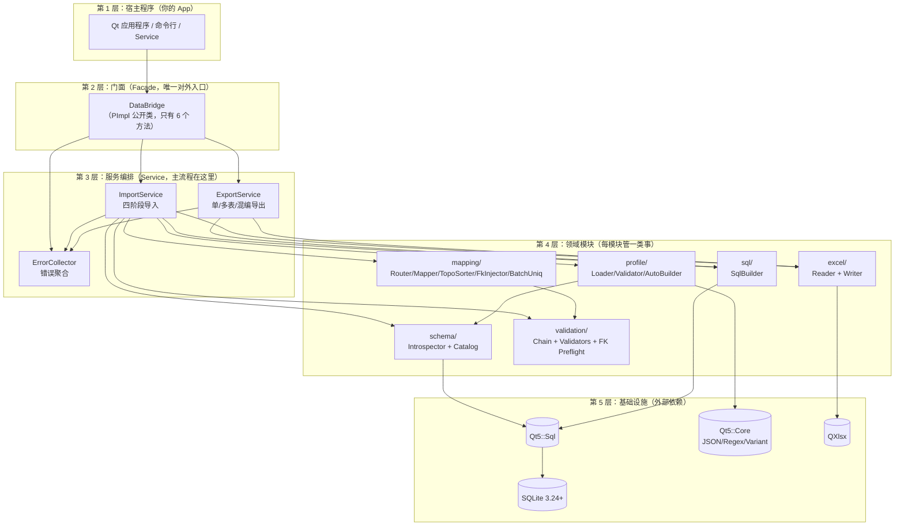

### 5.1 为什么要分层？

| 分层好处 | 反例 |
|---|---|
| 公开头零依赖，宿主不被迫 `#include` 全部 Qt-Sql | 如果 `DataBridge.h` 里写 `QSqlDatabase db_;`，宿主必须自己装 Qt-Sql |
| 模块单元测试容易写（每个模块依赖小） | 一个大类装一切，单测要 mock 一堆东西 |
| 模块可以独立替换（比如未来换成 MySQL） | SQL 代码散落各处，换数据库要改几十处 |

### 5.2 设计模式速查

| 用的模式 | 出现在哪 | 作用 |
|---|---|---|
| **Facade**（门面） | `DataBridge` | 给宿主一个简单接口，藏住内部 7 个模块 |
| **PImpl**（指针实现） | `DataBridge` + `DataBridgePrivate` | 公开头零私有依赖，改实现不破 ABI |
| **Pipeline**（流水线） | `ImportService` 的 Phase A/B/C/D | 每阶段输入输出明确，失败立刻终止 |
| **Strategy**（策略） | `ProfileMode::SingleTable/MultiTable/Mixed` | 一份 API 三种行为 |
| **Builder**（构造器） | `SqlBuilder` / `AutoProfileBuilder` | 把"组装"逻辑独立出来 |
| **Collector**（聚合器） | `ErrorCollector` | 一次收集所有错误，给宿主完整反馈 |

---

## 6. 整体流程图

### 6.1 importExcel：导入大流程

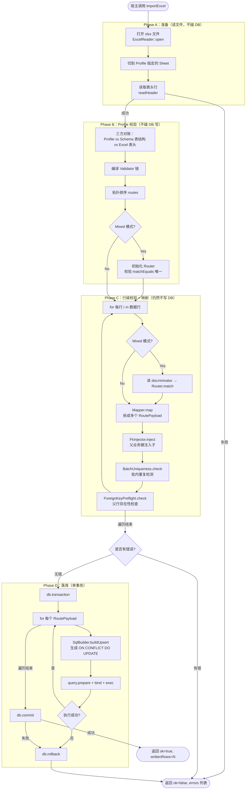

**关键约束（这是 MVP 的命门）：**
- Phase A/B/C **绝不允许**写 DB；只要 Phase B 或 C 报错，**根本不开事务**。
- Phase D 一旦任意一行失败，立刻 `ROLLBACK`，`writtenRows` 重置为 0。
- 这就是规格里反复强调的 "All or Nothing"。

### 6.2 exportExcel：导出大流程


---

## 7. 整体时序图

宿主程序与 dbridge 之间的高层交互：

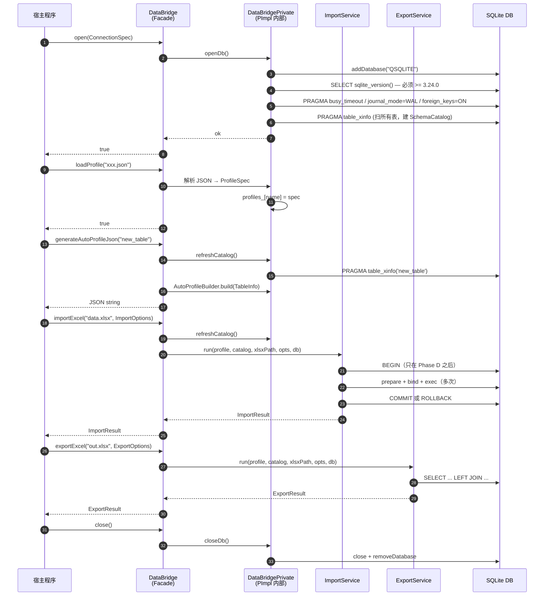

**新手提示**：序号能帮你追踪"谁先谁后"。Phase D 的 `BEGIN/COMMIT/ROLLBACK` 出现在调用 17、20、22——
这就是"事务只包住写阶段"的可视化证据。

---

## 8. 局部架构（按模块）

下面**逐个模块**讲清楚"它的内部长啥样、依赖谁、被谁调用"。

### 8.1 Profile 模块（`src/profile/`）

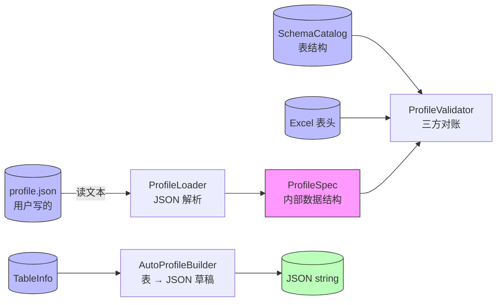

**职责拆分**：
- **`ProfileLoader`**：只做"字符串→结构体"，不查 DB 不查 Excel。这样**单测可纯字符串测**。
- **`ProfileValidator`**：拿到 `ProfileSpec` 后，对比真实 DB schema 和真实 Excel 表头，找出"声明的列在 DB 不存在"这种问题。
- **`AutoProfileBuilder`**：反向——已知 DB 表结构，自动生成一份 Profile JSON 草稿。

### 8.2 Schema 模块（`src/schema/`）

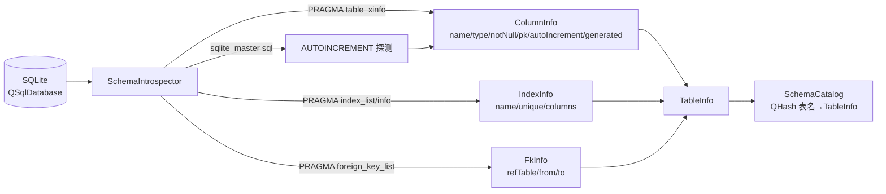

**为什么用 `table_xinfo` 而不是 `table_info`？**
- `table_info` 不返回"generated columns"（生成列），会被当成普通列处理。
- `table_xinfo` 多一列 `hidden`，值 `2/3` 表示 VIRTUAL/STORED 生成列。生成列**不能被 INSERT**，所以必须识别。

### 8.3 Validation 模块（`src/validation/`）

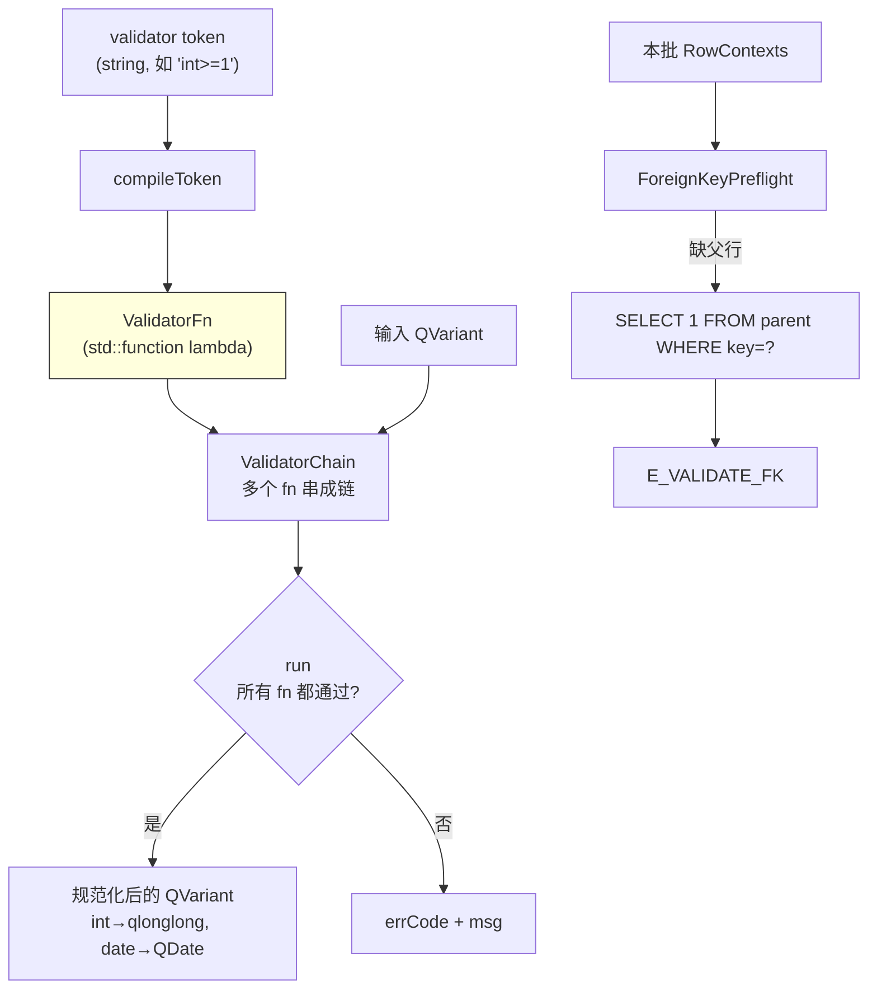

**注释**：
- "编译"一次 = 解析 token 字符串生成 lambda；之后每行只调 lambda，**不再 parse 字符串**——性能关键。
- `regex` 用 `anchoredPattern` 强制全匹配，避免"包含匹配"的陷阱。
- "互斥类型 token" 检测：`int` 与 `date:` 不能并存，编译期就报错。

### 8.4 Mapping 模块（`src/mapping/`）

这是**最复杂的模块**，单独画一张内部依赖图：

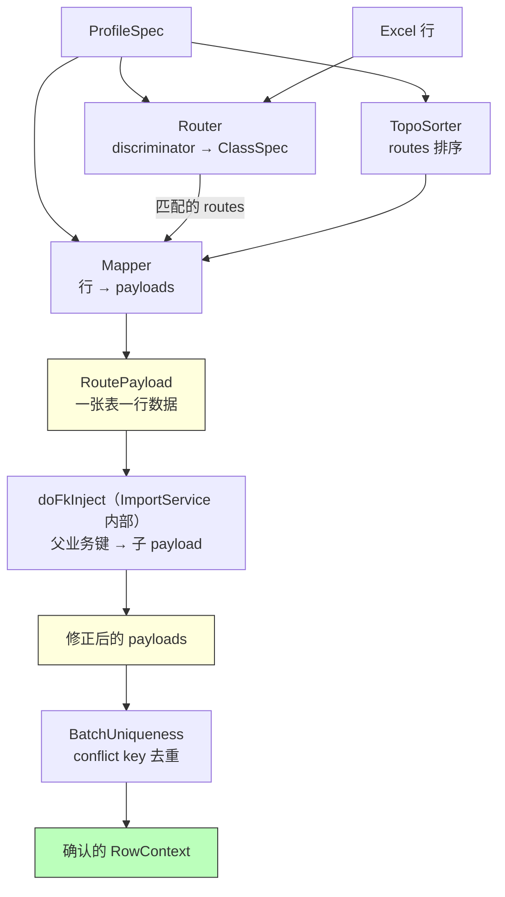

> **实现注意**：`FkInjector.cpp` 中的 `inject()` 方法是一个空存根（直接返回 `true`）。
> 真正的注入逻辑通过 `ImportService.cpp` 内的静态函数 `doFkInject()` 实现，
> 这样可以直接访问 `RouteSpec` 中的 `fkInject` 字段，无需额外传参。
> 上图中 `doFkInject` 在逻辑上归属于 ImportService，而非独立模块调用。

**为什么 FK 注入要在 `BatchUniqueness` 之前？**
- 子表的 conflict key 通常包含父业务键（如 `order_items` 的 `(order_no, line_no)`）。
- 必须先把父 `order_no` 注入到子 payload，才能算出完整的 conflict key 去查重。
- 顺序错了 → 子 payload 的 conflict 值有空洞 → 去重失效。

### 8.5 SQL 模块（`src/sql/`）

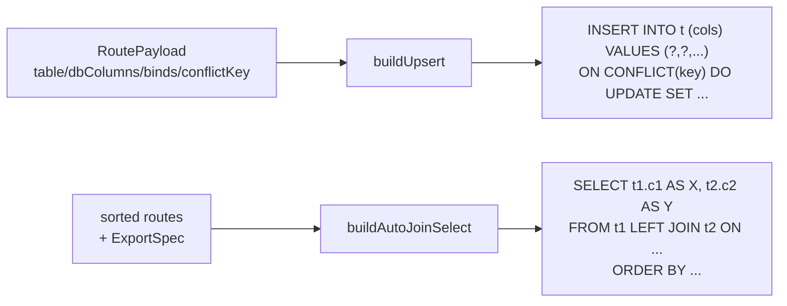

**安全性约定**：
- **标识符**（表/列名）直接拼接到 SQL——但已被 `ProfileLoader` 用正则 `^[A-Za-z_]\w*$` 验证过，**不可能有注入字符**。
- **值**全部走 `QSqlQuery::addBindValue`，**绝不拼接**。

### 8.6 Service 模块（`src/service/`）

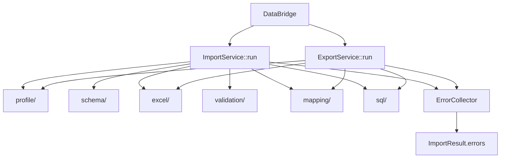

`Service` 层就是**编排**：它不实现任何业务规则，只调用其他模块、按顺序串起来、聚合错误。

---

## 9. 局部流程图

### 9.1 Phase A：打开 xlsx + 读表头


### 9.2 Phase B：Profile 校验（三方对账）


**关键细节**：Phase B 校验**尽量不提前 return**，把所有错误一次性收集，给用户一次看完，避免改一次跑一次。

### 9.3 Phase C：行级映射 + 校验


### 9.4 Phase D：单事务落库

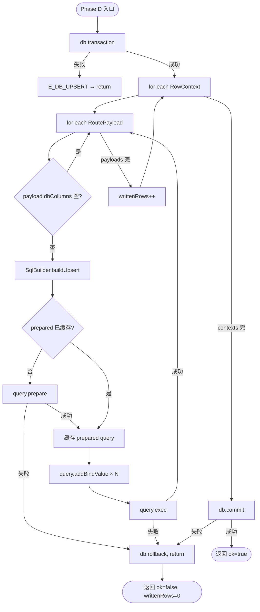

**为什么 prepare 要缓存？**
- 同一张表的 N 行用**同一条 SQL**（列序不变）。
- prepare 一次，反复 bind+exec，性能比每行重新 prepare 提升 5~10 倍。

### 9.5 Upsert SQL 生成


### 9.6 拓扑排序（Kahn 算法）


**新手提示**：Kahn 算法本质就是"先做没人依赖的，做完后释放依赖它的，循环到全部做完"。
如果还有节点没做完但 queue 空了 → 一定存在环（A 依赖 B，B 依赖 A）。

### 9.7 FK 业务键注入

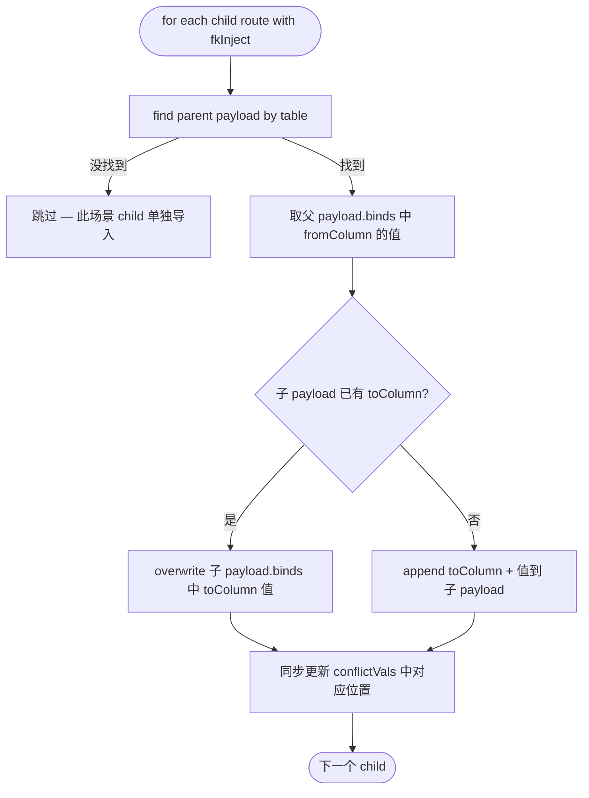

---

## 10. 局部时序图

### 10.1 importExcel 详细时序

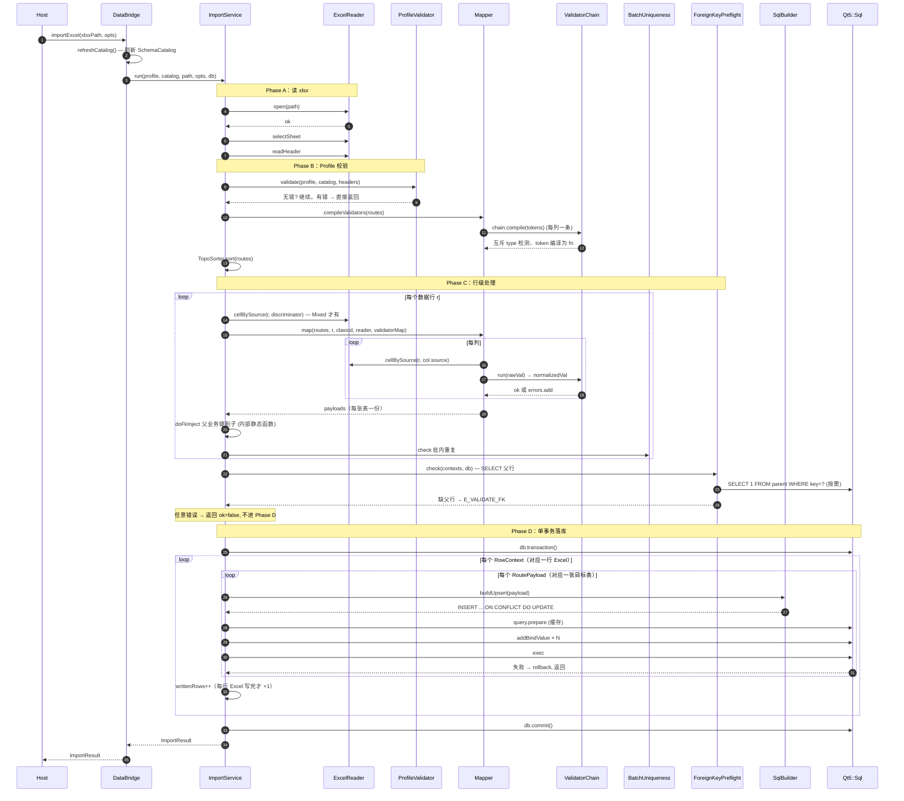

### 10.2 exportExcel 详细时序（Mixed 模式最复杂）

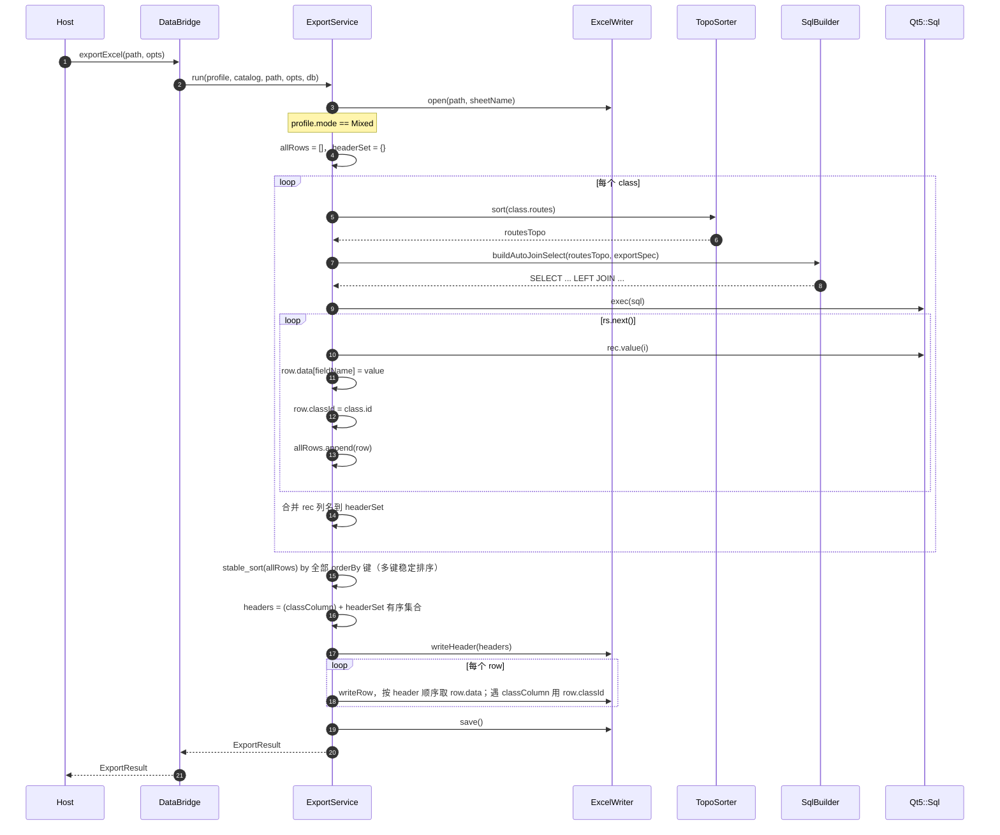

### 10.3 generateAutoProfileJson 时序

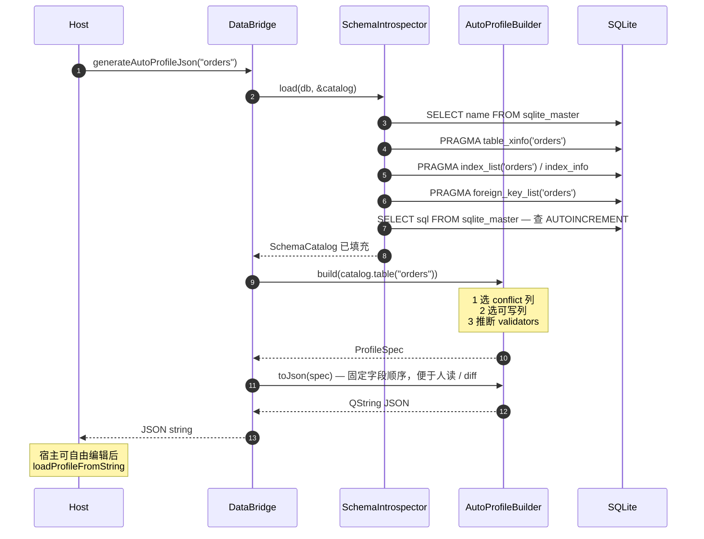

---

## 11. 关键算法详解

### 11.1 SQLite Upsert（规格 §8）

```sql
INSERT INTO orders (order_no, customer, amount)
VALUES (?, ?, ?)
ON CONFLICT(order_no) DO UPDATE SET
  customer = excluded.customer,
  amount   = excluded.amount;
```

**为什么不用 `INSERT OR REPLACE`？**
- `REPLACE` = DELETE 旧行 + INSERT 新行。
- DELETE 旧行会**触发外键级联删除**，把子表数据也带走。
- DELETE 旧行会让"Profile 没映射但 DB 里有的列"丢失值。
- `ON CONFLICT DO UPDATE` 是**原地更新**，不动这些列。

### 11.2 批内唯一性的 length-prefixed 编码（规格 §6.4）

朴素拼接：`"abc" + "|" + "d"` 与 `"ab" + "|" + "cd"` 都等于 `"abc|d"`，**会撞键**。

length-prefixed：
- `["abc", "d"]` → `"3|abc|1|d|"`
- `["ab", "cd"]` → `"2|ab|2|cd|"`
- 两者**永远不可能相等**。

代码（`BatchUniqueness.cpp:9-16`）：
```cpp
for (const auto& v : vals) {
    QString s = v.isNull() ? QStringLiteral("<null>") : v.toString();
    encoded += QString::number(s.length()) + "|" + s + "|";
}
```

### 11.3 多键稳定排序（导出 Mixed 模式）

```cpp
std::stable_sort(allRows.begin(), allRows.end(),
    [&sortKeys](const MixedRow& a, const MixedRow& b) {
        for (const QString& k : sortKeys) {
            QString va = a.data.value(k).toString();
            QString vb = b.data.value(k).toString();
            if (va != vb) return va < vb;
        }
        return false;
    });
```

- `stable_sort` 保证相等元素相对顺序不变。
- 逐键比较：第一个键相等则比第二个，依此类推（类似 SQL `ORDER BY a, b, c`）。

### 11.4 autoIncrement 三条件检测（规格 §5.2）

```text
列被认定为 AUTOINCREMENT 必须同时满足：
1. 列类型 (case-insensitive) 等于 INTEGER
2. 是单列主键 (pkOrder == 1)
3. CREATE TABLE 的 SQL 中包含 "AUTOINCREMENT" 关键字
```

**为什么 (3) 不可省？**
- SQLite 把所有 `INTEGER PRIMARY KEY` 列都当作 ROWID alias，但不一定是 AUTOINCREMENT。
- 没有 AUTOINCREMENT 时，删除行后 rowid 会重用；有 AUTOINCREMENT 时**严格单调递增**。
- `AutoProfileBuilder` 区分这两种：AUTOINCREMENT 列**默认不从 Excel 写入**。

---

## ⚠️ BREAKING：export 反向 lookup — H 列消失、A 列出现

声明了 `lookups[]` 的 profile，升级后**导出 Excel 结构会变化**：

- `lookups[*].select[*].dbColumn`（H 列，如 `customer_name`）**默认不再出现**在导出 Excel 中
- 对应的 `lookups[*].match[*].Excel_header`（A 列，如 `CustNo`）**默认出现**在导出 Excel 中

这是为了实现导入→导出的无损往返。如果不希望结构改变，在对应 lookup 上加一行：

```json
"exportRoundtrip": false
```

即可恢复旧行为（H 列保留，A 列不出现）。

---

## ⚠️ BREAKING：fkInject 格式变更

旧的单列对象写法 `"fkInject": { "from": "table.col", "to": "table.col" }` 已**删除**，不再向后兼容。

**迁移对照**：

```jsonc
// 旧（已删除，会报 parse error）
"fkInject": { "from": "orders.order_no", "to": "order_items.order_no" }

// 新（单列）
"fkInject": [{ "from": "orders", "pairs": [["order_no","order_no"]] }]

// 新（多列复合键）
"fkInject": [
  { "from": "orders", "pairs": [["order_no","order_no"],["tenant_id","tenant_id"]] }
]

// 新（多父表）
"fkInject": [
  { "from": "orders",      "pairs": [["order_no","order_no"]] },
  { "from": "ref_tenants", "pairs": [["tenant_id","tenant_id"]] }
]
```

## 12. 三种 Profile 模式对比

| 维度 | SingleTable | MultiTable | Mixed |
|---|---|---|---|
| **典型场景** | 一个 Sheet 对应一张表 | 一个 Sheet 拆到多张父子表 | 一个 Sheet 混杂 A/B/C 三类行 |
| **Profile 关键字段** | `table` + `conflict` + `columns` | `routes[]` + 每个 route 有 `parent` / `fkInject` | `discriminator` + `classes[]` |
| **Router 是否参与** | 否 | 否 | 是 |
| **TopoSorter 是否参与** | 退化（只有一个 route） | 是 | 每个 class 内部各自排序 |
| **FkInjector 是否参与** | 否 | 是 | 是（class 内） |
| **导出 SQL** | `SELECT FROM t` 或 explicitSql | LEFT JOIN 或 explicitSql | 每 class 各一条 SQL，内存合并 |
| **classColumn 表头** | 无 | 无 | 有（写入 `Type` 列等） |

### 12.1 SingleTable Profile 示例

```json
{
  "profileName": "customer_basic",
  "sheet": "Customers",
  "headerRow": 1,
  "mode": "singleTable",
  "table": "customer",
  "conflict": { "columns": ["customer_no"] },
  "columns": {
    "customer_no": { "source": "CustomerNo", "validators": ["notNull", "len<=32"] },
    "name":        { "source": "Name",       "validators": ["notNull"] },
    "phone":       { "source": "Phone",      "validators": ["regex:^[-0-9+ ]*$"] }
  }
}
```

### 12.2 MultiTable Profile（一行 Excel → orders + order_items 各一行）

```json
{
  "profileName": "order_m_set",
  "sheet": "Orders",
  "mode": "multiTable",
  "routes": [
    {
      "table": "orders",
      "conflict": { "columns": ["order_no"] },
      "columns": { "order_no": { "source": "OrderNo" }, "amount": { "source": "Amount" } }
    },
    {
      "table": "order_items",
      "parent": "orders",
      "fkInject": [{ "from": "orders", "pairs": [["order_no","order_no"]] }],
      "conflict": { "columns": ["order_no", "line_no"] },
      "columns": { "line_no": { "source": "LineNo" }, "sku": { "source": "Sku" } }
    }
  ]
}
```

### 12.3 Mixed Profile（A/B/C 混编）

```json
{
  "profileName": "mixed_abc",
  "sheet": "Mixed",
  "mode": "mixed",
  "discriminator": { "source": "Type" },
  "classes": [
    { "id": "A", "match": { "equals": "A" }, "routes": [...] },
    { "id": "B", "match": { "equals": "B" }, "routes": [...] },
    { "id": "C", "match": { "equals": "C" }, "routes": [...] }
  ],
  "export": { "classColumn": "Type", "orderBy": ["sort_no"] }
}
```

---

## 13. 错误码体系

所有错误码集中在 `include/dbridge/Errors.h`，按"问题发生在哪个阶段"分组：

```mermaid
graph LR
    subgraph IO["I/O 错误（基础设施）"]
        e1[E_OPEN_DB<br/>打不开 SQLite]
        e2[E_OPEN_XLSX<br/>打不开 xlsx]
        e3[E_WRITE_XLSX<br/>写 xlsx 失败]
    end

    subgraph Prof["Profile 错误（声明问题）"]
        e4[E_PROFILE_PARSE<br/>JSON 格式错]
        e5[E_PROFILE_TABLE_NOT_FOUND<br/>声明的表不在 DB]
        e6[E_PROFILE_COLUMN_NOT_FOUND<br/>声明的列不在 DB]
        e7[E_PROFILE_NO_CONFLICT_KEY<br/>无可用 Upsert 键]
        e8[E_PROFILE_TOPOLOGY_CYCLE<br/>多表依赖成环]
    end

    subgraph Data["数据错误（值问题）"]
        e9[E_HEADER_NOT_FOUND<br/>Excel 缺表头]
        e10[E_ROUTE_UNMATCHED<br/>Mixed 行未匹配 class]
        e11[E_VALIDATE_NULL<br/>必填空]
        e12[E_VALIDATE_TYPE<br/>类型/长度/枚举错]
        e13[E_VALIDATE_REGEX<br/>正则不匹配]
        e14[E_VALIDATE_DUPLICATE<br/>批内 conflict key 重复]
        e15[E_VALIDATE_FK<br/>父行不存在]
        e18[E_LOOKUP_KEY_EMPTY<br/>lookup key 为空]
        e19[E_LOOKUP_KEY_INVALID<br/>lookup key 类型转换失败]
        e20[E_LOOKUP_NOT_FOUND<br/>参考表无命中]
        e21[E_LOOKUP_AMBIGUOUS<br/>参考表命中多行]
        e22[E_LOOKUP_QUERY_FAILED<br/>lookup SELECT 失败]
    end

    subgraph Temporal["时间字段错误"]
        t1[E_TIME_PARSE<br/>导入时 Excel→内存 解析失败]
        t2[E_TIME_PARSE_DB<br/>导出时 DB→内存 解析失败]
        t3[W_TIME_ORDERBY_NONSORTABLE<br/>dbFormat 不满足字典序排序]
    end

    subgraph ExportOrder["导出列序错误"]
        o1[E_EXPORT_UNKNOWN_HEADER<br/>columnOrder 含未声明表头]
        o2[E_EXPORT_DUPLICATE_ORDER<br/>columnOrder 有重复]
        o3[E_EXPORT_ORDER_WITH_RAW_SQL<br/>columnOrder 与 explicitSql 同时声明]
    end

    subgraph RevLookup["反向 lookup 错误（导出）"]
        r1[E_REVERSE_LOOKUP_NOT_FOUND<br/>G 表中无匹配行]
        r2[E_REVERSE_LOOKUP_AMBIGUOUS<br/>G 表命中多行]
        r3[E_REVERSE_LOOKUP_QUERY_FAILED<br/>预取 SELECT 失败]
    end

    subgraph Run["运行期错误"]
        e16[E_DB_UPSERT<br/>SQLite 写失败]
        e17[E_EXPORT_QUERY<br/>导出 SELECT 失败]
    end
```

每条错误带 5 个上下文字段（`RowError`）：
- `sheet`：哪个 Sheet
- `row`：第几行（Excel 1-based）；表级错误为 0
- `column`：哪个表头列；表级错误为空
- `rawValue`：用户原本写的什么
- `message`：人类可读的描述

宿主拿到 `errors` 列表后，可以一次性高亮全部错误单元格，**不需要让用户改一处跑一次**。

> **同步子系统的错误码**（`E_SYNC_*` / `W_SYNC_*` / `E_BUSY`）同样定义在 `include/dbridge/Errors.h`，
> 但语义、上报通道（同步返回值 vs 后台 `errors()` 环）和 `SyncError` 上下文字段都不同，集中在
> [§15.10 同步错误码](#1510-同步错误码e_sync_--w_sync_) 单独讲。

---

## 14. 完整使用指南（手把手）

> 这一节是给**完全没接触过这个库的人**写的。从环境准备到第一次跑通示例，每一步都讲清楚。
> 如果你只想跑通一个 demo，直接看 [14.6 第一个完整示例](#146-第一个完整示例从零到成功导入)。

### 14.1 系统要求与依赖

| 依赖 | 最低版本 | 说明 |
|---|---|---|
| **操作系统** | Linux / macOS / Windows | MVP 在 Linux 上验证；其他平台理论可行 |
| **编译器** | GCC 9+ / Clang 10+ / MSVC 2019+ | 必须支持 C++17 |
| **CMake** | 3.16+ | 项目使用现代 CMake target 写法 |
| **Qt** | **5.12.12 LTS** | 必须包含 `Core` + `Sql` + `Gui` 三个模块；运行测试还需 `Test` |
| **SQLite** | **3.24.0+** | 因为依赖 `INSERT ... ON CONFLICT(...) DO UPDATE`，库会在 `open()` 时检查版本，低版本直接报 `E_OPEN_DB` |
| **QXlsx** | 已 vendored 在 `3rdparty/QXlsx/`（QtExcel/QXlsx，BSD-2） | **不需要单独安装**，构建系统会自动编译。注意它依赖 Qt 的 `QtGui/private/qzipreader_p.h`——这要求 Qt 安装包含 GUI 私有头文件（Qt 官方 Online Installer 默认带；某些 Linux 发行版的 `qtbase-private-dev` 包要额外装） |

**怎么检查环境是否满足？**

```bash
# 1. 编译器
g++ --version                  # 应 >= 9.0

# 2. CMake
cmake --version                # 应 >= 3.16

# 3. Qt（看你装在哪）
ls /opt/Qt5.12.12/5.12.12/gcc_64/lib/libQt5Core.so* 2>/dev/null

# 4. SQLite（命令行工具版本通常和 lib 版本一致）
sqlite3 --version              # 应 >= 3.24
# 也可以用 SQL 查询库内置版本：
sqlite3 :memory: 'SELECT sqlite_version();'
```

> **新手提示**：本库不依赖系统的 `libsqlite3`——Qt5::Sql 内置 SQLite 驱动。
> 但 ON CONFLICT DO UPDATE 是 SQLite 3.24+ 才有的语法，**Qt 5.12 自带的 SQLite 一般是 3.x**，
> 大多数情况下没问题。报错就升级 Qt 或者用系统 SQLite。

### 14.2 从源码构建 dbridge

#### 14.2.1 克隆仓库 + 子模块

```bash
git clone <your-repo-url>
cd <repo-root>
# 如果 QXlsx 是 submodule（本项目是 vendored 的，可跳过这步）
git submodule update --init --recursive
```

#### 14.2.2 配置 CMake

```bash
# Debug 构建 + 启用测试 + 启用 examples
cmake -S . -B build \
  -DCMAKE_BUILD_TYPE=Debug \
  -DBUILD_TESTING=ON \
  -DDBRIDGE_BUILD_EXAMPLES=ON \
  -DCMAKE_PREFIX_PATH=/opt/Qt5.12.12/5.12.12/gcc_64
```

**CMake 选项详解：**

| 选项 | 默认值 | 作用 |
|---|---|---|
| `CMAKE_BUILD_TYPE` | 空 | 推荐 `Debug` 或 `Release`；调试时用 Debug，发布用 Release |
| `BUILD_TESTING` | `ON`（CTest 默认） | 关掉可减少构建时间：`-DBUILD_TESTING=OFF` |
| `DBRIDGE_BUILD_EXAMPLES` | `ON` | 关掉就不会构建 `dbridge-cli`：`-DDBRIDGE_BUILD_EXAMPLES=OFF` |
| `CMAKE_PREFIX_PATH` | 系统默认 | 必须指向你 Qt5.12 的 `gcc_64` 目录（即包含 `lib/cmake/Qt5/` 的那一层） |
| `CMAKE_INSTALL_PREFIX` | `/usr/local` | 如果你打算 `make install`，改成你想装的路径 |

#### 14.2.3 编译

```bash
cmake --build build -j$(nproc)
# 或：cd build && make -j$(nproc)
```

构建产物：
- `build/libdbridge.so`（Linux） / `dbridge.dll`（Windows） / `libdbridge.dylib`（macOS）
- `build/examples/cli/dbridge-cli`（CLI 工具）
- `build/tests/*`（单元 + 集成测试）

#### 14.2.4 运行测试

```bash
cd build
ctest --output-on-failure          # 全部 17 个测试套件
ctest --output-on-failure -V       # 详细日志
ctest -R tst_profile_loader        # 只跑某个测试（套件名见 tests/CMakeLists.txt）
```

完整套件清单见 `tests/CMakeLists.txt`；其中 `tst_fk_preflight` 锁定 mixed 模式 FK 预校验回归，`tst_profile_validator` 覆盖 Profile × DB × Excel 三方校验，`tst_lookup_prefetch` / `tst_lookup_semantics` 覆盖 lookup 预取与行级语义，`tst_temporal_import` / `tst_temporal_export` 覆盖时间字段格式转换，`tst_column_order_export` 覆盖导出列序，`tst_reverse_lookup_export` 覆盖反向 lookup 导出（详见 §14.16 端到端验证流程）。

#### 14.2.5 安装（可选）

```bash
cmake --install build --prefix /opt/dbridge
# 会装到：
# /opt/dbridge/lib/libdbridge.so
# /opt/dbridge/include/dbridge/*.h
```

> 注意：当前 `CMakeLists.txt` **未配置 `install()` 规则**——MVP 阶段建议直接以源码集成（见 14.3）。

### 14.3 集成到你的 Qt 项目

#### 方式 A：CMake `add_subdirectory`（推荐）

把 `dbridge` 仓库放到你项目下，比如 `third_party/dbridge`：

```cmake
# your_project/CMakeLists.txt
cmake_minimum_required(VERSION 3.16)
project(my_app LANGUAGES CXX)

set(CMAKE_CXX_STANDARD 17)
set(CMAKE_AUTOMOC ON)

find_package(Qt5 5.12 REQUIRED COMPONENTS Core Sql Gui Widgets)

# 把 dbridge 当成子目录纳入
add_subdirectory(third_party/dbridge)

add_executable(my_app main.cpp MainWindow.cpp)
target_link_libraries(my_app PRIVATE dbridge Qt5::Widgets)
```

**好处**：
- 不需要先编译安装 dbridge
- 你项目里 `#include "dbridge/DataBridge.h"` 就能用
- `dbridge` 是 PRIVATE/PUBLIC 透传 Qt5::Core + Qt5::Sql 的，无需重复 `target_link_libraries`

#### 方式 B：CMake `find_package`（库已安装时）

```cmake
find_package(dbridge REQUIRED)        # 需要 dbridge 提供 dbridgeConfig.cmake
target_link_libraries(my_app PRIVATE dbridge::dbridge)
```

> 当前 MVP 未生成 `dbridgeConfig.cmake`，方式 B 暂不可用。

#### 方式 C：qmake 项目（旧式 .pro 文件）

```pro
QT += core sql gui
CONFIG += c++17

INCLUDEPATH += /path/to/dbridge/include /path/to/dbridge/build/include
LIBS += -L/path/to/dbridge/build -ldbridge
LIBS += -Wl,-rpath,/path/to/dbridge/build  # 让运行时能找到 .so

SOURCES += main.cpp
```

记得 `main.cpp` 里 `#include "dbridge/DataBridge.h"`。

### 14.4 公共 API 参考（6 个方法）

整个公开头只有 1 个类 `DataBridge`，6 个方法。**这就是你需要掌握的全部 API**。

```cpp
class DataBridge {
public:
    DataBridge();                                  // ① 构造
    ~DataBridge();                                 //    析构

    bool open(const ConnectionSpec& spec, QString* err = nullptr);   // ② 打开 SQLite
    void close();                                                    // ③ 关闭

    bool loadProfile(const QString& jsonPath, QString* err = nullptr);
    bool loadProfileFromString(const QString& json, QString* err = nullptr);   // ④ 加载 Profile

    QString generateAutoProfileJson(const QString& table, QString* err = nullptr);  // ⑤ 自动生成 Profile

    ImportResult importExcel(const QString& xlsxPath, const ImportOptions& options);   // ⑥ 导入
    ExportResult exportExcel(const QString& xlsxPath, const ExportOptions& options);   // ⑦ 导出
};
```

> 注：①②③ + ④（两个加载方法算一个）+ ⑤ + ⑥ + ⑦ = **核心 6 个对外行为**。

#### ① `open(spec, err) → bool`

**作用**：打开 SQLite 数据库连接，校验版本，配置 PRAGMA，刷新 SchemaCatalog。

**入参**：
- `spec.sqlitePath`：DB 文件路径（如 `"mydata.db"`；不存在会自动创建空库）
- `spec.busyTimeoutMs`：SQLite 忙等待毫秒数（默认 5000）
- `spec.enableWal`：是否开启 WAL 日志（默认 `true`，强烈推荐）

**返回**：
- `true`：成功，库可以用了
- `false`：失败，`*err` 里有可读的错误描述（含错误码 `E_OPEN_DB`）

**失败常见原因**：
- 路径不可写（权限）
- SQLite 版本 < 3.24
- 文件不是合法 SQLite 数据库

```cpp
dbridge::DataBridge bridge;
dbridge::ConnectionSpec cs;
cs.sqlitePath = "/data/app.db";
cs.busyTimeoutMs = 10000;
cs.enableWal = true;

QString err;
if (!bridge.open(cs, &err)) {
    qFatal("打开 DB 失败：%s", qPrintable(err));
}
```

#### ② `close()`

**作用**：关闭 DB 连接，从 Qt 全局连接池中移除。

**注意**：析构时会自动调用，一般不需要手动调。

#### ③ `loadProfile(jsonPath, err) / loadProfileFromString(json, err) → bool`

**作用**：把一份 Profile JSON 解析并存到内部 `profiles_` 表（用 `profileName` 当 key）。

**返回**：
- `true`：解析+校验通过，Profile 可用
- `false`：`*err` 含错误码 `E_PROFILE_PARSE` / `E_PROFILE_TABLE_NOT_FOUND` 等

```cpp
QString err;
bridge.loadProfile("profiles/customer_basic.json", &err);
// 也可以从字符串加载（适合从配置中心读 / 加密后解密）：
QString jsonStr = readMyEncryptedProfile();
bridge.loadProfileFromString(jsonStr, &err);
```

**多个 Profile？** 多次调用即可。每个 Profile 内必须有不同的 `profileName`，否则后加载的会覆盖前者。

#### ④ `generateAutoProfileJson(table, err) → QString`

**作用**：自动从 SQLite 表结构生成一份 SingleTable Profile JSON 草稿。返回 JSON 字符串。

```cpp
QString err;
QString json = bridge.generateAutoProfileJson("customer", &err);
if (json.isEmpty()) {
    qWarning() << "生成失败:" << err;
} else {
    QFile f("draft.json"); f.open(QIODevice::WriteOnly); f.write(json.toUtf8());
    // 编辑 draft.json 后再 loadProfile
}
```

**典型用法**：你装好了 DB 但还没 Profile，先用 AutoProfile 生成草稿，改 source/validators 后再加载。

#### ⑤ `importExcel(xlsxPath, options) → ImportResult`

**作用**：4 阶段流水线把 Excel 导入 DB。Phase A/B/C 任何错误都不写库，Phase D 单事务写入。

```cpp
dbridge::ImportOptions opts;
opts.profileName = "customer_basic";     // 必填：在 loadProfile 之后才能引用
opts.sheetName = "";                     // 可选：覆盖 Profile 的 sheet 字段
opts.abortOnError = true;                // MVP 必须 true（all-or-nothing）

auto r = bridge.importExcel("data.xlsx", opts);
if (!r.ok) {
    qWarning() << "导入失败 errors=" << r.errors.size();
    for (const auto& e : r.errors) {
        qWarning() << e.code << "row=" << e.row << "col=" << e.column << e.message;
    }
} else {
    qInfo() << "导入成功，写入" << r.writtenRows << "行";
}
```

#### ⑥ `exportExcel(xlsxPath, options) → ExportResult`

**作用**：根据 Profile 的 `export`（或 routes 隐含的 LEFT JOIN）从 DB 查询并写入 Excel。

```cpp
dbridge::ExportOptions eopts;
eopts.profileName = "orders_full";
auto er = bridge.exportExcel("orders_export.xlsx", eopts);
if (!er.ok) {
    for (const auto& e : er.errors) qWarning() << e.code << e.message;
}
```

### 14.5 配置结构体详解

#### `ConnectionSpec`

```cpp
struct ConnectionSpec {
    QString sqlitePath;          // 必填：DB 文件路径
    int busyTimeoutMs = 5000;    // SQLite 锁等待毫秒（默认 5 秒）
    bool enableWal = true;       // 是否开 WAL 模式（强烈建议 true）
};
```

**WAL 是什么？** 默认 `journal_mode=DELETE`，写期间读会被阻塞；`WAL` 模式下读写不互斥，性能高得多。生产环境一律 `true`。

#### `ImportOptions`

```cpp
struct ImportOptions {
    QString profileName;         // 必填：要用哪份 Profile
    QString sheetName;           // 可选：覆盖 Profile 里的 sheet，为空则用 Profile 的
    bool abortOnError = true;    // MVP 必须 true，false 行为未实现
    bool dryRun = false;         // true = 跳过 UPSERT，仅校验和预取；不建议用于生产
};
```

#### `ExportOptions`

```cpp
struct ExportOptions {
    QString profileName;         // 必填
    QString sheetName;           // 可选
};
```

#### `ImportResult` / `ExportResult` / `RowError`

```cpp
struct ImportResult {
    bool ok = false;                          // 全部成功才 true
    int readRows = 0;                         // 从 Excel 读到的行数
    int writtenRows = 0;                      // 成功写入 DB 的行数；失败时为 0（all-or-nothing）
    QList<RowError> errors;                   // 所有错误（不止一个！）
    QVector<RowContext> dryRunPayloads;        // dryRun=true 时暴露构造好的 payload 列表
};

struct RowError {
    QString sheet;               // 哪个 sheet
    int row = 0;                 // Excel 第几行（1-based）；0 表示表级错误
    QString column;              // 哪个表头列名；空表示行/表级错误
    QString rawValue;            // 出问题的原始单元格值（便于显示）
    QString code;                // 错误码（见 Errors.h，如 "E_VALIDATE_TYPE"）
    QString message;             // 人类可读描述
};
```

### 14.6 第一个完整示例：从零到成功导入

我们走一遍**最小完整流程**，从准备数据到运行成功。

#### 步骤 1：准备 SQLite 表

```bash
sqlite3 demo.db <<'SQL'
CREATE TABLE customer (
    id          INTEGER PRIMARY KEY AUTOINCREMENT,
    customer_no TEXT    NOT NULL UNIQUE,
    name        TEXT    NOT NULL,
    phone       TEXT,
    age         INTEGER
);
SQL
```

#### 步骤 2：准备 Excel（`customers.xlsx`）

| CustomerNo | Name | Phone | Age |
|---|---|---|---|
| C001 | 张三 | 13800000001 | 28 |
| C002 | 李四 | 13800000002 | 35 |
| C003 | 王五 |  | 42 |

#### 步骤 3：写 Profile（`customer_basic.json`）

```json
{
  "profileName": "customer_basic",
  "sheet": "Customers",
  "headerRow": 1,
  "mode": "singleTable",
  "table": "customer",
  "conflict": { "columns": ["customer_no"] },
  "columns": {
    "customer_no": { "source": "CustomerNo", "validators": ["notNull", "len<=32"] },
    "name":        { "source": "Name",       "validators": ["notNull"] },
    "phone":       { "source": "Phone",      "validators": ["regex:^1\\d{10}$"] },
    "age":         { "source": "Age",        "validators": ["int>=0"] }
  }
}
```

**JSON 字段速记**：
- `profileName`：你给这份 Profile 起的名字，后面 `ImportOptions.profileName` 要填这个
- `sheet`：Excel 里的 Sheet 标签名（Excel 左下角 tab 名）
- `headerRow`：哪一行是表头（1-based，通常是 1）
- `mode`：`singleTable` / `multiTable` / `mixed` 三选一
- `table`：目标表名（SQLite 里的表）
- `conflict.columns`：用哪些列做 upsert 的 conflict key（通常是主键/唯一键）
- `columns`：`数据库列 → { source: Excel 表头, validators: [校验规则] }`

#### 步骤 4：写 C++ 代码

```cpp
// main.cpp
#include "dbridge/DataBridge.h"
#include "dbridge/Errors.h"

#include <QCoreApplication>
#include <QDebug>

int main(int argc, char* argv[]) {
    QCoreApplication app(argc, argv);

    dbridge::DataBridge bridge;
    QString err;

    // 1. 打开数据库
    dbridge::ConnectionSpec cs;
    cs.sqlitePath = "demo.db";
    if (!bridge.open(cs, &err)) {
        qCritical() << "open failed:" << err;
        return 1;
    }

    // 2. 加载 Profile
    if (!bridge.loadProfile("customer_basic.json", &err)) {
        qCritical() << "load profile failed:" << err;
        return 1;
    }

    // 3. 导入 Excel
    dbridge::ImportOptions opts;
    opts.profileName = "customer_basic";
    auto r = bridge.importExcel("customers.xlsx", opts);

    if (r.ok) {
        qInfo() << "导入成功，写入" << r.writtenRows << "行";
    } else {
        qWarning() << "导入失败，共" << r.errors.size() << "条错误:";
        for (const auto& e : r.errors) {
            qWarning().noquote()
                << QString("  [%1] row=%2 col=%3 raw='%4' msg=%5")
                       .arg(e.code).arg(e.row).arg(e.column).arg(e.rawValue).arg(e.message);
        }
        return 1;
    }

    return 0;
}
```

#### 步骤 5：CMake 链接

```cmake
add_subdirectory(third_party/dbridge)
add_executable(demo main.cpp)
target_link_libraries(demo PRIVATE dbridge Qt5::Core)
```

#### 步骤 6：编译运行

```bash
cmake --build build -j$(nproc)
./build/demo
# 期望输出：导入成功，写入 3 行
```

#### 步骤 7：验证结果

```bash
sqlite3 demo.db 'SELECT * FROM customer;'
# 1|C001|张三|13800000001|28
# 2|C002|李四|13800000002|35
# 3|C003|王五||42
```

**恭喜，你已经跑通完整流程！** 后面几节是进阶。

### 14.7 编写 Profile JSON

#### Profile 顶层字段（通用）

```jsonc
{
  "profileName": "<给这份 Profile 起的名字>",     // 必填，唯一
  "sheet":       "<Excel Sheet 标签名>",           // 必填
  "headerRow":   1,                                // 表头在第几行，1-based
  "mode":        "singleTable | multiTable | mixed", // 必填

  // 根据 mode 不同，下面写不同字段：
  // — singleTable: table / conflict / columns
  // — multiTable:  routes
  // — mixed:       discriminator / classes

  "export": { ... }                                // 可选：导出专用配置
}
```

#### SingleTable mode 字段

```jsonc
{
  "mode": "singleTable",
  "table": "<DB 表名>",
  "conflict": { "columns": ["<conflict 列1>", "<conflict 列2>"] },
  "columns": {
    "<DB 列名>": {
      "source": "<Excel 表头列名>",     // 也可以为空（用于自动填充 FK 等）
      "validators": ["notNull", "int>=0", "regex:^\\d+$"]
    }
  }
}
```

#### MultiTable mode 字段

```jsonc
{
  "mode": "multiTable",
  "routes": [
    {
      "table": "orders",
      "conflict": { "columns": ["order_no"] },
      "columns": { ... }
    },
    {
      "table": "order_items",
      "parent": "orders",                                   // 父表名（必须先于本表写）
      "fkInject": [{ "from": "orders", "pairs": [["order_no","order_no"]] }],
      "lookups": [                                          // 可选：从同库参考表预取字段
        {
          "name": "cust",                                   // route 内唯一的标识名
          "from": "ref_customers",                          // 参考表名（同一 SQLite 连接）
          "match": [["c_no", "CustNo"]],                    // [[参考表列, Excel 表头], ...]
          "select": [["c_name", "customer_name"]]           // [[参考表列, 目标 DB 列], ...]
        }
      ],
      "conflict": { "columns": ["order_no", "line_no"] },
      "columns": { ... }
    }
  ]
}
```

**lookups 字段说明**

每个 lookup 元素从同一 SQLite 连接的参考表 `from` 中批量预取字段，行级别命中后合并到当前 route 的写入列集合：

| 子字段 | 必填 | 默认 | 说明 |
|--------|------|------|------|
| `name` | ✓ | — | Route 内唯一标识，不影响 DB 写入 |
| `from` | ✓ | — | 参考表名（必须在同一 SQLite 连接中存在） |
| `match` | ✓ | — | `[[参考表列, Excel 表头], ...]`：用 Excel 行的表头值查参考表键 |
| `select` | ✓ | — | `[[参考表列, 目标 DB 列], ...]`：命中后写入当前 route 的哪些列 |
| `exportRoundtrip` | 否 | `true` | `true`：导出时执行反向 lookup，H 列消失 A 列恢复；`false`：H 列原样出现，A 列不出现（详见 §⚠️ 反向 lookup BREAKING 说明） |
| `exportOnMissing` | 否 | `"error"` | 反向 lookup 找不到匹配时的处理：`"error"` 跳过行+报 `E_REVERSE_LOOKUP_NOT_FOUND`；`"null"` 写空继续；`"skip"` 写空继续且不计入错误统计 |

**错误码**：

| 错误码 | 含义 |
|--------|------|
| `E_LOOKUP_KEY_EMPTY` | Excel match key 为空（null / 纯空白） |
| `E_LOOKUP_KEY_INVALID` | match key 值无法转换为参考表列的类型亲和（如字母值对应 INTEGER 列） |
| `E_LOOKUP_NOT_FOUND` | 参考表中找不到该 key |
| `E_LOOKUP_AMBIGUOUS` | 参考表中命中多行（需保证 match key 唯一） |
| `E_LOOKUP_QUERY_FAILED` | SELECT 执行失败（SQL 错误） |

> 所有 lookup 错误均为 **row-level error**（记录到该行，不中断整批导入）。

**fkInject 字段说明**

| 子字段 | 必填 | 说明 |
|--------|------|------|
| `from` | ✓ | 父 route 的 `table` 名 |
| `pairs` | ✓ | `[[父列, 子列], ...]`：从父行的哪些列注入到子行 |

多父表注入示例：

```jsonc
"fkInject": [
  { "from": "orders",      "pairs": [["order_no","order_no"],["tenant_id","tenant_id"]] },
  { "from": "ref_tenants", "pairs": [["region_code","region"]] }
]
```

#### Mixed mode 字段

```jsonc
{
  "mode": "mixed",
  "discriminator": "Type",                                  // Excel 用哪一列判断分类
  "classes": [
    {
      "id": "A",                                            // 这类的标识
      "matchEquals": "TypeA",                               // discriminator 列等于此值 → 走这一类
      "routes": [
        { "table": "table_a", "conflict": {...}, "columns": {...} }
      ]
    },
    {
      "id": "B",
      "matchEquals": "TypeB",
      "routes": [...]
    }
  ]
}
```

#### `export`（可选）

```jsonc
{
  "export": {
    "explicitSql": "SELECT ...",         // 用这条 SQL 而非自动 JOIN
    "columnOrder": ["CustomerNo", "Name", "Phone"],  // 输出列顺序（Excel header 名）
    "orderBy": ["customer_no", "name"],              // 排序键（DB 列名或 table.col）
    "classColumn": "Type"                            // Mixed 模式：写入类别标识的表头列名
  }
}
```

### 14.8 验证器（Validators）完整清单

`columns[col].validators` 是一个字符串数组，按顺序应用。

| Token | 作用 | 失败错误码 | 例子 |
|---|---|---|---|
| `notNull` | 值不能为空（空字符串视为空） | `E_VALIDATE_NULL` | `["notNull"]` |
| `len<=N` | 字符串长度 ≤ N | `E_VALIDATE_TYPE` | `["len<=32"]` |
| `len>=N` | 字符串长度 ≥ N | `E_VALIDATE_TYPE` | `["len>=8"]` |
| `int` | 必须能解析为整数（输出转 int） | `E_VALIDATE_TYPE` | `["int"]` |
| `int>=N` | 整数且 ≥ N | `E_VALIDATE_TYPE` | `["int>=0"]` |
| `int<=N` | 整数且 ≤ N | `E_VALIDATE_TYPE` | `["int<=150"]` |
| `decimal` | 必须能解析为浮点数 | `E_VALIDATE_TYPE` | `["decimal"]` |
| `date:FORMAT` | 按指定格式解析日期 | `E_VALIDATE_TYPE` | `["date:yyyy-MM-dd"]` |
| `regex:PATTERN` | 完整匹配正则 | `E_VALIDATE_REGEX` | `["regex:^[A-Z]\\d{4}$"]` |
| `enum:A\|B\|C` | 必须是枚举值之一 | `E_VALIDATE_TYPE` | `["enum:Active\|Disabled"]` |

**写组合验证**：

```json
"validators": ["notNull", "regex:^1\\d{10}$"]
// 先校验非空，再校验正则
```

**冲突检测**：`int` / `int>=N` / `decimal` / `date:` 这些**类型规范化**的 token 在同一列里**最多只能有一个**（否则输出类型互相冲突）。违规会在 `loadProfile` 阶段直接报 `E_PROFILE_PARSE`。

> 这是为了避免你写 `["int", "decimal"]` 然后两个 token 互相覆盖最终值。

### 14.9 三种导入模式分步教程

#### 14.9.1 SingleTable：一个 Sheet → 一张表

**适用场景**：Excel 一行 = DB 一张表的一行。最常用。

**例子**：见 14.6。

#### 14.9.2 MultiTable：一个 Sheet → 多张父子表

**适用场景**：Excel 一行包含**订单头**和**订单明细**信息，要拆到两张表。

**SQLite 表：**
```sql
CREATE TABLE orders (
    order_no   TEXT PRIMARY KEY,
    customer   TEXT NOT NULL,
    total      INTEGER NOT NULL
);
CREATE TABLE order_items (
    order_no   TEXT NOT NULL,
    line_no    INTEGER NOT NULL,
    sku        TEXT NOT NULL,
    qty        INTEGER NOT NULL,
    PRIMARY KEY (order_no, line_no),
    FOREIGN KEY (order_no) REFERENCES orders(order_no)
);
```

**Excel：**

| OrderNo | Customer | Total | LineNo | Sku | Qty |
|---|---|---|---|---|---|
| O001 | 张三 | 200 | 1 | A1 | 2 |
| O001 | 张三 | 200 | 2 | B2 | 3 |
| O002 | 李四 | 100 | 1 | A1 | 1 |

注意 `O001` 重复两次（订单头部分相同，明细不同）——这是合法的。

**Profile：**

```json
{
  "profileName": "orders_with_items",
  "sheet": "Orders",
  "headerRow": 1,
  "mode": "multiTable",
  "routes": [
    {
      "table": "orders",
      "conflict": { "columns": ["order_no"] },
      "columns": {
        "order_no": { "source": "OrderNo", "validators": ["notNull"] },
        "customer": { "source": "Customer", "validators": ["notNull"] },
        "total":    { "source": "Total",    "validators": ["int>=0"] }
      }
    },
    {
      "table": "order_items",
      "parent": "orders",
      "fkInject": [{ "from": "orders", "pairs": [["order_no","order_no"]] }],
      "conflict": { "columns": ["order_no", "line_no"] },
      "columns": {
        "line_no": { "source": "LineNo", "validators": ["int>=1"] },
        "sku":     { "source": "Sku",    "validators": ["notNull"] },
        "qty":     { "source": "Qty",    "validators": ["int>=1"] }
      }
    }
  ]
}
```

**流程**：
1. Excel 一行 → Mapper 拆成 2 个 RoutePayload（一个写 orders，一个写 order_items）
2. FK Injection：`orders.order_no` 注入到 `order_items.order_no`（即使 Excel 列名相同也会做这一步，确保一致）
3. BatchUniqueness：因为 `O001` 重复出现，orders 的两次去重会合并；order_items 因为 `(order_no, line_no)` 不同，不去重
4. Phase D：先写 orders（拓扑前），再写 order_items

#### 14.9.3 Mixed：一个 Sheet → A/B/C 多类行

**适用场景**：Excel 第一列是 `Type`，根据值不同走不同表组。

**Excel：**

| Type | ColA1 | ColA2 | ColB1 |
|---|---|---|---|
| A | a1-1 | a2-1 |  |
| B |  |  | b1-1 |
| A | a1-2 | a2-2 |  |

**Profile：**

```json
{
  "profileName": "mixed_a_b",
  "sheet": "Data",
  "headerRow": 1,
  "mode": "mixed",
  "discriminator": "Type",
  "classes": [
    {
      "id": "A",
      "matchEquals": "A",
      "routes": [
        {
          "table": "table_a",
          "conflict": { "columns": ["col_a1"] },
          "columns": {
            "col_a1": { "source": "ColA1", "validators": ["notNull"] },
            "col_a2": { "source": "ColA2" }
          }
        }
      ]
    },
    {
      "id": "B",
      "matchEquals": "B",
      "routes": [
        {
          "table": "table_b",
          "conflict": { "columns": ["col_b1"] },
          "columns": {
            "col_b1": { "source": "ColB1", "validators": ["notNull"] }
          }
        }
      ]
    }
  ]
}
```

**注意**：`matchEquals` 在所有 classes 内**必须唯一**——重复会在 Router init 时报错。

### 14.10 导出 Excel 教程

#### 14.10.1 最简：SingleTable 全表导出

```cpp
dbridge::ExportOptions opts;
opts.profileName = "customer_basic";
auto r = bridge.exportExcel("out.xlsx", opts);
```

会生成 SQL：`SELECT customer_no AS CustomerNo, name AS Name, phone AS Phone, age AS Age FROM customer`，然后写入 xlsx。

#### 14.10.2 自定义列顺序 / 排序

在 Profile 加 `export`：

```json
{
  ...
  "export": {
    "columnOrder": ["Name", "Phone", "CustomerNo", "Age"],
    "orderBy": ["customer_no"]
  }
}
```

#### 14.10.3 用自定义 SQL（最灵活）

```json
{
  "export": {
    "explicitSql": "SELECT c.customer_no AS CustomerNo, c.name AS Name, COUNT(o.order_no) AS OrderCount FROM customer c LEFT JOIN orders o ON o.customer = c.name GROUP BY c.customer_no ORDER BY OrderCount DESC"
  }
}
```

此时 columns 字段被忽略，列顺序按 SELECT 的别名顺序。

#### 14.10.4 MultiTable 导出（自动 LEFT JOIN）

`export.explicitSql` 不填时，库会按 routes 的 `parent` + `fkInject` 自动生成 LEFT JOIN。

```sql
SELECT o.order_no AS OrderNo, o.customer AS Customer, oi.line_no AS LineNo, oi.sku AS Sku
FROM orders o
LEFT JOIN order_items oi ON oi.order_no = o.order_no
```

#### 14.10.5 Mixed 导出

每个 class 跑一次 SELECT，结果按 `classColumn` 合并到一个表里，按 `orderBy` 多键稳定排序。

### 14.11 自动生成 Profile（AutoProfile）

适用场景：你的表已经在 DB 里了，懒得手写 Profile JSON。

```cpp
QString err;
QString draft = bridge.generateAutoProfileJson("customer", &err);
if (draft.isEmpty()) {
    qWarning() << "生成失败：" << err;
    return;
}

// 写到文件让运维 / DBA 编辑
QFile f("draft.json");
f.open(QIODevice::WriteOnly);
f.write(draft.toUtf8());
```

**AutoProfile 的默认决策规则**：

| 自动行为 | 触发条件 |
|---|---|
| `conflict.columns` 选主键 | 主键不是 AUTOINCREMENT 单列时 |
| `conflict.columns` 选 UNIQUE 索引 | 没有可用主键时退而求其次 |
| 跳过 AUTOINCREMENT 列 | 该列既不在 conflict 也不在 columns 里（让 DB 自增） |
| 跳过 GENERATED 列 | 一律不写 |
| validators 自动推断 | 类型是 INTEGER → `["int"]`；NOT NULL → 加 `notNull`；TEXT 且有长度 → `len<=N` |

生成后**强烈建议人工 review**：
- source 列名（库里默认用 `dbColumn` 转 PascalCase，可能不对）
- 缺失的业务校验（如手机号正则）

### 14.12 错误处理模式

#### 14.12.1 区分表级错误和行级错误

```cpp
auto r = bridge.importExcel(path, opts);
for (const auto& e : r.errors) {
    if (e.row == 0) {
        // 表级错误：profile/schema 问题，整体不可继续
        qCritical() << "[TABLE]" << e.code << e.message;
    } else {
        // 行级错误：第 e.row 行某列出问题
        qWarning() << "[ROW]" << e.row << e.column << e.code << e.message;
    }
}
```

#### 14.12.2 把错误回填给用户（UI 高亮）

```cpp
// 假设 ui.table 是 QTableWidget 已经把 Excel 内容显示出来
for (const auto& e : r.errors) {
    if (e.row >= 1 && !e.column.isEmpty()) {
        int colIdx = findColumnByHeader(ui.table, e.column);
        if (colIdx >= 0) {
            auto* item = ui.table->item(e.row - 1, colIdx);  // Excel 1-based → Qt 0-based
            item->setBackground(QBrush(Qt::red));
            item->setToolTip(e.code + ": " + e.message);
        }
    }
}
```

#### 14.12.3 失败重试策略

dbridge 是 **all-or-nothing**：失败时 `writtenRows = 0`，DB 没有任何写入。用户改完 Excel 直接重跑即可，**不需要回滚**。

### 14.13 CLI 与辅助工具完整参考

仓库提供两个命令行工具：`examples/cli/dbridge-cli`（库自带的最小示例）与 `tools/xlsx2csv.py`（验证流程配套对账脚本）。

#### 14.13.1 `dbridge-cli`（库示例）

CMake 构建后会生成 `build/examples/cli/dbridge-cli`。

```bash
dbridge-cli <db_path> <profile_json> <xlsx_path> [import|export]
```

| 参数 | 含义 | 例子 |
|---|---|---|
| `db_path` | SQLite 文件路径，不存在则创建 | `demo.db` |
| `profile_json` | Profile JSON 文件路径 | `customer_basic.json` |
| `xlsx_path` | Excel 文件路径 | `customers.xlsx` |
| `import\|export` | 模式（默认 `import`） | `import` |

**例子**：

```bash
# 导入
./build/examples/cli/dbridge-cli demo.db customer_basic.json customers.xlsx import

# 导出
./build/examples/cli/dbridge-cli demo.db customer_basic.json out.xlsx export
```

返回值：
- `0`：成功
- `1`：失败（stderr 打印错误详情）

#### 14.13.2 `tools/xlsx2csv.py`（验证对账脚本）

xlsx → CSV 转储器，**纯 Python 标准库**实现（`zipfile` + `xml.etree`），不需要 `pip install`。
读 `xl/styles.xml` 识别日期/时间样式，把序列号还原为 ISO 字符串。

```bash
python3 tools/xlsx2csv.py <path.xlsx> [--sheet <name>]
```

主要用途：在导入 + 导出之后把两份 xlsx 拉平成 CSV，`sort | sha256sum` 做对账（用例见 §14.16）。

**详细解析能力、日期换算、局限、对账配方**见 `docs/validation/row-to-multitable.md` 的 [§工具：`tools/xlsx2csv.py`](docs/validation/row-to-multitable.md#工具toolsxlsx2csvpy)（这里不重复）。

### 14.14 性能调优与实用技巧

#### 14.14.1 提速建议（按收益排序）

1. **保持 `enableWal = true`**：默认就开，别关。
2. **批量大小**：MVP 单批最多 N 行（受内存约束）；如要导入百万行，考虑分批写多个 Excel（每批 5 万-10 万行）。
3. **预编译查询缓存**：库内部已经对每张表的 upsert SQL 缓存了 `QSqlQuery`，无需手动优化。
4. **关闭 `foreign_keys`**：如果你**完全信任** Excel 数据的外键完整性，可在 `open()` 后手动 `PRAGMA foreign_keys = OFF`（但 dbridge 默认开启，不建议关）。
5. **建好索引**：conflict 列必须是主键或 UNIQUE 索引，否则 ON CONFLICT 不工作。

#### 14.14.2 内存控制

QXlsx 全量内存读取，**百万行 Excel 可能爆内存**。当前 MVP 没有流式读，超大数据请：
- 拆成多个文件分批导
- 或直接用 `sqlite3 .import csv` 跳过 dbridge

#### 14.14.3 并发模式

`QSqlDatabase` **不能跨线程共享**。如果要在工作线程导入：

```cpp
// 工作线程内：
dbridge::DataBridge bridge;          // 这个线程独享
dbridge::ConnectionSpec cs;
cs.sqlitePath = "demo.db";
bridge.open(cs);                     // 这个连接是本线程的
// ... 后续操作 ...
```

每个线程一个 `DataBridge` + 一个 SQLite 连接。WAL 模式下多读单写不冲突。

### 14.15 常见坑与排查

| 现象 | 原因 | 解决 |
|---|---|---|
| `open()` 返回 `E_OPEN_DB: SQLite version X < 3.24.0` | Qt 自带 SQLite 太旧 | 升级 Qt 到 5.12+ 或重编 Qt5::Sql 链接系统 SQLite |
| `loadProfile` 返回 `E_PROFILE_TABLE_NOT_FOUND` | Profile 声明的表 DB 里没有 | 先建表 / 修正 Profile 的 `table` 字段 |
| `loadProfile` 返回 `E_PROFILE_NO_CONFLICT_KEY` | `conflict.columns` 不是主键 / UNIQUE | 给目标列加 UNIQUE 约束 |
| 导入时所有行都 `E_HEADER_NOT_FOUND` | `headerRow` 写错（如表头在第 2 行但 Profile 写了 `1`） | 修 Profile `headerRow` |
| 大量 `E_VALIDATE_DUPLICATE` | conflict key 在 Excel 内重复 | 检查 Excel 是否真的有重复，或 conflict 列选错 |
| Mixed 模式 `E_ROUTE_UNMATCHED` | discriminator 值没有对应 class | 加 class 或检查值 |
| 导入成功但 `writtenRows == 0` | Phase C 校验全错（不进 Phase D） | 看 `errors` 列表，逐条修 |
| 中文表头打不开 / 乱码 | Excel 文件不是 UTF-8 | 用 LibreOffice / Excel 另存为 `.xlsx`（而非 .xls） |
| `query.prepare failed: no such table` | Phase D 写表时 DB 表名错 | 复检 Profile `table` 与实际 DB 表名（区分大小写） |
| 外键报错 `E_VALIDATE_FK` 但父行明明在 Excel 里 | Mixed/MultiTable 中父表晚于子表声明 | TopoSorter 是按 `parent` 字段排序的——检查父表声明顺序，或父表没填 conflict 列 |

#### 调试技巧

1. **先用 CLI 试**：把代码集成前，用 `dbridge-cli` 验证 Profile + Excel + DB 三者能否跑通。
2. **看 SQL**：在 `QSqlQuery::exec` 前打开 `QT_DEBUG_PLUGINS=1`，或在 ImportService 临时插 `qDebug() << sql` 看实际生成的 SQL。
3. **小数据迭代**：先用 3 行 Excel 跑通整个流程，再扩展到真实数据。
4. **用 `generateAutoProfileJson` 兜底**：手写 Profile 错了，让库帮你生成一份"标准答案"对照。

### 14.16 端到端验证流程

dbridge 在仓库内提供五个独立可复跑的端到端验证场景：

- **场景 I**：单类行 → 多表集合（一行 Excel 同时进 `orders` + `order_items`）
- **场景 II**：多类行 → 各自不同的表集合（A/B/C 三类行分别落入 m / n / o 集合）
- **场景 III**：时间字段格式转换（日期 / 日期时间 / 时间三 slot，excelFormat↔dbFormat 互转；含子场景 §III-E epochSec 整数存储与 §III-F 新 `excel`/`db` 子对象形态等价性验证）
- **场景 IV**：导出列序控制（`columnOrder` 精确排列输出列）
- **场景 V**：反向 lookup 往返（导出自动反查 G 表还原 A 列；`exportOnMissing` 三种模式）

完整步骤、数据准备、SQL 断言、负向用例与对账配方见 `docs/validation/row-to-multitable.md`。

仓库已签入的夹具（可直接使用）：

| 文件 | 用途 |
|---|---|
| `tests/data/sql/02_orders.sql` | 场景 I schema |
| `tests/data/profiles/order_m_set.json` | 场景 I Profile（multiTable） |
| `tests/data/xlsx/Orders.xlsx` | 场景 I 输入 Excel |
| `tests/data/sql/04_mixed_multitable.sql` | 场景 II schema（6 张表，3 个集合） |
| `tests/data/profiles/mixed_abc_multitable.json` | 场景 II Profile（mixed + 每个 class 父子 routes） |
| `tests/data/xlsx/Mixed.xlsx` | 场景 II 输入 Excel |
| `tests/data/sql/05_time_formats.sql` | 场景 III schema（event 表，含日期/时间列） |
| `tests/data/profiles/time_formats.json` | 场景 III Profile（profile 级 + 列级时间格式） |
| `tests/data/xlsx/Events.xlsx` | 场景 III 输入 Excel |
| `tests/data/sql/06_column_order.sql` | 场景 IV schema |
| `tests/data/profiles/column_order.json` | 场景 IV Profile（含 `columnOrder`） |
| `tests/data/xlsx/OrdersColOrder.xlsx` | 场景 IV 输入 Excel |
| `tests/data/sql/07_reverse_lookup.sql` | 场景 V schema（orders + ref_customers） |
| `tests/data/profiles/reverse_lookup.json` | 场景 V Profile（含 `lookups` + `exportOnMissing`） |
| `tests/data/xlsx/ReverseLookup.xlsx` | 场景 V 输入 Excel |
| `tests/data/sql/08_epoch_time.sql` | 场景 III-E schema（epoch_event 表，含 INTEGER 时间戳列） |
| `tests/data/profiles/epoch_time.json` | 场景 III-E Profile（`datetimeFormat.db.type=epochSec`） |
| `tests/data/xlsx/EpochEvents.xlsx` | 场景 III-E 输入 Excel |
| `tools/xlsx2csv.py` | 导出对账脚本 |
| `tools/build_fixtures.py` | 生成所有 xlsx 夹具（纯 Python stdlib） |

Excel 夹具已签入 `tests/data/xlsx/`，也可用 `python3 tools/build_fixtures.py` 重新生成。回归点 `tst_fk_preflight` 单元测试已锁住 mixed 模式 FK 预校验路径，`tst_temporal_import` 覆盖时间字段导入（含 epochSec 整数路径），`tst_temporal_export` 覆盖时间字段导出（含 epochSec 反序列化与 E_TIME_PARSE_DB），`tst_column_order_export` / `tst_reverse_lookup_export` 各自覆盖对应导出路径，`tst_profile_loader` 覆盖新旧形态 JSON 加载与 E_PROFILE_PARSE 负向用例。

---

## 15. SQLite 同步工具（多节点增量同步）

> dbridge 的**第二个子系统**，与 §1–§14 的 Excel 导入导出**编译进同一个 `libdbridge`**，但功能正交：
> 解决"多个 SQLite 节点之间如何安全地增量同步数据"。公开接口全部在 `include/dbridge/sync/` 与
> `include/dbridge/IBatchTransfer.h`，宿主不碰 `importExcel`/`exportExcel` 也能单独用同步。
>
> **阅读顺序**：15.1（要解决什么）→ 15.2（行话）→ 15.3（分层）→ 15.5（一次同步怎么走完）→ 其余按需。

### 15.1 这个子系统要解决什么问题？

同一份业务数据被分发到多台机器，各自离线增删改，过段时间要**合并对齐**。朴素做法处处是坑：

| 痛点 | 朴素做法的后果 | 同步工具的处理 |
|---|---|---|
| 多节点改了同一行 | 谁后写谁赢，改动随机丢失 | 按 `(origin rank, seq)` **确定性仲裁** + 逐行胜者表，结果**与到达顺序无关** |
| 整库互相覆盖同步 | 删旧插新破坏外键、丢未同步列 | 以 **changeset** 为单位逐行 UPSERT，不动无关行/列 |
| 子节点只想上行几条记录 | 手挑记录漏带父行 → 外键悬挂 | 自动求**外键依赖闭包** + 拓扑排序，父行先于子行落地 |
| 窄带 / 离线链路 | 大事务一次发不完、断了重来 | 紧凑编码 + 按字节预算**分片** + **断点续传** |
| changeset 乱序 / 重复到达 | 重复应用、丢更新 | `(origin, epoch)` **严格连续应用** + 制品级**幂等台账** |
| 某节点长期掉线 | 中心 changelog 无限膨胀 | **死节点三维阈值驱逐** + outbox 坍缩成单个基线 |
| 表结构对不上 | 应用到一半炸库 | **schema 指纹守卫** + 隔离区，升级后重放 |
| 同步进行中崩溃 | 业务已提交但变更没记上，丢同步 | 收割与 changelog 落库**同事务原子提交**，零窗口 |

**适用场景 / 部署形态**

- **单域星型拓扑**：一个中心节点（`NodeRole::Center`，权威源）+ 若干子节点（`NodeRole::Edge`）。中心负责裁决并向全域广播；子节点只与中心来往。
- **传输层无关**：同步逻辑只与本地 `outboxDir` / `inboxDir` 两个目录里的**文件制品**打交道。真正把文件从 A 搬到 B 的是**第三方黑盒工具**（rsync / U 盘 / 消息队列 / 自研网关都行），dbridge **不自带网络协议**。制品用"先写主文件、再落地 `.ready` 哨兵"保证接收端不会读到半截。
- **窄带友好**：面向 2Mbps 量级链路 —— 紧凑二进制编码、按 `pushChunkBudgetBytes` 分片、断点续传、离线可投递。
- **触发模型**：**上行（子节点 → 中心）人工发起**，由人指定要同步哪些记录（`syncSelected`）；**下行（中心 → 全域其它子节点）在中心固化裁决后自动广播**。

**非目标（明确不做，YAGNI）**：DDL/schema 变更自动传播、多域跨桥、CRDT、自建网络协议、分布式共识（Paxos/Raft）、整库物理页复制、非 SQLite 数据库、内建 GUI。冲突仲裁**不是纯 LWW、也不是向量时钟**，而是 origin 优先级全序（见 §15.7.2）。

---

### 15.2 核心术语词典（同步篇）

先把行话搞懂，再看后面的图。**这一节是同步篇的入门第一关**。

| 术语 | 通俗解释 |
|---|---|
| **changelog** | 本地变更日志表 `__sync_changelog`：本地单调 `local_seq` 为主键，记录每笔变更（kind/origin/origin_seq/stream_epoch/schema 指纹/changeset blob）。增量同步和溯源裁决都从这里取数据 |
| **changeset** | 对一行/一批记录的逻辑变更（插/改/删），由 SQLite Session 扩展产出，是同步与传播的**基本单位** |
| **baseline（基线）** | 冷启动时一次性全量同步，把对端对齐到统一起点，之后切增量 |
| **incremental（增量）** | 只传 `seq > 锚点` 的新增 changeset |
| **origin（来源，不可变）** | 变更**最初产生**的节点标识，全生命周期不变，是防回声、规范序仲裁、幂等向量的分组键。它始终是 changelog/制品的**元数据列，不在 changeset blob 内** |
| **rank（origin 优先级）** | 给每个 origin 预设的**全局唯一**排名，`(rank, seq)` 构成全序，仲裁靠它 |
| **anchor（锚点）= `OutboundAckStore`** | **发送端**记某对端已收到/应用到的 seq 水位线，增量从锚点之后开始，按 ACK 前移 |
| **ack（确认）** | 对端对"已成功收/应用"的确认。两型：`ChangesetAck{origin,epoch,appliedSeq}` 推进发送端锚点；`PushChunkAck{pushId,chunkSeq,checksum,ok}` 记分片进度，全片 ok 才算发完 |
| **applied-vector** | **接收端**按 `(origin, stream_epoch)` 维护的已应用 seq 高水位，做跨源幂等去重 |
| **winner（逐行胜者）= `__sync_row_winner`** | 持久化每行当前胜者的来源与规范序键，冲突回调据 `(rank, seq)` 裁决 REPLACE/OMIT，保证多源仲裁**到达序无关** |
| **frozen manifest（冻结清单）** | 上行选择性推送在短读快照内一次性算出、并持久化的拓扑有序 `(表, 主键, 指纹)` 列表。算完即释放读快照（护 WAL），作为分片续传来源 |
| **quarantine（隔离区）= `__sync_quarantine`** | schema 漂移（指纹/版本不符）时临时隔离暂不可安全应用的载荷，升级后重放 |
| **rebase（变基）** | 中心把待广播 changeset 用 `sqlite3rebaser_*` 重新裁决到中心已固化的状态，使各节点在统一裁决下收敛 |
| **conflict arbiter** | 确定性仲裁器：按 `(rank, seq)` 规范序产出"保留/丢弃/隔离"裁决 |
| **routing table（防回声）** | 下行路由规则：只发 `origin ≠ 对端` 且 `seq > 对端锚点` 的条目，禁回推来源、禁子节点反推中心 |
| **selection（上行选择集）** | 上行推送时人工界定的待同步记录集合（MVP：表 + 主键集合） |
| **closure（外键依赖闭包）** | 对选择集沿外键递归求出的全部父记录，随选择集一并上行以保引用完整 |
| **ConsistencyCache（一致性剪枝）** | Edge 侧按 `(表, 主键)` 记"中心当前持有该行内容"的指纹，**只由中心权威制品喂养，绝不由上行 ACK 盖章**；剪枝时把"本地行指纹 == 中心已知指纹"的**依赖父行**剪掉不发（人工直选的记录不剪） |
| **staging（内存暂存）** | 场景 2 比对会话期间内存暂存待合并的差异，会话结束即释放，不落地 |
| **PayloadCodec** | 制品二进制编解码（魔数 `DBSY`、版本 2），区分 Changeset / SelectionPush / BaselineRequest / BaselineResponse 四类载荷 |
| **inbox / outbox** | 文件制品的收/发目录；`.ready` 哨兵表示主文件已写完可读 |
| **streamEpoch（代际号）** | outbox 坍缩成基线后递增；接收端据此丢弃/隔离早于当前代际的旧增量 |
| **quiescence（静默）** | 域内无新变更、无在途载荷的稳定态，用于"防回声/最终一致"验收 |

---

### 15.3 整体架构（四层）

公开面薄、编排层厚、接入层窄、传输层在边界外。**自上而下 4 层 + 横切**：

```mermaid
graph TB
    subgraph L1["公开面（纯抽象 + 工厂，宿主只见接口）"]
        ISE["ISyncEngine<br/>（8+1 接口）"]
        IBT["IBatchTransfer<br/>（非阻塞批量）"]
        ICS["IComparisonSession<br/>（场景 2 比对/合并）"]
        CFG["SyncConfig::Builder<br/>SyncSelection::Builder"]
    end

    subgraph L2["同步编排层（后台单写线程驱动）"]
        SE["SyncEngine<br/>装配 + 门面"]
        SW["SyncWorker<br/>唯一写连接所有者（QThread）"]
        WT["WriteTxn<br/>两路写通道共用的事务"]
        FG["ForegroundGate<br/>每库单活动互斥"]
        SCx["SyncContext (+Registry)<br/>同库跨引擎共享状态"]
    end

    subgraph L3["SQLite 接入层（仅写线程）"]
        SH["SqliteHandle<br/>driver()->handle() → sqlite3*"]
        SR["SessionRecorder<br/>短命 session 录制"]
    end

    subgraph L4["传输适配层（dbridge 边界内）"]
        OW["OutboxWriter"]
        IW["InboxWatcher / InboxLedger"]
        AC["AckChannel"]
    end

    BlackBox[("第三方搬运工具<br/>（rsync / U 盘 / MQ，黑盒）")]

    ISE --> SE
    IBT --> SE
    ICS --> SE
    SE --> SW
    SW --> WT
    SE --> FG
    SE --> SCx
    SW --> SH
    SW --> SR
    SW --> OW
    SW --> IW
    SW --> AC
    OW -. 写文件 .-> BlackBox
    BlackBox -. 投递文件 .-> IW
```

各层落到 `src/sync/` 的子目录：`capture/`（捕获）、`apply/`（应用）、`conflict/`（仲裁/变基/路由）、`selection/`（上行选择推送）、`transport/`（文件收发）、`schema/`（模式守卫/隔离/表态）、`peer/`（死节点驱逐）、`baseline/`（基线）、`anchor/`（发送端锚点）、`payload/`（编解码）、`diff/`（场景 2）。逐模块见 §15.6。

> **两条独立写通道**：自动 changeset 走 `ChangesetApplier`（native `apply_v2`），上行选择推送走 `SelectionPushApplier`（逐行 UPSERT）。两者**只共享 `WriteTxn` / `SchemaGuard` / `ErrorCollector`，不共享行写实现**。

---

### 15.4 线程与连接模型

这是整个子系统的设计根基，**一句话：所有写都串行经过唯一一个写线程**。

| 约束 | 怎么做 | 为什么 |
|---|---|---|
| **唯一写连接** | `SyncWorker` 在自己线程里 `addDatabase` 打开指向同一 `.db` 的写连接 `wconn`，`SqliteHandle::of(wconn)` 取 `sqlite3*` 仅本线程用 | 所有写（changeset apply、上行 UPSERT、import/export、场景 2 save、广播前的本地捕获）入写队列**串行执行** → 天然无写写冲突、无死锁 |
| **不移交主线程连接** | 禁止把 `DataBridge::db_`（主线程专属）交给后台线程 | `QSqlDatabase` 不可跨线程共享 |
| **读写分离** | 读用独立连接（WAL 读不阻塞写者）；getter 不读库，只返回加锁快照 | 状态查询永不卡在写事务后面 |
| **跨线程只传值** | 线程间只传 `QByteArray` 载荷、值类型快照、任务描述；**绝不传 `QSqlQuery` / `sqlite3*`** | 避免句柄逃逸到错误的线程 |

`SyncContext` 按**物理文件标识**（POSIX `(st_dev, st_ino)` / Windows 卷序列号 + FileIndex）为 key 在进程内共享，消解 URI / 相对路径 / 符号链接 / 硬链接 / 大小写差异 —— 保证"同一个 `.db` 文件"无论用什么路径打开，都共用同一个写线程和前台门控。

---

### 15.5 端到端同步流程

#### 15.5.1 自动增量：接收并应用一个下行 changeset

```mermaid
flowchart TB
    s([第三方把 .payload + .ready 投进 inbox]) --> scan[InboxWatcher.scan<br/>见 .ready 哨兵 + 台账幂等]
    scan --> dec[PayloadCodec.decode]
    dec --> tx[[WriteTxn.begin: BEGIN IMMEDIATE]]
    tx --> idem{AppliedVector.check<br/>是否紧接水位?}
    idem -->|seq ≤ 水位：已见| noop[幂等 no-op，丢弃]
    idem -->|seq 跳号：有缺口| gap[入 pending 缺口<br/>持续缺口 → E_SYNC_GAP → 回退基线]
    idem -->|紧接水位：可应用| guard{SchemaGuard.verifyPayload<br/>指纹 / 版本一致?}
    guard -->|否| quar[QuarantineStore 隔离<br/>升级后重放]
    guard -->|是| apply[ChangesetApplier.apply_v2<br/>冲突回调查 RowWinner 裁决 REPLACE/OMIT]
    apply --> upd[AppliedVector.advance + RowWinner/TableState 维护<br/>+ appendForward 写 changelog]
    upd --> commit[[WriteTxn.commit（同事务原子）]]
    commit --> ack[AckChannel 调度 ChangesetAck → outbox]
    ack --> e([收到 ACK 才前移发送端锚点])
```

**关键点**：收割 changeset 和写 changelog 在 `COMMIT` **前同事务**完成 —— "业务已提交"与"已落 changelog"是同一个原子提交，崩溃零窗口。

#### 15.5.2 中心下行广播 + rebase + 防回声

中心把入站变更固化裁决后，自动向全域**其它**子节点广播：

```mermaid
flowchart LR
    win[攒批窗口<br/>broadcastIntervalMs 或 broadcastThreshold 先到先发] --> arb[ConflictArbiter<br/>按 rank,seq 规范序]
    arb --> reb[RebaseEngine<br/>sqlite3rebaser_* 变基为权威下行]
    reb --> route[RoutingTable.shouldRoute<br/>仅 origin≠对端 且 seq 高于对端锚点]
    route --> ow[OutboxWriter.write → 各对端 outbox]
    ow --> down["下游 AuthoritativeApply<br/>（强制 REPLACE，豁免 ConflictPolicy）"]
    down --> ack[收 ACK → 前移 per-peer 锚点]
```

> 上行 `selectionpush` 的 UPSERT **不走 rebaser**（无 rebase buffer），以普通 `origin=B` 的 changelog 记录广播；只有 `apply_v2` 路径用 rebaser。rebaser 失败 → `E_SYNC_REBASE_FAILED`，本轮不外发并回滚。

#### 15.5.3 上行人工选择性推送 `syncSelected`

```mermaid
flowchart TB
    s([syncSelected（selection）]) --> pre{受理前同步校验<br/>空选择 / Builder 非法?}
    pre -->|是| eret[同步返回 E_SYNC_SELECTION_EMPTY<br/>不占前台槽]
    pre -->|否| res[SelectionResolver<br/>只读快照解析 PK]
    res --> clo[FkClosureBuilder<br/>外键闭包 + Kahn 拓扑 + 一致性剪枝]
    clo -->|FK 环| cyc[E_SYNC_FK_CYCLE_UNSUPPORTED]
    clo -->|悬挂父| miss[E_SYNC_FK_CLOSURE_MISSING]
    clo --> froze[物化 FrozenManifest<br/>释放读快照（护 WAL）]
    froze --> chunk[ChunkStreamer<br/>按 pushChunkBudgetBytes 拓扑序分片<br/>父片不晚于子片]
    chunk --> ob[经 outbox/inbox 到中心]
    ob --> push["中心 SelectionPushApplier 逐行 UPSERT<br/>直选 DO UPDATE / 依赖 DO NOTHING"]
    push --> cack[分片 ACK]
    cack --> done([全片 PushChunkAck → Completed<br/>超时 → E_SYNC_ACK_TIMEOUT])
```

**长推送"半截"语义**：分片直接落真实表、**不引入 per-push staging 表、不跨片回滚**。安全靠三道边界 —— ① FK 安全（父片不晚于子片，绝无悬挂）；② **半截不外泄下游**（中心推迟广播本 push 的直选变更，直到 `push_progress=done`）；③ 撞 schema 迁移时整发拒收（`E_SYNC_PUSH_SCHEMA_MOVED`）。

#### 15.5.4 `sync()` 前台流程与 ACK 生命周期（两层 ACK）

`ISyncEngine::sync()` 是一次**前台操作**：把本地已捕获的变更**抽干广播**给所有对端，然后**等它们回 ACK** 才算完成。它跑在**调用方线程**，真正的收发在 **worker 线程**（`SyncWorker::run()` 常驻循环）。

> **务必先分清两层 ACK**（本节主角是「应用层同步 ACK」）：
>
> | | 传输层 UDP ACK | **应用层同步 ACK** |
> |---|---|---|
> | 位置 | `examples/sync-demo/udp_transport.cpp`（§15.13） | `src/sync/`（库内） |
> | 形态 | 9 字节 UDP 包 | `.ack` 二进制**文件工件** |
> | 语义 | "这个**数据报**我收到了" | "你那条变更我**成功应用**了，水位到某序号" |
> | 类型 | 无 | `ChangesetAck` / `PushChunkAck`（`SyncTypes.h`） |
>
> 两者互不依赖：哪怕 UDP-ACK 丢了，应用层 ACK 仍靠 outbox 文件重传自愈；反之库本体在非 UDP 传输（U 盘/共享目录）下根本没有 UDP ACK，只有应用层 ACK。

**① `sync()` 前台决策（`SyncEngine::sync`）**

```mermaid
flowchart TB
    a([sync 调用 · 调用方线程]) --> g{gate.tryAcquire<br/>抢前台门控?}
    g -->|被占| b[E_BUSY 返回]
    g -->|成功| arm[startAckWait<br/>先武装 ACK 等待（C-1 修复：防广播完成到武装间漏收 ACK）]
    arm --> d[[enqueueDrain：投递闭包给 worker 并阻塞等它跑完<br/>闭包内 scanInbox 收 + broadcastTopeer 发]]
    d --> w{本轮写出工件?}
    w -->|否 · 不会有 ACK| c0[cancelAckWait → Completed/100% → 还闸]
    w -->|是| build[建 pendingAckWindow<br/>登记要等哪些 peer,origin,epoch,targetSeq]
    build --> hold[门控继续持有，静待对端回 ACK]
    hold --> j{processAckArtifact 收齐<br/>窗口全部 ackedSeq ≥ targetSeq?}
    j -->|是| ok[Completed → onWorkerProgress 还闸]
    j -->|超过 ackMaxDelayMs| to[E_SYNC_ACK_TIMEOUT → Failed → 还闸]
```

**worker 主循环每轮四阶段**（`SyncWorker::run`）：① `processPendingTasks`（执行 `sync` 的 drain 闭包等写任务）→ ② `scanInbox`（**收**：应用入站工件 + 生成/消费 ACK）→ ③ `broadcast`（到点的**后台周期**广播，独立于 `sync`）→ ④ ACK 超时检查。`sync()` 走的是「①里执行的 drain 闭包」这条前台主动路径，与 ③ 的后台广播是两条独立触发路径。

**② 应用层 ACK 的生成与消费闭环**（都在 `scanInbox` 阶段——因为 `.ack` 也是 inbox 里的一种工件，`SyncWorker::processArtifact` 按 `.ack` 后缀分派到 `processAckArtifact`）

```mermaid
flowchart LR
    ap[接收端 apply 成功<br/>processChangesetArtifact] --> sc[scheduleChangesetAck + flush<br/>生成 .ack 工件落 outbox]
    sc --> mc[再 markConsumed<br/>H-01 铁律：先持久 ACK 再消费]
    mc --> net[[.ack 经 outbox → inbox 回到发送端]]
    net --> pa[发送端 processAckArtifact]
    pa --> up[OutboundAckStore.updateAcked<br/>acked_seq = MAX，只增不减]
    up --> win[命中 pendingAckWindow 且全达成<br/>→ 前台 sync 判 Completed]
    up --> tr[minAckedSeq 之前的 changelog 可安全裁剪]
```

**关键不变量**：
- **先持久 ACK，再 `markConsumed`**（H-01）：若两步之间崩溃，工件停在 `seen` 态，重启后**幂等重放 + 重发 ACK**，绝不静默丢确认。
- **`acked_seq` 只增不减**（`updateAcked` 用 `MAX`）：ACK 可能乱序/重复到达，迟到的旧 ACK 不能把已确认水位拉回。
- **入站 apply 本身不清 `ackWaiting_`**（J-02/I-19）：本端的等待只由本端收到对端回的 typed ACK（`processAckArtifact`）或超时才清除。
- **重发下界用 `minUnackedLocalSeq`**（C-02）：广播读取起点取"最早未确认"而非"最后已发送"，保证丢包的变更下轮仍被重读重发。
- `PushChunkAck` 是选择性推送的**分片级**确认（`pushId + chunkSeq + checksum + ok`）：全片 ok 才算发完，支撑断点续传与完整性核对（见 §15.5.3）。

**③ 端到端时序（edge 上行增量 → center 回 ACK → edge 收 ACK 并裁剪）**

```text
Edge   sync(): 抢门控 → startAckWait → enqueueDrain
       └ drain 闭包: broadcastTopeer(center) 读 changelog(origin=edge, seq=N)
                     → 编码 changeset 工件写 outbox
                     → 登记 pendingAckWindow{ center, edge, epoch, targetSeq=N }
       ── changeset 工件经传输层搬到 center/inbox ──
Center scanInbox → processChangesetArtifact
       ├ SchemaGuard 校验 → AppliedVectorStore.check(seq=N):
       │      Apply(=水位+1) / NoOp(≤水位,幂等跳过) / Gap(>水位+1,不应用,留 seen)
       ├ Apply: ChangesetApplier.apply_v2 + advance(N) + changelog 转发   （同一 WriteTxn）
       └ scheduleChangesetAck{origin=edge, appliedSeq=N, toPeer=edge} → flush → 再 markConsumed
       ── ack__center__edge__ts.ack 搬回 edge/inbox ──
Edge   scanInbox → processAckArtifact
       ├ OutboundAckStore.updateAcked(peer=center, origin=edge, epoch, N)   // MAX 推进
       └ pendingAckWindow 全达成 → ackWaiting=false → Completed → 还闸
Edge   后台某轮: minAckedSeq=N → 删除 __sync_changelog 中 origin=edge 且 seq ≤ N 的行
```

**代码坐标速查**（符号名，避免行号随代码漂移）：

| 环节 | 位置 |
|---|---|
| `sync()` 前台入口 / 门控 / 武装 ACK | `SyncEngine::sync` |
| 抽干广播（收+发+建 ACK 窗口） | `SyncWorker::enqueueDrain` |
| 主循环四阶段 | `SyncWorker::run` → `processPendingTasks` / `scanInbox` / `broadcast` |
| `.ack` 分派 | `SyncWorker::processArtifact`（`.ack` 后缀） |
| ACK 生成（先 flush 后 markConsumed，H-01） | `SyncWorker::processChangesetArtifact` + `AckChannel::scheduleChangesetAck/flush` |
| ACK 消费 / 推进水位 / 判定完成 | `SyncWorker::processAckArtifact` + `OutboundAckStore::updateAcked` |
| 重发下界（C-02）/ 裁剪下界 | `OutboundAckStore::minUnackedLocalSeq` / `minAckedSeq` |
| ACK 攒批（默认 `ackMaxDelayMs=5000`） | `AckChannel`（`transport/AckChannel.h`） |
| ACK 结构体 | `SyncTypes.h`：`ChangesetAck` / `PushChunkAck` / `PendingAckEntry` |

> **传输层 UDP ACK 补充**：以上 `.ack` 工件如何在节点间**可靠送达**，是传输层的事。demo 用自研 UDP ARQ（9 字节 UDP ACK + 全量重传）保证 outbox→inbox 的文件不丢，详见 [§15.13](#1513-可靠-udp-分片传输拆包与组包-arq)。生产可换成任意"目录搬运"通道（U 盘、共享盘、rsync），此时无 UDP ACK，应用层 ACK 语义不变。

---

### 15.6 局部架构（按模块）

逐目录列出每个类的职责（读 `src/sync/<目录>/` 的头文件即可对应）。

**`capture/` 捕获层**

| 类 | 职责 |
|---|---|
| `SqliteHandle` | 从 `QSqlDatabase` 取原生 `sqlite3*`；静态校验 SESSION / PREUPDATE_HOOK 编译与运行时可用 |
| `SessionRecorder` | 短生命周期 `sqlite3_session` 管理：`begin`（事务后、业务写前）捕获同步表变更，`sealInto`（COMMIT 前）收集 changeset 写 changelog 并分离会话 |
| `ChangelogStore` | `__sync_changelog` 读写：`append`（本地捕获）/`appendForward`（转发）/`readRange*`/`maxLocalSeq`/`truncate`（GC） |

**`schema/` 模式层**

| 类 | 职责 |
|---|---|
| `SchemaEligibility` | 会话附加前逐表校验是否支持 UPSERT（拒虚表/视图/影子表/无 PK/partial unique）；`expandSyncTables` 把空列表展开成全部用户表 |
| `TableStateStore` | `__sync_table_state`：以**增量校验和**跟踪表级行状态，支撑场景 2 零全量拉取 |
| `SchemaGuard` | 模式版本 + 指纹守卫，`verifyPayload` 拒绝与本地基线不一致的载荷；指纹 = 列名/类型/PK → SHA-256 |
| `QuarantineStore` | `__sync_quarantine`：隔离 schema 超前的载荷，升级后 `drainReady` 重放 |

**`apply/` 应用层**

| 类 | 职责 |
|---|---|
| `AppliedVectorStore` | `__sync_applied_vector`：对每个 `(origin, epoch)` 强制连续严格序号，`check` 返回 `Apply/NoOp/Gap` |
| `RowWinnerStore` | `__sync_row_winner`：`(rank, seq)` 极大元冲突解决（到达序无关） |
| `ChangesetApplier` | 调 `sqlite3changeset_apply_v2` 应用原始 changeset，冲突回调查 `RowWinnerStore`；`xFilter` 限定接受的同步表 |
| `CapturedWriteTemplate` | 核心**三分支写入模板**（A 权威下行 / B 选择推送 / C 本地写），统一管事务、应用向量、胜者、表态 |
| `UpsertExecutor` | 批量 UPSERT 执行（缓存预编译语句、逐行收集 `RowError` 不中断）；**从 `ImportService` 提取，import / 场景 2 save / 上行推送三路共用** |
| `SelectionPushApplier` | 应用入站选择推送的单个 chunk（经 `CapturedWriteTemplate` 分支 B + `UpsertExecutor`） |

**`conflict/` 冲突层**

| 类 | 职责 |
|---|---|
| `ConflictArbiter` | 规范排序仲裁（rank 降序、originSeq 降序）：`beats(a, b)` |
| `RebaseEngine` | `sqlite3rebaser_*` 把 changeset 变基到权威 rebase 缓冲 |
| `RoutingTable` | 防回声路由：仅 `origin ≠ peer` 且 `originSeq > peerAckedSeq` 才转发 |

**`selection/` 上行选择推送层**

| 类 | 职责 |
|---|---|
| `SelectionResolver` | 把 `SyncSelection`（PK 集）在只读连接上解析为具体行 |
| `FkClosureBuilder` | 计算选中行的传递 FK 闭包并拓扑排序（复用 `SchemaIntrospector`/`TopoSorter`/`FkInjector`） |
| `ConsistencyCache` | 内存（可选持久化 `__sync_consistency_cache`）指纹缓存，判断依赖行是否已与中心一致以剪枝 |
| `FrozenManifest` | `__sync_frozen_manifest` 持久化 push 的拓扑清单，供续传恢复 |
| `ChunkStreamer` | 按字节预算把清单切成 chunk 流式发送 |

**`transport/` 传输层（文件 inbox/outbox）**

| 类 | 职责 |
|---|---|
| `OutboxWriter` | 原子发布制品：`tmp → fsync → rename → .ready`；`write` / `writeAck` |
| `InboxWatcher` | 扫 inbox 的 `*.ready`，更新台账，返回就绪制品路径 |
| `InboxLedger` | `__sync_inbox_ledger`：制品级幂等消费（`seen/consumed/corrupt`）+ 缺口检测 |
| `AckChannel` | 批量化 ACK 制品、定时/显式刷新 |

**其余模块**

| 类（目录） | 职责 |
|---|---|
| `DeadPeerEvictor`（`peer/`） | 三维阈值（序号/字节/时间，各软硬两级）评估对端 `Healthy/Lagging/Dead`，驱逐时标记 `pending_baseline` 并重置锚点 |
| `BaselineManager`（`baseline/`） | 整表基线导出/应用（重置向量、状态、种子胜者）；源已压缩所需 changeset 时降级到基线 |
| `OutboundAckStore`（`anchor/`） | `__sync_outbound_ack`：按 `(peer, origin, epoch)` 维护 ACK 水位；`minAckedSeq` 给出 changelog 截断水位 |
| `PayloadCodec`（`payload/`） | 所有制品二进制编解码（魔数 `DBSY`、版本 2，向后兼容版本 1） |
| `DiffEngine`/`ComparisonSession`/`StagingBuffer`/`InboundTableGate`（`diff/`） | 场景 2：表/行级 diff、内存暂存编辑、比对期对"被比对表"的 inbox 门控 |

---

### 15.7 关键算法与机制

#### 15.7.1 变更捕获：短命 session，同事务

用 SQLite **Session 扩展**（不是触发器、不是影子表），session 生命周期严格绑定**单个事务**，与业务写**同事务**写 changelog（`SessionRecorder.sealInto` 在 `COMMIT` 前完成）→ 崩溃零窗口。这也是为什么构建必须开 `SQLITE_ENABLE_SESSION` + `SQLITE_ENABLE_PREUPDATE_HOOK`（§15.12），且**阶段 0 不通过就停工、无降级**。

#### 15.7.2 冲突仲裁：`(rank, seq)` + 逐行胜者表（到达序无关）

纯 `(rank, seq)` 只在"同批仲裁"成立；现实分批到达会让低 rank 后到的变更覆盖高 rank。所以新增 `__sync_row_winner` **逐行胜者表**：冲突回调据持久化的当前胜者裁决 REPLACE / OMIT，终态 = 该行所有来源中 `(rank, origin_seq)` 的**极大元**，与到达顺序无关。仅作用于 changeset 自动路径（上行 UPSERT 不叠 rank）。

#### 15.7.3 rebase：中心权威重放

中心入站 changeset 重放产生权威 changelog，`apply_v2` 收集 rebase buffer，用 `sqlite3rebaser_create/configure/rebase/delete` 把待广播 changeset 变基到中心已裁决状态，使全域在统一裁决下收敛。

#### 15.7.4 schema 守卫 + 隔离区

`SchemaGuard.verifyPayload` 比对版本/指纹，不符 → `E_SYNC_SCHEMA_MISMATCH`；`QuarantineStore` 隔离 + 升级后重放；低于当前 `stream_epoch` 的载荷直接隔离/丢弃且不推进 applied-vector。**资格校验**在 `initialize` 硬前置：同步表必须是普通 rowid / WITHOUT ROWID 表 + 显式非空 PK + 完整唯一索引冲突目标，否则 `E_SYNC_UNSUPPORTED_SCHEMA` 拒绝进入同步模式（防"配置成功但变更静默漏同步"）。

#### 15.7.5 外键依赖闭包选择 + 一致性剪枝

`FkClosureBuilder` 用读快照取行值 + `SchemaCatalog` 的 FK 图 + Kahn 拓扑排序；把已与中心一致的**依赖父行**剪除（`ConsistencyCache`），但**人工直选的记录永不剪**。FK 环 → `E_SYNC_FK_CYCLE_UNSUPPORTED`，悬挂父 → `E_SYNC_FK_CLOSURE_MISSING`。

#### 15.7.6 分块流式 + 断点续传 + 半截不外泄

`ChunkStreamer` 按 `pushChunkBudgetBytes` 拓扑序分片，`(push_id, chunk_seq)` 幂等续传。半截语义见 §15.5.3（三道边界）。

#### 15.7.7 幂等去重（两套机制分账）

1. **changeset 流：严格连续应用** —— `applied_seq` 单调高水位，仅 `seq == applied_seq+1` 才应用；`seq <= applied_seq` 幂等 no-op；`seq > applied_seq+1` 缺口入 pending（复用 inbox + ledger 的 `seen` 状态，**不新建 pending 表**），持续缺口（超 `gapTimeoutMs`）→ `E_SYNC_GAP` → 回退基线。杜绝"乱序 seq=2 先到推高水位致 seq=1 被误判已见"的丢更。
2. **selectionpush 分片：独立幂等** —— 幂等键 `(origin, epoch, push_id, chunk_seq)`，由 `__sync_push_chunk_progress` 承载。重复 chunk checksum 相同 = no-op，不同 = `E_SYNC_PAYLOAD_CORRUPT`。

#### 15.7.8 死节点驱逐 + outbox 坍缩

`DeadPeerEvictor` 三维阈值（commit 数 / 字节数 / 时长，各软+硬，取最严升档）：软阈值 → `W_SYNC_PEER_LAGGING`，硬上限 → `E_SYNC_PEER_DEAD` + 逐出（停保留增量、对其余对端恢复正常截断、打回归标记强制 re-baseline）。**outbox 有界**（`outboxMaxBytesPerPeer` / `outboxMaxArtifactsPerPeer`），溢出坍缩成单个待发基线，把单对端占用钳制为常数级。无独立心跳，存活性由 ACK 新鲜度推断。

#### 15.7.9 表态增量校验和（顺序无关聚合）

`TableStateStore.content_checksum` 取**顺序无关聚合**（所有行哈希的模加，优于 XOR），每次写增量更新（INSERT `+=H(new)`、DELETE `-=H(old)`、UPDATE `+=H(new)-H(old)`），**禁全表扫描**（仅 re-baseline 允许一次全扫重置）—— 这是场景 2 能"零全量拉取"判表是否相同的根。表级判等三元组 = `schema_fingerprint + row_count + content_checksum` 全等（`high_water_seq` 不参与判等）。

---

### 15.8 公共 API 与配置

#### `ISyncEngine`（8 + 1 接口，`include/dbridge/sync/ISyncEngine.h`）

| # | 方法 | 说明 |
|---|---|---|
| ① | `bool initialize(const SyncConfig&, QString* err)` | 载入配置、资格校验、挂 session、启动写线程 |
| ② | `bool sync(QString* err)` | 手动 drain：扫 inbox + 打包 outbox。**非阻塞，不等第三方搬运** |
| ③ | `bool stop(QString* err)` | 协作式中止当前**前台**操作（不拦后台 inbox/apply/广播） |
| ④ | `SyncState state() const` | 前台操作状态快照（`Idle/Capturing/Exporting/Importing/Broadcasting/Completed/Stopped/Failed`） |
| ⑤ | `SyncProgress progress() const` | 进度（percent / bytesPacked / bytesApplied / changesApplied / conflicts） |
| ⑥ | `QList<SyncLogEntry> logs() const` | 日志环 |
| ⑦ | `QList<SyncError> errors() const` | 错误环（后台失败落这里） |
| ⑧ | `SyncResult result() const` | 上一次完成操作的结果（含 per-peer 状态） |
| ⑨ | `bool syncSelected(const SyncSelection&, QString* err)` | 上行选择性推送（FR-17） |

工厂：`std::unique_ptr<ISyncEngine> createSyncEngine(DataBridge& bridge);`

#### `SyncConfig::Builder`（`SyncConfig.h`）—— `build(&err)` 产出**不可变值对象**（可跨线程传值）

| 配置项（Builder 方法） | 默认值 | 含义 |
|---|---|---|
| `nodeId(id)` | （必填） | 本节点 id |
| `role(NodeRole)` | `Edge` | `Center` / `Edge` |
| `centerNodeId(id)` | — | Edge 必填 |
| `addPeerNode(id)` | — | 对端列表（不含自身、去重、非空） |
| `database(path)` | （必填） | `.db` 路径 |
| `syncTables({...})` | 空=全部用户表 | 参与同步的表 |
| `outboxDir / inboxDir / quarantineDir` | （前两个必填） | 收发/隔离目录 |
| `conflictPolicy(p)` | `SourceWins` | `SourceWins` / `TargetWins` / `Manual` |
| `originPriority(origin, rank)` | — | rank **全局唯一**，大者优先 |
| `peerLagSoftLimit / HardLimit`（seq） | `10000` / `100000` | 滞后阈值（变更数） |
| `peerLagSoftBytes / HardBytes` | `50 MiB` / `500 MiB` | 滞后阈值（字节） |
| `peerLagSoftMs / HardMs` | `5 min` / `1 h` | 滞后阈值（时长） |
| `outboxMaxBytesPerPeer / ArtifactsPerPeer` | `1 GiB` / `10000` | outbox 上界 |
| `ackMaxDelayMs` | `5000` | ACK 批量最大延迟 |
| `baselineSizeWarnBytes` | `100 MiB` | 基线过大告警阈值 |
| `schemaVersion(v)` | `1` | schema 版本（≥1） |
| `changelogRetention(n)` | `100000` | changelog 保留条数 |
| `verifySchemaFingerprint(b)` | `true` | 是否校验指纹 |
| `autoSyncAfterImport(b)` | `false` | 导入后自动同步 |
| `broadcastIntervalMs / broadcastThreshold` | `5000` / `100` | 中心攒批窗口（先到先发） |
| `maxSelectionSize` | `100000` | 上行选择集上限 → `E_SYNC_SELECTION_TOO_LARGE` |
| `pushChunkBudgetBytes` | `2 MiB` | 分片字节预算 |
| `consistencyCacheDurable(b)` | `true` | 一致性缓存是否持久化 |
| `gapTimeoutMs(ms)` | `30000` | 缺口超时 → `E_SYNC_GAP` |

`build()` 会做完整性校验（必填项、对端去重/不含自身、rank 全局唯一、各软阈值 ≤ 硬阈值且为正、Edge 必须有 center…），任一不满足返回非法对象并写 `*err`。

#### `SyncSelection::Builder`（`SyncSelection.h`）

`addRecord(table, pk)` / `addRecords(table, {pk...})` / `includeFkDependencies(bool)` / `pruneConsistentDependencies(bool)` / `build(&err)`。
**MVP 仅支持"表 + 主键集合"**：`addWhere()` 传原始 SQL 会在 `build()` 报 `E_SYNC_SELECTION_EMPTY`（设计 §4.4）；非法表名（非 `[A-Za-z_]\w*`）同样在 `build()` 拒绝（防 SQL 注入）。

#### `IBatchTransfer`（8 + 3 接口，`IBatchTransfer.h`）

非阻塞批量导入导出，与同步引擎**共享同一 `ForegroundGate`**（同库单活动互斥）。
`startImport` / `startExport` / `importProgress` / `importErrors` / `importResult` / `exportProgress` / `exportErrors` / `exportResult` / `stop` / `importState` / `exportState`。工厂 `createBatchTransfer(DataBridge&)`。

#### `IComparisonSession`（场景 2，`IComparisonSession.h`）

`initialize(remoteSnapshots, &err)` → `tableDiffs` / `rowDiffs` / `stageRow` / `stageTable` / `acceptLocal` / `acceptRemote` / `stageCell` / `save` / `discard`。工厂 `createComparisonSession(config, &err)`。

#### 最小用法示例

```cpp
#include "dbridge/DataBridge.h"
#include "dbridge/sync/ISyncEngine.h"
using namespace dbridge;
using namespace dbridge::sync;

DataBridge bridge;
ConnectionSpec cs; cs.sqlitePath = "node_b.db";
bridge.open(cs, nullptr);

QString err;
SyncConfig cfg = SyncConfig::Builder()
    .nodeId("B").role(NodeRole::Edge).centerNodeId("A")
    .database("node_b.db")
    .syncTables({"orders", "order_items"})
    .outboxDir("/sync/B/out").inboxDir("/sync/B/in").quarantineDir("/sync/B/quar")
    .originPriority("A", 100).originPriority("B", 50)   // rank 全局唯一，大者优先
    .conflictPolicy(ConflictPolicy::SourceWins)
    .build(&err);

auto engine = createSyncEngine(bridge);
engine->initialize(cfg, &err);     // 资格校验 + 挂 session + 启写线程
engine->sync(&err);                // 收下行 + 发本地已捕获变更（非阻塞）

// 人工上行：把这几笔订单推给中心，自动带外键依赖、剪掉与中心已一致的父行
SyncSelection sel = SyncSelection::Builder()
    .addRecords("orders", {"O1001", "O1002", "O1003"})
    .includeFkDependencies(true)
    .pruneConsistentDependencies(true)
    .build(&err);
engine->syncSelected(sel, &err);

for (const auto& e : engine->errors())
    qWarning() << e.code << e.phase << e.message;
```

---

### 15.9 同步元数据表（11 张 `__sync_*`）

同步工具在**本地库**自建以下元数据表（`src/sync/SyncDDL.h`，**不参与业务同步**）：

| 表名 | 用途 |
|---|---|
| `__sync_changelog` | 本地/转发变更日志（`local_seq` 主键、kind/origin/origin_seq/stream_epoch/schema 指纹/changeset blob/authoritative/push_id） |
| `__sync_applied_vector` | 每 `(origin, epoch)` 的 `applied_seq` + `baseline_generation`，序号连续性检查 |
| `__sync_outbound_ack` | 每 `(peer, origin, epoch)` 的 `acked_seq` / `last_sent_seq` / `pending_baseline` / `last_push_id` |
| `__sync_table_state` | 每 `(table, epoch)` 的 `schema_fingerprint` / `high_water_seq` / `content_checksum` / `row_count` |
| `__sync_row_winner` | 行级冲突胜者（`table + pk_hash`、winning_origin/rank/origin_seq/content_hash） |
| `__sync_consistency_cache` | `(table, primary_key) → center_fingerprint`，上行依赖剪枝 |
| `__sync_quarantine` | 隔离 schema 超前的载荷（payload blob + payload_schema_ver） |
| `__sync_inbox_ledger` | 制品级幂等消费台账（artifact_name 主键、status / first_seen_ms / consumed_ms） |
| `__sync_push_progress` | 选择推送进度（push_id 主键、total_chunks / status / failed_code） |
| `__sync_push_chunk_progress` | 单 chunk 进度（push_id + chunk_seq、status / checksum） |
| `__sync_frozen_manifest` | 冻结的拓扑清单（push_id + chunk_seq + table + pk_hash、record_kind / topo_index / fingerprint） |

> 另有 `__sync_context_meta` / `context_uuid` 兜底上下文标识。制品命名统一为 `origin__epoch__kind__seq__[peer-]uuid.payload`（见 `SyncDDL.h` 的 helper）。

---

### 15.10 同步错误码（`E_SYNC_*` / `W_SYNC_*`）

定义在 `include/dbridge/Errors.h`，**两类分流上报**：① 受理前同步校验（空 selection、Builder 非法）经返回值 `*err` 同步返回，不占前台槽；② 受理后后台失败经 `errors()` / `result()` 上报，`state()=Failed`，并携带 `SyncError{code, severity, phase, nodeId, message}`。

```mermaid
graph LR
    subgraph Init["初始化 / 模式"]
        s1[E_SYNC_INIT]
        s2[E_SYNC_SESSION_UNAVAILABLE]
        s3[E_SYNC_UNSUPPORTED_SCHEMA]
        s4[E_SYNC_COMPOSITE_PK_NOT_SUPPORTED]
        s5[E_SYNC_NODE_UNKNOWN]
    end
    subgraph Apply["应用 / 一致性"]
        a1[E_SYNC_SCHEMA_MISMATCH]
        a2[E_SYNC_PAYLOAD_CORRUPT]
        a3[E_SYNC_APPLY_FK]
        a4[E_SYNC_APPLY_CONSTRAINT]
        a5[E_SYNC_GAP]
        a6[E_SYNC_REBASE_FAILED]
        a7[E_SYNC_BASELINE_FAILED]
    end
    subgraph Push["上行选择推送"]
        p1[E_SYNC_SELECTION_EMPTY]
        p2[E_SYNC_SELECTION_TOO_LARGE]
        p3[E_SYNC_FK_CLOSURE_MISSING]
        p4[E_SYNC_FK_CYCLE_UNSUPPORTED]
        p5[E_SYNC_PUSH_SCHEMA_MOVED]
    end
    subgraph Runtime["传输 / 运行期"]
        r1[E_SYNC_TRANSPORT]
        r2[E_SYNC_ACK_TIMEOUT]
        r3[E_SYNC_PEER_DEAD]
        r4[E_SYNC_WRITE_BLOCKED]
        r5[E_BUSY]
    end
    subgraph Stage["场景 2 比对"]
        g1[E_SYNC_STAGE_STALE]
        g2[E_SYNC_STAGE_CONFLICT]
    end
    subgraph Warn["告警（非阻断）"]
        w1[W_SYNC_CONFLICT_REPLACED]
        w2[W_SYNC_BASELINE_LARGE]
        w3[W_SYNC_PAYLOAD_LARGE]
        w4[W_SYNC_UNTRACKED_CHANGE]
        w5[W_SYNC_PEER_LAGGING]
        w6[W_SYNC_PUSH_ROW_DRIFTED]
        w7[W_SYNC_CONCURRENT_MANUAL_PUSH]
    end
```

几个常见码的处置建议：

| 错误码 | 触发 | 宿主应对 |
|---|---|---|
| `E_BUSY` | 前台已有活动操作（与 `IBatchTransfer` 共享门控） | 等当前操作结束再试 |
| `E_SYNC_WRITE_BLOCKED` | 同步激活后 `importExcel` 直接写**同步表** | 改走 `IBatchTransfer` |
| `E_SYNC_GAP` | changeset 缺口超 `gapTimeoutMs` | 触发/等待基线回退 |
| `E_SYNC_ACK_TIMEOUT` | 上行全片 ACK 超时 | `sync()` 幂等可安全重跑 |
| `E_SYNC_PEER_DEAD` | 对端三维硬阈值超限 | 对端需 re-baseline 重新入域 |
| `W_SYNC_PEER_LAGGING` | 对端触软阈值 | 观察，必要时排查链路 |

---

### 15.11 与 Excel 子系统的关系

| 维度 | 关系 |
|---|---|
| **打包** | 同步与 Excel **编进同一个 `libdbridge`**，不是独立库；但公开接口独立（`DataBridge.h` 不暴露 sync API） |
| **复用（DRY）** | `UpsertExecutor` 从 `ImportService` 的 UPSERT 循环提取，**import / 场景 2 save / 上行推送三路共用**；`FkClosureBuilder` 复用 `SchemaIntrospector`/`TopoSorter`/`FkInjector`；`BatchTransfer` 复用 `DataBridge`（profiles/catalog）+ `ImportService`/`ExportService` |
| **写边界** | 同步激活后（`setSyncActive(true, syncTables)`），主线程 `DataBridge::importExcel` 对**同步表**统一拒绝 `E_SYNC_WRITE_BLOCKED`、`db_` 对同步表降为只读；**非同步表不受限**。`db_` 与写线程 `wconn` 指向同一 `.db`，但同步模式下 `wconn` 是同步表唯一受控写者 |
| **入口** | 三个工厂都接收 `DataBridge&`：`createSyncEngine(bridge)` / `createBatchTransfer(bridge)` / `createComparisonSession(config, &err)`；按库的**物理文件标识**共享同一 `SyncContext` |

---

### 15.12 构建、测试与实现状态

**构建集成（`CMakeLists.txt`）**

- `src/sync/**` 与 `src/batch/BatchTransfer.cpp` 直接编进**同一个 `dbridge` 库**，**无独立 target**。
- 单独的静态库 `dbridge_sqlite3`（从 Qt 自带 `sqlite3.c` 编译，开启 `SQLITE_ENABLE_SESSION` + `SQLITE_ENABLE_PREUPDATE_HOOK`），`dbridge` PRIVATE 链接它，并自身也加这两个编译宏 —— **没有这两个宏，Session/rebaser 不可用，同步无法工作**。
- sqlite3 源路径默认 `/opt/Qt5.12.12/.../sqlite3.c`，可经 cache 变量 `QT_SQLITE_SRC` / `QT_SQLITE_INC` 覆盖。
- 运行时还需 **session-enabled 的 QSQLITE 驱动插件**（`3rdparty/qsqlite_session/`），否则 `QSqlDatabase("QSQLITE")` 会加载系统官方插件、缺 SESSION 而报 `E_SYNC_SESSION_UNAVAILABLE`（详见 §15.14）。

**可运行示例**（`examples/`，qmake 子项目，产物在 `build_qmake_demos/`）

| 示例 | 作用 | 运行 |
|---|---|---|
| **`sync-demo`** | 1 中心 + 3 边缘、五阶段端到端（下行基线 → 上行增量 → 下行广播 → 选择推送 → 冲突仲裁），走**自研 UDP ARQ 传输层**（数据报 ≤ 800B，强制多分片，§15.13） | `./sync-demo <workspace-dir>`（启动即清理旧 DB 与 inbox/outbox；节点目录 `ws/<nodeId>/{outbox,inbox,quarantine}`） |
| **`sync-suite`** | 两场景：场景 1 多节点指定库同步、场景 2 类 Beyond Compare 差异比对/合并（`IComparisonSession`）；Qt Widgets GUI + 无界面自测 | GUI：`./sync-suite [--ws <dir>]`；CI：`QT_QPA_PLATFORM=offscreen ./sync-suite --selftest` |
| **`diff-demo`** | 场景 2 差异比对最小命令行示例 | `./diff-demo` |
| **`dbridge-cli`** | Excel↔SQLite 导入导出（§14.13） | `dbridge-cli <db> <profile> <xlsx> [import\|export]` |

**测试**

同步子系统有 **19 套单元测试**（`tests/unit/tst_sync_*` 18 套 + `tst_write_txn`），随 `BUILD_TESTING` 经 CTest 运行（全库共 ~38 个 CTest 目标）。覆盖：applied_vector、changelog_store、conflict_arbiter、consistency_cache、dead_peer_evictor、foreground_gate、inbound_table_gate、inbox_ledger、outbound_ack、payload_codec、quarantine_store、routing_table、row_winner、schema_eligibility、schema_guard、staging_buffer、table_state、upsert_executor、write_txn。最近一次提交记录为 **209 个用例全绿**（数据驱动展开后）。每套同时提供 `.pro`（qmake）与 CMake 双构建。

此外，示例传输层 `examples/sync-demo/udp_transport.cpp` 有独立的 **`tst_udp_reassembly`**（纯组件 Part A + socket 集成 Part B），覆盖拆包边界 / 乱序 / 重复 / 越界 / 元数据不一致 / 文件名安全 / ARQ 重传恢复 / giveUp / durable 落盘失败等场景，`--coverage` 插桩下**行覆盖率 97.82% ≥ 90%、函数覆盖率 100%**（详见 §15.13）。

**实现状态**

源码树已完整覆盖全部模块（含 baseline / peer / diff / conflict 等加固层）。经 **39 轮代码审查**，最新一轮 **0 Critical / 0 High / 0 Medium / 1 Low**（`ConsistencyCache::init()` 失败静默降级缺可观测告警，非阻断），构建通过。

**阶段路线（设计 §里程碑）**

| 阶段 | 内容 |
|---|---|
| **M0** | SQLite Session 构建 + 句柄穿透 + rebaser 硬验收（**不过不进、无降级**） |
| **M1** | 两节点最小同步（M1a/M1b/M1c） |
| **M2** | 星型 + 上行选择性推送 |
| **M3** | 批量导入导出门面（`IBatchTransfer`） |
| **M4** | 场景 2 可视化差异比对/合并 |
| **M5** | 加固（死节点驱逐、基线坍缩、隔离重放等） |

> **设计 vs 计划的若干修订（最新结论）**：锚点拆为 `OutboundAckStore`（发送端）+ `AppliedVectorStore`（接收端），弃用含糊的 `AnchorStore`；表级判等用 `schema_fingerprint + row_count + content_checksum` 三元组（`high_water_seq` 不参与）；长推送不引入 per-push staging 表、不跨片回滚，靠"FK 安全 + 半截不外泄 + re-baseline 收口"三道边界。

---

### 15.13 可靠 UDP 分片传输（拆包与组包 ARQ）

> 位置：`examples/sync-demo/udp_transport.{h,cpp}`，**sync-demo 与 sync-suite 共用同一份传输层**。它不属于 `libdbridge`，而是 demo 用来在节点间搬运同步制品（changeset / baseline / selectionpush）的**文件搬运层**：同步引擎把制品写进 outbox，本层负责可靠地把它送到对端 inbox。

#### 15.13.1 为什么需要它

生产链路带宽极小，要求**每个 UDP 数据报 ≤ 800 字节**。而旧 `UdpFileTransport` 的分片阈值 `kFragSize = 60000`，demo 工件（约 1702B 快照）几乎恒为「单片直通」，分片/重组路径基本休眠。一旦压到 800B，任何工件都被切成多片，暴露三个此前「存在但从未触发」的健壮性缺口：

| 缺口 | 后果 | 本层修复 |
|---|---|---|
| 无重传 / 无 ACK | 任一分片丢失 → 接收端永不组齐 → 半成品永久滞留（内存泄漏）、文件到不了 inbox | **全量重传 ARQ**：发送端按 RTO 周期重发整条消息，直到 ACK 或放弃 |
| 无 pending 超时淘汰 | 滞留半成品不清理 | 接收端 pending **超时淘汰** + 发送端超 `kMaxRetries` **释放** |
| `msg_id` 为随机 32bit | 两个并发文件 `msg_id` 碰撞 → 分片混进同一消息 → 数据损坏 | 归并键含**发送端点** `(senderKey, msgId)`；`msg_id` 改**单调计数器 + 随机起点** |

> 设计原则：**最小可落地**——只做全量重传 ARQ，不做选择性重传（NACK）/ 发送节流。已经过两轮 Codex 评审收敛（见 `specs/拆包和组包设计文档.md`）。

#### 15.13.2 线格式（大端）

DATA 固定头 **18 字节**，ACK 包精确 **9 字节**；收端先校验 `magic + type` 再分派：

| 类型 | type | 布局 | 长度约束 |
|---|:--:|---|---|
| **DATA** | `0x01` | `magic(4) \| type(1) \| msg_id(4) \| frag_idx(2) \| frag_count(2) \| total_size(4) \| fname_len(1) \| fname[N] \| payload[M]` | `18 + fname_len ≤ len ≤ maxTransmitBytes` |
| **ACK** | `0x02` | `magic(4) \| type(1) \| msg_id(4)` | 精确 9 字节 |

关键常量（`udp_transport.h`）：

| 常量 | 值 | 含义 |
|---|---|---|
| `kMagic` | `0xDB5ACED0` | 魔数 |
| `kFixedHeader` | `18` | DATA 固定头长度 |
| `kAckSize` | `9` | ACK 包长度 |
| `kMinMaxBytes` | `274` | `maxTransmitBytes` 下限（18 头 + 255 最长文件名 + 1 净荷） |
| `kRtoMs` | `500` | 重传超时（RTO） |
| `kMaxRetries` | `5` | 放弃前最大重传次数 |
| `kReassemblyTimeoutMs` | `8000` | 接收端 pending 超时淘汰 |
| `kCompletedRetentionMs` | `8000` | 已完成短表保留 |
| `kPollMs` | `50` | socket 轮询间隔 |

- 每片净荷 `M = maxTransmitBytes − 18 − fname_len`，**逐文件计算**（文件名嵌在每片、长度可变）——所以不能简单把阈值设成 800（那会得到 ≈850B 的数据报，反而违约）。
- 同一消息各分片的 `msg_id / frag_count / total_size / fname_len / fname` 完全相同、`frag_idx / payload` 各异 → **哪片先到都能初始化元数据**。

#### 15.13.3 拆包：`fragmentMessage()`（纯函数）

```cpp
FragmentResult fragmentMessage(quint32 msgId, const QString& filename,
                               const QByteArray& data, int maxTransmitBytes);
```

把一条消息切成若干 ≤ `maxTransmitBytes` 的自描述 DATA 数据报。守卫（任一不过 → `ok=false`，上层把工件改名 `.failed`、不进 outbound）：

- 文件名 UTF-8 > 255（`fname_len` 为 `quint8`）→ 失败；
- `M < 1`（无净荷余地）→ 失败；
- `fragCount = ceil(size / M) > 65535`（`frag_count` 为 `quint16`）→ 失败；
- **空文件特判 1 片空净荷**（空体也要被传输并触发接收端落盘）。

#### 15.13.4 组包：`FragmentReassembler`（有状态机，可脱离 socket 单测）

接收端重组状态机。归并键 `MsgKey = (senderKey, msgId)`；乱序分片存进 `QMap<quint16, QByteArray>`（稀疏、自动有序）。

```cpp
RxEvent feed(const QString& senderKey, const QByteArray& datagram, qint64 nowMs);
void    markDelivered(const QString& senderKey, quint32 msgId, qint64 nowMs);
void    evictStale(qint64 nowMs);
int     pendingCount() const;   // 供测试断言「无泄漏」
```

`feed()` 入站校验（**宁丢勿污**，任一不过即丢弃该片 / 淘汰该消息）：长度 ≥ 18 → `magic`/`type` → `frag_idx < frag_count`（越界）→ `size ≥ 18 + fname_len` → **文件名安全**（非空、无 `/` `\`、非绝对路径、非 `..`，防路径穿越）→ 后续片元数据逐字段一致 → 组齐后 `assemble()` 校验 `size == total_size`。

**交付以 durable 落盘为准**（解耦幂等）：`feed()` 组齐返回 `Completed` 时**不写短表**；外层把 payload + `.ready` 两步都写盘成功后，才调 `markDelivered()` 记入「已完成短表」并回 ACK。此后重收同消息 → 返回 `NeedAck`（只回 ACK，不重建 pending、不重复落盘）。写盘失败则不 ACK，交由发送端 RTO 重传自愈。`evictStale()`：`now − lastProgressAt > kReassemblyTimeoutMs` 的 pending → 淘汰；短表项超 `kCompletedRetentionMs` → 清理（重复片**不刷新进度**，避免冗余片续命）。

#### 15.13.5 ARQ 与出站状态机（磁盘后缀为唯一真源）

发送端用**原子认领**（单次 `rename`）替代内存表，严格「先落定 `.sending` 终态对象、再发送」：

```text
name.payload + name.payload.ready
   │ ① 原子认领 rename(.ready → .ready.sending)   失败=被并发认领 → 跳过
   ▼
name.payload + name.payload.ready.sending
   │ ② rename(.payload → .payload.sending)         此步在发送前，保证终态改名有对象
   ▼
name.payload.sending + name.payload.ready.sending
   ├─ ③ 读 payload 失败 / ④ 拆包失败 → 两文件 rename → .failed + 告警，不进 outbound
   └─ ⑤ 全部分片发出 → 记入 outbound(lastSentAt=now, retries=0)
        ├─ 收 ACK（校验来源端点 == dest）→ rename → .sent、删 outbound
        └─ RTO 到期且 retries < 5 → 全量重发（从内存 datagrams，不读盘）、retries++
             retries == 5（giveUp）→ rename → .failed + 告警（E_UDP_DELIVERY_GIVEUP 语义）、删 outbound
```

要点：单片 / 空文件也走同一路径（不分叉）；RTO 兜底永不关闭（不引入「收到某反馈后停重传」的开关，避免反馈丢失时永久卡死）；`run()` 单线程收发交替 → 所有 ARQ 状态**无锁**、以 `QElapsedTimer` 单调毫秒为超时基准。

#### 15.13.6 对外 API

```cpp
class UdpFileTransport : public QThread {
  // 单 peer（edge 节点）
  UdpFileTransport(quint16 localPort, const QHostAddress& peerHost, quint16 peerPort,
                   const QString& outboxDir, const QString& inboxDir, QObject* parent=nullptr);
  // 多 peer（center 节点）
  UdpFileTransport(quint16 localPort, const QHash<QString, UdpPeerEndpoint>& peers,
                   const QString& outboxDir, const QString& inboxDir, QObject* parent=nullptr);

  bool setMaxTransmitBytes(int bytes);  // 单个 UDP 数据报总长上限；须在 start() 前调用；< 274 拒绝并返回 false；默认 60000
  void requestStop();                   // 线程安全停止（置原子标志，须再 wait()）
};
```

sync-demo / sync-suite 在启动时对所有节点 `setMaxTransmitBytes(800)`，把 800B 网络约束落到实处。

#### 15.13.7 测试与覆盖率

`tests/unit/tst_udp_reassembly.cpp` 分两部分：

- **Part A（纯组件）**：`fragmentMessage` 边界与线格式、乱序/重复幂等重组、各类拒绝（短包 / 错 magic / 错 type / 越界 / 文件名超长 / 不安全文件名 / 元数据不一致 / 总长不一致）、durable 交付解耦、超时淘汰、短表过期、跨发送端同 `msg_id` 隔离。
- **Part B（socket 集成）**：单片与多分片（800B）端到端字节一致、多 peer 路由、黑洞端口触发 RTO 重传 → giveUp（断言重发 6 次 = 首发 + 5 重传）、durable 写失败终态 `.failed`、bind 失败线程速退、垃圾数据报丢弃、认领 / 改名失败确定性路径。

构建运行（CMake 已登记，`--coverage -O0` 插桩）：

```bash
cmake --build build --target tst_udp_reassembly
QT_QPA_PLATFORM=offscreen ctest -R tst_udp_reassembly --output-on-failure
```

行覆盖率 **97.82% ≥ 90%**、函数覆盖率 100%；不可达分支（如已被 `/` 拦截后的绝对路径判断、前置 size 校验后的流读失败）逐条 `LCOV_EXCL_*` 标注豁免。

---

### 15.14 QSQLITE Session 插件集成

同步依赖 SQLite 的 **SESSION + PREUPDATE_HOOK** 扩展。库本体已把开启这两个宏的 `sqlite3.c` 编成 `dbridge_sqlite3` 链接进 `libdbridge`（§15.12），但**运行时** `QSqlDatabase("QSQLITE")` 仍会去加载 **Qt 的 QSQLITE 驱动插件**——系统官方插件没开这两个宏，于是报 `E_SYNC_SESSION_UNAVAILABLE`。

修复（commit `7470403`）：`3rdparty/qsqlite_session/` 从 Qt 5.12 自带插件源码（`qsql_sqlite.cpp` / `smain.cpp`）+ bundled `sqlite3.c` 重编，叠加 `SQLITE_ENABLE_SESSION + SQLITE_ENABLE_PREUPDATE_HOOK`，`TARGET` / 类名 / 驱动 key 与官方完全一致 → 只要它先于系统插件被命中即可无感替换。三种命中手段：

| 手段 | 适用 | 说明 |
|---|---|---|
| **部署覆盖**（生产首选） | 自包含部署 | `INSTALLS` 把 session 版 `libqsqlite.so` 覆盖进主程序 `sqldrivers/`，零源码、零运行时配置 |
| **`QT_PLUGIN_PATH`** | 开发期 / 跑别人的 exe | 该路径在 `libraryPaths()` 里天然优先于系统插件；指向**含 `sqldrivers/` 的父目录** |
| **`qt.conf`** | 纯文件部署 | exe 旁 `[Paths] Plugins=plugins` 重定向，但会替换整个 PluginsPath（`platforms/` 等须一并放入） |

demo 采用「改 `main`」的手段：首次 SQL 前调 `QCoreApplication::setLibraryPaths([appDir] + existing)` 把应用目录提到搜索列表**首位**。

> ⚠️ **必须用 `setLibraryPaths`，不能用 `addLibraryPath`**：Qt 5.12 把 `applicationDirPath()` append 在列表末尾，`addLibraryPath` 判定重复直接返回、是彻底的 no-op。详见 `specs/QSQLITE-Session插件集成-无main场景方案.md`。

---

## 附录：常见疑问

**Q1：为什么不用 ORM（QtSql ORM / sqlpp11）？**
A：ORM 假设 DB schema 编译期已知；本库的核心需求是**运行期才知道有哪些表**（用户随时新建）。

**Q2：为什么不流式读 xlsx（处理百万行）？**
A：MVP 范围内 QXlsx 普通读写够用。流式读 = 自研 zip + `QXmlStreamReader`，
工作量大，留给长期演进（见 `specs/长期架构演进*.md`）。

**Q3：能不能开多线程并行写？**
A：MVP 单线程写。`QSqlDatabase` 不能跨线程共享，多线程要么多连接 + 分库分表，
要么写者-队列模型。MVP 不做。

**Q4：Profile 加密怎么搞？**
A：MVP 不做。Profile 是声明文件，由开发/运维管控；如需加密，建议宿主侧做。

**Q5：表 schema 变更怎么办？**
A：调 `generateAutoProfileJson` 重新生成草稿，diff 旧的、合并到新的。

**Q6：从 Excel 读取的数据，会按表字段类型自动转换吗？**
A：**不会自动按 DB schema 转换。** 读取层只回传 QXlsx 给出的原始 `QVariant`，类型化由列上的 validator 决定。

- 读取层（`src/excel/ExcelReader.cpp:75`）：`cellBySource(row, source)` 直接返回 `impl_->doc->read(row, col)`，拿到什么是什么 —— 数字单元格大多是 `double`、文本是 `QString`、被识别为日期样式的是 `QDate/QDateTime`（参见 commit `c6dc2d5`），空单元格是 `QVariant()`。
- 映射层（`src/mapping/Mapper.cpp:43`）：把原值喂给 `ValidatorChain`，得到 `normalizedVal` 再绑到 SQL。只有"类型化"validator 会真正改写值类型：
  - `int` / `int>=N` → `QVariant(qlonglong)`（`Validators.cpp:74,101`）
  - `decimal` → `QVariant(double)`（`Validators.cpp:121`）
  - `date:fmt` → `QVariant(QDate)`，若已是 `QDate/QDateTime` 则直通（`Validators.cpp:133,146`）
- 其余 token（`notNull` / `len<=` / `len>=` / `regex:` / `enum:`）只做校验，**不改类型**。

**结论**：最终绑定到 SQL 的值类型 = QXlsx 原始 `QVariant` 类型，**叠加** profile 里该列声明的类型化 validator 所做的强制转换。

**Q7：不指定字段类型直接导入 SQLite，有什么风险？**
A：能跑通，但有几类隐患需要清楚。

**为什么不会立刻出错**

SQLite 是"类型亲和（type affinity）"，列没有强类型；任何 `QVariant` 都能通过 `QSqlQuery::addBindValue` 写进去（`src/service/ImportService.cpp:278`）。即使建表把列写成 `INTEGER`，SQLite 也允许往里塞 TEXT/REAL；除非用 `STRICT` 表（SQLite ≥ 3.37）。

**实际会踩的坑**

1. **整数列变 REAL/带小数**：Excel "123" 被 QXlsx 当 `double`，绑到无 validator 的列里就是 `123.0`。INTEGER affinity 通常会把无小数部分的 REAL 收敛成 INTEGER，但 TEXT 列会直接存成 `"123"` 或 `"123.0"`。
2. **长数字精度丢失**：身份证号、订单号、银行卡号等 ≥ 2^53 的整数，被当 `double` 读进来就已经丢精度了。**必须**在 Excel 端按"文本"格式录入，且 profile 里**不要**加 `int`，挂 `regex:` / `len>=` 走字符串路径。
3. **前导零丢失**：Excel 单元格若是数字格式，"00123" 在 QXlsx 那一层就只剩 `123`，读出来已经无法恢复。同样要源头按文本格式存。
4. **日期格式不统一**：未在识别白名单中的日期样式仍可能返回原始 serial 数字；即便识别为 `QDate`，SQLite 没有 DATE 类型，Qt 驱动写入时会序列化成 ISO 字符串。下游若按 "yyyy/M/d" 比对会匹配不上。建议日期列必挂 `date:yyyy-MM-dd` 之类做归一化。
5. **唯一键 / 外键比对失效**：同一逻辑值在两张表里一边是 `123`（INTEGER）、一边是 `"123"`（TEXT），SQLite 不会自动等价（`123 = '123'` 为 false）。这是 UPSERT、FK 预检最容易出现的隐藏 bug。
6. **TEXT 列拿到非字符串**：能存，但后续 `LIKE`、长度比对、CSV 导出顺序可能与预期不一致。

**实务建议**

- 关键列（主键、外键、`conflict.columns`、日期、长编号）一律在 profile 里挂对应 validator，让类型显式化。
- 建表 DDL 明确写 `INTEGER/REAL/TEXT/NUMERIC`，强约束场景考虑 `STRICT` 表。
- 长数字字段在 Excel 源头就按"文本"格式录入，不要指望读完再补救。

**Q8：如何在 Profile 配置中显式声明字段类型？**
A：本项目里"字段类型"不是单独字段，而是通过列上的 `validators` token 数组隐式声明的 —— 把对应的**类型化 validator** 加到列里，绑定到 SQLite 时就会变成那种 QVariant 类型。完整 token 清单见 §14.8。

**类型化 token 速查**

| Token | 实际效果（`Validators.cpp`） | 写进 SQLite 的 QVariant 类型 |
|---|---|---|
| `int` | `toLongLong` → `QVariant(qlonglong)` | INTEGER |
| `int>=N` / `int<=N` | 同上并加上下限校验 | INTEGER |
| `decimal` | `toDouble` → `QVariant(double)` | REAL |
| `date:yyyy-MM-dd` | `QDate::fromString(fmt)` → `QVariant(QDate)` | TEXT（Qt SQLite 驱动按 ISO 序列化） |
| 其它（`notNull` / `len<=N` / `regex:` / `enum:` / ...） | 仅校验，保留原 `QVariant` | 由 QXlsx 给出的原型决定 |

> 没有 `string` / `text` token —— 不挂任何类型化 token 就是"按 QXlsx 原型走"（数字单元格 → double，文本单元格 → QString）。若想强制按字符串入库，目前只能在 Excel 源头把单元格设为文本格式，profile 这边用 `regex:.*` / `len<=N` 做约束。
>
> 此外，同一列里类型化 token（`int` / `int>=` / `decimal` / `date:`）**最多只能挂一个**，否则 `loadProfile` 直接报 `E_PROFILE_PARSE`（参见 §14.8）。

**示例：把 `tests/data/profiles/order_m_set.json` 里的每种类型显式化**

```json
{
    "profileName": "orders_typed",
    "sheet": "Orders",
    "headerRow": 1,
    "mode": "multiTable",
    "routes": [
        {
            "table": "orders",
            "conflict": { "columns": ["order_no"] },
            "columns": {
                "order_no":   { "source": "OrderNo",   "validators": ["notNull", "len<=32", "regex:^[A-Z0-9-]+$"] },
                "customer":   { "source": "Customer",  "validators": ["notNull", "len<=128"] },
                "amount":     { "source": "Amount",    "validators": ["decimal"] },
                "order_date": { "source": "OrderDate", "validators": ["notNull", "date:yyyy-MM-dd"] },
                "status":     { "source": "Status",    "validators": ["enum:NEW|PAID|SHIPPED|DONE"] }
            }
        },
        {
            "table": "order_items",
            "parent": "orders",
            "fkInject": [{ "from": "orders", "pairs": [["order_no","order_no"]] }],
            "conflict": { "columns": ["order_no", "line_no"] },
            "columns": {
                "line_no": { "source": "LineNo", "validators": ["int>=1"] },
                "sku":     { "source": "Sku",    "validators": ["notNull", "len<=64"] },
                "qty":     { "source": "Qty",    "validators": ["int>=1"] },
                "price":   { "source": "Price",  "validators": ["decimal"] }
            }
        }
    ],
    "export": { "orderBy": ["orders.order_no", "order_items.line_no"] }
}
```

**几个实务要点**

- 顺序无关功能，但建议 `notNull` 放最前（短路），类型 token 紧随其后，限值 / 正则放后。Validator 链一旦失败会用原始值占位（`Mapper.cpp:52`），所以先后顺序影响错误消息但不影响最终绑定。
- **长编号**（身份证、银行卡、长订单号）**不要**加 `int`，否则会被转 `qlonglong` 后超精度风险；让它走 `QString` 路径，配 `len<=N` + `regex:`。Excel 源头务必按"文本"格式录入。
- **日期**列建议必挂 `date:fmt`：即便 QXlsx 已识别为 `QDate` 也会原样直通；若返回的是字符串 / serial 会被强制归一化，下游对账才不会因格式差异错配。
- **conflict.columns / FK 列**尤其要显式声明类型，避免一边 INTEGER 一边 TEXT 导致 UPSERT / 外键比对失效（参见 Q7 第 5 条）。
- 目前 profile 里**没有** `type: "integer"` 这样的字段；若想往"声明式类型"路线扩展，需要在 `ProfileSpec::ColumnSpec` 上加 `dbType` 字段，并在 `Validators::compileToken` 或 `Mapper` 里据此派生默认 validator。属于功能扩展，不是当前已支持的能力。

**Q9：如何在导入时从同库另一张参考表拉取字段（lookup）？**

A：在 route 的 `lookups` 数组里声明即可。dbridge 会在导入前（Phase A.5）批量预取，行级别命中后合并到当前 route 的写入列集合——**不产生逐行 SQL**。

```jsonc
{
  "table": "orders",
  "conflict": { "columns": ["order_no"] },
  "lookups": [
    {
      "name": "cust",
      "from": "ref_customers",
      "match":  [["c_no",  "CustNo"]],
      "select": [["c_name","customer_name"],
                 ["c_tier","tier"]]
    }
  ],
  "columns": { "order_no": { "source": "OrderNo" } }
}
```

**关键约束**：

- 参考表 `from` 必须在同一 SQLite 连接中（不支持 `ATTACH` 跨文件）。
- `match` 的 Excel 表头必须出现在当前 sheet 的 header row 里。
- `select` 的目标 DB 列在 route 内必须唯一（不能与 `columns` 里的 `dbColumn` 重名）。
- 命中 0 行 → `E_LOOKUP_NOT_FOUND`；命中多行 → `E_LOOKUP_AMBIGUOUS`；key 为空 → `E_LOOKUP_KEY_EMPTY`；key 类型不兼容参考表列 → `E_LOOKUP_KEY_INVALID`（均为 row-level 错误）。
- lookup 输出列可被本 route 的 `fkInject` 作为注入源（即"两跳"传播到子表），但不支持 lookup 级联（lookupA 的输出不能做 lookupB 的 match key）。

**Q10：fkInject 如何注入多列 / 多个父表？**

A：`fkInject` 是一个数组，每个元素对应一个父表，`pairs` 列出父→子的列对：

```jsonc
"fkInject": [
  {
    "from": "orders",
    "pairs": [
      ["order_no",  "order_no"],
      ["tenant_id", "tenant_id"]
    ]
  },
  {
    "from": "ref_tenants",
    "pairs": [
      ["region_code", "region"]
    ]
  }
]
```

> **注意**：旧的单列对象写法 `{ "from": "t.col", "to": "t.col" }` 已**完全移除**，不兼容。迁移方法见 §⚠️ BREAKING 章节。

---

**Q11：如何在 Profile 配置时间字段的 Excel 格式与 DB 存储格式？**

A：使用 `dateFormat` / `datetimeFormat` / `timeFormat` 三个独立 slot（对应 `QDate` / `QDateTime` / `QTime`）。每个 slot 支持两种写法：

---

**旧形态（简写，向后兼容）：**

```json
{
  "dateFormat":     { "excelFormat": "yyyy/M/d",          "dbFormat": "yyyy-MM-dd" },
  "datetimeFormat": { "excelFormat": "yyyy/M/d HH:mm:ss", "dbFormat": "yyyy-MM-dd HH:mm:ss" },
  "timeFormat":     { "excelFormat": "HH:mm",             "dbFormat": "HH:mm:ss" }
}
```

旧形态字段说明：

| 字段 | 必须 | 说明 |
|---|---|---|
| `excelFormat` | 是 | Excel 端格式字符串，用于导入解析与导出序列化 |
| `dbFormat` | 是 | DB 存储格式字符串，用于导入写库与导出从库读取 |
| `excelFormatFallback` | 否 | 仅导入用，主格式失败时依次尝试的备选列表 |

---

**新形态（`excel`/`db` 子对象，支持 `type` 字段）：**

```json
{
  "dateFormat": {
    "excel": { "type": "string", "format": "yyyy/M/d" },
    "db":    { "type": "string", "format": "yyyy-MM-dd" }
  },
  "datetimeFormat": {
    "excel": { "type": "string", "format": "yyyy/M/d HH:mm:ss" },
    "db":    { "type": "string", "format": "yyyy-MM-dd HH:mm:ss" }
  },
  "timeFormat": {
    "excel": { "type": "string", "format": "HH:mm" },
    "db":    { "type": "string", "format": "HH:mm:ss" }
  }
}
```

`excel`/`db` 子对象字段：

| 字段 | 必须 | 说明 |
|---|---|---|
| `type` | 否（默认 `"string"`） | 物理存储类型：`"string"` 或 `"epochSec"` |
| `format` | type=string 时必须 | Qt 格式字符串；type=epochSec 时必须省略或为 `""` |
| `fallback` | 否 | 仅 `excel` 侧有效，导入时主 format 失败后依次尝试 |

`type` 取值表：

| 值 | 适用 side | 适用 slot | 说明 |
|---|---|---|---|
| `"string"` | `excel`、`db` | 所有 slot | 字符串存储（默认行为） |
| `"epochSec"` | 仅 `db` | 仅 `datetimeFormat` | Unix 纪元秒（整数），对应 SQLite `INTEGER` 列 |

> **两种形态不可混用**：同一个 slot 对象内不能同时包含 `excelFormat`/`dbFormat` 等旧字段与 `excel`/`db` 子对象，否则加载时报 `E_PROFILE_PARSE`。两种形态可在不同层级（profile 级用旧、列级用新，或反之）分别使用。

---

**新旧形态等价对照表：**

| 旧形态 | 等价新形态 |
|---|---|
| `"dateFormat": {"excelFormat":"fmt1","dbFormat":"fmt2"}` | `"dateFormat": {"excel":{"type":"string","format":"fmt1"},"db":{"type":"string","format":"fmt2"}}` |
| `"excelFormatFallback": ["f1","f2"]` | `"excel": {"type":"string","format":"主格式","fallback":["f1","f2"]}` |
| `"datetimeFormat": {"excelFormat":"f"}` (仅 excel side) | `"datetimeFormat": {"excel":{"type":"string","format":"f"}}` |

---

**列级别覆盖（side 整体覆盖）：**

列级声明的 `excel` 或 `db` 子对象整体替换对应 side 的 profile 默认值；未声明的 side 继承 profile 默认：

```json
"columns": {
  "event_dt": {
    "source": "EventDT",
    "datetimeFormat": { "db": {"type": "epochSec"} }
  }
}
```

上例中 `event_dt` 列覆盖 `db` side 为 epochSec，`excel` side 则整体继承全局 `datetimeFormat.excel`。

> **与旧形态的区别**：旧形态为字段级合并（未声明的字段继承全局）；新形态为 side 级整体覆盖（未声明的 side 继承全局，但声明的 side 完全由列级决定）。

---

**epochSec 子场景（DB 存整数 Unix 时间戳）：**

如果 SQLite 列类型为 `INTEGER`（Unix epoch seconds），可在 `datetimeFormat.db` 声明 `type: "epochSec"`：

```json
{
  "datetimeFormat": {
    "excel": { "type": "string", "format": "yyyy-MM-dd HH:mm:ss" },
    "db":    { "type": "epochSec" }
  },
  "columns": {
    "id":        { "source": "ID",       "validators": ["notNull","int"] },
    "happen_at": { "source": "HappenAt" }
  }
}
```

- **导入**：Excel 字符串 `"2024-05-21 10:00:00"` 按 `excel.format` 解析为 `QDateTime`，再调 `QDateTime::toSecsSinceEpoch()` 写入 `INTEGER` 列。
- **导出**：从 `INTEGER` 列读取 `qlonglong`，调 `QDateTime::fromSecsSinceEpoch()` 得到结构化时间，再按 `excel.format` 序列化为字符串写入 Excel。
- **NULL vs 0**：SQL `NULL` 写空单元格；`qlonglong(0)` 对应 `"1970-01-01 00:00:00"`，不视为空。
- **限制**：`epochSec` 仅允许用在 `datetimeFormat.db`；`dateFormat`、`timeFormat` 或 `excel` side 声明 `epochSec` 会在加载时报 `E_PROFILE_PARSE`。
- **`orderBy`**：epochSec 列的整数自然有序，不触发 `W_TIME_ORDERBY_NONSORTABLE` 警告。

---

**`excelFormatFallback` 多格式回退：**

```json
"date_col": {
  "source": "Date",
  "dateFormat": {
    "excelFormat": "yyyy-MM-dd",
    "dbFormat": "yyyy-MM-dd",
    "excelFormatFallback": ["d/M/yyyy", "MM/dd/yyyy"]
  }
}
```

导入时先尝试主格式，失败后依次尝试回退列表；全部失败则记 `E_TIME_PARSE` 行级错误，该行跳过。

**与 `date:fmt` validator 的优先级：**

- 只声明 `date:fmt` validator（无 `dateFormat`）：旧行为不变，validator 负责解析；DB 存储为 `QDate` 的默认 ISO 表示。
- 同时声明 `dateFormat` 和 `date:fmt` validator：`dateFormat` 优先，`date:fmt` 被绕过；加载期发 info-level 诊断（不阻断）。
- 只声明 `dateFormat`（无 validator）：temporal 层全权负责，validator chain 不含日期处理。

**Excel 原生日期单元格（`QVariant::Date/DateTime`）：**

xlsx 库将单元格识别为日期时，`ExcelReader` 直接返回结构化 `QDate/QDateTime`，导入时绕过 `excel.format` 解析（包括 epochSec 路径），直接进入 `db` side 序列化。

**导出时格式化：**

ExportService 按 `db.type` 分派：`string` 类型调 `parseString` 从 DB 字符串还原结构化值；`epochSec` 类型调 `QDateTime::fromSecsSinceEpoch`。DB 侧解析失败则记 `E_TIME_PARSE_DB`（非阻断，该单元格置空，行继续）。

**`orderBy` 排序提示：**

`export.orderBy` 命中时间字段时，若 `db.type=string` 且 `format` 不以 `yyyy` 开头（即不是"年→月→日"字典序），加载期发 `W_TIME_ORDERBY_NONSORTABLE` warning；`db.type=epochSec` 时整数本身有序，不发警告。

**推荐的 `db.format` 起手值（type=string）：**

| slot | 推荐 format | 备注 |
|---|---|---|
| `dateFormat` | `yyyy-MM-dd` | ISO 8601，字典序 == 时间序 |
| `datetimeFormat` | `yyyy-MM-dd HH:mm:ss` | ISO 8601（无时区） |
| `timeFormat` | `HH:mm:ss` | 24 小时制 |

> **不引入时区**：本库不做 UTC 转换。`QDateTime` 默认本地时间；epochSec 也基于本地时间解释，如需 UTC，由宿主侧处理。

---

**Q12：如何控制导出 Excel 的列顺序？**

在 `export` 对象里声明 `columnOrder` 数组，元素为 Excel header 名称（即 `ColumnSpec.source`）：

```json
"export": {
  "orderBy": ["order_no"],
  "columnOrder": ["Total", "OrderNo", "TenantId"]
}
```

**规则：**

| 情况 | 行为 |
|---|---|
| `columnOrder` 为空（默认） | 维持 SQL 返回列顺序，行为与旧版完全一致 |
| `columnOrder` 列出部分列 | 列出的列按声明顺序排在最前，未列出的列按 SQL 自然顺序追加到末尾 |
| `columnOrder` 列出全部列 | 完全按声明顺序输出 |
| Mixed 模式 + `classColumn` 在 `columnOrder` 中 | classColumn 按声明位置插入，不再强制置首列 |
| Mixed 模式 + `classColumn` 不在 `columnOrder` 中 | classColumn 仍自动置首列（兼容旧行为） |

**约束：**
- `columnOrder` 中每个元素必须是 profile 中已声明的 `source`（Excel header 名），否则验证期报 `E_EXPORT_UNKNOWN_HEADER`
- `columnOrder` 中不得有重复，否则报 `E_EXPORT_DUPLICATE_ORDER`
- `columnOrder` 与 `export.sql`（显式 SQL）互斥；同时声明报 `E_EXPORT_ORDER_WITH_RAW_SQL`
- `columnOrder` 与 `orderBy` 完全正交，可同时使用

**存量 profile 零迁移：** 不声明 `columnOrder` 时行为与之前完全一致。

---

**Q13：如何让导出 Excel 还原 lookup 的原始 A 列（无损往返）？**

`lookups[]` 声明在导出方向自动做"反向查找"：把 DB 中存储的 H 列值（`select[*].dbColumn`）查回 G 表，还原出原始的 A 列值（`match[*].Excel_header`），写入 Excel。H 列在输出中消失，A 列出现。

**最小示例**（`ref_customers` 是 G 表，`customer_name` 是 H 列，`CustNo` 是 A 列）：

```json
{
  "lookups": [{
    "name": "c",
    "from": "ref_customers",
    "match": [["c_no", "CustNo"]],
    "select": [["c_name", "customer_name"]]
  }],
  "columns": { "order_no": { "source": "OrderNo" } }
}
```

导出结果：Excel 有 `OrderNo` 和 `CustNo`，没有 `customer_name`。

**关键字段：**

| 字段 | 类型 | 默认 | 说明 |
|---|---|---|---|
| `exportRoundtrip` | bool | `true` | `false` 时保留 H 列、不做反查，恢复旧行为 |
| `exportOnMissing` | `"error"` / `"null"` / `"skip"` | `"error"` | G 表中找不到匹配行时的处理策略 |

**`exportOnMissing` 三种模式：**

| 值 | G 表找不到匹配时 | 多行匹配时 |
|---|---|---|
| `"error"`（默认）| 行级错误 `E_REVERSE_LOOKUP_NOT_FOUND`，该行跳过 | 行级错误 `E_REVERSE_LOOKUP_AMBIGUOUS`，该行跳过 |
| `"null"` | A 列写空，行继续，不报错 | 同上（多匹配始终报错） |
| `"skip"` | A 列写空，行继续，不报错（不计入错误总数） | 同上 |

**与 `columnOrder` 协同：** `columnOrder` 中可以写 A 列名（`CustNo`），**不能**写 H 列名（`customer_name`，该列在导出中不存在，会报 `E_EXPORT_UNKNOWN_HEADER`）。

**与时间字段协同：** 若 A 列对应的 `ColumnSpec` 声明了 `dateFormat`，反查还原的值会自动经过时间格式化（`dbFormat` → `excelFormat`）。

**回滚方式：** 在每个 lookup 上加 `"exportRoundtrip": false`，导出行为与旧版完全一致。

---

## License & 贡献

详见仓库根目录（如有）。Bug 与改进建议请提 Issue / PR。

🤖 文档由 Claude Code 协助生成。
