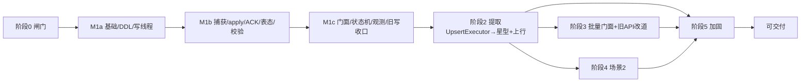
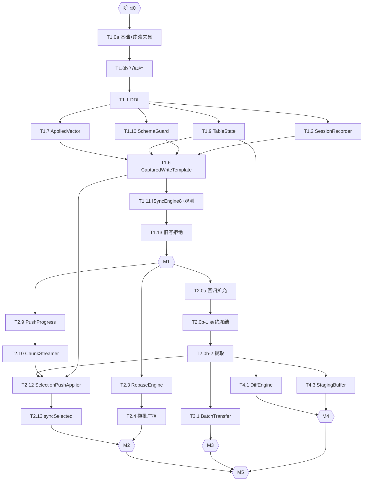

# SQLite 同步工具实现计划

> 版本：v0.3（草案）
> 日期：2026-06-25
> 来源：`specs/SQLite-同步工具-设计文档.md` v0.3、`specs/SQLite-同步工具-需求文档.md` v0.4
> 本版整改：纳入第二轮 **Codex（gpt-5.5）计划评审 Q-01~Q-08**（0 Critical / 4 High / 4 Medium）。第一轮 P-01~P-13 的依赖错序已实质修复，本版进一步收口"部分解决"项：统一 **`CapturedWriteTemplate`**（所有 `wconn` 写都维护 changelog+table_state，Q-01）、M1 崩溃夹具使 DoD 可测（Q-02）、`UpsertExecutor` 提取契约细化（Q-03）、**typed ACK**（Q-04）、M1 内拆 **M1a/M1b/M1c**（Q-05）、任务表按依赖排序（Q-06）、M2/M4 DoD 措辞校正（Q-07）、旧写**统一为拒绝**`E_SYNC_WRITE_BLOCKED`（Q-08）。
> 原则：**循序最小可落地**——里程碑=设计要求的可运行子系统；阶段 0 硬闸门；DoD 必须可断言（有夹具，不靠代码审查）。

---

## 1. 实现原则与约束

| 原则 | 落实 |
|---|---|
| 真·最小可落地 | 里程碑=可运行子系统；M1 内再拆 M1a/M1b/M1c，每个可跑验收（Q-05） |
| 统一写模板 | **所有 `wconn` 本地写**（入站 apply / 上行 UPSERT / 导入 / 场景2 save）走同一 `CapturedWriteTemplate`：捕获 changelog + 维护 table_state + 同事务（Q-01） |
| 阶段闸门 | 阶段 0 不过禁止进 M1；Session/句柄/rebaser 不可行则整方案停（FR-1，无降级） |
| DRY | `UpsertExecutor` 在 T2.0b 一次性提取，import/上行/场景2 save 共用；复用 `SchemaIntrospector/TopoSorter/FkInjector/SqlBuilder/ErrorCollector/onPrefetch` |
| 测试可验收 | 每阶段 DoD 必须有夹具可断言（含 M1 崩溃注入，Q-02）；提取/重构前先补回归（先红后绿） |
| 函数/参数 | 复杂流程按设计 §1 拆分（≤150 行 / ≤7 参；多参走 Builder） |

> 新增错误码：`E_SYNC_WRITE_BLOCKED`（同步激活后旧 API 对同步表写被拒，Q-08）——需回填设计 §4.6 与 `Errors.h`。

---

## 2. 总体路线图

里程碑：**M0** 闸门 →（**M1a→M1b→M1c**=）**M1** 两节点收敛 → **M2** 星型+上行 → **M3** 批量门面 → **M4** 场景2 → **M5** 加固。

---

## 3. 阶段详解

### 阶段 0 — 可行性闸门（硬验收，不过不进）

| 任务 | 描述 | 规模 |
|---|---|---|
| T0.1 | SQLite amalgamation 启用 `SESSION/PREUPDATE_HOOK`，QSQLITE 链接到它；记录 `compile_options` + source id（防双库同版本号假通过） | L |
| T0.2 | `SqliteHandle::of(db)` 取 `sqlite3*`；**在该 handle 上实调 session API** 验证 | S |
| T0.3 | 最小录制 changeset | M |
| T0.4 | `sqlite3changeset_apply_v2` + 冲突回调 | M |
| T0.5 | rebaser 链路：apply_v2 rebase buffer → `sqlite3rebaser_*`；两路冲突/反序到达验证收敛 | L |
| T0.6 | 与第三方锁定 outbox/inbox 目录/命名/`.ready` 契约 | S |

**DoD**：① `compile_options` 含两宏且 handle 上 session API 可调；② apply_v2+rebaser 重放收敛；③ 目录契约确认。任一不过 → 停止实施。

---

### 阶段 1 — 两节点最小同步（M1 = M1a→M1b→M1c）

#### M1a — 基础设施 / DDL / 写线程骨架

| 任务 | 描述 | 依赖 | 规模 |
|---|---|---|---|
| T1.0a | 构建接入、`DBRIDGE_EXPORT`、`Errors.h` 全量码（含 `E_SYNC_WRITE_BLOCKED`）、公共类型（`SyncTypes/SyncConfig::Builder/SyncSelection::Builder/PayloadHeader/RowMutation`）、测试夹具 + **最小崩溃注入夹具**（子进程 + 注入点，Q-02） | T0.* | M |
| T1.0b | 写线程骨架：`SqliteHandle`、`WriteTxn`、`ForegroundGate`、`SyncContext` 注册表、`SyncWorker` 主循环 | T1.0a | L |
| T1.1 | 建全部 `__sync_*` 表（设计 §6.1 DDL，键/索引/外键） | T1.0b | M |

**M1a DoD**：构建通过；写任务串行入队执行；建表成功；崩溃夹具可在指定点杀进程并重启。

#### M1b — 捕获 / 应用 / ACK / 表态 / 校验（依赖在前，Q-06）

| 任务 | 描述 | 依赖 | 规模 |
|---|---|---|---|
| T1.2 | `SessionRecorder` 同事务收割（`sealInto(h,store,txn,&seq)`） | T1.1 | M |
| T1.3 | `ChangelogStore`（写/`readRange`） | T1.1 | M |
| T1.4 | `PayloadCodec`（公共头 + `ChangesetPayload`，类型化 `DecodeResult`） | T1.0a | M |
| T1.5 | `TransportAdapter` + **typed ACK**：`AckChannel` 定义 `ChangesetAck` / `PushChunkAck`（含 `push_id/chunk_seq/total_chunks/checksum`）+ `ackMaxDelayMs` 默认 + 超时落点（Q-04） | T0.6 | M |
| T1.7 | `AppliedVectorStore`（`(origin,epoch,seq)` 幂等） | T1.1 | S |
| T1.9 | `TableStateStore` + 增量算法（顺序无关聚合，禁全表扫描，§6.2） | T1.1 | M |
| T1.10 | 最小 `SchemaGuard::verifyPayload`（同版本同指纹才写，否则拒绝 + 错误落点） | T1.1 | S |
| T1.6 | **`CapturedWriteTemplate`（Q-01 核心）**：所有 `wconn` 本地写的统一模板 — `WriteTxn.begin → 幂等判(仅入站) → SchemaGuard.verifyPayload(仅入站) → 业务写(ChangesetApplier.apply_v2 或 UpsertExecutor 或 ImportService) → 解析 mutations → TableState.applyMutations → AppliedVector.update(仅入站) → SessionRecorder.sealInto → commit`。本阶段先接 `ChangesetApplier`；T2.0b/T2.12/T3.1/T4.3 复用同一模板 | T1.2,T1.7,T1.9,T1.10 | L |
| T1.8 | `OutboundAckStore`（发送端锚点，按 ACK 前移，不与 applied-vector 混用） | T1.1,T1.5 | M |

**M1b DoD**：入站 changeset 经 `CapturedWriteTemplate` 落库；**`table_state` 随写增量更新（无全扫）**；schema 不匹配被拒；幂等去重；**崩溃零窗口（用 T1.0a 夹具在提交前/seal 后/commit 后注入，重启断言原子一致，Q-02）**。

#### M1c — 门面 / 状态机 / 观测 / 旧写收口

| 任务 | 描述 | 依赖 | 规模 |
|---|---|---|---|
| T1.11 | `ISyncEngine` 8 方法 + `createSyncEngine(bridge)` + 最小可观测（state 快照 / error 环 / `bytesPacked·bytesApplied·changesApplied·conflicts·lastAckedSeq`） | M1b | L |
| T1.12 | 双状态机：前台 `Exporting=等ACK/percent=-1`，足额 ACK 才 `Completed`，超时→`Failed`；后台 Pipeline | T1.11 | M |
| T1.13 | sync-aware 写边界：同步激活后同步表写仅经 `wconn`；**旧 `DataBridge::importExcel` 对同步表统一返回 `E_SYNC_WRITE_BLOCKED`（M1 选拒绝，不做改道；改道留 T3.3，Q-08）**；`db_` 对同步表只读 | T1.11 | M |

**M1 DoD（M1c 完成 = M1）**：A↔B 双向收敛；幂等；崩溃零窗口（可测）；`Exporting=等ACK`（含 `ackMaxDelayMs` 测试）；表态增量；schema 拒绝；**旧 importExcel 对同步表被 `E_SYNC_WRITE_BLOCKED` 拒（bypass 用例）**；8 getter+counters 可轮询。

---

### 阶段 2 — 提取 UpsertExecutor → 星型广播 + 上行选择性推送（M2）

| 任务 | 描述 | 依赖 | 规模 |
|---|---|---|---|
| T2.0a | **扩充** `ImportService` 回归测试：覆盖 multi-table、lookup、fkInject、行级 skip、`writtenRows`、rollback、`DO NOTHING`、bind 序（守护提取，Q-03） | M1 | M |
| T2.0b-1 | **提取契约冻结**：定义 `UpsertExecutor` 边界——**不持事务**（由 `CapturedWriteTemplate` 持）、输入 `RowMutation`、携带/返回**逐行 error context**、prepared 缓存、`DO UPDATE/DO NOTHING`（Q-03） | T2.0a | M |
| T2.0b-2 | **提取实现**：把 `ImportService.cpp:683-731` UPSERT 循环抽为 `UpsertExecutor`；`ImportService` 加 `RoutePayload→RowMutation` 适配，行为不变、回归绿；`SqlBuilder::buildUpsert` 扩展强制 `DO NOTHING` | T2.0b-1 | L |
| T2.1 | `RoutingTable`（防回声路由） | T1.8 | M |
| T2.2 | `ConflictArbiter`（`(rank,seq)` 规范序） | T1.6 | M |
| T2.3 | `RebaseEngine`（rebase buffer → `sqlite3rebaser_*`；下游 `AuthoritativeApply` 强制 REPLACE、豁免 ConflictPolicy） | T0.5,T2.2 | L |
| T2.4 | 下行去抖攒批广播（`broadcastIntervalMs`/`broadcastThreshold` 先到先发、concat、空闲不发） | T2.1,T2.3 | M |
| T2.5 | `SelectionResolver`（只读快照解析 PK；MVP 仅"表+主键集合"） | T1.1 | M |
| T2.6 | `FkClosureBuilder`（读快照 + 复用 schema/topo/fkInject；FK 环→`E_SYNC_FK_CYCLE_UNSUPPORTED`；悬挂父→`E_SYNC_FK_CLOSURE_MISSING`） | T2.5 | L |
| T2.7 | `ConsistencyCache`（本地自比；仅下行/基线喂养；`invalidateTable`） | T1.6 | M |
| T2.8 | `FrozenManifest` + `ReadSnapshot` 契约（短快照即释放，护 WAL） | T2.6,T2.7 | M |
| T2.9 | `PushProgressStore`（`push_progress`/`push_chunk_progress` + 续传判定）——先于分片/应用 | T1.1 | M |
| T2.10 | `ChunkStreamer`（拓扑序分片、`(push_id,chunk_seq)` 幂等续传、超规模→`E_SYNC_SELECTION_TOO_LARGE`） | T2.8,T2.9 | L |
| T2.11 | `PayloadCodec` 增 `SelectionPushPayload` | T1.4 | S |
| T2.12 | `SelectionPushApplier`（逐行直选 `DoUpdate`/依赖 `DoNothing`，**经 `CapturedWriteTemplate` + `UpsertExecutor`**） | T2.0b-2,T2.10,T2.11,T1.6 | M |
| T2.13 | `syncSelected` ⑨：受理前校验同步返回；后台失败入 `errors()/state(Failed)`；中心**全片 `PushChunkAck` 才 Completed、半截不外泄**（依赖 T1.5 typed ACK + T2.9） | T2.5-2.12,T1.5 | L |

**DoD（M2）**：`UpsertExecutor` 已提取，**import + 上行两路共用 + 场景2 save 编译契约预留**（第三路 save 由 M4 验，Q-07）；星型无回声、多源两序同终态；**Edge 配 `TargetWins/Manual` 仍收敛中心权威下行**；上行人工选择+闭包+剪枝+UPSERT 经 outbox/inbox 闭环；分片续传幂等；FK 环/空选择/超规模/悬挂父报码；`syncSelected` 全片 ACK 才 Completed。

---

### 阶段 3 — 批量门面 + 旧 API 改道（M3）

| 任务 | 描述 | 依赖 | 规模 |
|---|---|---|---|
| T3.1 | `BatchTransfer`（`IBatchTransfer` 8+3）+ `createBatchTransfer(bridge)`；导入跑在 `wconn`，**经 `CapturedWriteTemplate`**（复用 `ImportService`/`UpsertExecutor`，维护 changelog+table_state，Q-01） | T2.0b-2,T1.6 | L |
| T3.2 | 进度填充（`onPrefetch` 同型钩子 → `TransferProgress`） | T3.1 | S |
| T3.3 | 共享 `ForegroundGate` + `stop`/`importState`/`exportState`；**旧 `importExcel` 由 M1 的"拒绝"升级为"改道写队列"适配**（Q-08），含回归 | T1.13,T3.1 | M |

**DoD（M3）**：非阻塞导入/导出 + 轮询；同库 `E_BUSY` 互斥；现有 `importExcel/exportExcel` 回归全绿；导入路径维护 table_state（DiffEngine 可信前提）。

---

### 阶段 4 — 场景2 对比/合并（M4）

| 任务 | 描述 | 依赖 | 规模 |
|---|---|---|---|
| T4.1 | `DiffEngine`：表级（消费 M1 维护的 `TableStateStore`，零全量）+ 行级（只物化受影响行）+ `fetchRemoteRows`（keyset 分页） | T1.9,T2.0b-2 | L |
| T4.2 | `InboundTableGate`：预扫描载荷涉及表集合，命中则整发 pending、不 ACK；放行按到达序应用 | T1.6 | M |
| T4.3 | `StagingBuffer`：内存暂存；`save` **经 `CapturedWriteTemplate` + `UpsertExecutor`**（普通 origin 本地写，维护 table_state）；`discard` 零落盘 | T2.0b-2,T1.6 | M |
| T4.4 | `ComparisonSession`（`acceptLocal/acceptRemote/stageCell/fetchRemoteRows/save/discard`）+ 钉 `data_version`；脚下变动→`E_SYNC_STAGE_STALE` | T4.1-4.3 | L |

**DoD（M4）**：表级零全量（SELECT 行数有上界）；行级+分页；会话期暂停被比对表并按序放行；`save` 普通本地写；**第三路 save 共用 `UpsertExecutor` 验证（补 Q-07）**；脚下变动 `E_SYNC_STAGE_STALE`。

---

### 阶段 5 — 加固（M5）

| 任务 | 描述 | 依赖 | 规模 |
|---|---|---|---|
| T5.1 | `BaselineManager`：冷启动/缺口/迁移后/强制 → 基线；应用后重置 applied-vector/table_state、喂养 ConsistencyCache | T1.6,T1.9 | L |
| T5.2 | `SchemaGuard` 完整化 + `QuarantineStore`：版本/指纹隔离 + 迁移后重放（扩展 M1 最小版） | T1.10 | L |
| T5.3 | `DeadPeerEvictor`：三维阈值软告警→硬逐出 + outbox 坍缩 + `streamEpoch` 代际 | T1.8 | L |
| T5.4 | 迁移规程：静默窗排空在途推送；竞态 `E_SYNC_PUSH_SCHEMA_MOVED` 整发作废 | T2.13,T5.2 | M |
| T5.5 | 错误码触发点全覆盖 + 审计日志（扩展 M1 最小观测） | T1.11 | M |
| T5.6 | **全量故障矩阵**（扩展 M1 崩溃夹具）+ 载荷字节预算实测（承诺 `bytesPacked/bytesApplied` 在 2Mbps 预算内，不承诺黑盒在途时延）+ R5 阈值定值 | 全部 | L |

**DoD（M5）**：异常路径全覆盖；单/批载荷字节达 2Mbps 预算；R5 阈值落定。

---

## 4. 关键依赖图

---

## 5. 测试策略与可测断言映射（对应需求 §9 / 设计 §9）

| 性质 | 断言 | 阶段 |
|---|---|---|
| 幂等（C6） | 同 `(origin,epoch,seq)` 重投 → no-op | M1b |
| 崩溃零窗口（FR-1） | **崩溃夹具**在提交前/seal 后/commit 后注入，重启断言原子一致 | M1b（Q-02） |
| ACK 锚点 / typed ACK（C6/F-14） | 锚点前移当且仅当收 ACK；`ChangesetAck`/`PushChunkAck` 格式；超 `ackMaxDelayMs` → 状态落点 | M1b（Q-04） |
| 表态增量（F-17） | **所有写路径**（apply/import/save）后 `table_state` 更新且无全扫 | M1b/M3/M4（Q-01） |
| schema 校验（FR-5/7） | 版本/指纹不符被拒 | M1b |
| 旧写收口（FR-1/E-01） | 旧 importExcel 对同步表 → `E_SYNC_WRITE_BLOCKED` | M1c（Q-08） |
| 防回声/确定性仲裁（C2/C7） | 静默后 0 载荷；两序同终态 | M2 |
| 权威下行豁免（F-04） | Edge 配 `TargetWins/Manual` 仍收敛中心终态 | M2 |
| 缓存只认权威/指纹/算子分类（C10/11/12） | 高 rank 仲裁后缓存不记；抗碰撞+冷父必传；依赖父 DO NOTHING | M2 |
| 分片续传/长推送漂移/前后台（C13/16/15） | 中断终态一致；漂移取最新+告警；长推送等 ACK 期后台仍 apply | M2 |
| UpsertExecutor 共用 | import+上行两路（M2）；save 第三路（M4） | M2/M4（Q-07） |
| 重构无回退 | 现有导入回归全绿（multi-table/lookup/fkInject/skip/rollback/DO NOTHING） | M2（Q-03） |
| 零全量拉取 / 场景2 隔离（C5） | 比对 SELECT 有上界；save 前 `.db` 写=0；`E_SYNC_STAGE_STALE` | M4 |
| 迁移撞推送（C17） | 押旧 schema 片 → `E_SYNC_PUSH_SCHEMA_MOVED` | M5 |
| 载荷字节预算（NFR-5） | 单/批载荷字节 ≤ 预算（不承诺在途时延） | M5 |

---

## 6. 风险与回退

| 风险 | 触发 | 对策 |
|---|---|---|
| 阶段 0 不过 | T0.* | 停止本方案（CDC 属另立设计） |
| `UpsertExecutor` 提取回归 | T2.0b | T2.0a 扩充回归（multi-table/lookup/fkInject/skip/rollback/DO NOTHING）；T2.0b-1 先冻结契约 |
| M1 过载致排期失真 | M1 | 内部 M1a/M1b/M1c 分段验收（Q-05） |
| 双库假通过 | T0.1/T0.2 | handle 实调 session API + 记 source id |
| 载荷超 2Mbps 预算 | T5.6 | 压缩+剪枝+攒批+分片调参；不承诺黑盒在途时延 |
| provider/工具链不稳 | 评审/CI | 重试；本地单测兜底 |

---

## 7. 最小可落地核对（整改后）

- **统一写模板**：`CapturedWriteTemplate` 让 apply/import/save/上行**所有写**都捕获 changelog + 维护 table_state，杜绝场景2 表态从源头失真（Q-01）。
- **DoD 可测**：M1 自带崩溃夹具，"崩溃零窗口"可断言而非靠审查（Q-02）。
- **依赖前置 + 分段**：M1 拆 M1a/b/c；任务表按依赖排序；`UpsertExecutor`(T2.0b) 先于上行(T2.12)、`PushProgress`(T2.9) 先于分片（Q-05/06）。
- **提取有契约**：T2.0b-1 冻结边界、T2.0a 扩回归，再 T2.0b-2 提取（Q-03）。
- **措辞校正**：M2 验两路共用、M4 验第三路；旧写 M1 拒绝、T3.3 改道（Q-07/08）。

> 本计划随设计/需求演进同步修订；新增 `E_SYNC_WRITE_BLOCKED` 待回填设计 §4.6 与 `Errors.h`。
