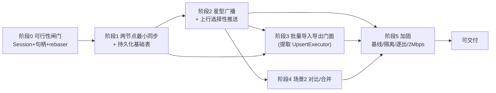
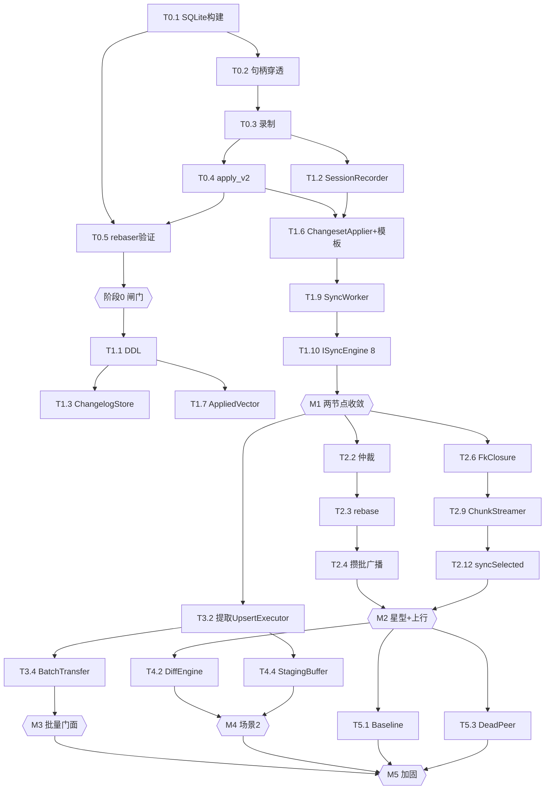

# SQLite 同步工具实现计划

> 版本：v0.1（草案）
> 日期：2026-06-25
> 来源：`specs/SQLite-同步工具-设计文档.md` v0.3（已整改 D-01~D-28 + E-01~E-15）、`specs/SQLite-同步工具-需求文档.md` v0.4
> 原则：**循序最小可落地**——每阶段交付一个**可运行 + 可验证的纵向切片**，先打通最薄的端到端路径（tracer bullet），再加健壮性；**阶段 0 是硬闸门，不过不进**。
> 读法：任务编号 `T<阶段>.<序>`；每任务给出 产出/文件、依赖、验收、规模(S≤1d / M≈2-3d / L≈1w+)、测试。阶段末有 **DoD（完成定义）**。

---

## 1. 实现原则与约束（贯穿全程）

| 原则 | 落实 |
|---|---|
| 最小可落地 | 阶段内按"纵向切片优先"排序：先让一条数据从捕获→传输→应用→ACK 端到端跑通，再补冲突/基线/逐出等横向能力 |
| 阶段闸门 | 阶段 0 未通过**禁止**进入阶段 1（Session/句柄穿透不可行则整方案停，无降级，FR-1/E-17） |
| DRY | 写库收敛 `UpsertExecutor`；复用 `SchemaIntrospector/TopoSorter/FkInjector/SqlBuilder/ErrorCollector/onPrefetch` |
| 单写线程 | 所有写经 `SyncWorker` 的 `wconn` 串行（E-01/§2.4）；`db_` 不跨线程；先建线程骨架再填业务 |
| 测试先行 | 重构既有代码（提取 `UpsertExecutor`）前先补回归测试（先红后绿）；每阶段 DoD 含可断言验收 |
| 函数/参数约束 | 复杂流程按设计 §1 拆分表落实（≤150 行 / ≤7 参；多参走 Builder） |

---

## 2. 总体路线图

里程碑：**M0** 闸门通过 → **M1** A↔B 双向收敛 → **M2** 星型+上行 N1/N2 闭环 → **M3** 非阻塞批量门面 → **M4** 场景2 可用 → **M5** 加固达标。

---

## 3. 前置基础设施（横切，主要在阶段 0/1 铺设）

| 任务 | 描述 | 产出/文件 | 验收 |
|---|---|---|---|
| **I-1 SQLite 构建** | 引入 amalgamation，以 `-DSQLITE_ENABLE_SESSION -DSQLITE_ENABLE_PREUPDATE_HOOK` 编译；让 Qt QSQLITE 驱动链接到它（重编插件或静态链接） | `3rdparty/sqlite/`、CMake/qmake 改动 | `PRAGMA compile_options` 含两宏（属阶段 0 验收 §阶段0） |
| **I-2 构建系统** | 同步模块源文件编入 `libdbridge`；同步宏开关；`DBRIDGE_EXPORT` 沿用 | `CMakeLists.txt`、`src/libdbridge.pro` | 编译通过、符号导出正确 |
| **I-3 错误码** | 扩展 `dbridge::err`（设计 §4.6 全部 `E_SYNC_*`/`W_SYNC_*`） | `include/dbridge/Errors.h` | 链接可见、风格一致 |
| **I-4 线程基础** | `SyncContext` 注册表（按 canonical db path）、`SyncWorker` 写线程骨架、`WriteTxn`、`ForegroundGate`、`SqliteHandle` | `src/sync/{SyncWorker,WriteTxn,ForegroundGate}`、`capture/SqliteHandle.h` | 写任务串行入队执行；`E_BUSY` 前台门控生效 |
| **I-5 测试夹具** | Qt Test；多节点夹具（临时目录作 outbox/inbox）；故障注入钩子；复用 `onPrefetch` 同型计数钩子 | `tests/sync/` | 可构造 2~4 节点端到端用例 |
| **I-6 公共类型/契约** | `SyncTypes.h`、`SyncConfig(::Builder)`、`SyncSelection(::Builder)`、`PayloadHeader`、`RowMutation` | `include/dbridge/sync/*`、`apply/UpsertExecutor.h` | 头文件编译、Builder `build()` 校验 |

> I-1 是**最高风险**且阻塞一切，故并入阶段 0 验收；I-2~I-6 在阶段 1 早期完成。

---

## 4. 阶段详解

### 阶段 0 — 可行性闸门（硬验收，不过不进）

**目标**：在目标产物上证明三大底层机制可用：Session 扩展、`sqlite3*` 句柄穿透、rebaser；并与第三方传输锁定目录契约。

| 任务 | 描述 | 产出 | 规模 |
|---|---|---|---|
| T0.1 | 完成 I-1（SQLite + QSQLITE 链接同一启用 Session 的库） | 可运行构建 | L |
| T0.2 | `SqliteHandle::of(db)` 经 `QSqlDriver::handle()` 取 `sqlite3*` 并验证有效 | `SqliteHandle.h` + 验证程序 | S |
| T0.3 | 最小录制：同一连接 attach session、录制 changeset、取 BLOB | 验证程序 | M |
| T0.4 | `sqlite3changeset_apply_v2` 应用 + 冲突回调跑通 | 验证程序 | M |
| T0.5 | rebaser 链路：apply_v2 收集 rebase buffer → `sqlite3rebaser_*` 生成权威 changeset；两路冲突、反序到达验证收敛（设计 §5.6/§13.1） | 验证程序 + 结论 | L |
| T0.6 | 与第三方锁定 outbox/inbox 目录、文件命名、`.ready` 哨兵契约（需求 §13 开放项 5） | 契约文档 | S |

**DoD / 退出标准（全部满足才进入阶段 1，对应设计 §13.1）**：
1. 运行期 `sqlite3_libversion()` + `PRAGMA compile_options` 含 `ENABLE_SESSION`/`ENABLE_PREUPDATE_HOOK`；
2. 同一 `QSqlDatabase` 取出的 `sqlite3*` 可调 session API；
3. `apply_v2` + rebaser 对两路冲突输入、反序到达**重放收敛**；
4. 目录契约与第三方方确认。
**任一不过 → 停止本方案实施**（触发器 CDC 属另立设计，非降级路径）。

---

### 阶段 1 — 两节点最小同步 + 持久化基础（M1）

**目标**：A↔B 双向增量同步收敛；建立全部 `__sync_*` 表的最小持久化基础；落地 `ISyncEngine` 8 接口骨架。
**纵向切片顺序**：先 capture→changelog→打包→outbox→inbox→apply→ACK 单向打通，再补双向与幂等。

| 任务 | 描述 | 产出/文件 | 依赖 | 验收 | 规模 |
|---|---|---|---|---|---|
| T1.1 | 建全部 `__sync_*` 表（设计 §6.1 DDL，最小列 + 键/索引/外键） | `sync/schema/SyncSchema.{h,cpp}` | I-4 | DDL 建表成功；键约束生效 | M |
| T1.2 | `SessionRecorder`：同事务收割（`begin`/`sealInto(h,store,txn,&seq)`，E-05 模板） | `capture/SessionRecorder.*` | T0.3 | 崩溃零窗口（提交前同事务落 changelog） | M |
| T1.3 | `ChangelogStore`：写入/`readRange(peer,anchor,epoch)` | `capture/ChangelogStore.*` | T1.1 | 区间读取正确；按 epoch/seq 索引 | M |
| T1.4 | `PayloadCodec`：公共头 + `ChangesetPayload`（先不做 SelectionPush）；压缩/校验/版本；类型化 `DecodeResult` | `payload/PayloadCodec.*` | I-6 | 编解码往返一致；缺字段 → `E_SYNC_PAYLOAD_CORRUPT` | M |
| T1.5 | `TransportAdapter`：`OutboxWriter`（先写主文件后置 `.ready`）、`InboxWatcher`（watcher + 启动/timer 扫描兜底，E-12 思想）、`AckChannel` | `transport/*` | T0.6 | 半截文件不被读；ACK 往返 | M |
| T1.6 | `ChangesetApplier` + **apply 三件套同事务模板**（WriteTxn→幂等→apply_v2→AppliedVector→TableState→sealInto→commit） | `apply/ChangesetApplier.*` | T0.4,T1.2 | 任一步失败整体回滚 | L |
| T1.7 | `AppliedVectorStore`：`(origin,epoch,seq)` 幂等去重 | `apply/AppliedVectorStore.*` | T1.1 | 重复投递 = no-op | S |
| T1.8 | `OutboundAckStore`：发送端锚点（按 ACK 前移；不与 applied-vector 混用，F-05） | `anchor/OutboundAckStore.*` | T1.1,T1.5 | 收 ACK 才前移；未 ACK 不截断 | M |
| T1.9 | `SyncWorker` 主循环 + `WriteTxn` + `ForegroundGate` + `SyncContext` 注册表 | `sync/*` | I-4 | 写串行；前台 `E_BUSY` | L |
| T1.10 | `ISyncEngine` 8 方法实现 + `createSyncEngine(bridge)`（E-07 绑定共享上下文） | `sync/SyncEngine.*`、`include/.../ISyncEngine.h` | T1.1-1.9 | 8 接口可调；getter 加锁快照 | L |
| T1.11 | 双状态机：前台 Operation（**`Exporting`=等 ACK，percent=-1**，E-02）+ 后台 Pipeline 最小 | `state/*` | T1.9 | `Completed` 仅在 ACK 后 | M |
| T1.12 | sync-aware 写边界最小落实：同步表写仅经 wconn；`db_` 对同步表只读（E-01/§2.5） | `sync/SyncWorker.*` | T1.9 | 旧写不绕过 session（用例验证） | M |

**DoD（M1）**：
- A、B 两节点**双向**增量同步**收敛**（同步表内容校验和相等）；
- 重复投递同一载荷**幂等**（applied-vector）；
- `Exporting` 阶段 `percent=-1`，收 ACK 后 `Completed`；
- 8 个 getter 可在任意线程轮询；进程崩溃重启**无"已提交未捕获"窗口**。
- 测试：单元（PayloadCodec 往返、applied-vector 幂等）；集成（两节点收敛、崩溃恢复、外部写检测雏形）。

---

### 阶段 2 — 星型广播 + 上行选择性推送（M2，N1/N2 核心）

**目标**：单域星型下行自动广播 + 防回声 + 确定性仲裁；上行人工选择性推送（闭包 + 剪枝 + 分片 + UPSERT）。

| 任务 | 描述 | 产出/文件 | 依赖 | 验收 | 规模 |
|---|---|---|---|---|---|
| T2.1 | `RoutingTable`：拓扑/origin 优先级/防回声路由（origin≠对端 ∧ seq>对端锚点） | `conflict/RoutingTable.*` | T1.8 | 不回推来源；静默后 0 载荷 | M |
| T2.2 | `ConflictArbiter`：`(origin rank, seq)` 规范序仲裁（C7） | `conflict/ConflictArbiter.*` | T1.6 | 两种到达顺序 → 同一终态 | M |
| T2.3 | `RebaseEngine`：收集 apply_v2 rebase buffer → `sqlite3rebaser_*` 生成权威下行；广播以中心 changelog 为源（E-06） | `conflict/RebaseEngine.*` | T0.5,T2.2 | 下游 `AuthoritativeApply` 收敛 | L |
| T2.4 | 下行自动广播：去抖攒批（`broadcastIntervalMs`/`broadcastThreshold` 先到先发，concat 一发；空闲不发，C14） | `sync/SyncWorker.*` | T2.1,T2.3 | N 变更 → 每对端 1 合并广播 | M |
| T2.5 | `SelectionResolver`：只读快照解析 PK（MVP 仅"表+主键集合"；`addWhere` 受限/后置，E-13） | `selection/SelectionResolver.*` | T1.1 | 空选择 → `E_SYNC_SELECTION_EMPTY` | M |
| T2.6 | `FkClosureBuilder`：读快照取行值 + 复用 `SchemaIntrospector` Fk 图 + `TopoSorter` 拓扑 + `FkInjector`；FK 环 → `E_SYNC_FK_CYCLE_UNSUPPORTED`；悬挂父 → `E_SYNC_FK_CLOSURE_MISSING` | `selection/FkClosureBuilder.*` | T2.5 | 闭包完整、父先子后；环报错 | L |
| T2.7 | `ConsistencyCache`：本地自比强哈希指纹；**仅下行/基线喂养**（C10/C11）；`invalidateTable`（C17） | `selection/ConsistencyCache.*` | T1.6 | 一致父行被剪、不误剪冷父 | M |
| T2.8 | `FrozenManifest`：短读快照一次性算闭包 → 持久化 → 释放快照（护 WAL，C16）；`ReadSnapshot` 契约（E-11） | `selection/FrozenManifest.*` | T2.6,T2.7 | 不长持读事务；WAL checkpoint 正常 | M |
| T2.9 | `ChunkStreamer`：按 `pushChunkBudgetBytes` 拓扑序分片（父片不晚于子片）；`(push_id,chunk_seq)` 幂等续传；超规模 → `E_SYNC_SELECTION_TOO_LARGE` | `selection/ChunkStreamer.*` | T2.8 | 分片 FK 安全；中断续传幂等 | L |
| T2.10 | `PayloadCodec` 增 `SelectionPushPayload`（冻结清单+行快照+recordKind+push-id+chunk-seq） | `payload/PayloadCodec.*` | T1.4 | 解码类型化 | S |
| T2.11 | `SelectionPushApplier` + `RowMutation`：逐行直选 `DoUpdate`/依赖 `DoNothing`（C12）；走 `UpsertExecutor`（先临时直用，阶段3 正式提取） | `apply/SelectionPushApplier.*` | T2.9,T2.10 | 依赖父不覆盖中心值 | M |
| T2.12 | `syncSelected` ⑨：非阻塞受理；受理前校验同步返回，后台失败入 `errors()/state(Failed)`（E-03）；中心**全片 ACK 才完成、半截不外泄**（E-10） | `sync/SyncEngine.*` | T2.5-2.11 | 上行闭环收敛 | L |
| T2.13 | `push_progress`/`push_chunk_progress` 持久化与续传逻辑 | `apply/PushProgressStore.*` | T1.1 | 重复 chunk checksum 一致=no-op | M |

**DoD（M2）**：
- 星型 B→A→{C,D} 广播**无回声**、全域**确定性收敛**（多源两序同终态）；
- 上行**人工选择 + 外键闭包 + 一致性剪枝 + UPSERT** 闭环，经 outbox/inbox 传输（不跨节点直调）；
- 大闭包**分片续传**幂等；FK 环/空选择/超规模/悬挂父均报对应码；
- `syncSelected` 中心**全片 ACK 才 Completed**，半截不广播。
- 测试：确定性仲裁、防回声、上行闭包完整 + 剪枝（`onPrefetch` 断言一致父不传）、分片中断续传。

---

### 阶段 3 — 批量导入导出门面（M3，DRY 关键）

**目标**：在现有 `DataBridge` 上提供非阻塞批量导入导出 + 纯轮询；**提取 `UpsertExecutor`** 作为写库 DRY 收敛点。

| 任务 | 描述 | 产出/文件 | 依赖 | 验收 | 规模 |
|---|---|---|---|---|---|
| T3.1 | **先补回归测试**：覆盖现有 `ImportService` 导入路径（先红后绿守护重构） | `tests/` | — | 现有导入用例全绿 | M |
| T3.2 | 提取 `UpsertExecutor`：把 `ImportService.cpp:683-731` 的 UPSERT 循环抽出；输入改中性 `RowMutation`（E-08）；`SqlBuilder::buildUpsert` 扩展强制 `DO NOTHING` | `apply/UpsertExecutor.*`、改 `ImportService` | T3.1 | 三路（import/场景2/上行）共用；回归绿 | L |
| T3.3 | `ImportService` 重构为产出 `RowMutation`（Excel/Profile→RowMutation），落库交 `UpsertExecutor` | 改 `service/ImportService.*` | T3.2 | 职责切分；行为不变 | M |
| T3.4 | `BatchTransfer`（`IBatchTransfer` 8+3）+ `createBatchTransfer(bridge)`；导入跑在 `wconn`（复用元数据，不用 `db_`） | `batch/BatchTransfer.*`、`include/.../IBatchTransfer.h` | T3.2,T1.9 | 非阻塞启动 + 轮询 | L |
| T3.5 | 进度填充：复用 `onPrefetch` 同型计数钩子 → `TransferProgress` | 改 ETL 钩子 | T3.4 | 进度可轮询 | S |
| T3.6 | 共享 `ForegroundGate`（同 `.db` 与 SyncEngine 互斥，E-07）；`stop`/`importState`/`exportState` | `batch/BatchTransfer.*` | T1.9 | Busy → `E_BUSY`；导入导出互斥 | M |

**DoD（M3）**：
- 非阻塞导入/导出 + 纯轮询；同库 `E_BUSY` 单活动互斥；
- **现有 `DataBridge::importExcel/exportExcel` 回归全绿**（重构无行为回退）；
- UpsertExecutor 被 import/场景2/上行三路共用（DRY 验证）。

---

### 阶段 4 — 场景2 对比/合并（M4）

**目标**：表级差异（零全量拉取）+ 行级差异（受影响行 + 分页）+ 内存暂存合并；会话期暂停被比对表的 inbox 应用。

| 任务 | 描述 | 产出/文件 | 依赖 | 验收 | 规模 |
|---|---|---|---|---|---|
| T4.1 | `TableStateStore` + **增量维护算法**（顺序无关聚合 XOR，从 changeset before/after 更新，禁全表扫描，E-09/§6.2） | `schema/TableStateStore.*` | T1.6 | 表态随写增量更新；常规无全扫 | L |
| T4.2 | `DiffEngine`：表级（指纹/高水位比对，零全量）+ 行级（只物化 changeset 受影响行 + 本地对应行）+ `fetchRemoteRows`（keyset 分页，F-03） | `diff/DiffEngine.*` | T4.1 | 表级红绿零全量；行级分页 | L |
| T4.3 | `InboundTableGate`：会话期登记被比对表；**预扫描载荷涉及表集合**，命中则整发 pending、不 ACK；放行按到达序应用（E-12） | `diff/InboundTableGate.*` | T1.6 | 会话期被比对表不被并发改 | M |
| T4.4 | `StagingBuffer`：内存暂存；`save` 经 `BEGIN IMMEDIATE` + `UpsertExecutor`（普通 origin 本地写，C5）；`discard` 零落盘 | `diff/StagingBuffer.*` | T3.2 | save 前 `.db` 无物理写 | M |
| T4.5 | `ComparisonSession`（`acceptLocal/acceptRemote/stageCell/fetchRemoteRows/save/discard`）；钉 `data_version` 快照；脚下变动 → `E_SYNC_STAGE_STALE` | `diff/ComparisonSession.*`、`include/.../IComparisonSession.h` | T4.2-4.4 | 失效作废、暂停/放行正确 | L |

**DoD（M4）**：表级红绿零全量拉取；行级差异 + 分页；会话期暂停被比对表并按序放行；`save` 为普通本地写并由场景1 增量自然传播；脚下变动 `E_SYNC_STAGE_STALE`。

---

### 阶段 5 — 加固（M5）

**目标**：覆盖异常路径与非功能指标，达可交付质量。

| 任务 | 描述 | 产出/文件 | 依赖 | 验收 | 规模 |
|---|---|---|---|---|---|
| T5.1 | `BaselineManager`：冷启动/缺口(`E_SYNC_GAP`)/迁移后/强制 → 基线；应用后重置 applied-vector/table_state、喂养 ConsistencyCache（§5.10） | `baseline/BaselineManager.*` | T1.6 | 缺口自动回退基线收敛 | L |
| T5.2 | `SchemaGuard` + `QuarantineStore`：版本比较 + 指纹兜底 + 隔离 + 迁移后重放（FR-7） | `schema/*` | T1.6 | 版本不符隔离、迁移后重放 | L |
| T5.3 | `DeadPeerEvictor`：三维阈值（commit/字节/时长）软告警→硬逐出 + outbox 坍缩 + `streamEpoch` 代际（FR-10/F-13） | `peer/DeadPeerEvictor.*` | T1.8 | 死对端逐出后截断恢复 | L |
| T5.4 | 迁移规程落实：静默窗**排空在途选择性推送**；竞态 `E_SYNC_PUSH_SCHEMA_MOVED` 整发作废（C17/§8.2） | 文档 + 代码 | T2.12,T5.2 | 长推送撞迁移无半截脏态 | M |
| T5.5 | 错误码触发点全覆盖（设计 §4.6 表）+ 可观测量 + 日志 | 全模块 | — | 每码有触发/状态/断言 | M |
| T5.6 | 故障注入 + 2Mbps 实测 + 量化阈值定值（R5：载荷预算/lag/基线/分片/广播/ackMaxDelay） | `tests/sync/`、配置 | 全部 | 2Mbps 达标；阈值落定 | L |

**DoD（M5）**：异常路径（崩溃/分区/迁移/死对端/外部写）全覆盖；2Mbps 实测达标；R5 阈值落定。

---

## 5. 测试策略与可测断言映射（贯穿各阶段，对应需求 §9 / 设计 §9）

| 性质 | 断言 | 落在阶段 |
|---|---|---|
| 幂等 | 同 `(origin,epoch,seq)` 重投 → no-op | T1.7（M1） |
| 崩溃零窗口 | 提交后崩溃无"已提交未捕获" | T1.2（M1） |
| 防回声 | 静默后新载荷=0、无回推 | T2.1（M2） |
| 确定性仲裁 | 两序终态校验和相等 | T2.2（M2） |
| 上行闭包 + 剪枝 | FK 违例=0；一致父打包=0（`onPrefetch`） | T2.6/T2.7（M2） |
| 分片续传 | 中断/不中断终态一致 | T2.9（M2） |
| 重构无回退 | 现有导入用例全绿 | T3.1（M3） |
| 零全量拉取 | 比对 SELECT 行数有上界 | T4.1/T4.2（M4） |
| 场景2 隔离 | save 前 `.db` 物理写=0；`E_SYNC_STAGE_STALE` | T4.4/T4.5（M4） |
| 最终一致 | 静默后各节点校验和相等 | M2 起持续 |
| 2Mbps | 单载荷 ≤ 预算；端到端达标 | T5.6（M5） |

---

## 6. 任务依赖图（关键路径）

---

## 7. 风险与回退

| 风险 | 触发 | 回退/对策 |
|---|---|---|
| 阶段 0 不通过（Session/句柄/rebaser 不可用） | T0.* 任一失败 | **停止本方案实施**；CDC 触发器属另立新设计（非降级，E-17/FR-1） |
| `UpsertExecutor` 提取引入回归 | T3.2 | T3.1 先补回归测试，先红后绿；保留 `ImportService` 行为快照对比 |
| QSQLITE 与自带 SQLite 符号冲突 | I-1 | 静态链接 + 符号隔离；或重编驱动插件 |
| 2Mbps 不达标 | T5.6 | 压缩 + 剪枝 + 攒批 + 分片续传调参；必要时调 R5 阈值 |
| 长读事务饿死 WAL | T2.8 | 冻结清单短快照即释放（已设计 C16） |
| provider/工具链不稳 | 任意 | 评审/CI 重试；关键路径有本地单测兜底 |

---

## 8. 最小可落地核对

- **每阶段独立可运行 + 可验证**：M1 即"两节点能同步"，M2"星型+人工上行可用"，M3"批量门面可用"，逐级叠加，无需等全量完成。
- **tracer bullet 优先**：阶段 1 先打通单向最薄链路再补双向/幂等；阶段 2 先单条选择记录端到端跑通再加闭包/剪枝/分片。
- **闸门前置**：最高风险（Session/句柄/rebaser）在阶段 0 一次性证伪/证实，避免后期返工。
- **持久化基础不后延**：全部 `__sync_*` 表在 M1 落最小列（D-28），策略在 M5 补，避免改数据模型返工。
- **DRY 收敛点**（`UpsertExecutor`）在 M3 提取，被三路复用，先有回归测试守护。

> 本计划随设计文档演进同步修订；阶段 0 结论若改变 SQLite 构建路径，§3 I-1 与阶段 0 验收需同步更新。
