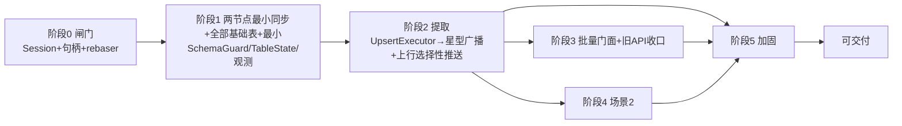
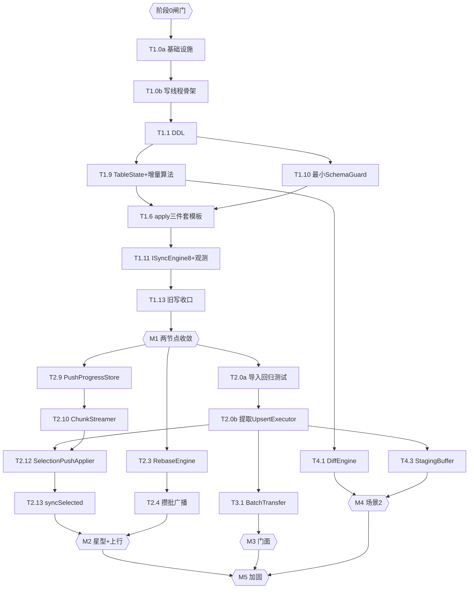

# SQLite 同步工具实现计划

> 版本：v0.2（草案）
> 日期：2026-06-25
> 来源：`specs/SQLite-同步工具-设计文档.md` v0.3、`specs/SQLite-同步工具-需求文档.md` v0.4
> 本版整改：纳入 **Codex（gpt-5.5）计划评审 P-01~P-13**（3 Critical / 5 High / 4 Medium / 1 Low）。核心是**闭合依赖错序**——把"早期即被依赖"的组件前移，消除 v0.1 的"伪最小"里程碑：`UpsertExecutor` 提取前移到阶段 2 起点（P-01）、`TableStateStore` 增量维护与最小 `SchemaGuard` 下沉到 M1（P-02/P-05）、旧写路径在 M1 强制收口（P-03）、`push_progress` 先于 `syncSelected`（P-04）、基础设施显式为 T1.0a/T1.0b（P-06）、ACK 制品/可观测性/测试断言前置（P-07/P-08/P-12）。
> 原则：**循序最小可落地**——每阶段交付**可运行 + 可验证**的纵向切片；**阶段 0 是硬闸门，不过不进**；里程碑必须是"设计所要求的系统"，而非"恰好能验收"。

---

## 1. 实现原则与约束

| 原则 | 落实 |
|---|---|
| 真·最小可落地 | 里程碑 = 设计要求的可运行子系统；早期被依赖的组件不得后置（P-01/02/03 整改） |
| 阶段闸门 | 阶段 0 未过**禁止**进入阶段 1；Session/句柄/rebaser 不可行则整方案停（FR-1，无降级） |
| DRY | `UpsertExecutor` 在阶段 2 起点一次性提取，import/场景2/上行三路共用；复用 `SchemaIntrospector/TopoSorter/FkInjector/SqlBuilder/ErrorCollector/onPrefetch` |
| 单写线程 | 所有写经 `SyncWorker` 的 `wconn` 串行；`db_` 不跨线程；旧写路径在 M1 收口 |
| 测试先行 | 提取/重构既有代码前先补回归（先红后绿）；每阶段 DoD 引用 §6 具体可测断言，不写"收敛/可用"了事 |
| 函数/参数 | 复杂流程按设计 §1 拆分（≤150 行 / ≤7 参；多参走 Builder） |

---

## 2. 总体路线图

里程碑：**M0** 闸门 → **M1** A↔B 双向收敛（含表态/校验/观测/旧写收口）→ **M2** 星型+上行 N1/N2（UpsertExecutor 已提取）→ **M3** 非阻塞批量门面 → **M4** 场景2 → **M5** 加固达标。

---

## 3. 阶段详解

### 阶段 0 — 可行性闸门（硬验收，不过不进）

| 任务 | 描述 | 规模 |
|---|---|---|
| T0.1 | SQLite amalgamation 启用 `SESSION/PREUPDATE_HOOK`，QSQLITE 驱动链接到它；**记录 `compile_options` + source id**，防"双 SQLite 同版本号假通过"（P-13） | L |
| T0.2 | `SqliteHandle::of(db)` 取 `sqlite3*`；**直接在该 handle 上调 session API 验证**（不只看版本号，P-13） | S |
| T0.3 | 最小录制 changeset（attach/changeset/BLOB） | M |
| T0.4 | `sqlite3changeset_apply_v2` + 冲突回调 | M |
| T0.5 | rebaser 链路：apply_v2 收集 rebase buffer → `sqlite3rebaser_*`；两路冲突、反序到达验证收敛 | L |
| T0.6 | 与第三方锁定 outbox/inbox 目录/命名/`.ready` 契约 | S |

**DoD（全过才进 M1）**：① `compile_options` 含两宏且 handle 上 session API 可调；② apply_v2+rebaser 对两路冲突/反序到达**重放收敛**；③ 目录契约确认。任一不过 → **停止实施**（CDC 属另立设计，非降级）。

---

### 阶段 1 — 两节点最小同步 + 持久化/校验/观测基础（M1）

> 整改重点：基础设施显式成任务（P-06）；`TableStateStore` 增量维护（P-02）、最小 `SchemaGuard`（P-05）、最小可观测量（P-12）、ACK 制品语义（P-08）、旧写收口（P-03）**全部在 M1 落地**，而非后置。

| 任务 | 描述 | 产出/文件 | 依赖 | 规模 |
|---|---|---|---|---|
| **T1.0a** | 基础设施：构建系统接入同步源、`DBRIDGE_EXPORT`、`Errors.h` 全量 `E_SYNC_*`、公共类型（`SyncTypes/SyncConfig::Builder/SyncSelection::Builder/PayloadHeader/RowMutation`）、测试夹具（多节点临时目录 + `onPrefetch` 同型钩子） | `include/dbridge/sync/*`、`Errors.h`、`tests/sync/` | T0.* | M |
| **T1.0b** | 线程骨架：`SqliteHandle`、`WriteTxn`、`ForegroundGate`、`SyncContext` 注册表（按 canonical db path）、`SyncWorker` 单写线程主循环 | `sync/{SyncWorker,WriteTxn,ForegroundGate}`、`capture/SqliteHandle.h` | T1.0a | L |
| T1.1 | 建全部 `__sync_*` 表（设计 §6.1 DDL，含键/索引/外键） | `sync/schema/SyncSchema.*` | T1.0b | M |
| T1.2 | `SessionRecorder` 同事务收割（`sealInto(h,store,txn,&seq)`） | `capture/SessionRecorder.*` | T1.1 | M |
| T1.3 | `ChangelogStore`（写/`readRange`） | `capture/ChangelogStore.*` | T1.1 | M |
| T1.4 | `PayloadCodec`（公共头 + `ChangesetPayload`，类型化 `DecodeResult`） | `payload/PayloadCodec.*` | T1.0a | M |
| T1.5 | `TransportAdapter`：Outbox（先文件后 `.ready`）、InboxWatcher（watcher + 启动/timer 扫描兜底）、**AckChannel：定义 ACK 专用制品格式 + `ackMaxDelayMs` 默认值 + 超时状态落点**（P-08） | `transport/*` | T0.6 | M |
| T1.6 | `ChangesetApplier` + **apply 三件套同事务模板**：`WriteTxn`→幂等判→**`SchemaGuard.verifyPayload`**→apply_v2→`AppliedVector.update`→**`TableState.applyMutations`**→`sealInto`→commit | `apply/ChangesetApplier.*` | T1.2,T1.7,T1.9,T1.10 | L |
| T1.7 | `AppliedVectorStore`（`(origin,epoch,seq)` 幂等） | `apply/AppliedVectorStore.*` | T1.1 | S |
| T1.8 | `OutboundAckStore`（发送端锚点，按 ACK 前移，不与 applied-vector 混用） | `anchor/OutboundAckStore.*` | T1.1,T1.5 | M |
| **T1.9** | `TableStateStore` 最小实现 + **增量维护算法**（顺序无关聚合 XOR，从 changeset before/after 更新，禁全表扫描，§6.2）—— 供 T1.6 模板调用（P-02） | `schema/TableStateStore.*` | T1.1 | M |
| **T1.10** | **最小 `SchemaGuard::verifyPayload`**（同版本同指纹才 apply，否则拒绝 + 错误落点）（P-05） | `schema/SchemaGuard.*` | T1.1 | S |
| T1.11 | `ISyncEngine` 8 方法 + `createSyncEngine(bridge)`（共享 `SyncContext`）+ **最小可观测骨架**（state 快照/error 环/`bytesPacked·bytesApplied·changesApplied·conflicts·lastAckedSeq` counters）（P-12） | `sync/SyncEngine.*`、`include/.../ISyncEngine.h` | T1.0b-1.10 | L |
| T1.12 | 双状态机：前台 Operation（**`Exporting`=等 ACK/percent=-1**，全片/足额 ACK 才 `Completed`，超时→`Failed`）+ 后台 Pipeline | `state/*` | T1.11 | M |
| **T1.13** | **sync-aware 写边界 + 旧写收口**（P-03）：盘点既有写路径；同步激活后同步表写仅经 `wconn`；既有 `DataBridge::importExcel` 对同步表**重定向写队列或拒绝（`E_BUSY`）**，`db_` 对同步表只读 | `sync/SyncWorker.*`、改 `DataBridge` | T1.0b,T1.11 | M |

**DoD（M1，引用 §6 断言）**：
- A↔B **双向**增量收敛（校验和相等）；重复投递**幂等**（applied-vector）；
- **崩溃零窗口**（提交后崩溃无"已提交未捕获"）；
- `Exporting=等ACK`，收 ACK 才 `Completed`，ACK 超时→`Failed`（含 `ackMaxDelayMs` 测试，P-08）；
- **`table_state` 随每次 apply 增量更新**（无全表扫描）（P-02）；schema 不匹配载荷被 `SchemaGuard` **拒绝**（P-05）；
- **旧 `importExcel` 对同步表的写不绕过 session**（专门 bypass 用例）（P-03）；
- 8 getter + 最小 counters 可轮询（P-12）。

---

### 阶段 2 — 提取 UpsertExecutor → 星型广播 + 上行选择性推送（M2）

> 整改重点：**先提取 `UpsertExecutor`（P-01/P-10），再做依赖它的上行**；`PushProgressStore` 先于 `syncSelected`（P-04）；下行权威 apply 加 `TargetWins/Manual` 测试（P-11）。

| 任务 | 描述 | 产出/文件 | 依赖 | 规模 |
|---|---|---|---|---|
| **T2.0a** | 补 `ImportService` 导入路径回归测试（守护后续提取，先红后绿） | `tests/` | M1 | M |
| **T2.0b** | **提取 `UpsertExecutor`**：把 `ImportService.cpp:683-731` 的 UPSERT 循环抽出为 `UpsertExecutor(RowMutation)`；`ImportService` 加 `RoutePayload→RowMutation` 适配（行为不变，回归绿）；`SqlBuilder::buildUpsert` 扩展强制 `DO NOTHING`。**此后上行/场景2 共用**（P-01/P-10） | `apply/UpsertExecutor.*`、改 `ImportService` | T2.0a | L |
| T2.1 | `RoutingTable`（防回声路由：origin≠对端 ∧ seq>对端锚点） | `conflict/RoutingTable.*` | T1.8 | M |
| T2.2 | `ConflictArbiter`（`(rank,seq)` 规范序，C7） | `conflict/ConflictArbiter.*` | T1.6 | M |
| T2.3 | `RebaseEngine`（apply_v2 rebase buffer → `sqlite3rebaser_*`；下游 `AuthoritativeApply` 强制 REPLACE、**豁免 ConflictPolicy**）（E-06/F-04） | `conflict/RebaseEngine.*` | T0.5,T2.2 | L |
| T2.4 | 下行去抖攒批广播（`broadcastIntervalMs`/`broadcastThreshold` 先到先发、concat 一发、空闲不发，C14） | `sync/SyncWorker.*` | T2.1,T2.3 | M |
| T2.5 | `SelectionResolver`（只读快照解析 PK；MVP 仅"表+主键集合"，`addWhere` 受限/后置） | `selection/SelectionResolver.*` | T1.1 | M |
| T2.6 | `FkClosureBuilder`（读快照 + 复用 `SchemaIntrospector`/`TopoSorter`/`FkInjector`；FK 环→`E_SYNC_FK_CYCLE_UNSUPPORTED`；悬挂父→`E_SYNC_FK_CLOSURE_MISSING`） | `selection/FkClosureBuilder.*` | T2.5 | L |
| T2.7 | `ConsistencyCache`（本地自比强哈希；**仅下行/基线喂养**；`invalidateTable`） | `selection/ConsistencyCache.*` | T1.6 | M |
| T2.8 | `FrozenManifest` + `ReadSnapshot` 契约（短快照算闭包即释放，护 WAL） | `selection/FrozenManifest.*` | T2.6,T2.7 | M |
| **T2.9** | **`PushProgressStore`**（`push_progress`/`push_chunk_progress` 持久化 + 续传判定）—— **先于** ChunkStreamer/SelectionPushApplier（P-04） | `apply/PushProgressStore.*` | T1.1 | M |
| T2.10 | `ChunkStreamer`（拓扑序分片、`(push_id,chunk_seq)` 幂等续传、超规模→`E_SYNC_SELECTION_TOO_LARGE`） | `selection/ChunkStreamer.*` | T2.8,T2.9 | L |
| T2.11 | `PayloadCodec` 增 `SelectionPushPayload` | `payload/PayloadCodec.*` | T1.4 | S |
| T2.12 | `SelectionPushApplier`（逐行直选 `DoUpdate`/依赖 `DoNothing`，**走 T2.0b 的 `UpsertExecutor`**） | `apply/SelectionPushApplier.*` | T2.0b,T2.10,T2.11 | M |
| T2.13 | `syncSelected` ⑨：受理前校验同步返回；后台失败入 `errors()/state(Failed)`；中心**全片 ACK 才 Completed、半截不外泄**（E-03/E-10） | `sync/SyncEngine.*` | T2.5-2.12 | L |

**DoD（M2）**：`UpsertExecutor` 已提取且三路共用（DRY 验证，回归绿）；星型 B→A→{C,D} **无回声**、多源**两序同终态**；**Edge 配 `TargetWins/Manual` 仍收敛到中心权威下行**（P-11）；上行人工选择+闭包+剪枝+UPSERT 经 outbox/inbox 闭环；大闭包**分片续传**幂等；FK 环/空选择/超规模/悬挂父报对应码；`syncSelected` 全片 ACK 才 Completed。

---

### 阶段 3 — 批量导入导出门面 + 旧 API 收口（M3）

> 提取已在 T2.0b 完成，本阶段只做**非阻塞门面 + 旧 API 适配**（消除 v0.1 的 T3.2/T3.3 重叠，P-10）。

| 任务 | 描述 | 依赖 | 规模 |
|---|---|---|---|
| T3.1 | `BatchTransfer`（`IBatchTransfer` 8+3）+ `createBatchTransfer(bridge)`；导入跑在 `wconn`（复用 `ImportService`/元数据，不用 `db_`） | T2.0b,T1.0b | L |
| T3.2 | 进度填充（复用 `onPrefetch` 同型钩子 → `TransferProgress`） | T3.1 | S |
| T3.3 | 共享 `ForegroundGate`（同 `.db` 与 SyncEngine 互斥）+ `stop`/`importState`/`exportState`；**旧 `importExcel` 对同步表走改道适配**（承接 T1.13） | T1.13,T3.1 | M |

**DoD（M3）**：非阻塞导入/导出 + 纯轮询；同库 `E_BUSY` 互斥；**现有 `importExcel/exportExcel` 回归全绿**；`UpsertExecutor` 三路共用确认。

---

### 阶段 4 — 场景2 对比/合并（M4）

> `TableStateStore` 已在 M1 维护，本阶段消费它做零全量比对（P-02）。

| 任务 | 描述 | 依赖 | 规模 |
|---|---|---|---|
| T4.1 | `DiffEngine`：表级（消费 M1 的 `TableStateStore` 指纹/高水位，零全量）+ 行级（只物化 changeset 受影响行）+ `fetchRemoteRows`（keyset 分页） | T1.9,T2.0b | L |
| T4.2 | `InboundTableGate`：会话期登记被比对表；**预扫描载荷涉及表集合**，命中则整发 pending、不 ACK；放行按到达序应用 | T1.6 | M |
| T4.3 | `StagingBuffer`：内存暂存；`save` 经 `BEGIN IMMEDIATE` + `UpsertExecutor`（普通 origin 本地写）；`discard` 零落盘 | T2.0b | M |
| T4.4 | `ComparisonSession`（`acceptLocal/acceptRemote/stageCell/fetchRemoteRows/save/discard`）+ 钉 `data_version`；脚下变动→`E_SYNC_STAGE_STALE` | T4.1-4.3 | L |

**DoD（M4）**：表级红绿**零全量拉取**（SELECT 行数有上界）；行级差异+分页；会话期被比对表暂停并按序放行；`save` 普通本地写；脚下变动 `E_SYNC_STAGE_STALE`。

---

### 阶段 5 — 加固（M5）

| 任务 | 描述 | 依赖 | 规模 |
|---|---|---|---|
| T5.1 | `BaselineManager`：冷启动/缺口(`E_SYNC_GAP`)/迁移后/强制 → 基线；应用后重置 applied-vector/table_state、喂养 ConsistencyCache | T1.6,T1.9 | L |
| T5.2 | `SchemaGuard` **完整化** + `QuarantineStore`：版本/指纹隔离 + 迁移后重放（在 M1 最小版基础上扩展） | T1.10 | L |
| T5.3 | `DeadPeerEvictor`：三维阈值（commit/字节/时长）软告警→硬逐出 + outbox 坍缩 + `streamEpoch` 代际 | T1.8 | L |
| T5.4 | 迁移规程：静默窗**排空在途选择性推送**；竞态 `E_SYNC_PUSH_SCHEMA_MOVED` 整发作废 | T2.13,T5.2 | M |
| T5.5 | 错误码触发点**全覆盖**（设计 §4.6）+ 审计日志（在 M1 最小观测基础上扩展） | T1.11 | M |
| T5.6 | 故障注入 + **载荷字节预算实测**（NFR-5：承诺 `bytesPacked/bytesApplied` 在 2Mbps 预算内达标；用限速搬运器做参考实测，**不承诺第三方在途时延**，P-09）+ R5 阈值定值 | 全部 | L |

**DoD（M5）**：异常路径（崩溃/分区/迁移/死对端/外部写）全覆盖；**单/批载荷字节达 2Mbps 预算**；R5 阈值落定。

---

## 4. 关键依赖图（含整改后的前移）

---

## 5. 测试策略与可测断言映射（扩展，对应需求 §9 / 设计 §9，P-07）

| 性质 | 断言 | 阶段 |
|---|---|---|
| 幂等（C6） | 同 `(origin,epoch,seq)` 重投 → no-op | M1 |
| 崩溃零窗口（FR-1） | 提交后崩溃无"已提交未捕获" | M1 |
| ACK 锚点（C6/F-14） | 锚点前移当且仅当收 ACK；无 ACK 不前移；超 `ackMaxDelayMs` → 状态落点 | M1（P-08） |
| 表态增量（F-17） | 每次 apply 后 `table_state` 更新且无全表扫描 | M1（P-02） |
| schema 校验（FR-5/7） | 版本/指纹不符载荷被拒 | M1（P-05） |
| 旧写不绕过（FR-1/E-01） | 旧 importExcel 对同步表的写经 session 或被拒 | M1（P-03） |
| 防回声（C2） | 静默后新载荷=0、无回推 | M2 |
| 确定性仲裁（C7） | 两序终态校验和相等 | M2 |
| 权威下行豁免（F-04） | Edge 配 `TargetWins/Manual` 仍收敛中心终态 | M2（P-11） |
| 缓存只认权威（C10） | B 推被高 rank 仲裁掉 → 缓存不记、后续不剪 | M2 |
| 指纹稳定/冷父必传（C11） | 抗碰撞、同行恒等、冷父打包数=闭包内该类数 | M2 |
| 上行算子分类（C12） | 依赖父 DO NOTHING 不覆盖中心值；直选 DO UPDATE | M2 |
| 分片续传（C13） | 中断/不中断终态一致 | M2 |
| 长推送漂移（C16） | 推送期改/删选中行 → 取最新/剔除 + 告警 | M2 |
| 前后台双面（C15） | 长推送等 ACK 期间后台 inbox 仍应用、不报 E_BUSY | M2 |
| 重构无回退 | 现有导入用例全绿 | M2（T2.0a） |
| 零全量拉取 | 比对 SELECT 行数有上界 | M4 |
| 场景2 隔离（C5） | save 前 `.db` 物理写=0；`E_SYNC_STAGE_STALE` | M4 |
| 迁移撞推送（C17） | 押旧 schema 片到达 → 整发 `E_SYNC_PUSH_SCHEMA_MOVED` | M5 |
| 载荷字节预算（NFR-5） | 单/批载荷字节 ≤ 预算（不承诺在途时延，P-09） | M5 |

---

## 6. 风险与回退

| 风险 | 触发 | 对策 |
|---|---|---|
| 阶段 0 不过（Session/句柄/rebaser） | T0.* | **停止本方案**；CDC 属另立新设计（非降级，FR-1） |
| `UpsertExecutor` 提取回归 | T2.0b | T2.0a 先补回归、先红后绿；保留行为快照对比 |
| QSQLITE 与自带 SQLite 符号冲突/双库假通过 | T0.1/T0.2 | 静态链接 + 符号隔离；handle 上实调 session API + 记 source id（P-13） |
| 载荷字节超 2Mbps 预算 | T5.6 | 压缩+剪枝+攒批+分片调参；调 R5 阈值；不承诺黑盒在途时延（P-09） |
| 长读事务饿死 WAL | T2.8 | 冻结清单短快照即释放（C16） |
| provider/工具链不稳 | 评审/CI | 重试；关键路径有本地单测兜底 |

---

## 7. 最小可落地核对（整改后）

- **里程碑=设计要求的子系统**：M1 不仅"能同步"，还**自带表态增量/schema 校验/旧写收口/观测**——是可信纵向切片，非伪最小（P-02/03/05/12 整改）。
- **依赖前置**：`UpsertExecutor`(T2.0b) 在依赖它的上行(T2.12)之前提取；`PushProgressStore`(T2.9) 先于 `ChunkStreamer`/`syncSelected`；基础设施显式为 T1.0a/T1.0b（P-01/04/06 整改）。
- **闸门前置**：最高风险（Session/句柄/rebaser）在阶段 0 一次性证伪/证实。
- **DoD 可断言**：每阶段 DoD 引用 §5 具体可测断言，杜绝"收敛/可用"式空验收（P-07）。
- **DRY 一次到位**：`UpsertExecutor` 提取一次、三路共用，回归测试守护。

> 本计划随设计/需求演进同步修订；阶段 0 结论若改变 SQLite 构建路径，T0.1 与阶段 0 DoD 需同步更新。
