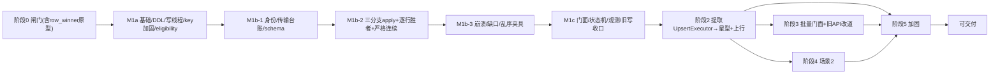

# SQLite 同步工具实现计划

> 版本：v0.5（草案）
> 日期：2026-06-25
> 本版整改：纳入第四轮 **Codex（gpt-5.5）计划复评 S-01~S-04**（1 Critical / 1 High / 2 Medium；R-01~R-12 经复评 10 条已解决、R-03/R-04 部分解决于本版收口）——缺口 pending **复用 inbox+ledger（`seen` 未 consumed、不 ACK、三时机重扫、缺口超时→`E_SYNC_GAP`→baseline，不新建表）**（S-01/R-03 收口）、eligibility 在 **T1.11 initialize attach 前显式调用**（S-02/R-04 收口）、§4 依赖图补全 `T1.3→T1.6`/`T1.5x`/`T1.8→T1.12`/`T1.0c→T1.11`（S-03）、T1.6 **M1 仅实跑分支 A，B/C 为接口占位由消费任务接入**（S-04）。
> 来源：`specs/SQLite-同步工具-设计文档.md` **v0.5**、`specs/SQLite-同步工具-需求文档.md` v0.5
> 本版整改：纳入第三轮 **Codex（gpt-5.5）计划评审 R-01~R-12**（3 Critical / 5 High / 4 Medium），将设计 v0.5（第三轮设计评审 G-01~G-10）新增不变量**任务化/排序化/夹具化**——`CapturedWriteTemplate` 三分支化（入站 changeset 挂起捕获，R-02/G-03）、`RowWinnerStore` + `__sync_row_winner` + 低 rank 跨批后到夹具（R-01/G-01）、入站严格连续应用 + 缺口 pending（R-03/G-05）、同步表 eligibility（R-04/G-04）、`TransportAdapter` 拆分 + `__sync_inbox_ledger`（R-05/G-08）、`SyncContext` key 加固（R-06/G-07）、分片幂等键含 origin/epoch（R-07）、判等以校验和为准（R-08/G-06）、新错误码触发点（R-09/G-09）、迁移 stop 取消收口（R-10/G-02）、阶段 0 闸门补全（R-11）、M1b 拆 b1/b2/b3（R-12）。
> 历史整改：第二轮 **Q-01~Q-08**（统一 `CapturedWriteTemplate`、M1 崩溃夹具、`UpsertExecutor` 提取契约、typed ACK、M1 拆 M1a/b/c、依赖排序、DoD 校正、旧写拒绝 `E_SYNC_WRITE_BLOCKED`）；第一轮 **P-01~P-13** 依赖错序已实质修复。
> 原则：**循序最小可落地**——里程碑=设计要求的可运行子系统；阶段 0 硬闸门；DoD 必须可断言（有夹具，不靠代码审查）。

---

## 1. 实现原则与约束

| 原则 | 落实 |
|---|---|
| 真·最小可落地 | 里程碑=可运行子系统；M1 内再拆 M1a/M1b/M1c，每个可跑验收（Q-05） |
| 统一写模板 | **所有 `wconn` 本地写**（入站 apply / 上行 UPSERT / 导入 / 场景2 save）走同一 `CapturedWriteTemplate`：捕获 changelog + 维护 table_state + 同事务（Q-01） |
| 阶段闸门 | 阶段 0 不过禁止进 M1；Session/句柄/rebaser 不可行则整方案停（FR-1，无降级） |
| DRY | `UpsertExecutor` 在 T2.0b 一次性提取，import/上行/场景2 save 共用；复用 `SchemaIntrospector/TopoSorter/FkInjector/SqlBuilder/ErrorCollector/onPrefetch` |
| 测试可验收 | 每阶段 DoD 必须有夹具可断言（含 M1 崩溃注入，Q-02）；提取/重构前先补回归（先红后绿） |
| 函数/参数 | 复杂流程按设计 §1 拆分（≤150 行 / ≤7 参；多参走 Builder） |

> 错误码：`E_SYNC_WRITE_BLOCKED`（Q-08）已落设计 §4.6/需求 §7；设计 v0.5 另增 `E_SYNC_UNSUPPORTED_SCHEMA`（R-04/G-04）、`E_SYNC_ACK_TIMEOUT`/`E_SYNC_REBASE_FAILED`/`E_SYNC_BASELINE_FAILED`（R-09/G-09）——T1.0a `Errors.h` 须含 v0.5 全量码，触发点测试见 §5。

---

## 2. 总体路线图



里程碑：**M0** 闸门 →（**M1a→M1b(b1→b2→b3)→M1c**=）**M1** 两节点收敛 → **M2** 星型+上行 → **M3** 批量门面 → **M4** 场景2 → **M5** 加固。

---

## 3. 阶段详解

### 阶段 0 — 可行性闸门（硬验收，不过不进）

| 任务 | 描述 | 规模 |
|---|---|---|
| T0.1 | SQLite amalgamation 启用 `SESSION/PREUPDATE_HOOK`，QSQLITE 链接到它；记录 `compile_options` + source id（防双库同版本号假通过） | L |
| T0.2 | `SqliteHandle::of(db)` 取 `sqlite3*`；**在该 handle 上实调 session API** 验证 | S |
| T0.3 | 最小录制 changeset | M |
| T0.4 | `sqlite3changeset_apply_v2` + 冲突回调 | M |
| T0.5 | rebaser 链路：apply_v2 rebase buffer → `sqlite3rebaser_*`；两路冲突/反序到达验证收敛；**增 `__sync_row_winner` 最小原型：冲突回调读 `(rank,seq)` 胜者 → REPLACE/OMIT，跑通"高 rank 先到提交、低 rank 后到(跨批)不覆盖"fixture（R-01/R-11/G-01）** | L |
| T0.6 | 与第三方锁定 outbox/inbox 目录/命名/`.ready` 契约；**增 ACK 制品 schema、原子发布顺序 `tmp→fsync→rename→.ready`、启动/周期扫描契约确认（R-05/R-11/G-08）** | M |

**DoD**：① `compile_options` 含两宏且 handle 上 session API 可调；② apply_v2+rebaser 重放收敛；③ **`__sync_row_winner` 原型令"低 rank 跨批后到"不覆盖高 rank（G-01 核心可行性）**；④ 目录契约 + ACK 制品 schema + 原子发布顺序确认。任一不过 → 停止实施。

---

### 阶段 1 — 两节点最小同步（M1 = M1a→M1b→M1c）

#### M1a — 基础设施 / DDL / 写线程骨架

| 任务 | 描述 | 依赖 | 规模 |
|---|---|---|---|
| T1.0a | 构建接入、`DBRIDGE_EXPORT`、`Errors.h` **v0.5 全量码**（含 `E_SYNC_WRITE_BLOCKED` + **`E_SYNC_UNSUPPORTED_SCHEMA`/`E_SYNC_ACK_TIMEOUT`/`E_SYNC_REBASE_FAILED`/`E_SYNC_BASELINE_FAILED`**，R-09/G-09）、公共类型（`SyncTypes/SyncConfig::Builder/SyncSelection::Builder/PayloadHeader/RowMutation`）、测试夹具 + **最小崩溃注入夹具**（子进程 + 注入点，Q-02） | T0.* | M |
| T1.0b | 写线程骨架：`SqliteHandle`、`WriteTxn`、`ForegroundGate`、`SyncWorker` 主循环；**`SyncContext` 注册表 key 加固**（`PRAGMA database_list` 主库路径 → OS 文件标识 `(dev,inode)`/Windows FileIndex；URI 归一化 + casefold；未建库临时 path key；registry mutex/refcount；`context_uuid` 兜底，R-06/G-07） | T1.0a | L |
| T1.0c | **`SchemaEligibility::verify`（R-04/G-04）**：复用 `SchemaIntrospector`，attach 前逐表校验"普通表 + 显式非空 PK + 可用冲突目标，拒虚表/视图/影子表/partial unique 目标"；不合格 → `E_SYNC_UNSUPPORTED_SCHEMA` | T1.0a | S |
| T1.1 | 建全部 `__sync_*` 表（设计 §6.1 DDL，键/索引/外键），**含 `__sync_row_winner`（R-01/G-01）与 `__sync_inbox_ledger`（R-05/G-08）** | T1.0b | M |

**M1a DoD**：构建通过；写任务串行入队执行；建表成功（含 `__sync_row_winner`/`__sync_inbox_ledger`）；**路径别名（symlink/hardlink/相对路径/URI）指向同一库只建一个 `SyncContext`（R-06）**；**无 PK 表/视图配为同步表 → `E_SYNC_UNSUPPORTED_SCHEMA`（R-04）**；崩溃夹具可在指定点杀进程并重启。

M1b 经设计 v0.5 新增不变量后明显过载，**内部拆 b1/b2/b3**（R-12），依赖在前（Q-06）。

##### M1b-1 — 捕获/changelog/载荷/传输台账/表态/schema 基件

| 任务 | 描述 | 依赖 | 规模 |
|---|---|---|---|
| T1.2 | `SessionRecorder` 同事务收割（`sealInto(h,store,txn,&seq)`） | T1.1 | M |
| T1.3 | `ChangelogStore`（写/`readRange`；**`appendForward(origin, 原 blob, 元数据)` 供分支 A 转发，R-02**） | T1.1 | M |
| T1.4 | `PayloadCodec`（公共头 + `ChangesetPayload`，类型化 `DecodeResult`） | T1.0a | M |
| T1.5a | **`OutboxPublisher`（R-05/G-08）**：原子发布 `tmp→fsync→rename→.ready`；IO 失败 `E_SYNC_TRANSPORT` | T0.6 | M |
| T1.5b | **`InboxScanner` + `InboxLedger`（R-05/S-01/G-08）**：`__sync_inbox_ledger` 制品级幂等消费；启动/watcher/timer **三时机扫描**；每轮对 `status='seen'`（未 consumed）制品**重判**——解头取 `(origin,seq)`，命中 `seq==applied_seq+1` 则交 T1.6 应用并转 `consumed`，仍 `>applied_seq+1` 维持 `seen`（缺口 pending，S-01）；缺主文件留待重扫；损坏→`quarantineDir`+`E_SYNC_PAYLOAD_CORRUPT` | T0.6,T1.1 | M |
| T1.5c | **`AckArtifactCodec` + typed ACK（Q-04/R-05）**：`ChangesetAck` / `PushChunkAck`（`push_id/chunk_seq/total_chunks/checksum`）制品 schema + `ackMaxDelayMs` 默认 + 超时落点 | T0.6 | S |
| T1.9 | `TableStateStore` + 增量算法（顺序无关**模加**聚合，禁全表扫描，§6.2；**high_water 仅信息量不判等，R-08**） | T1.1 | M |
| T1.10 | 最小 `SchemaGuard::verifyPayload`（同版本同指纹才写，否则拒绝 + 错误落点） | T1.1 | S |

##### M1b-2 — 三分支 apply + 逐行胜者 + 严格连续

| 任务 | 描述 | 依赖 | 规模 |
|---|---|---|---|
| T1.7 | **`AppliedVectorStore` 严格连续应用（R-03/S-01/G-05）**：`seq==applied_seq+1` 才应用；`seq<=applied_seq` 幂等 no-op；`seq>applied_seq+1` **缺口**→**不应用、不 ACK**，对应 inbox 制品**保持 `__sync_inbox_ledger.status='seen'`（未 consumed）作为 pending**（复用台账，不新建表，S-01）；缺口由 T1.5b 三时机扫描每轮重判、补齐即应用并转 `consumed`；缺口超 `gapTimeout/阈值` → `E_SYNC_GAP` 回退基线。**崩溃安全**：pending = 文件 + ledger 行，重启后重扫续判，不丢不重复消费 | T1.1,T1.5b | M |
| T1.7b | **`RowWinnerStore`（R-01/G-01）**：维护 `__sync_row_winner`；`ChangesetApplier` 冲突回调读 `(winning_rank, winning_origin_seq)` → REPLACE/OMIT；**仅 changeset 路径维护**（上行 UPSERT 不叠 rank，C12） | T1.1 | M |
| T1.6 | **`CapturedWriteTemplate` 三分支（R-02/G-03 核心改写）**：<br>**A 入站 changeset**：`WriteTxn.begin → 严格连续判(T1.7) → SchemaGuard → ChangesetApplier.apply_v2(冲突回调消费 RowWinner) → AppliedVector.update → RowWinner.applyMutations → TableState.applyMutations → ChangelogStore.appendForward(原 blob+origin 元数据，**不 fresh 捕获**) → commit`；<br>**B 入站 selectionpush 分片**：`push_chunk_progress` 幂等 → SchemaGuard → fresh `SessionRecorder.begin` → `SelectionPushApplier` → markChunk → TableState → `sealInto` → commit；<br>**C 本地写(import/save)**：fresh 捕获 → `UpsertExecutor` → TableState → `sealInto` → commit。<br>**M1 范围（S-04）：仅实跑分支 A**（M1 唯一被驱动的写路径）；**B/C 为模板接口占位**——B 由 `T2.12` 接入（M2）、C 由 `T3.1`/`T4.3` 在 `UpsertExecutor` 提取（T2.0b-2）后接入（M3/M4），故 M1 不依赖 `UpsertExecutor` | T1.2,T1.3,T1.7,T1.7b,T1.9,T1.10 | XL |
| T1.8 | `OutboundAckStore`（发送端锚点，按 ACK 前移，不与 applied-vector 混用） | T1.1,T1.5c | M |

##### M1b-3 — 崩溃/缺口/乱序夹具（DoD 可断言）

**M1b DoD**：入站 changeset 经分支 A 落库且 **origin 不被重铸**（`apply_v2` 后 changelog 记原 origin，转发可被对端识别，R-02）；**`table_state` 随写增量更新（无全扫）**；schema 不匹配被拒；**幂等去重 + 严格连续：乱序 `seq=2` 先到不推高水位致 `seq=1` 丢更、缺口超时 `E_SYNC_GAP`（R-03）；缺口 pending（ledger `seen`）跨崩溃重启重扫续判，不丢不重复消费（S-01）**；**A↔B 单边冲突按 `__sync_row_winner` 裁决（多源跨批留 M2，R-01）**；**inbox 半截文件/重复 watcher/启动补扫/损坏 quarantine（R-05）**；**崩溃零窗口（T1.0a 夹具在提交前/seal 后/commit 后注入，重启断言业务+changelog+applied_vector+row_winner+ledger 原子一致，Q-02 扩展）**。

#### M1c — 门面 / 状态机 / 观测 / 旧写收口

| 任务 | 描述 | 依赖 | 规模 |
|---|---|---|---|
| T1.11 | `ISyncEngine` 8 方法 + `createSyncEngine(bridge)` + 最小可观测（state 快照 / error 环 / `bytesPacked·bytesApplied·changesApplied·conflicts·lastAckedSeq`）；**`initialize()` 在 open `wconn` 后、session attach 前显式调 `SchemaEligibility::verify`(T1.0c)，不合格 → `E_SYNC_UNSUPPORTED_SCHEMA` 且不进入同步模式（S-02/R-04）** | M1b,T1.0c | L |
| T1.12 | 双状态机：前台 `Exporting=等ACK/percent=-1`，足额 ACK 才 `Completed`，**超时→`Failed` 且落 `E_SYNC_ACK_TIMEOUT`（R-09/G-09，区别于泛 Failed）**；后台 Pipeline | T1.11 | M |
| T1.13 | sync-aware 写边界：同步激活后同步表写仅经 `wconn`；**旧 `DataBridge::importExcel` 对同步表统一返回 `E_SYNC_WRITE_BLOCKED`（M1 选拒绝，不做改道；改道留 T3.3，Q-08）**；`db_` 对同步表只读 | T1.11 | M |

**M1 DoD（M1c 完成 = M1）**：A↔B 双向收敛；幂等 + **严格连续（乱序/缺口可测，R-03）**；**入站 changeset origin 不被重铸（R-02）**；**A↔B 单边冲突按逐行胜者裁决（R-01）**；崩溃零窗口（可测，含 row_winner/ledger）；`Exporting=等ACK`（含 `ackMaxDelayMs` + 超时 `E_SYNC_ACK_TIMEOUT` 测试）；表态增量；schema 拒绝；**无 PK/视图表 → `E_SYNC_UNSUPPORTED_SCHEMA`（R-04）**；**inbox 台账幂等/半截/补扫（R-05）**；**路径别名同库单 context（R-06）**；**旧 importExcel 对同步表被 `E_SYNC_WRITE_BLOCKED` 拒（bypass 用例）**；8 getter+counters 可轮询。

---

### 阶段 2 — 提取 UpsertExecutor → 星型广播 + 上行选择性推送（M2）

| 任务 | 描述 | 依赖 | 规模 |
|---|---|---|---|
| T2.0a | **扩充** `ImportService` 回归测试：覆盖 multi-table、lookup、fkInject、行级 skip、`writtenRows`、rollback、`DO NOTHING`、bind 序（守护提取，Q-03） | M1 | M |
| T2.0b-1 | **提取契约冻结**：定义 `UpsertExecutor` 边界——**不持事务**（由 `CapturedWriteTemplate` 持）、输入 `RowMutation`、携带/返回**逐行 error context**、prepared 缓存、`DO UPDATE/DO NOTHING`（Q-03） | T2.0a | M |
| T2.0b-2 | **提取实现**：把 `ImportService.cpp:683-731` UPSERT 循环抽为 `UpsertExecutor`；`ImportService` 加 `RoutePayload→RowMutation` 适配，行为不变、回归绿；`SqlBuilder::buildUpsert` 扩展强制 `DO NOTHING` | T2.0b-1 | L |
| T2.1 | `RoutingTable`（防回声路由） | T1.8 | M |
| T2.2 | `ConflictArbiter`（`(rank,seq)` 规范序）**与 M1 的 `RowWinnerStore`（T1.7b）协同**：跨批/低 rank 后到的到达序无关由逐行胜者保证，本任务只产出规范序与广播裁决（R-01/G-01） | T1.6,T1.7b | M |
| T2.3 | `RebaseEngine`（rebase buffer → `sqlite3rebaser_*`；下游 `AuthoritativeApply` 强制 REPLACE、豁免 ConflictPolicy；**rebaser 链路失败 → `E_SYNC_REBASE_FAILED` 本轮不外发、回滚，R-09/G-09**） | T0.5,T2.2 | L |
| T2.4 | 下行去抖攒批广播（`broadcastIntervalMs`/`broadcastThreshold` 先到先发、concat、空闲不发） | T2.1,T2.3 | M |
| T2.5 | `SelectionResolver`（只读快照解析 PK；MVP 仅"表+主键集合"） | T1.1 | M |
| T2.6 | `FkClosureBuilder`（读快照 + 复用 schema/topo/fkInject；FK 环→`E_SYNC_FK_CYCLE_UNSUPPORTED`；悬挂父→`E_SYNC_FK_CLOSURE_MISSING`） | T2.5 | L |
| T2.7 | `ConsistencyCache`（本地自比；仅下行/基线喂养；`invalidateTable`） | T1.6 | M |
| T2.8 | `FrozenManifest` + `ReadSnapshot` 契约（短快照即释放，护 WAL） | T2.6,T2.7 | M |
| T2.9 | `PushProgressStore`（`push_progress`/`push_chunk_progress` + 续传判定）——先于分片/应用；**`push_id` 全局唯一（含/绑定 `origin`+`epoch`，故分片幂等键 `(push_id,chunk_seq)` 等价于 `(origin,epoch,push_id,chunk_seq)`，R-07/G-05）** | T1.1 | M |
| T2.10 | `ChunkStreamer`（拓扑序分片、`(push_id,chunk_seq)` 幂等续传；**重复 chunk checksum 相同 = no-op、不同 = `E_SYNC_PAYLOAD_CORRUPT`，R-07**；超规模→`E_SYNC_SELECTION_TOO_LARGE`） | T2.8,T2.9 | L |
| T2.11 | `PayloadCodec` 增 `SelectionPushPayload` | T1.4 | S |
| T2.12 | `SelectionPushApplier`（逐行直选 `DoUpdate`/依赖 `DoNothing`，**经 `CapturedWriteTemplate` + `UpsertExecutor`**） | T2.0b-2,T2.10,T2.11,T1.6 | M |
| T2.13 | `syncSelected` ⑨：受理前校验同步返回；后台失败入 `errors()/state(Failed)`；中心**全片 `PushChunkAck` 才 Completed、半截不外泄**（依赖 T1.5c typed ACK + T2.9） | T2.5-2.12,T1.5c | L |

**DoD（M2）**：`UpsertExecutor` 已提取，**import + 上行两路共用 + 场景2 save 编译契约预留**（第三路 save 由 M4 验，Q-07）；星型无回声、多源两序同终态；**B/D 跨批、低 rank 后到、反序到达后 C/D 仍收敛中心终态（逐行胜者，R-01/G-01）**；**Edge 配 `TargetWins/Manual` 仍收敛中心权威下行**；上行人工选择+闭包+剪枝+UPSERT 经 outbox/inbox 闭环；分片续传幂等 + **重复 chunk 同 checksum no-op / 异 checksum `E_SYNC_PAYLOAD_CORRUPT`（R-07）**；FK 环/空选择/超规模/悬挂父报码；`rebaser` 失败 `E_SYNC_REBASE_FAILED`；`syncSelected` 全片 ACK 才 Completed。

---

### 阶段 3 — 批量门面 + 旧 API 改道（M3）

| 任务 | 描述 | 依赖 | 规模 |
|---|---|---|---|
| T3.1 | `BatchTransfer`（`IBatchTransfer` 8+3）+ `createBatchTransfer(bridge)`；导入跑在 `wconn`，**经 `CapturedWriteTemplate`**（复用 `ImportService`/`UpsertExecutor`，维护 changelog+table_state，Q-01） | T2.0b-2,T1.6 | L |
| T3.2 | 进度填充（`onPrefetch` 同型钩子 → `TransferProgress`） | T3.1 | S |
| T3.3 | 共享 `ForegroundGate` + `stop`/`importState`/`exportState`；**旧 `importExcel` 由 M1 的"拒绝"升级为"改道写队列"适配**（Q-08），含回归 | T1.13,T3.1 | M |

**DoD（M3）**：非阻塞导入/导出 + 轮询；同库 `E_BUSY` 互斥；现有 `importExcel/exportExcel` 回归全绿；导入路径维护 table_state（DiffEngine 可信前提）。

---

### 阶段 4 — 场景2 对比/合并（M4）

| 任务 | 描述 | 依赖 | 规模 |
|---|---|---|---|
| T4.1 | `DiffEngine`：表级（消费 M1 维护的 `TableStateStore`，零全量）**Identical 判等 = `schema_fingerprint + row_count + content_checksum` 三元组，`high_water_seq` 不参与判等（R-08/G-06）** + 行级（只物化受影响行）+ `fetchRemoteRows`（keyset 分页） | T1.9,T2.0b-2 | L |
| T4.2 | `InboundTableGate`：预扫描载荷涉及表集合，命中则整发 pending、不 ACK；放行按到达序应用 | T1.6 | M |
| T4.3 | `StagingBuffer`：内存暂存；`save` **经 `CapturedWriteTemplate` + `UpsertExecutor`**（普通 origin 本地写，维护 table_state）；`discard` 零落盘 | T2.0b-2,T1.6 | M |
| T4.4 | `ComparisonSession`（`acceptLocal/acceptRemote/stageCell/fetchRemoteRows/save/discard`）+ 钉 `data_version`；脚下变动→`E_SYNC_STAGE_STALE` | T4.1-4.3 | L |

**DoD（M4）**：表级零全量（SELECT 行数有上界）；**判等三元组：内容相同但 `high_water` 不同仍 green、`checksum` 不同但 `high_water` 相同仍 red（R-08/G-06）**；行级+分页；会话期暂停被比对表并按序放行；`save` 普通本地写；**第三路 save 共用 `UpsertExecutor` 验证（补 Q-07）**；脚下变动 `E_SYNC_STAGE_STALE`。

---

### 阶段 5 — 加固（M5）

| 任务 | 描述 | 依赖 | 规模 |
|---|---|---|---|
| T5.1 | `BaselineManager`：冷启动/缺口/迁移后/强制 → 基线；应用后重置 **applied-vector/table_state/`__sync_row_winner`（R-10/G-01）**、喂养 ConsistencyCache；**导出/应用失败 → `E_SYNC_BASELINE_FAILED` 回滚不动旧锚点（R-09/G-09）** | T1.6,T1.7b,T1.9 | L |
| T5.2 | `SchemaGuard` 完整化 + `QuarantineStore`：版本/指纹隔离 + 迁移后重放（扩展 M1 最小版） | T1.10 | L |
| T5.3 | `DeadPeerEvictor`：三维阈值软告警→硬逐出 + outbox 坍缩 + `streamEpoch` 代际 | T1.8 | L |
| T5.4 | 迁移规程**三路径（R-10/G-02）**：①静默窗排空在途推送(等 `status=done`)后才 DDL；②**在途 push 被 `stop()` 取消 → 已落片由迁移后 re-baseline 整表收口**(残留片被基线覆盖,**不引入 per-push staging、不跨片回滚**)；③竞态押旧版片迁移后到达 → 按 `push_id` 整发拒收 `E_SYNC_PUSH_SCHEMA_MOVED`(整体不落片) | T2.13,T5.1,T5.2 | M |
| T5.5 | 错误码触发点全覆盖 + 审计日志（扩展 M1 最小观测） | T1.11 | M |
| T5.6 | **全量故障矩阵**（扩展 M1 崩溃夹具）+ 载荷字节预算实测（承诺 `bytesPacked/bytesApplied` 在 2Mbps 预算内，不承诺黑盒在途时延）+ R5 阈值定值 | 全部 | L |

**DoD（M5）**：异常路径全覆盖；单/批载荷字节达 2Mbps 预算；R5 阈值落定。

---

## 4. 关键依赖图

```mermaid
graph TD
    M0{{阶段0(含row_winner原型)}} --> T10a["T1.0a 基础+全量码+崩溃夹具"] --> T10b["T1.0b 写线程+key加固"] --> T11["T1.1 DDL(含row_winner/ledger)"]
    T10a --> T10c["T1.0c eligibility"]
    M0 --> T15a["T1.5a OutboxPublisher"]
    M0 --> T15c["T1.5c AckCodec/typed ACK"]
    T11 --> T17["T1.7 AppliedVector(严格连续/pending)"]
    T11 --> T17b["T1.7b RowWinnerStore"]
    T11 --> T19["T1.9 TableState"]
    T11 --> T110["T1.10 SchemaGuard"]
    T11 --> T12["T1.2 SessionRecorder"]
    T11 --> T13["T1.3 ChangelogStore/appendForward"]
    T11 --> T15b["T1.5b InboxScanner/Ledger"]
    T15b --> T17
    T17 --> T16["T1.6 三分支模板(M1:仅A)"]
    T17b --> T16
    T19 --> T16
    T110 --> T16
    T12 --> T16
    T13 --> T16
    T15c --> T18["T1.8 OutboundAckStore"]
    T16 --> T111["T1.11 ISyncEngine8+观测+initialize调eligibility"]
    T10c --> T111
    T18 --> T112["T1.12 双状态机/ACK超时"]
    T111 --> T112 --> T113["T1.13 旧写拒绝"] --> M1{{M1}}
    M1 --> T20a["T2.0a 回归扩充"] --> T20b1["T2.0b-1 契约冻结"] --> T20b2["T2.0b-2 提取"]
    T20b2 --> T212["T2.12 SelectionPushApplier"]
    M1 --> T29["T2.9 PushProgress"] --> T210["T2.10 ChunkStreamer"] --> T212
    T16 --> T212
    T212 --> T213["T2.13 syncSelected"]
    T18 --> T21["T2.1 RoutingTable"] --> T24["T2.4 攒批广播"]
    M1 --> T22["T2.2 ConflictArbiter(配胜者)"] --> T23["T2.3 RebaseEngine"] --> T24
    T17b --> T22
    T213 --> M2{{M2}}
    T24 --> M2
    T20b2 --> T31["T3.1 BatchTransfer"] --> M3{{M3}}
    T19 --> T41["T4.1 DiffEngine"] --> M4{{M4}}
    T20b2 --> T43["T4.3 StagingBuffer"] --> M4
    M2 --> M5{{M5}}
    M3 --> M5
    M4 --> M5
```

---

## 5. 测试策略与可测断言映射（对应需求 §9 / 设计 §9）

| 性质 | 断言 | 阶段 |
|---|---|---|
| 幂等 + 严格连续 + pending（C6/G-05） | 同 `(origin,epoch,seq)` 重投 → no-op；**乱序 `seq=2` 先到不致 `seq=1` 丢更；缺口 pending(ledger `seen`)崩溃重启续判不丢不重；缺口超时 → `E_SYNC_GAP`** | M1b（R-03/S-01） |
| 逐行胜者到达序无关（FR-6/G-01） | **高 rank 先到提交、低 rank 跨批后到不覆盖**；B/D 反序到达终态一致 | M1b(A↔B)/M2(多源)（R-01） |
| origin 不重铸（FR-9/G-03） | 入站 changeset 经分支 A apply 后 changelog 记**原 origin**、转发可被对端识别 | M1b（R-02） |
| 同步表 eligibility（FR-2/G-04） | 无 PK 表/视图/影子表/不可用冲突目标 → `E_SYNC_UNSUPPORTED_SCHEMA`，拒绝初始化 | M1a（R-04） |
| SyncContext 唯一（NFR-6/G-07） | symlink/hardlink/相对路径/URI 指向同一库 → 仅一个 context/`wconn` | M1a（R-06） |
| 传输可靠性（FR-4/G-08） | 半截文件不读；重复 watcher 幂等；启动补扫；损坏→quarantine；原子发布顺序 | M1b（R-05） |
| 表级判等三元组（FR-12/G-06） | 内容同但 `high_water` 异仍 green；`checksum` 异但 `high_water` 同仍 red | M4（R-08） |
| 新错误码触发点（G-09） | `E_SYNC_ACK_TIMEOUT`(M1c)/`E_SYNC_REBASE_FAILED`(M2)/`E_SYNC_BASELINE_FAILED`(M5)/`E_SYNC_UNSUPPORTED_SCHEMA`(M1a) 各有码级断言 | M1~M5（R-09） |
| 迁移半截收口（C17/G-02） | 排空后 DDL；stop 取消片由 re-baseline 收口；旧片整发拒收，**无 staging** | M5（R-10） |
| 崩溃零窗口（FR-1） | **崩溃夹具**在提交前/seal 后/commit 后注入，重启断言业务+changelog+applied_vector+row_winner+ledger 原子一致 | M1b（Q-02 扩展） |
| ACK 锚点 / typed ACK（C6/F-14） | 锚点前移当且仅当收 ACK；`ChangesetAck`/`PushChunkAck` 格式；超 `ackMaxDelayMs` → 状态落点 | M1b（Q-04） |
| 表态增量（F-17） | **所有写路径**（apply/import/save）后 `table_state` 更新且无全扫 | M1b/M3/M4（Q-01） |
| schema 校验（FR-5/7） | 版本/指纹不符被拒 | M1b |
| 旧写收口（FR-1/E-01） | 旧 importExcel 对同步表 → `E_SYNC_WRITE_BLOCKED` | M1c（Q-08） |
| 防回声/确定性仲裁（C2/C7） | 静默后 0 载荷；两序同终态 | M2 |
| 权威下行豁免（F-04） | Edge 配 `TargetWins/Manual` 仍收敛中心终态 | M2 |
| 缓存只认权威/指纹/算子分类（C10/11/12） | 高 rank 仲裁后缓存不记；抗碰撞+冷父必传；依赖父 DO NOTHING | M2 |
| 分片续传/长推送漂移/前后台（C13/16/15） | 中断终态一致；漂移取最新+告警；长推送等 ACK 期后台仍 apply | M2 |
| UpsertExecutor 共用 | import+上行两路（M2）；save 第三路（M4） | M2/M4（Q-07） |
| 重构无回退 | 现有导入回归全绿（multi-table/lookup/fkInject/skip/rollback/DO NOTHING） | M2（Q-03） |
| 零全量拉取 / 场景2 隔离（C5） | 比对 SELECT 有上界；save 前 `.db` 写=0；`E_SYNC_STAGE_STALE` | M4 |
| 迁移撞推送（C17） | 押旧 schema 片 → `E_SYNC_PUSH_SCHEMA_MOVED` | M5 |
| 载荷字节预算（NFR-5） | 单/批载荷字节 ≤ 预算（不承诺在途时延） | M5 |

---

## 6. 风险与回退

| 风险 | 触发 | 对策 |
|---|---|---|
| 阶段 0 不过 | T0.* | 停止本方案（CDC 属另立设计） |
| `UpsertExecutor` 提取回归 | T2.0b | T2.0a 扩充回归（multi-table/lookup/fkInject/skip/rollback/DO NOTHING）；T2.0b-1 先冻结契约 |
| M1 过载致排期失真 | M1 | 内部 M1a/M1b(b1→b2→b3)/M1c 分段验收（Q-05/R-12）；T1.6 三分支模板按 XL 估 |
| 设计 v0.5 不变量漏落地 | M1/M2 | row_winner/严格连续/eligibility/传输台账/key 加固均已任务化 + 夹具化（R-01~R-11） |
| 双库假通过 | T0.1/T0.2 | handle 实调 session API + 记 source id |
| 载荷超 2Mbps 预算 | T5.6 | 压缩+剪枝+攒批+分片调参；不承诺黑盒在途时延 |
| provider/工具链不稳 | 评审/CI | 重试；本地单测兜底 |

---

## 7. 最小可落地核对（整改后）

- **写模板分支化**：`CapturedWriteTemplate` 三分支——入站 changeset **挂起捕获存原 blob+origin 元数据**、selectionpush/本地写 fresh 捕获；所有写仍维护 table_state（Q-01 + R-02/G-03）。
- **到达序无关有真实落点**：`__sync_row_winner` + 冲突回调裁决，阶段 0 即验"低 rank 跨批后到不覆盖"（R-01/R-11/G-01）。
- **入站不丢更**：严格连续 `seq==applied_seq+1` + 缺口 pending/`E_SYNC_GAP`；分片幂等键 `(push_id,chunk_seq)`（`push_id` 全局唯一）与 changeset 高水位分账（R-03/R-07/G-05）。
- **eligibility/key/传输三道前置**：同步表 eligibility（R-04）、`SyncContext` OS 文件标识 key（R-06）、`TransportAdapter` 原子发布+`__sync_inbox_ledger`+三时机扫描（R-05）。
- **判等以校验和为准**：DiffEngine 三元组判等，`high_water` 仅信息量（R-08/G-06）。
- **DoD 可测 + 分段**：M1 崩溃夹具扩到 row_winner/ledger；M1b 拆 b1/b2/b3（R-12/Q-02/Q-05）；任务表按依赖排序（Q-06）；`UpsertExecutor`(T2.0b) 先于上行(T2.12)、`PushProgress`(T2.9) 先于分片。
- **提取有契约**：T2.0b-1 冻结、T2.0a 扩回归、T2.0b-2 提取（Q-03）；M2 两路、M4 第三路；旧写 M1 拒绝、T3.3 改道（Q-07/08）。
- **迁移收口**：T5.4 三路径（排空/stop 取消 re-baseline/旧片拒收），不引入 staging（R-10/G-02）。

> 本计划基于设计 v0.5 / 需求 v0.5；v0.5 全量错误码（含 `E_SYNC_WRITE_BLOCKED/UNSUPPORTED_SCHEMA/ACK_TIMEOUT/REBASE_FAILED/BASELINE_FAILED`）已落设计 §4.6 / 需求 §7，T1.0a 据此落 `Errors.h`。
