# SQLite 同步工具设计文档

> 版本：v0.5（草案）
> 日期：2026-06-25
> 本版整改：纳入第三轮 **Codex（gpt-5.5）设计评审 G-01~G-10**（1 Critical / 6 High / 3 Medium）——**逐行胜者状态**保证多源仲裁到达序无关（G-01，新增 `__sync_row_winner`，§5.6/§6.1）、**长推送撞迁移半截语义**与排空/再基线收口对齐（G-02，§5.5/§8.2 引用）、`CapturedWriteTemplate` **按载荷类型分支**（入站 changeset 挂起本地捕获、`origin` 仅元数据、rebaser 仅限 `apply_v2` 路径，G-03，§5.4/§5.6）、**同步表 eligibility 校验**（G-04，新增 `E_SYNC_UNSUPPORTED_SCHEMA`，§4.4/§5.1）、**入站严格连续应用** + 选择推送分片幂等分离（G-05，§5.4/§6）、**表级判等以校验和为准**（high_water 仅信息，G-06，§6.2）、**`SyncContext` 键加固**为 OS 文件标识（G-07，§2.4/§4.3）、**`TransportAdapter` 子设计**补全（G-08，§5.11）、补齐 `E_SYNC_ACK_TIMEOUT/REBASE_FAILED/BASELINE_FAILED` 触发点（G-09，§4.6）、**NFR 追溯**（G-10，§14.4）。
> 上版回填（v0.4）：plan 评审 Q-01/Q-04/Q-08 确立的 3 处设计↔计划缺口——统一 **`CapturedWriteTemplate`**（Q-01）、**typed ACK**（`ChangesetAck`/`PushChunkAck`，Q-04）、错误码 **`E_SYNC_WRITE_BLOCKED`**（Q-08）。
> 对应需求：`specs/SQLite-同步工具-需求文档.md` v0.4（FR-1~FR-17、共识 C1~C17、Codex 整改 F-01~F-20）
> 本版整改：纳入第二轮 **Codex（gpt-5.5）设计评审 E-01~E-15**（3 Critical / 9 High / 3 Medium），修复 v0.2 引入的回归与未收口契约——**`Exporting` 完成条件回到"全片 ACK"**（E-02 回归修复）、sync-aware 写边界（E-01）、**可执行 DDL**（E-04）、apply 三件套同事务模板（E-05）、rebase 算法链路（E-06）、`RowMutation` 写入抽象（E-08）、长推送半截语义（E-10）、`sync_table_state` 增量维护算法（E-09）等。
> 历史：v0.2 纳入第一轮设计评审 D-01~D-28（线程/连接模型、载荷二分、阶段 0 硬验收、双状态机），删除违反 FR-1 的"CDC 兜底"回退。
> 定位：需求文档的实现侧设计，在**现有 dbridge 库**之上增量集成，不重写既有 ETL 通道。

---

## 0. 文档目的与范围

| 项 | 说明 |
|---|---|
| 目的 | 把需求 FR/共识落成**可编码的线程模型、模块、接口、数据模型 DDL 与流程**。 |
| 范围 | 同步引擎（星型增量 + 上行选择性推送 + 下行自动广播）、场景 2 比对/合并、精简批量导入导出门面。 |
| 非范围 | DDL/Schema 传播、CRDT、分布式共识、传输工具本身、宿主 GUI（需求 §1.3）。**触发器 CDC 不是本设计的运行时降级路径**（见 §13.1）。 |
| 读者 | 实现工程师、评审者；前置阅读需求文档 v0.4。 |

### 0.1 现状基线（代码库探查）与对设计的硬约束

| 现状事实 | 设计影响 |
|---|---|
| `DataBridge` 为 PImpl；`DataBridgePrivate` 持 `QSqlDatabase db_`（主线程、UUID 连接名）、`SchemaCatalog catalog_`、`QHash<QString,ProfileSpec> profiles_`、无状态 `ImportService/ExportService` | **db_ 属创建它的线程，禁止交给后台 worker**（见 §2.4）；catalog/profiles 为连接无关元数据，可只读共享 |
| 真正的 UPSERT 落库循环埋在 `ImportService.cpp:683-731` | 提取 `UpsertExecutor`；但**仅用于 UPSERT 路径**（import / 场景2 save / 上行选择性推送），下行 changeset 走原生 `apply_v2`，二者不共享行写实现（D-04） |
| `SchemaIntrospector` 已用 `PRAGMA foreign_key_list`；`TopoSorter` 为 Kahn | 外键闭包/拓扑复用；行级闭包需面向表图的拓扑变体 |
| `dbridge::err` 为 `inline constexpr const char*` | `E_SYNC_*` 沿用 |
| **全库无 `sqlite3*` 句柄穿透；系统 Qt QSQLITE 几乎肯定未启用 `SQLITE_ENABLE_SESSION`** | **阶段 0 可行性闸门**（§13.1 硬验收）；不通过则停止实施，无运行时降级 |
| Qt 5.12 / C++17 / 静态库 `libdbridge`，3rdparty 仅 QXlsx | 同步模块同标准编入同库 |

---

## 1. 设计目标与约束

| 约束 | 落实 |
|---|---|
| **KISS** | 公开面纯抽象 + 工厂；纯轮询无回调；写串行到单写线程。 |
| **DRY** | UPSERT 三路收敛 `UpsertExecutor`；外键/拓扑/schema 复用既有件；上行/下行/场景2 复用同一传输底座与 `WriteTxn` 事务包装。 |
| **YAGNI** | 多域、CRDT、加密、回调、原始 WHERE 直通均不实现，留扩展位。 |
| **SOLID** | SRP=§3.2 每模块边界；DIP/OCP=纯抽象 + 工厂 + 策略点（ConflictPolicy/TransportAdapter）；ISP=8+8 接口不臃肿。 |
| **函数 ≤150 行** | 复杂流程预拆（见下"函数拆分约束"，D-27）。 |
| **参数 ≤7** | 多参装配走 Builder；接口方法参数恒 ≤4。 |
| **Builder 模式** | `SyncConfig::Builder` / `SyncSelection::Builder`，`build()` 完整性校验、产出不可变值对象。 |
| **单一职责 / 无重复** | §3.2 "做/不做"；两条写通道不重复实现。 |
| **循序最小可落地** | §11 阶段 0→5；**持久化基础（表/epoch/quarantine/ack）下沉到阶段 1**（D-28）。 |

**函数拆分约束（D-27）**：天然超长的流程在实现时按下表拆为小函数（每个 ≤150 行、单一职责）：

| 流程 | 拆分函数（建议） |
|---|---|
| `syncSelected` | `validateSelection` → `resolveSelectionPK` → `buildFkClosure` → `pruneConsistent` → `freezeManifest` → `streamChunks` |
| changeset 应用 | `verifySchema` → `beginWriteTxn` → `applyChangesetV2`(+冲突回调) → `advanceAppliedVector` → `appendForwardChangelog` → `commitOrRollback` |
| 上行分片应用（中心） | `decodePayload` → `checkEpoch` → `beginWriteTxn` → `applyChunkUpsert`(逐行 DO UPDATE/DO NOTHING) → `recordChunkProgress` → `emitAck` |
| 场景2 save | `validateStage` → `beginImmediate` → `upsertStaged` → `releaseInboundGate` → `commit` |

---

## 2. 设计总览

### 2.1 增量定位

保留并复用现有 ETL（Profile→映射→校验→Upsert），在其旁新增"同步编排层 + SQLite 接入层 + 传输适配层"与三个公开门面；**所有写经单写线程串行**，UPSERT 路径收敛回 `UpsertExecutor`，下行 changeset 走原生 `apply_v2`。

### 2.2 总体分层架构

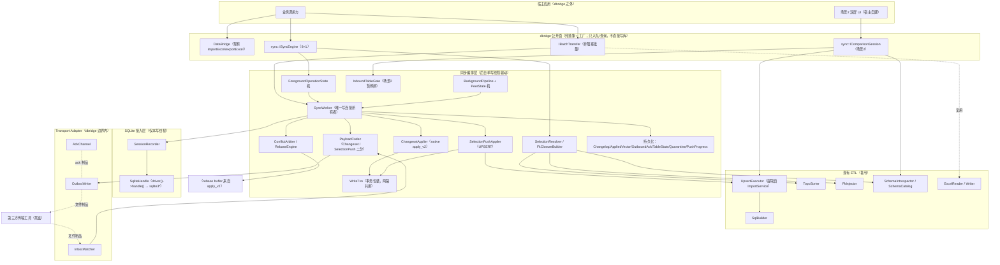

> 关键修正（D-04/D-05/D-18）：**`ChangesetApplier` 与 `SelectionPushApplier` 是两条独立写通道**，只共享 `WriteTxn`/SchemaGuard/错误归集，不共享行写实现；上行选择性推送**必须经 Outbox→第三方→Inbox**，禁止跨节点组件直接调用。

### 2.3 关键设计决策

| 决策 | 选型 | 理由 |
|---|---|---|
| 公开面 | 纯抽象 + `createXxx()` | DIP、可测、可替换 |
| 写并发 | **单写线程 + 写连接独占**（§2.4） | C15；规避 QSqlDatabase 跨线程与写写冲突 |
| 变更捕获 | 短命 session + **同事务**写 changelog | F-01 崩溃零窗口 |
| 载荷二分 | ChangesetPayload→native apply；SelectionPushPayload→UPSERT | F-02/D-04 |
| 冲突 | 自动路径 origin 规范序；上行人工"直选 DO UPDATE / 依赖 DO NOTHING"（逐行） | C7/C12/D-21 |
| 句柄穿透 | `QSqlDriver::handle()`，封进 `SqliteHandle`，仅写线程内取用 | 唯一 Qt 耦合点 |

### 2.4 线程与连接模型（D-01，本设计根基）

Qt 的 `QSqlDatabase`/`QSqlQuery` **不可跨线程**，底层 `sqlite3*` 亦绑定其连接所属线程。故定义：

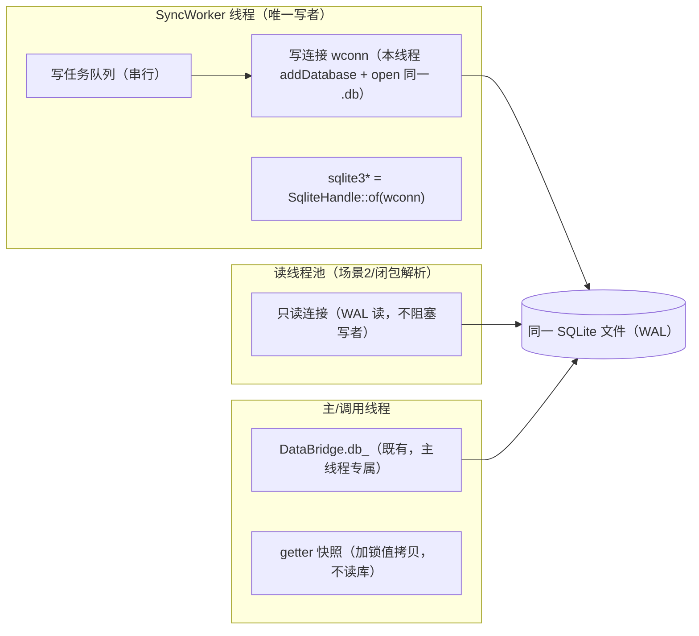

规则：

1. **唯一写连接**：`SyncWorker` 在自身线程 `addDatabase`（独立 connName）打开**指向同一 `.db`** 的写连接 `wconn`，`SqliteHandle::of(wconn)` 取 `sqlite3*` 仅在本线程使用。"同一 `.db`" 的唯一性由 **OS 文件标识**（非路径字符串）判定，规程见 §4.3（G-07）——否则路径别名会拆出第二个 `wconn`、破坏单写者。**所有写**（changeset apply、上行 UPSERT、import/export、场景2 save、广播打包前的本地捕获）作为任务入**写队列**，在该线程串行执行 → 天然无写写冲突、无死锁。
2. **禁止移交 `db_`**：现有 `DataBridge::db_`（主线程）不交给后台线程；`IBatchTransfer` 后台导入复用的是 `wconn`（`ImportService::run` 无状态、连接参数化，传入 `wconn` 即可），元数据（`catalog_`/`profiles_`）为连接无关只读数据可共享。
3. **读用独立连接**：WAL 下读者不阻塞写者；场景2 物化、闭包解析各自用只读连接（本线程创建）；getter 不读库，只返回加锁快照。
4. **跨线程只传值**：线程间仅传递 `QByteArray` 载荷、值类型快照、任务描述；绝不传 `QSqlQuery`/`sqlite3*`。

### 2.5 sync-aware 写边界（E-01：杜绝旧写绕过 session）

同步模式下，对**同步表**的写若绕过挂了 session 的 `wconn`，将不被捕获 → 违反 FR-1/FR-2。故规定唯一写入口：

| 写来源 | 同步模式下的处置 |
|---|---|
| 新 `IBatchTransfer` 导入 | 入 `SyncWorker` 写队列，在 `wconn`（session 已 attach）执行 `ImportService::run` |
| 场景2 `save` / 上行 UPSERT / changeset apply | 同样入写队列，经 `WriteTxn` + `UpsertExecutor`/`ChangesetApplier` |
| **既有阻塞式 `DataBridge::importExcel`（主线程 `db_`）** | 同步激活后，对**同步表**：M1 阶段统一**拒绝并报 `E_SYNC_WRITE_BLOCKED`**（不做改道，改道适配留实现计划 T3.3）；`db_` 对同步表降为**只读**。非同步表（不在 `syncTables`）不受限。 |
| 宿主直连 / 外部进程 / 带外 SQL | 属"外部写"，靠 FR-2 `data_version`/校验和检测 → `W_SYNC_UNTRACKED_CHANGE` + re-baseline |

要点：**`wconn` 是同步表的唯一受控写者**；`DataBridge.db_` 与 `wconn` 指向同一 `.db`，但 `db_` 在同步模式下不写同步表。实现时由 `ForegroundGate` + 写队列统一收口，旧 API 在同步上下文中走改道适配（保留非同步用法向后兼容）。

---

## 3. 模块分解与职责

### 3.1 组件依赖图（与 §2.2 同向，D-18 已统一）

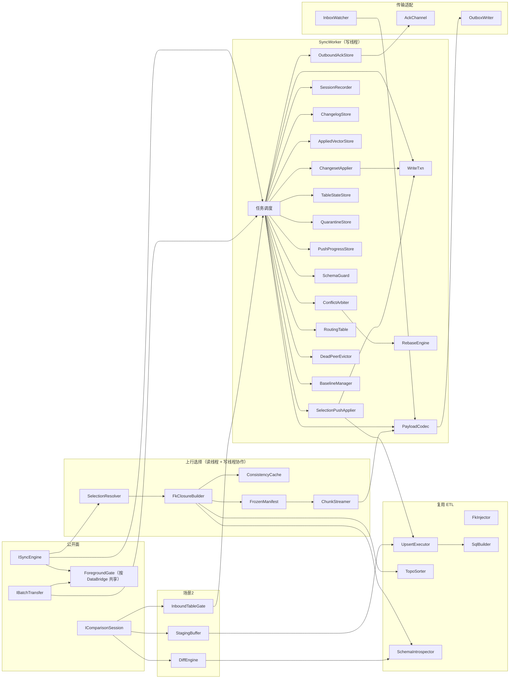

### 3.2 模块职责表（SRP：做 / 不做）

| 模块 | 做 | 不做 |
|---|---|---|
| **SyncEngine（ISyncEngine 实现）** | 装配组件、暴露 8+1、维护前台门控与可观测快照、入队任务 | 不直接操作 `sqlite3*`、不在调用线程写库 |
| **ForegroundGate** | 按 `DataBridge` 实例共享的前台单活动闸门（D-22）；重入 `E_BUSY` | 不拦截后台 inbox/apply/广播 |
| **SyncWorker** | 唯一写线程：串行执行写任务、周期扫 inbox、攒批广播、推进位点 | 不暴露公开接口、不渲染 |
| **WriteTxn** | 写事务包装（`BEGIN IMMEDIATE`/`COMMIT`/`ROLLBACK`），两路写通道共用 | 不实现行写、不解析载荷 |
| **ChangesetApplier** | `sqlite3changeset_apply_v2` + 冲突回调（FR-5），仅 ChangesetPayload | 不做 UPSERT、不传输 |
| **SelectionPushApplier** | 上行分片逐行 UPSERT（直选 DO UPDATE / 依赖 DO NOTHING），调 `UpsertExecutor` | 不做 changeset apply、不解析闭包 |
| **UpsertExecutor**（提取） | 统一 UPSERT 落库 + prepared 缓存 | 不解析 Profile、不读 Excel、不持事务（由 WriteTxn 持） |
| **SqliteHandle** | 写线程内取 `sqlite3*`、探测 Session 可用 | 不录制、不应用 |
| **SessionRecorder** | 写线程内绑定 `sqlite3*` 录制短命 session；提交前 `sealInto` | 不拥有事务（D-02）、不读历史区间 |
| **ChangelogStore** | 持久化/读取 `sync_changelog` 区间 | 不仲裁、不传输 |
| **PayloadCodec** | 两类载荷编解码（**类型化** DecodeResult）、压缩、校验、版本 | 不决定发给谁、不落库 |
| **ConflictArbiter / RebaseEngine** | 规范序仲裁（C7）；从 apply_v2 收集 rebase buffer 经 `sqlite3rebaser_*` 生成权威下行（D-13） | 不传输 |
| **Anchor(=OutboundAckStore)** | **仅发送端** outbound ACK 水位（D-19）；裁剪/重发/截断依据 | 不表示接收端状态 |
| **AppliedVectorStore** | **仅接收端** `(origin, stream_epoch)` 幂等去重 | 不发 ACK |
| **TableStateStore** | 每表 schema 指纹/校验和/行数增量维护（FR-12/F-17，D-11）；high_water 仅信息（G-06） | 不在比对时全表扫描、不以 high_water 判等 |
| **RowWinnerStore（G-01）** | 维护 `__sync_row_winner`，冲突回调据 `(rank,seq)` 裁决 REPLACE/OMIT，保证到达序无关 | 不参与 UPSERT/上行路径（C12 不叠 rank）、不传输 |
| **SchemaGuard / QuarantineStore** | 版本比较、指纹兜底、隔离 + 重放 | 不传播 DDL |
| **BaselineManager / DeadPeerEvictor / RoutingTable** | 基线构建；三维阈值逐出 + outbox 坍缩；防回声路由 | 不删对端业务数据 |
| **SelectionResolver / FkClosureBuilder / ConsistencyCache / FrozenManifest / ChunkStreamer** | 解析选择集、外键闭包（读快照）、一致性剪枝、冻结清单、分片续传 | 不落库（交 UpsertExecutor）、不渲染 |
| **InboundTableGate（D-16）** | 场景2 会话期暂停"被比对表"的 inbox 应用并排队，save/discard 后放行 | 不渲染、不仲裁 |
| **DiffEngine / StagingBuffer** | 比对（依赖 TableStateStore，零全量拉取）、内存暂存合并 | 不落库（交 UpsertExecutor） |
| **TransportAdapter（Outbox/Inbox/Ack）** | 写出/监听文件制品、原子发布、维护 inbox 消费台账、三时机扫描、收发 typed ACK（§5.11，G-08） | 不搬运文件、不解码业务语义 |
| **BatchTransfer（IBatchTransfer 实现）** | 在 `DataBridge` 上包非阻塞调度 + 轮询，导入跑在写线程的 `wconn` | 不重写 ETL、不用 `db_` 后台写 |

---

## 4. 接口设计（精简可用 · 头文件级契约）

### 4.1 命名空间、导出宏、文件布局

- `dbridge::sync`（同步类型与门面）；`IBatchTransfer` 在 `dbridge`。导出宏 `DBRIDGE_EXPORT`。错误码 `dbridge::err`。

### 4.2 八个同步接口 —— `ISyncEngine`（`dbridge::sync`）

```cpp
class DBRIDGE_EXPORT ISyncEngine {
public:
    virtual ~ISyncEngine() = default;
    virtual bool initialize(const SyncConfig& config, QString* err = nullptr) = 0;  // ① 初始化
    virtual bool sync(QString* err = nullptr) = 0;                                   // ② 同步（手动 drain，见下）
    virtual bool stop(QString* err = nullptr) = 0;                                   // ③ 停止（仅前台 operation）
    virtual SyncState state() const = 0;                                             // ④ 状态（前台 operation 态）
    virtual SyncProgress progress() const = 0;                                       // ⑤ 进度
    virtual QList<SyncLogEntry> logs() const = 0;                                    // ⑥ 日志
    virtual QList<SyncError> errors() const = 0;                                     // ⑦ 错误
    virtual SyncResult result() const = 0;                                           // ⑧ 结果
    virtual bool syncSelected(const SyncSelection& selection, QString* err = nullptr) = 0; // ⑨ 上行选择性推送
};
// 工厂绑定 DataBridge：以其库的 OS 文件标识（dev/inode 或 Windows FileIndex，见 §4.3 G-07）为 key
// 取/建共享 SyncContext（含 ForegroundGate、wconn 写线程），与 createBatchTransfer(bridge) 自动共享门控
// （E-07，细化需求 §5.3 无参工厂）。
DBRIDGE_EXPORT std::unique_ptr<ISyncEngine> createSyncEngine(DataBridge& bridge);
```

**`sync()` 语义澄清（D-23）**：`sync()` 触发一次**手动 drain**——扫描 inbox、应用待处理载荷、按 `outbound_ack` 打包待发增量并写 outbox；**非阻塞、不等待第三方搬运**。后台 `SyncWorker` 即使不调用 `sync()` 也按 `broadcastIntervalMs` 周期扫 inbox/广播。`stop()` 仅中止当前**前台 operation**，不停后台收取（如需整体下线另有 `shutdown`，本期不暴露，YAGNI）。

**受理 vs 完成、错误分流（E-02/E-03）**：

- **"非阻塞"指调用立即返回（受理），不是 operation 立即完成**。受理成功后 operation 进入 `Exporting(percent=-1)`，**直到全片 ACK 才 `Completed`**（FR-11/FR-17）；ACK 超时 → `Failed` 或对端转 lagging/dead；`Completed/Failed/Stopped` 后释放 `ForegroundGate`。
- **错误两类**：①**受理前同步校验**（空 selection、Builder 非法）→ 经返回值 `*err` 同步返回，不占前台槽；②**受理后后台失败**（外键闭包/FK 环/超规模/schema moved/行漂移/分片失败）→ **不经调用栈 `err`**，而是落 `errors()`/`result()`、`state()=Failed`，并释放门控。`syncSelected` 的 `E_SYNC_FK_*`/`E_SYNC_SELECTION_TOO_LARGE` 属第②类（闭包解析在后台）。

### 4.3 八个批量导入导出接口 —— `IBatchTransfer`（`dbridge`）

```cpp
struct TransferProgress { int percent = 0; qint64 rowsDone = 0; qint64 rowsTotal = -1; };
enum class TransferState { Idle, Running, Stopping, Completed, Stopped, Failed };

class DBRIDGE_EXPORT IBatchTransfer {
public:
    virtual ~IBatchTransfer() = default;
    virtual bool startImport(const ImportOptions& options, QString* err = nullptr) = 0; // ① 导入
    virtual bool startExport(const ExportOptions& options, QString* err = nullptr) = 0; // ② 导出
    virtual TransferProgress importProgress() const = 0;   // ③
    virtual QList<RowError>  importErrors()   const = 0;   // ④
    virtual ImportResult     importResult()   const = 0;   // ⑤
    virtual TransferProgress exportProgress() const = 0;   // ⑥
    virtual QList<RowError>  exportErrors()   const = 0;   // ⑦
    virtual ExportResult     exportResult()   const = 0;   // ⑧
    virtual bool stop(QString* err = nullptr) = 0;         // C9 增补
    virtual TransferState importState() const = 0;
    virtual TransferState exportState() const = 0;
};
DBRIDGE_EXPORT std::unique_ptr<IBatchTransfer> createBatchTransfer(DataBridge& bridge);
```

**门控作用域（D-22 / E-07）**：进程内维护一张 **`SyncContext` 注册表**（同一 `.db` → 同一 context，含唯一 `ForegroundGate` 与 `wconn` 写线程）。`createBatchTransfer(bridge)` 与 `createSyncEngine(bridge)` 经各自 `bridge` 解析到同一 key → **共享同一门控**，保证"导入/导出/sync/syncSelected"在同库单活动互斥；不同 `.db` 互不影响。

**注册表 key 加固（G-07）**：仅用 "canonical db path" 作 key **不足以**保证"唯一写连接"——SQLite URI（`file:foo.db?...`）、相对/绝对路径、符号链接、硬链接（不同路径同 inode）、Windows 大小写不敏感、文件尚未创建时 realpath 为空等，都可能把同一物理库解析成两个 key → 建出两个 `wconn` → **破坏 §2.4 单写者根基**。故 key 解析按以下规程（首次 open 后执行，后续以 OS 文件标识为权威）：

1. 打开连接后 `PRAGMA database_list` 取 **main 库的已解析绝对路径**（消解 URI 与相对路径）。
2. 对该路径 `stat`，取 **OS 文件标识**作为 key 主体：POSIX = `(st_dev, st_ino)`；Windows = 卷序列号 + `nFileIndexHigh/Low`（`BY_HANDLE_FILE_INFORMATION`）——天然消解符号链接/硬链接/大小写差异。
3. 文件尚不存在（首次创建）时，先以 **归一化路径**（URI 解析 + 大小写折叠平台 casefold）临时占位，open/建库成功后立即改挂到 OS 文件标识 key，并校验无第二注册项抢先。
4. 注册表读写由 **进程内 registry mutex** 保护，按 key 引用计数（refcount）；末位释放才析构 `SyncContext`。
5. 兜底校验：在库内 `__sync_*` 元数据中写一个 **`context_uuid`**（首建时生成），同一 key 复用前比对，二次确认未把两个物理库误并为一。

**跨进程**对同一 `.db` 的并发同步仍为非目标（见下）；OS 文件标识 key 仅解决**进程内**唯一性。导入在 `wconn` 上跑 `ImportService::run`（复用元数据，不用 `db_`）。进度由 `onPrefetch` 同型钩子填充。**跨进程**对同一 `.db` 的并发同步**为非目标**：外进程的写按 FR-2 视为"外部写"（`data_version` 检测）；若部署上确有跨进程需求，用 OS lock file 互斥（留扩展，本期不实现）。

### 4.4 配置装配（Builder · 字段以需求 §5.2/§5.6 为准，D-14）

本设计实现**必须逐项包含**需求 §5.2 `SyncConfig::Builder` 全部字段（`nodeId/role/centerNodeId/addPeerNode/database/syncTables/outboxDir/inboxDir/quarantineDir/conflictPolicy/originPriority/peerLag{Soft,Hard}{Limit,Bytes,Ms}/outboxMax{Bytes,Artifacts}PerPeer/ackMaxDelayMs/baselineSizeWarnBytes/schemaVersion/changelogRetention/verifySchemaFingerprint/autoSyncAfterImport/broadcastIntervalMs/broadcastThreshold/maxSelectionSize/pushChunkBudgetBytes/consistencyCacheDurable`）与 §5.6 `SyncSelection::Builder`（`addRecord/addRecords/addWhere/includeFkDependencies/pruneConsistentDependencies`）。`build(QString*)` 做完整性校验，产出**不可变值对象**（线程安全跨线程传值）。

**`addWhere` 安全（D-25，对齐需求 §13 开放项）**：MVP **仅实现"表 + 主键集合"**；`addWhere` 暂不接受原始 SQL 直通——开放项关闭前，只允许经参数绑定编译的**受限 DSL**（禁多语句/子查询/函数副作用），否则 `build` 拒绝。

**同步表 eligibility 校验（G-04，`initialize` 硬前置）**：SQLite Session 对表有**硬性限制**——**无显式 PRIMARY KEY 的表 `attach` 不报错但变更被静默丢弃、虚表/视图不支持**（已核 SQLite 官方 Session 文档）。若放任 `syncTables` 配任意表，会出现"配置成功但变更从未被捕获"的**静默漏同步**。故 `initialize` 在 attach 前对每张同步表（空集合时为全部用户表）逐表校验，任一不合格 → `E_SYNC_UNSUPPORTED_SCHEMA` 并拒绝进入同步模式（不静默跳过）：

| 校验项 | 要求 | 不合格后果 |
|---|---|---|
| 表类型 | 必须是普通 rowid 表或 `WITHOUT ROWID` 表 | 虚表/影子表/视图 → 拒绝 |
| 主键 | 必须有**显式、非空** PRIMARY KEY（或配置声明的 sync key）；无 PK 表 Session 不记录 | 无显式 PK → 拒绝 |
| 生成列 | 生成列（`GENERATED ALWAYS`）**不进入** INSERT/UPDATE 写列与指纹编码 | 仅排除该列，不拒整表 |
| 冲突目标 | UPSERT 的 `ON CONFLICT` 目标须为**完整**唯一索引；**partial / 表达式唯一索引不得作冲突目标** | 选不出可用冲突目标 → 拒绝该表 |

校验复用 `SchemaIntrospector`（`PRAGMA table_info`/`index_list`/`foreign_key_list`）；通过后记录每表的 PK 列与冲突目标，供 `UpsertExecutor`/`RowMutation.pkColumns` 复用。

### 4.5 公共类型与场景2 接口

`SyncState/SyncProgress/PeerSyncState/SyncLogEntry/SyncError/SyncResult` 采纳需求 §5.1。`IComparisonSession`（含 `acceptLocal/acceptRemote/stageCell`、`fetchRemoteRows`）采纳需求 §5.4，并由 `InboundTableGate` 支撑会话期表级暂停（§5.8）。

### 4.6 错误码（完整 · 对齐需求 §7，D-12）

```cpp
namespace dbridge::err {
    // Error / Fatal
    inline constexpr const char* E_SYNC_INIT                 = "E_SYNC_INIT";
    inline constexpr const char* E_SYNC_SESSION_UNAVAILABLE  = "E_SYNC_SESSION_UNAVAILABLE";
    inline constexpr const char* E_SYNC_SCHEMA_MISMATCH      = "E_SYNC_SCHEMA_MISMATCH";
    inline constexpr const char* E_SYNC_PAYLOAD_CORRUPT      = "E_SYNC_PAYLOAD_CORRUPT";
    inline constexpr const char* E_SYNC_TRANSPORT            = "E_SYNC_TRANSPORT";
    inline constexpr const char* E_SYNC_APPLY_FK             = "E_SYNC_APPLY_FK";
    inline constexpr const char* E_SYNC_APPLY_CONSTRAINT     = "E_SYNC_APPLY_CONSTRAINT";
    inline constexpr const char* E_SYNC_NODE_UNKNOWN         = "E_SYNC_NODE_UNKNOWN";
    inline constexpr const char* E_SYNC_GAP                  = "E_SYNC_GAP";
    inline constexpr const char* E_SYNC_STAGE_STALE          = "E_SYNC_STAGE_STALE";
    inline constexpr const char* E_SYNC_STAGE_CONFLICT       = "E_SYNC_STAGE_CONFLICT";
    inline constexpr const char* E_SYNC_PEER_DEAD            = "E_SYNC_PEER_DEAD";
    inline constexpr const char* E_SYNC_SELECTION_EMPTY      = "E_SYNC_SELECTION_EMPTY";
    inline constexpr const char* E_SYNC_FK_CLOSURE_MISSING   = "E_SYNC_FK_CLOSURE_MISSING";
    inline constexpr const char* E_SYNC_FK_CYCLE_UNSUPPORTED = "E_SYNC_FK_CYCLE_UNSUPPORTED";
    inline constexpr const char* E_SYNC_SELECTION_TOO_LARGE  = "E_SYNC_SELECTION_TOO_LARGE";
    inline constexpr const char* E_SYNC_PUSH_SCHEMA_MOVED    = "E_SYNC_PUSH_SCHEMA_MOVED";
    inline constexpr const char* E_BUSY                      = "E_BUSY";
    inline constexpr const char* E_SYNC_WRITE_BLOCKED        = "E_SYNC_WRITE_BLOCKED";
    inline constexpr const char* E_SYNC_UNSUPPORTED_SCHEMA   = "E_SYNC_UNSUPPORTED_SCHEMA"; // G-04
    inline constexpr const char* E_SYNC_ACK_TIMEOUT          = "E_SYNC_ACK_TIMEOUT";         // G-09
    inline constexpr const char* E_SYNC_REBASE_FAILED        = "E_SYNC_REBASE_FAILED";       // G-09
    inline constexpr const char* E_SYNC_BASELINE_FAILED      = "E_SYNC_BASELINE_FAILED";     // G-09
    // Warning
    inline constexpr const char* W_SYNC_CONFLICT_REPLACED      = "W_SYNC_CONFLICT_REPLACED";
    inline constexpr const char* W_SYNC_BASELINE_LARGE         = "W_SYNC_BASELINE_LARGE";
    inline constexpr const char* W_SYNC_PAYLOAD_LARGE          = "W_SYNC_PAYLOAD_LARGE";
    inline constexpr const char* W_SYNC_UNTRACKED_CHANGE       = "W_SYNC_UNTRACKED_CHANGE";
    inline constexpr const char* W_SYNC_PEER_LAGGING           = "W_SYNC_PEER_LAGGING";
    inline constexpr const char* W_SYNC_PUSH_ROW_DRIFTED       = "W_SYNC_PUSH_ROW_DRIFTED";
    inline constexpr const char* W_SYNC_CONCURRENT_MANUAL_PUSH = "W_SYNC_CONCURRENT_MANUAL_PUSH";
}
```

**错误码触发点（E-14，节选先前欠定义者；其余见 §7/§14）**：

| 码 | 触发条件 / 阶段 | 事务动作 | 状态落点 | 测试断言 |
|---|---|---|---|---|
| `E_SYNC_SESSION_UNAVAILABLE` | initialize 探测 Session 不可用 | 拒绝初始化 | `state` 不进同步；返回 false | compile_options 缺宏 → 必报 |
| `E_SYNC_APPLY_FK` | apply_v2 外键破裂 | `WriteTxn.rollback` | 后台 `errors()`，state=Failed/隔离 | 构造孤儿子行 → 整事务回滚 |
| `E_SYNC_NODE_UNKNOWN` | 载荷 routeTag 指向未注册对端 | 拒绝路由，不应用 | `errors()`，不 ACK | 发未知 peer 标签 → 拒收 |
| `E_SYNC_PUSH_SCHEMA_MOVED` | 推送跨迁移、押旧 schema_ver | push 整发作废 | `push_progress.status=failed` | 迁移后到旧片 → 整发废 |
| `W_SYNC_PUSH_ROW_DRIFTED` | 打包时行内容与冻结指纹不符 | 取最新值/剔除，不回滚 | `warnings()` 留痕，继续 | 推送期改/删选中行 → 告警 |
| `W_SYNC_CONCURRENT_MANUAL_PUSH` | 中心短窗口内同 PK 两次 DoUpdate | 末者胜，不自动裁决 | `warnings()` 留痕 | 两边缘并发推同 PK → 告警 |
| `W_SYNC_UNTRACKED_CHANGE` | `data_version`/校验和检出外部写 | 进 re-baseline required，暂停发布 | `warnings()` + re-baseline | 带外改库 → 告警 + 重算 |
| `E_SYNC_WRITE_BLOCKED` | 同步激活后旧 API（如 `db_` 上的 `importExcel`）对**同步表**写 | 拒绝该写、不进 session | 返回 false / `errors()` | 旧 importExcel 写同步表 → 被拒（M1 收口，plan Q-08） |
| `E_SYNC_UNSUPPORTED_SCHEMA` | initialize：同步表无显式 PK / 为虚表/视图/影子表 / 无可用冲突目标（G-04） | 拒绝初始化、不 attach | `state` 不进同步；返回 false | 配无 PK 表 / 视图为同步表 → 必报 |
| `E_SYNC_ACK_TIMEOUT` | `Exporting` 超 `ackMaxDelayMs` 容限仍未收足额 ACK（G-09，原仅落 Failed） | 释放前台门控 | `state=Failed` 且 `errors()` 标本码（区别于后台错误，提示"可重试 sync()"） | 不回 ACK → 超时落 `E_SYNC_ACK_TIMEOUT`（非泛 Failed） |
| `E_SYNC_REBASE_FAILED` | `sqlite3rebaser_*` 链路失败 / rebase buffer 不可用（G-09） | 本轮广播作废、`WriteTxn.rollback` | 后台 `errors()`，下行不外发 | 注入 rebaser 失败 → 本轮不广播、报本码 |
| `E_SYNC_BASELINE_FAILED` | `BaselineManager.exportBaseline/applyBaseline` 失败（G-09） | 基线事务回滚、保留旧锚点 | `errors()`；提示重试/换路 | 基线导出/应用失败 → 报本码、不污染锚点 |

---

## 5. 关键内部组件设计

### 5.1 SqliteHandle（句柄穿透，仅写线程）

```cpp
class SqliteHandle {
public:
    static sqlite3* of(QSqlDatabase& db);     // 在 db 所属线程调用；driver()->handle()
    static bool sessionAvailable(sqlite3* h); // PRAGMA compile_options / 运行期探测
};
// 同步表 eligibility 校验（G-04，§4.4 表）：普通表 + 显式非空 PK + 可用冲突目标；拒虚表/视图/影子表。
class SchemaEligibility {
public:
    // 逐表校验；不合格表名与原因经 errors 回填，整体不合格返回 false（→ E_SYNC_UNSUPPORTED_SCHEMA）。
    static bool verify(QSqlDatabase& wconn, const QStringList& syncTables,
                       SchemaIntrospector&, QStringList* rejected, QString* err);
};
```
`initialize` 在写线程探测：Session 不可用 → `E_SYNC_SESSION_UNAVAILABLE`（不降级，D-17）；同步表不合格 → `E_SYNC_UNSUPPORTED_SCHEMA`（G-04）；二者均**先于** attach/进入同步模式。

### 5.2 事务所有权 + 同事务收割（D-02 / F-01）

**契约（文档级，必须遵守）**：收割不由 `SessionRecorder` 拥有事务，由 `WriteTxn`（调用方）拥有。一次本地写的标准时序（全部在写线程、同一 `wconn`）：

```
WriteTxn.begin()  // BEGIN IMMEDIATE
SessionRecorder.begin(h, syncTables)
... 业务写（经 UpsertExecutor / 普通 SQL）...
SessionRecorder.sealInto(h, ChangelogStore&, txn, &seq)  // changeset() + 同连接写 sync_changelog
WriteTxn.commit()  // 单一 COMMIT：业务写 + changelog 原子提交
```

```cpp
class SessionRecorder {
public:
    bool begin(sqlite3* h, const QStringList& syncTables, QString* err);
    // 必须传入正在进行的写事务句柄与同一连接，证明同事务原子性。
    bool sealInto(sqlite3* h, ChangelogStore& store, const WriteTxn& txn,
                  qint64* outSeq, QString* err);
    void abort();
};
```
崩溃边界：因收割与 changelog 落库在 `COMMIT` 前同事务，"已提交"与"已落 changelog"是同一原子提交，零窗口。

### 5.3 PayloadCodec（类型化解码，D-07）

```cpp
struct DecodeResult {
    PayloadHeader header;            // origin/seq/parentSeq/schemaFingerprint/schemaVer/streamEpoch/routeTag
    PayloadKind   kind;              // Changeset | SelectionPush
    QByteArray    changeset;         // kind==Changeset 时有效（压缩后已解压）
    SelectionPushBody selection;     // kind==SelectionPush 时有效（含 frozenEntries/rows/recordKind/pushId/chunkSeq/totalChunks）
};
class PayloadCodec {
public:
    QByteArray encodeChangeset(const PayloadHeader&, const QByteArray& changeset);
    QByteArray encodeSelectionPush(const PayloadHeader&, const SelectionPushBody&);
    bool decode(const QByteArray&, DecodeResult* out, QString* err); // 头/body/版本/幂等键校验失败 → E_SYNC_PAYLOAD_CORRUPT
};
```

### 5.4 两条写通道（D-04 / D-21）

```cpp
// 通道 A：下行/自动增量 —— 原生 changeset
class ChangesetApplier {
public:
    bool apply(sqlite3* h, const QByteArray& changeset, const ApplyOptions&,
               ApplyOutcome* out, QString* err);     // apply_v2 + 冲突回调（FR-5/6）
};
// 中性行写抽象（E-08）：与 Profile/Excel 解耦，import/场景2/上行三路统一产出此结构
enum class UpsertMode { DoUpdate, DoNothing };       // 直选→DoUpdate；依赖→DoNothing（C12）
struct RowMutation {
    QString table;
    QStringList columns;       // 待写列
    QVariantList values;       // 与 columns 对齐
    QStringList pkColumns;     // 冲突键
    UpsertMode mode;
    QVariantMap originMeta;    // origin/seq 等溯源（可选）
};
// 通道 B：上行选择性推送 —— UPSERT
class SelectionPushApplier {
public:
    bool applyChunk(QSqlDatabase& wconn, const QVector<RowMutation>& rows,
                    ErrorCollector* errors, QString* err);
};
class UpsertExecutor {  // 提取自 ImportService；只负责 RowMutation → SQL/事务内落库
public:
    bool apply(QSqlDatabase& db, const QVector<RowMutation>& rows, ErrorCollector* errors);
};
```
**职责切分（E-08）**：`ImportService` 只负责 Excel/Profile → `RowMutation`；`UpsertExecutor` 只负责 `RowMutation` → SQL（prepared 缓存 + 批量）+ 事务内落库。两通道仅共享 `WriteTxn` + `SchemaGuard` + `ErrorCollector`，**不共享行写实现**。`SqlBuilder::buildUpsert` 小幅扩展支持强制 `DO NOTHING`。

**`CapturedWriteTemplate` —— 所有 `wconn` 本地写的统一模板（Q-01 回填，E-05 强化，G-03/G-05/G-01 分支化）**：

四类写共用同一**事务骨架与 `table_state` 维护**，但**捕获方式与前置校验按载荷类型分支**——统一不等于"无差别同一步骤"。错误在于把入站 changeset 也当成"需 fresh session 捕获"：SQLite changeset **blob 本身不承载 `origin`**（origin 只是 changelog/payload 的**元数据列**，见 §6.1 `__sync_changelog.origin`）；入站 changeset 重放必须**挂起本地捕获、原样保留 origin 元数据供转发**（需求 §4.9：不铸新 origin、挂起本地捕获），否则会被中心 session 重捕成"中心 origin"，破坏防回声与 rebase 来源。三分支：

| 分支 | 触发 | 幂等键/校验 | 捕获方式 | changelog 写入 |
|---|---|---|---|---|
| **A 入站 changeset** | 下行/自动增量（远端 origin） | **严格连续**（G-05）+ SchemaGuard + **逐行胜者**（G-01） | **挂起 fresh 捕获**（§5.6） | **原 changeset blob** + origin 元数据（供转发/rebase） |
| **B 入站 selectionpush 分片** | 上行 UPSERT（远端 origin=B） | `(origin,epoch,push_id,chunk_seq)` 经 `push_chunk_progress`（G-05）+ SchemaGuard | **fresh 捕获**（UPSERT 产物需变 changeset 转发） | session 捕获的 changeset + origin=B 元数据 |
| **C 本地写** | import / 场景2 save（本地 origin） | 无（本地无远端来源，不卡） | **fresh 捕获** | session 捕获的 changeset + 本地 origin |

```
WriteTxn.begin()                            // BEGIN IMMEDIATE（唯一写连接）

# —— 分支 A：入站 changeset —— #
if kind == InboundChangeset:
    # G-05 严格连续：杜绝乱序高水位误判（单调高水位下 seq2 先到会让 seq1 被当成已见）
    if seq <= applied_seq(origin,epoch):     WriteTxn.rollback(); return noop      # 已见，幂等 no-op
    if seq >  applied_seq(origin,epoch)+1:   WriteTxn.rollback(); enqueuePending(); maybe E_SYNC_GAP→baseline   # 缺口，入 pending
    SchemaGuard.verifyPayload(...)           # 版本/指纹不符 → E_SYNC_SCHEMA_MISMATCH
    # 不调用 SessionRecorder.begin（挂起本地捕获，§5.6）
    ChangesetApplier.apply_v2(h, blob, conflictCb)   # 冲突回调消费 __sync_row_winner（G-01，见 §5.6）
    AppliedVectorStore.update(origin, epoch, seq)     # 高水位前移到 seq（连续保证下即 +1）
    RowWinnerStore.applyMutations(...)        # G-01：逐行胜者随本次裁决推进（仅 changeset 路径）
    TableStateStore.applyMutations(...)       # §6.2 增量表态
    ChangelogStore.appendForward(origin, blob, ...)   # 存"原 blob + origin 元数据"，不 fresh 捕获

# —— 分支 B/C：selectionpush 分片 / 本地写 —— #
else:
    if kind == InboundSelectionPush:
        if PushProgress.chunkApplied(push_id, chunk_seq): WriteTxn.rollback(); return noop   # G-05 分片幂等
        SchemaGuard.verifyPayload(...)
    SessionRecorder.begin(h, syncTables)      # fresh 捕获（UPSERT/import/save 的行写需变 changeset 转发）
    业务写：SelectionPushApplier.applyChunk(...) | UpsertExecutor.apply(RowMutation...)
    if kind == InboundSelectionPush: PushProgress.markChunk(push_id, chunk_seq)
    TableStateStore.applyMutations(...)        # §6.2 增量表态
    SessionRecorder.sealInto(h, ChangelogStore, txn, &localSeq)   # 同事务写 changelog（origin=B 或本地）

WriteTxn.commit()                             # 单一 COMMIT：业务写 + 向量/胜者/表态 + changelog 原子
```
任一步失败 → `WriteTxn.rollback()`，向量/胜者/表态/changelog 一并回退，无半提交。三分支共享 `WriteTxn` + `SchemaGuard`（仅入站）+ `ErrorCollector` + `TableStateStore` 维护，**不各自起事务**——这是"所有写路径都维护 changelog+table_state"的落点；但**入站 changeset 走"原 blob 转发"而非 fresh 捕获**（G-03），**selectionpush 分片幂等独立于 changeset 高水位**（G-05）。

**typed ACK（Q-04 回填）**：`AckChannel` 的 ACK 不是单一概念，分两型，经同一文件通道回送（`ackMaxDelayMs` 内以专用 ack 制品发出，捎带仅作优化）：

| 型 | 字段 | 用途 / 完成判定 |
|---|---|---|
| `ChangesetAck` | `origin, stream_epoch, applied_seq` | 推进 `OutboundAckStore` 锚点；驱动 4.10 存活性/截断 |
| `PushChunkAck` | `push_id, chunk_seq, total_chunks, checksum, ok` | 记 `push_chunk_progress`；**全 `total_chunks` 片 ok → `push_progress=done` → `syncSelected` 前台 `Completed`**（与 FR-11/§7.1 的"全片 ACK 才完成"对齐） |

发送端凭 `PushChunkAck` 判定整发完成（半截不外泄，§5.5）；`ChangesetAck` 与 `PushChunkAck` 均只前移**发送端** `OutboundAckStore`（接收端幂等仍由 applied-vector 独立承担，F-05 分层不变）。

### 5.5 上行选择链路（D-15）

```cpp
class SelectionResolver {  // 只读快照内解析 PK（含受限 addWhere）
public:
    bool resolvePk(ReadSnapshot& snap, const SyncSelection&,
                   QVector<RecordRef>* selected, QString* err);
};
class FkClosureBuilder {
public:
    // 读快照取行值 + Fk 图(SchemaCatalog) + Kahn 拓扑；一致性剪枝；FK 环→E_SYNC_FK_CYCLE_UNSUPPORTED
    bool build(ReadSnapshot& snap, const QVector<RecordRef>& selected,
               const SchemaCatalog&, ConsistencyCache&,
               QVector<FrozenEntry>* manifest, QString* err);
};
enum class RecordKind { Selected, Dependency };   // 业务分类；映射 SQL：Selected→DoUpdate，Dependency→DoNothing
struct FrozenEntry { RecordRef ref; RecordKind kind; int topoIndex; QByteArray fingerprint; };
```
`FrozenManifest` 持久化（释放读快照，护 WAL，C16）；`ChunkStreamer` 按 `pushChunkBudgetBytes` 拓扑序分片（父片不晚于子片），`(pushId,chunkSeq)` 幂等续传（C13）。`ConsistencyCache` 仅由下行/基线喂养（C10）。中心侧应用时 `FrozenEntry.kind` → `RowMutation.mode`（§5.4）。

**ReadSnapshot 契约（E-11）**：闭包解析在**读线程**的**只读连接**上进行——`BEGIN`（WAL 固定一致性快照）→ `resolvePk` + `build`（取行值、判悬挂父、算指纹、剪枝）→ 物化 `FrozenManifest` 后**立即 `COMMIT` 释放快照**（不长持读事务，护 WAL，C16）。`ConsistencyCache` 的读写与写线程的"权威盖章"用**独立 mutex** 或"写线程发布快照"方式同步，避免读/写线程竞态；剪枝判定读取的是发布后的一致视图。

**长推送半截语义（E-10 / G-02 澄清）**：分片在中心**直接落真实表**（依赖父 `DoNothing` 无害、直选子 `DoUpdate` 落地）。需求 C13/§4.5-R2 明确选择性推送"**不要求所有片落同一事务**、语义为可续 + 幂等 + **FK 安全** + 最终全有、**不跨片回滚**"——故本设计**不引入 per-push staging 表**（那将违背"不跨片回滚/最终全有"并重新引入"一次性大事务"，与分片续传相悖）。半截状态的安全性由下列**三道边界**共同保证，而非靠暂存：

1. **FK 安全（恒成立）**：分片按拓扑序"父片不晚于子片"，每片单原子事务。任意中断点：已落子行的父行必已在更早片落地 → **绝无 FK 悬挂**；半截 = "有效但不完整"，非"脏/坏"。
2. **不外泄下游**：中心**推迟向 C/D 广播本 push 的直选变更，直到 `push_progress.status=done`（全片 ACK）**——半截**不外泄**。中心**本地**查询可见半截属**设计内**（中心是权威源，本地可见在途推送的已落片不破坏全域一致；下游只见"全有"）。
3. **撞迁移的收口（与 §8.2 对齐）**：长推送横跨 schema 迁移时——
   - **主路径**：迁移静默窗（§8.2 step-1）**先排空在途选择性推送**才允许 DDL：`等其 status=done` **或** 对在途 push `stop()`。无论哪种，DDL **不在 mid-push 半截上执行**。
   - **被 `stop()` 取消的 push**：其已落片留作"有效但不完整"的本地行，由迁移强制的 **re-baseline（§8.2 step-4）整表重算收口**——迁移后该表基线即权威切面，残留片被基线覆盖对齐，不需逐片回滚。
   - **竞态兜底**：若押旧 `schema_ver` 的片在迁移后才到达 → 中心按 `push_id` **整发拒收 `E_SYNC_PUSH_SCHEMA_MOVED`**（该 push **整体不落任何片**，故无新增半截）；B 在新 schema 下**重新快照整发重推**，对同批 PK 的 UPSERT 幂等自愈。

> 措辞统一（G-02）：§4.6 触发表"整发作废"**专指竞态兜底中被拒收的那一发**（整体不落片）；它与"先前已落片由 re-baseline 收口"不矛盾——前者是**被拒的新 push**，后者是**被取消/完成的旧 push** 的残留，二者由不同机制处理。普通中断（非迁移）则靠 `push_chunk_progress` + 分片幂等**续传补齐**，终态与不中断一致。

### 5.6 冲突仲裁与 rebase（D-13 / E-06 / G-01 / G-03）

`ConflictArbiter`：自动 changeset 路径按 `(origin rank, seq)` 规范序裁决（C7）。

**逐行胜者状态 `__sync_row_winner`（G-01：到达序无关的真实落点）**：

FR-6 要求"无论到达顺序，中心终态唯一可复现"。但 `(rank, seq)` 规范序**仅在"所有冲突变更同批一起仲裁"时成立**；现实是 B、D 的冲突变更**分批、隔时到达**。设 `rank(B) > rank(D)`：

- B 先到 → 中心提交 `row=B_VAL`；D 后到 → `apply_v2` 见当前行 `B_VAL`≠D 的预期前像 → 触发 `SQLITE_CHANGESET_DATA` → **默认 REPLACE 会写成 `D_VAL`**。SQLite 冲突回调**只能看到当前行值与入站变更，看不到"当前值来自谁、rank 多少"** → 低 rank 的 D 覆盖了高 rank 的 B，**违反 FR-6**。

根因：需要**持久化每行当前胜者的来源与规范序键**，冲突回调据此裁决。故新增同事务维护的 `__sync_row_winner(table_name, pk_hash, winning_origin, winning_rank, winning_origin_seq, content_hash)`（DDL 见 §6.1）。冲突回调（及非冲突的直接 apply）按下式裁决，使终态 = 该行所有来源中 `(rank, origin_seq)` 规范序的**极大元**，与到达顺序无关：

```
入站变更 (in_origin, in_rank, in_seq) 命中行 r：
  cur = RowWinnerStore.get(table, pk_hash(r))          // 该行当前胜者；无则视为 (-∞)
  if (in_rank, in_seq) >= (cur.rank, cur.seq):          // rank 全局唯一→比 rank；同源→比 seq
        return REPLACE;  RowWinnerStore.put(table, pk, in_origin, in_rank, in_seq, H(after))
  else: return OMIT      // 低规范序后到，丢弃；胜者不动 → 到达序无关
```

- **仅作用于 changeset 自动路径**：上行 selectionpush 按 C12/§4.5 **不叠 rank**（直选 `DO UPDATE`/依赖 `DO NOTHING`、不记 per-row owner），故**不维护也不查 `__sync_row_winner`**；本表只由 ChangesetApplier 路径写。这把 per-row 成本限定在自动增量冲突域内。
- `rank` 全局唯一（需求 §4.6），故 `(rank, seq)` 是**全序**：跨源比 rank、同源比 seq，比较无歧义。
- `content_hash` 供幂等/审计；基线重置时 `RowWinnerStore` 随 `applied_vector`/`table_state` 一并重置（§5.10）。

**广播载荷的来源 —— 中心 changelog（E-06 关键澄清，origin 仅元数据 G-03）**：下行广播**不直接转发入站原始载荷字节**，而以**中心自身 changelog 为源**；`origin` 始终是 changelog/payload 的**元数据列**，**不在 changeset blob 内**：

- **入站 changeset 重放**（origin=B）：中心 `apply_v2` 时**挂起 fresh 捕获**（§5.4 分支 A），把**原 changeset blob 连同 `origin=B` 元数据**追加进中心 changelog 供转发（不铸新 origin，C2/FR-9）。
- **上行 UPSERT 推送**（origin=B）：中心经 `SelectionPushApplier` 在 `wconn`（session 已 attach）写入 → 被中心 session **fresh 捕获**为 changeset（§5.4 分支 B），**changelog 元数据列记 `origin=B`** → "上行 UPSERT 如何变下行 changeset"自然解决：它是中心 changelog 一条 `origin=B` 记录，按常规广播给 C/D。

**rebase 算法步骤（中心侧，仅 `apply_v2` 路径 G-03）**：

1. 中心本轮入站 changeset 重放在事务内、经 `__sync_row_winner` 裁决产生中心权威 changelog 区间。
2. `apply_v2` 应用冲突时**收集 rebase buffer**（每个冲突的 REPLACE/OMIT 裁决）。
3. 用 `sqlite3rebaser_create/configure(rebase buffer)/rebase/delete` 将**待广播 changeset** 变基到中心已裁决状态。**rebaser 仅用于由 `apply_v2` 产生 rebase buffer 的 changeset 路径**；上行 selectionpush 的 UPSERT **无 rebase buffer、不进 rebaser**，它以普通 `origin=B` changelog 记录广播。
4. 广播以**中心提交后的 changelog**为源，按 `RoutingTable` 防回声路由；下游 `AuthoritativeApply`（强制 REPLACE，不受 ConflictPolicy，F-04）。rebaser 链路失败 → `E_SYNC_REBASE_FAILED`（G-09），本轮不外发、回滚。

**阶段 0 必须验证**：两路冲突输入、**含"低 rank 后到"的跨批到达**、反序到达，经 `__sync_row_winner` + rebase 后在 C/D 收敛到中心终态（§13.1）。

### 5.7 位点分层（D-19 / F-05）

- `OutboundAckStore`（即"锚点"，**仅发送端**）：裁剪/重发/截断依据。
- `AppliedVectorStore`（**仅接收端**）：`(origin, stream_epoch)` 幂等。
- 二者不混用；不再保留含义含糊的 `AnchorStore`。

### 5.8 场景2 表级暂停闸（D-16）

```cpp
class InboundTableGate {
public:
    void open(const QStringList& watchedTables);          // 会话开启：登记被比对表
    // 预扫描载荷涉及的表集合（changeset 可跨多表）；任一命中 watched → 整发暂停
    bool shouldDefer(const QSet<QString>& payloadTables) const;
    void releaseAll();                                    // save/discard 后放行
};
```
机制（E-12，多表 changeset 安全）：后台 apply 前**先预扫描该载荷涉及的表集合**（`PayloadCodec` 解出或 changeset 迭代得出）；**任一表命中 `watched` → 整个 payload 进入 pending、暂不 ACK**（不部分应用）。`save/discard` 后 `releaseAll`，pending 载荷**按原到达顺序**依次应用并 ACK。`ComparisonSession` 开启时钉 `data_version` 读快照并 `open(watched)`；`data_version` 变动 → `E_SYNC_STAGE_STALE` 作废丢弃 stage。

### 5.9 并发 worker

`ForegroundGate`（按 `DataBridge` 共享）拦前台重入 → `E_BUSY`；`SyncWorker` 单线程串行处理写队列 + 周期扫 inbox + 攒批广播 + 位点推进 + 缓存盖章，不受 `E_BUSY` 约束。长推送"等 ACK"为非排他等待，不挡后台。

### 5.10 ConsistencyCache 与 BaselineManager 接口（E-15：补齐被引用组件）

```cpp
class ConsistencyCache {  // C10/C11/C17，§6 __sync_consistency_cache
public:
    bool isConsistent(const RecordRef&, const QByteArray& localFingerprint) const; // 本地自比
    void stampFromAuthoritative(const RecordRef&, const QByteArray& centerFp);     // 仅下行/基线喂养
    void invalidateTable(const QString& table);   // 本地迁移即作废（C17）
};
class BaselineManager {  // FR-8/C3：冷启动/缺口/迁移后构建基线
public:
    bool exportBaseline(QSqlDatabase& rconn, const QStringList& tables,
                        BaselineArtifact* out, QString* err);   // 一致性快照 + source_max_seq
    bool applyBaseline(QSqlDatabase& wconn, const BaselineArtifact&,
                       qint64* newAnchorSeq, QString* err);     // 应用后锚点=source_max_seq
    bool shouldFallbackToBaseline(const PeerState&) const;      // 缺锚点/E_SYNC_GAP/迁移后/强制
};
```
`BaselineManager` 应用基线后**重置** `applied_vector`/`table_state` 聚合/`__sync_row_winner`（§6.2 允许的全扫场景；基线即权威切面，逐行胜者以基线 origin/rank 重置，G-01），并喂养 `ConsistencyCache`（中心权威态）。基线导出/应用失败 → `E_SYNC_BASELINE_FAILED`（G-09），事务回滚、不动旧锚点。

### 5.11 TransportAdapter 子设计（G-08：制品发布/消费契约）

§3 的 `OutboxWriter/InboxWatcher/AckChannel` 此前仅在时序图出现，未定义可靠性细节；本节补全 dbridge 边界内的契约（第三方搬运仍为黑盒，§0 非范围）。落实需求 FR-4 的"完成哨兵 + 三时机扫描 + 持久清单"。

**制品命名与原子发布**：

- 命名：`<origin>__<stream_epoch>__<kind>__<seq|push_id.chunk_seq>__<uuid>.payload` + 同名 `.ready` 哨兵；ACK 制品 `ack__<peer>__<...>.ack`。命名规范是与第三方的稳定契约（§13.1 阶段 0 锁定）。
- **原子发布**：先把主文件写入**临时名 `*.tmp`** → `fsync` → **`rename` 到 `*.payload`**（同目录 rename 原子）→ 再落 `.ready` 哨兵。接收端**先见 `.ready` 再读主文件**，杜绝半截读（FR-4）。
- IO 失败 → `E_SYNC_TRANSPORT`（可重试）。

**消费台账（durable inbox ledger）**：

- 持久表 `__sync_inbox_ledger(artifact_name PK, status, first_seen_ms, consumed_ms)`，`status ∈ {seen, consumed, corrupt}`。
- 消费幂等：已 `consumed` 的制品名再次出现 → 跳过（防 watcher 重复事件 / 第三方重投造成的重复消费）；业务幂等仍由 applied_vector / push_chunk_progress 独立兜底（双保险）。
- **缺主文件 / 哨兵先到**：见 `.ready` 但主文件缺失/未就绪 → 标 `seen`、留待下一轮扫描；超时仍缺 → `E_SYNC_TRANSPORT` 告警，不阻塞其它制品。
- **损坏**：`PayloadCodec.decode` 失败 → 标 `corrupt` + `E_SYNC_PAYLOAD_CORRUPT`，移入 `quarantineDir`，不重复尝试。

**三时机扫描（F-12，watcher 仅作唤醒优化）**：①进程**启动时**全量扫 inbox（补 watcher 漏掉的历史制品）；②`QFileSystemWatcher` **触发时**；③**周期 timer** 兜底（网络盘 watcher 易失效）。三者都以"`.ready` 哨兵 + `__sync_inbox_ledger`"为准消费，不以 watcher 事件为唯一来源。

**ACK 制品 schema**：复用 §5.4 typed ACK——`ChangesetAck{origin, stream_epoch, applied_seq}` 与 `PushChunkAck{push_id, chunk_seq, total_chunks, checksum, ok}` 序列化为 `.ack` 制品，经对方 inbox/本方 outbox 往返；`ackMaxDelayMs` 内必发（F-14），捎带仅优化。ACK 超时落点 `E_SYNC_ACK_TIMEOUT`（G-09）。

---

## 6. 数据模型与持久化（完整 · D-08~D-11/D-24）

> 同步元数据置于本地库 `__sync_*` 表（不参与业务同步）。

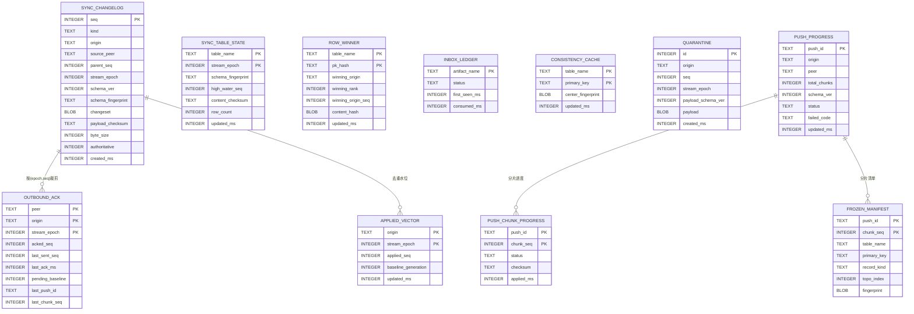

关键索引与规则：

- `sync_changelog`：索引 `(origin, seq)`、`(stream_epoch, seq)`；防回声/审计/2Mbps 体积测试依赖 `kind/authoritative/source_peer/byte_size`。
- **epoch 规则（F-13）**：应用前比对 `stream_epoch`；**低于当前 epoch 的载荷直接隔离/丢弃且不推进 `applied_vector`**。
- **applied_vector 严格连续应用（G-05）**：`applied_seq` 是单调高水位，**仅当 `seq == applied_seq+1` 才应用**；`seq <= applied_seq` → 幂等 no-op；`seq > applied_seq+1` → **缺口**：入 pending 缓冲等待补齐，持续缺口触发 `E_SYNC_GAP` → 回退基线（FR-8）。**杜绝乱序到达下"seq2 先到推高水位、seq1 后到被误判已见"的丢更**。此规则**只管 changeset 流**。
- **selectionpush 分片幂等独立（G-05）**：上行选择推送分片**不靠 changeset 单高水位去重**（一发多片可能共享 origin_seq，会让首片推高水位后续片被误判已见 no-op）；其幂等键为 **`(origin, stream_epoch, push_id, chunk_seq)`**，由 `push_chunk_progress` 承载。两套幂等机制分账，互不干扰。
- `outbound_ack`（D-09）：`last_ack_ms` 支撑 FR-10 时长阈值；`pending_baseline`/`last_push_id`/`last_chunk_seq` 支撑坍缩与多片 ACK；截断水位 = `min(活跃 peer 的 acked_seq)`，死对端退出计算。
- `push_chunk_progress`（D-10）：中心按 `chunk_seq` 顺序应用；幂等键 `(push_id, chunk_seq)`（G-05），重复 chunk **checksum 相同 = no-op**，不同 = `E_SYNC_PAYLOAD_CORRUPT`；`E_SYNC_PUSH_SCHEMA_MOVED` 时 `push_progress.status=failed`。`applied_chunks` 计数不可靠，以本表逐片 `status` 为准。
- `sync_table_state`：由 apply/import/save 路径**增量维护**，场景2 表级差异零全量扫描（F-17，算法见 §6.2）。

> 上方 ER 为概念示意；**键/索引/外键以 §6.1 可执行 DDL 为权威**（E-04）。

### 6.1 可执行 DDL（关键键与索引，E-04）

```sql
-- 变更日志：本地单调 local_seq 为 PK；溯源唯一键 (origin, stream_epoch, origin_seq)
CREATE TABLE __sync_changelog (
  local_seq INTEGER PRIMARY KEY AUTOINCREMENT,
  kind TEXT NOT NULL,                 -- 'changeset' | 'selectionpush'
  origin TEXT NOT NULL, source_peer TEXT,
  origin_seq INTEGER NOT NULL, parent_seq INTEGER,
  stream_epoch INTEGER NOT NULL, schema_ver INTEGER NOT NULL,
  schema_fingerprint TEXT NOT NULL, changeset BLOB NOT NULL,
  payload_checksum TEXT NOT NULL, byte_size INTEGER NOT NULL,
  authoritative INTEGER NOT NULL DEFAULT 0, created_ms INTEGER NOT NULL,
  UNIQUE(origin, stream_epoch, origin_seq)
);
CREATE INDEX idx_changelog_origin ON __sync_changelog(origin, origin_seq);
CREATE INDEX idx_changelog_epoch  ON __sync_changelog(stream_epoch, local_seq);

-- 接收端幂等高水位（PK = origin+epoch）
CREATE TABLE __sync_applied_vector (
  origin TEXT NOT NULL, stream_epoch INTEGER NOT NULL,
  applied_seq INTEGER NOT NULL, baseline_generation INTEGER NOT NULL DEFAULT 0,
  updated_ms INTEGER NOT NULL, PRIMARY KEY(origin, stream_epoch)
);

-- 发送端 ACK 水位（PK = peer+origin+epoch）
CREATE TABLE __sync_outbound_ack (
  peer TEXT NOT NULL, origin TEXT NOT NULL, stream_epoch INTEGER NOT NULL,
  acked_seq INTEGER NOT NULL DEFAULT -1, last_sent_seq INTEGER NOT NULL DEFAULT -1,
  last_ack_ms INTEGER, pending_baseline INTEGER NOT NULL DEFAULT 0,
  last_push_id TEXT, last_chunk_seq INTEGER,
  PRIMARY KEY(peer, origin, stream_epoch)
);

-- 每表同步状态（增量维护，零全量扫描）
CREATE TABLE __sync_table_state (
  table_name TEXT NOT NULL, stream_epoch INTEGER NOT NULL,
  schema_fingerprint TEXT NOT NULL,
  high_water_seq INTEGER NOT NULL DEFAULT 0,  -- 仅本地信息量，跨节点不可比，不参与判等（G-06，见 §6.2）
  content_checksum TEXT NOT NULL,    -- 顺序无关聚合，判等权威依据，见 §6.2
  row_count INTEGER NOT NULL DEFAULT 0, updated_ms INTEGER NOT NULL,
  PRIMARY KEY(table_name, stream_epoch)
);

-- 逐行胜者（G-01：仅 changeset 自动路径维护；保证多源仲裁到达序无关）
-- pk_hash = 主键规范编码的强哈希；(winning_rank, winning_origin_seq) 为该行当前规范序极大元
CREATE TABLE __sync_row_winner (
  table_name TEXT NOT NULL, pk_hash TEXT NOT NULL,
  winning_origin TEXT NOT NULL,
  winning_rank INTEGER NOT NULL,
  winning_origin_seq INTEGER NOT NULL,
  content_hash BLOB NOT NULL, updated_ms INTEGER NOT NULL,
  PRIMARY KEY(table_name, pk_hash)
);

CREATE TABLE __sync_consistency_cache (
  table_name TEXT NOT NULL, primary_key TEXT NOT NULL,
  center_fingerprint BLOB NOT NULL, updated_ms INTEGER NOT NULL,
  PRIMARY KEY(table_name, primary_key)
);

CREATE TABLE __sync_quarantine (
  id INTEGER PRIMARY KEY AUTOINCREMENT, origin TEXT NOT NULL,
  origin_seq INTEGER NOT NULL, stream_epoch INTEGER NOT NULL,
  payload_schema_ver INTEGER NOT NULL, payload BLOB NOT NULL, created_ms INTEGER NOT NULL
);

-- inbox 消费台账（G-08：制品级幂等消费，防 watcher 重复事件/第三方重投）
CREATE TABLE __sync_inbox_ledger (
  artifact_name TEXT PRIMARY KEY,
  status TEXT NOT NULL,              -- 'seen' | 'consumed' | 'corrupt'
  first_seen_ms INTEGER NOT NULL, consumed_ms INTEGER
);

CREATE TABLE __sync_push_progress (
  push_id TEXT PRIMARY KEY, origin TEXT NOT NULL, peer TEXT NOT NULL,
  total_chunks INTEGER NOT NULL, schema_ver INTEGER NOT NULL,
  status TEXT NOT NULL,              -- 'streaming' | 'done' | 'failed'
  failed_code TEXT, updated_ms INTEGER NOT NULL
);

-- 分片进度：PK = push_id+chunk_seq
CREATE TABLE __sync_push_chunk_progress (
  push_id TEXT NOT NULL, chunk_seq INTEGER NOT NULL,
  status TEXT NOT NULL,              -- 'pending' | 'applied'
  checksum TEXT NOT NULL, applied_ms INTEGER,
  PRIMARY KEY(push_id, chunk_seq),
  FOREIGN KEY(push_id) REFERENCES __sync_push_progress(push_id)
);

-- 冻结清单：PK 必含 table_name+pk_hash（否则每片只能存一行！E-04）
CREATE TABLE __sync_frozen_manifest (
  push_id TEXT NOT NULL, chunk_seq INTEGER NOT NULL,
  table_name TEXT NOT NULL, pk_hash TEXT NOT NULL, primary_key TEXT NOT NULL,
  record_kind TEXT NOT NULL,        -- 'selected' | 'dependency'
  topo_index INTEGER NOT NULL, fingerprint BLOB NOT NULL,
  PRIMARY KEY(push_id, chunk_seq, table_name, pk_hash),
  FOREIGN KEY(push_id) REFERENCES __sync_push_progress(push_id)
);
```

### 6.2 `sync_table_state` 增量维护算法（E-09，禁全表扫描）

`content_checksum` 取**顺序无关聚合**——所有行哈希的**模加**（优于 XOR：避免同哈希偶数次出现自相抵消）。每次写从 changeset 的 before/after 像（或 `RowMutation`）增量更新，**不重扫全表**：

| 行变更 | content_checksum（模加） | row_count |
|---|---|---|
| INSERT(new) | `+= H(new)` | `+1` |
| DELETE(old) | `-= H(old)` | `-1` |
| UPDATE(old→new) | `+= H(new) - H(old)` | 不变 |

`H(row)` 为按列序的规范编码强哈希（与 §5/C11 指纹同族）。**仅 re-baseline 允许一次全表扫描**重置聚合值；常规路径恒为 O(变更行数)。

**表级 Identical 判等以校验和为准（G-06，修正 FR-12 措辞）**：判等 = 比对双方 **`schema_fingerprint` + `row_count` + `content_checksum` 三者全等**；**`high_water_seq` 不参与判等**。原因：`high_water_seq` 是"已应用的最大 `origin_seq`"，而**不同 origin 的 seq 空间相互独立、本地 import/save 又无远端 origin_seq**——两节点即便内容完全一致（校验和相等），其 high_water 也可能不同（应用历史不同）；用它判等会造成**假红（内容同但水位不同）/假绿**。故 `high_water_seq` 仅作**本地信息量/审计**（如"本表自某点是否有新应用"），跨节点比较一律以内容派生的 `content_checksum`（+ `row_count` 防平凡抵消 + `schema_fingerprint` 防结构差异）为权威。零全量拉取不变（FR-12/F-17）。

> 注：需求 §4.12 原文"指纹/高水位完全匹配"中的"高水位"在本设计降级为信息量、不作判等门，属设计侧对 FR-12 的技术性修正；建议需求文档后续同步该措辞。

> 阶段 1 即落上述表的**最小列与状态字段**（D-28），策略（基线/逐出/隔离重放）阶段 5 补，但不推迟持久化基础。

---

## 7. 关键流程

### 7.1 双状态机（D-06）

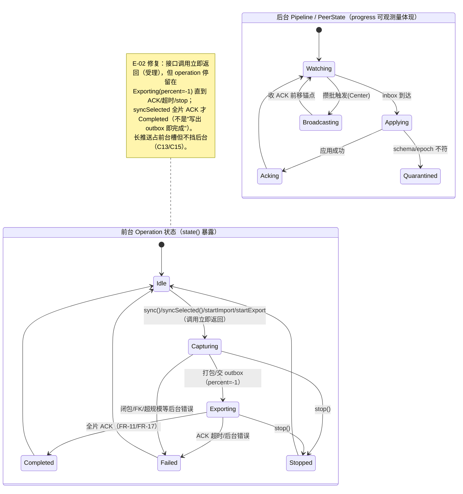
`stop()` 只作用于 FG；BG 持续运行（除非 `shutdown`，本期不暴露）。后台失败/隔离经 `errors()`/`progress()` 可观测，不污染前台终态。

### 7.2 一轮自动增量同步（D-20 修正）

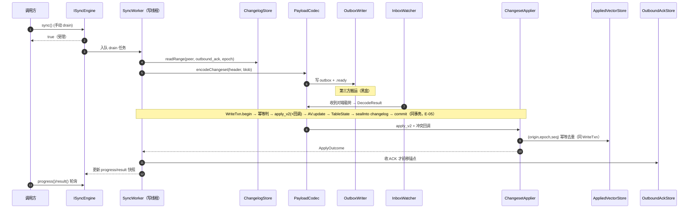

### 7.3 上行人工选择性推送（D-05 修正：必经传输）

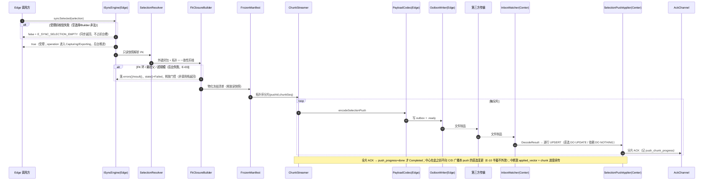

### 7.4 下行自动广播 + rebase + 防回声（C14/F-04/D-13）

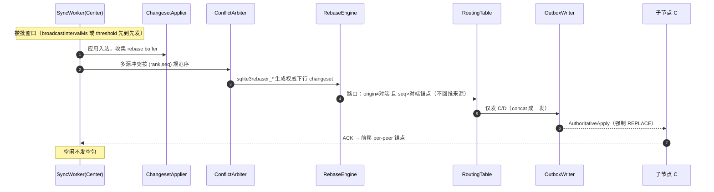

### 7.5 批量导入（非阻塞 + 轮询，写线程执行）

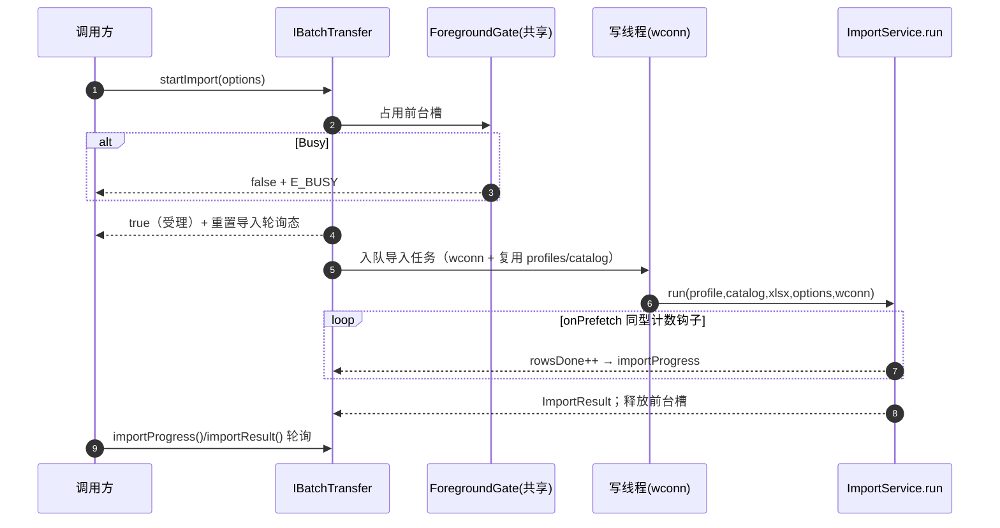

### 7.6 场景2 比对/合并（D-16 修正：表级暂停闸）

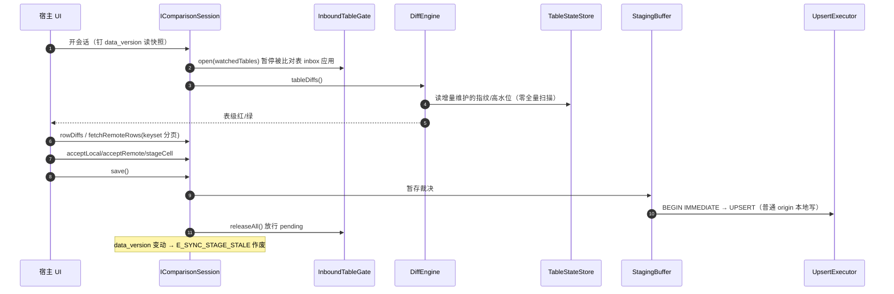

---

## 8. 并发模型与线程（落实 §2.4 / D-01）

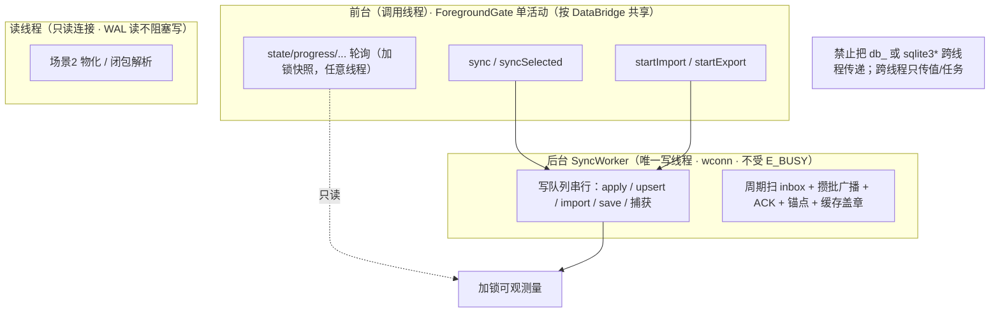

---

## 9. DRY 复用映射

| 新组件 | 复用件 | 方式 |
|---|---|---|
| `UpsertExecutor` | `SqlBuilder::buildUpsert` + ImportService 写循环 | 提取，import/场景2/上行三路共用 |
| `FkClosureBuilder` | `SchemaIntrospector`/`FkInfo`、`TopoSorter`、`FkInjector` | Fk 图 + 拓扑 + 注入父键 |
| `BatchTransfer` | `DataBridge`（profiles/catalog）+ `ImportService/ExportService.run` | 组合 + 写线程 wconn + 轮询 |
| `DiffEngine`/`StagingBuffer` | `SchemaIntrospector`、`TableStateStore`、`UpsertExecutor` | 内省取键 + 指纹比对 + save 走 UPSERT |
| 进度 | `ImportService::onPrefetch` 同型钩子 | 注入计数 lambda |
| 错误归集 | `ErrorCollector` | 累积 RowError/SyncError |

---

## 10. 可扩展性（OCP/DIP 扩展点）

| 扩展点 | 抽象 | 现期 | 未来 |
|---|---|---|---|
| 传输 | `TransportAdapter` | 文件制品 + watcher | MQ/对象存储 |
| 冲突 | `ConflictPolicy` + 回调 | SourceWins + rank | 插件裁决 |
| 选择 | `SelectionResolver` | 主键集合（addWhere 受限） | 受限 DSL（§13 待定） |
| 拓扑 | `RoutingTable` | 单域星型 | 多域跨桥（预留） |
| 一致性 | `ConsistencyCache` | 本地指纹缓存 | 清单握手 |
| 通知 | 纯轮询 | getter 快照 | 回调/信号（YAGNI 延后） |

---

## 11. 循序最小可落地（D-28 调整）


| 阶段 | 目标 | 关键交付 |
|---|---|---|
| **0** | Session + 句柄穿透 + apply_v2 + rebaser + 目录契约**硬验收**（§13.1）；**不过不进** | `SqliteHandle`、最小验证程序、SQLite 构建方案落定 |
| **1** | 两节点双向最小增量；**线程/连接模型 + 全部 `__sync_*` 表最小列 + epoch/quarantine/ack 持久化基础** | `SyncWorker`/`WriteTxn`、`SessionRecorder`、`ChangelogStore`、`PayloadCodec`、`Outbox/Inbox/Ack`、`ChangesetApplier`、`AppliedVectorStore`、`OutboundAckStore`、`ISyncEngine` 8 接口骨架 |
| **2** | 星型广播 + 防回声 + 上行选择性推送 | `RoutingTable`、`ConflictArbiter`、`RebaseEngine`、`SelectionResolver`、`FkClosureBuilder`、`ConsistencyCache`、`FrozenManifest`、`ChunkStreamer`、`SelectionPushApplier`、`syncSelected` |
| **3** | 精简导入导出门面 | `UpsertExecutor`（提取）、`BatchTransfer` + `createBatchTransfer`、`ForegroundGate` |
| **4** | 场景2 对比/合并 | `DiffEngine`、`TableStateStore`、`InboundTableGate`、`StagingBuffer`、`IComparisonSession` |
| **5** | 加固 | `BaselineManager`、`SchemaGuard`/`QuarantineStore` 策略、`DeadPeerEvictor`、故障注入、2Mbps 实测 |

---

## 12. 目录结构与文件布局（新增）

```
include/dbridge/
  IBatchTransfer.h
  sync/{SyncTypes.h, SyncConfig.h, SyncSelection.h, ISyncEngine.h, IComparisonSession.h}
  Errors.h                       # 追加 §4.6 全部码
src/
  batch/BatchTransfer.{h,cpp}
  sync/
    SyncEngine.{h,cpp}  SyncWorker.{h,cpp}  ForegroundGate.h  WriteTxn.{h,cpp}
    state/{ForegroundStateMachine.{h,cpp}, BackgroundPipeline.{h,cpp}}
    capture/{SqliteHandle.h, SessionRecorder.{h,cpp}, ChangelogStore.{h,cpp}}
    payload/PayloadCodec.{h,cpp}
    transport/{OutboxWriter.{h,cpp}, InboxWatcher.{h,cpp}, AckChannel.{h,cpp}}
    apply/{ChangesetApplier.{h,cpp}, SelectionPushApplier.{h,cpp},
           UpsertExecutor.{h,cpp}, AppliedVectorStore.{h,cpp}}
    conflict/{ConflictArbiter.{h,cpp}, RebaseEngine.{h,cpp}, RoutingTable.{h,cpp}}
    anchor/OutboundAckStore.{h,cpp}
    baseline/BaselineManager.{h,cpp}
    schema/{SchemaGuard.{h,cpp}, QuarantineStore.{h,cpp}, TableStateStore.{h,cpp}}
    peer/DeadPeerEvictor.{h,cpp}
    selection/{SelectionResolver.{h,cpp}, FkClosureBuilder.{h,cpp},
               ConsistencyCache.{h,cpp}, FrozenManifest.{h,cpp}, ChunkStreamer.{h,cpp}}
    diff/{DiffEngine.{h,cpp}, InboundTableGate.{h,cpp}, StagingBuffer.{h,cpp},
          ComparisonSession.{h,cpp}}
```
`UpsertExecutor` 提取后 `ImportService` 改为调用它（重构 + 回归测试守护）。同步模块需 `-DSQLITE_ENABLE_SESSION -DSQLITE_ENABLE_PREUPDATE_HOOK`（§13.1）。

---

## 13. 关键风险与权衡

### 13.1 【最高】阶段 0 硬验收：SQLite Session 构建 + 句柄穿透（D-03/D-13/D-17）

仅把 amalgamation 放入 `3rdparty/` **不会**让 Qt 5.12 的 QSQLITE 插件使用它。方案与**硬验收清单**（任一不过 → 阶段 0 失败、**停止实施**，无运行时降级）：

1. 构建：以 `-DSQLITE_ENABLE_SESSION -DSQLITE_ENABLE_PREUPDATE_HOOK` 编译 SQLite amalgamation，并**重编 QSQLITE 驱动插件**链接到它（或静态链接、消除符号冲突）。
2. 运行期打印 `sqlite3_libversion()`、`PRAGMA compile_options` 须含 `ENABLE_SESSION`/`ENABLE_PREUPDATE_HOOK`。
3. 从**同一 `QSqlDatabase`** 取出的 `sqlite3*` 可成功调用 `sqlite3session_create/attach/changeset`。
4. `sqlite3changeset_apply_v2` + **rebaser 链路**（apply_v2 收集 rebase buffer → `sqlite3rebaser_*`）在 Qt 连接内、对两路冲突输入、反序到达跑通且收敛。
5. 若 Qt 插件实际未链接同一 SQLite（句柄不可用或 Session 符号缺失）→ 失败。

### 13.2 其它

| 风险 | 对策 |
|---|---|
| `UpsertExecutor` 提取回归 | 先补 `ImportService` 回归测试（现有 tests/），先红后绿 |
| 2Mbps | changeset 压缩 + 一致性剪枝 + 攒批合并 + 分片续传 |
| 大闭包/长推送 | 冻结清单（护 WAL）+ `E_SYNC_SELECTION_TOO_LARGE` + 分片可续 |
| FK 环 | `E_SYNC_FK_CYCLE_UNSUPPORTED`（本期仅无环） |
| WHERE 注入 | 受限 DSL + 参数绑定；MVP 仅 PK 集合（§4.4） |
| 量化阈值 | 随需求 §13 R5 设计阶段定值 |

---

## 14. 需求 → 设计逐条追溯（D-26）

### 14.1 FR 追溯

| FR | 设计落点（章节 / 组件 / 接口） | 测试断言 |
|---|---|---|
| FR-1 捕获/changelog | §5.2 SessionRecorder.sealInto（同事务）；§6 SYNC_CHANGELOG | 崩溃后无"已提交未捕获" |
| FR-2 同步表/外部写 | §2.4 SqliteHandle；§4.4/§5.1 eligibility 校验（G-04）；TableStateStore；`data_version` | 外部写 → W_SYNC_UNTRACKED_CHANGE；无 PK/视图表 → E_SYNC_UNSUPPORTED_SCHEMA |
| FR-3 载荷 | §5.3 PayloadCodec（二分） | 缺头字段 → E_SYNC_PAYLOAD_CORRUPT |
| FR-4 传输/ACK | §3 TransportAdapter；§4.6 E_SYNC_TRANSPORT；ackMaxDelayMs | ACK 最迟发送 |
| FR-5 应用/冲突 | §5.4 ChangesetApplier（native）；E_SYNC_APPLY_FK/CONSTRAINT | 冲突映射正确 |
| FR-6 多源仲裁 | §5.6 ConflictArbiter（rank,seq）+ `__sync_row_winner` 逐行胜者（G-01） | 两序终态一致；**含"低 rank 后到/跨批"用例**仍收敛高 rank 终态 |
| FR-7 schema 隔离 | §5/§6 SchemaGuard/QuarantineStore | 版本不符 → 隔离重放 |
| FR-8 基线/增量 | §5.10 BaselineManager；epoch | 缺口 → 基线 |
| FR-9 广播/rebase | §5.6 RebaseEngine；§7.4 | 静默后无新载荷 |
| FR-10 死对端 | §3.2 DeadPeerEvictor；OUTBOUND_ACK.last_ack_ms | 超阈逐出 + 截断恢复 |
| FR-11 状态机 | §7.1 双状态机 | Exporting percent=-1 |
| FR-12/13/14 场景2 | §5.8 InboundTableGate；DiffEngine；§7.6 | 零全量拉取 + STAGE_STALE |
| FR-15 批量门面 | §4.3 IBatchTransfer | E_BUSY 互斥 |
| FR-16/17 触发/上行 | §4.2⑨ + §5.4/5.5 + §7.3 | 闭包完整 + 剪枝 |
| FR-17 `addWhere`（部分，E-13） | §4.4 受限 DSL；**MVP 仅 PK 集合**，`addWhere` 为开放项后置 | build 拒原始 SQL；不声称完整实现 |

### 14.2 共识 C1~C17 追溯（要点）

| C | 落点 | C | 落点 |
|---|---|---|---|
| C1 | §5.2 | C10 | §5.5 ConsistencyCache（仅权威喂养） |
| C2 | §5.6/§7.4 | C11 | §5.5 本地自比指纹 |
| C3 | §5 BaselineManager | C12 | §5.4 逐行 DO UPDATE/DO NOTHING |
| C4 | §5 SchemaGuard | C13 | §5.5 ChunkStreamer + §6 push_chunk_progress |
| C5 | §7.6 save 普通本地写 | C14 | §7.4 攒批 |
| C6 | §5.7 OutboundAck + AppliedVector | C15 | §2.4/§8 单写线程 + 前台门控 |
| C7 | §5.6 ConflictArbiter | C16 | §5.5 FrozenManifest（护 WAL） |
| C8 | DeadPeerEvictor | C17 | SchemaGuard + §5.10 ConsistencyCache.invalidateTable |
| C9 | §5.9 ForegroundGate | | |

### 14.3 Codex 整改 F-01~F-20 追溯（含本版新整改 D-xx）

| F | 落点 | F | 落点 |
|---|---|---|---|
| F-01 同事务收割 | §5.2（D-02 强化） | F-11 合并裁决接口 | §4.5 IComparisonSession |
| F-02 载荷二分 | §5.3/§5.4（D-04 强化） | F-12 有界远端取行 | §4.5 fetchRemoteRows |
| F-03 场景2 远端 | §7.6 + fetchRemoteRows | F-13 坍缩 epoch | §6 stream_epoch（D-08/09） |
| F-04 权威下行 | §5.6 AuthoritativeApply | F-14 ACK 最迟 | §4.6/§6 ackMaxDelayMs/last_ack_ms |
| F-05 位点分层 | §5.7（D-19 强化） | F-15 错误码触发点 | §4.6 + §14.1 |
| F-06 重试分层 | §2.4/§4.6（职责分层） | F-16 去解密 | §5.4（changeset 仅校验+解压） |
| F-07 删除连带 | §5.5/§7.3 整发失败 | F-17 校验和元数据 | §6 SYNC_TABLE_STATE（D-11） |
| F-08 FK 环 | §5.5 E_SYNC_FK_CYCLE_UNSUPPORTED | F-18 措辞 | §14（本逐条表） |
| F-09 阈值补齐 | §4.4 Builder 字段 | F-19 术语 | 需求 §2（设计沿用） |
| F-10 syncSelected 入接口 | §4.2 ⑨ | F-20 接口"8+3" | §4.3 |

### 14.4 NFR 追溯（G-10）

| NFR | 设计落点（章节 / 组件） | 测试断言 / 边界 |
|---|---|---|
| NFR-1 架构最佳实践（DIP/纯抽象+工厂+PImpl、E_BUSY 单活动） | §4.2/§4.3 纯抽象+`createXxx`；§3.2 SRP 表；§5.9 ForegroundGate | 公开面仅抽象+工厂可编译替换；前台重入 → `E_BUSY` |
| NFR-2 KISS/YAGNI（文件制品、不引 MQ/共识/CRDT、扩展点仅预留） | §0 非范围；§5.11 文件传输；§10 扩展点仅接口 | 无 MQ/共识依赖；扩展点无落地实现 |
| NFR-3 DRY/SOLID（落库收敛单通道、策略点可注入） | §5.4 `UpsertExecutor` 三路共用；§9 复用映射；策略点 ConflictPolicy/TransportAdapter | 四写路径共用 `UpsertExecutor`/`CapturedWriteTemplate`；新增策略不改调用方 |
| NFR-4 编码硬约束（函数≤150 行/参数≤7/Builder/clang-format） | §1 函数拆分约束（D-27）；§4.4 Builder | 超长流程按 §1 表拆分；多参走 Builder；pre-commit 校验 |
| NFR-5 性能与低带宽（载荷字节体积，不承诺在途时延） | §5.3 压缩；§5.5 剪枝/分片；§7.4 攒批；§6.2 表级零拉取 | `bytesPacked`/`bytesApplied` ≤ 预算（§14 测试映射"载荷字节预算"）；**不承诺黑盒在途时延** |
| NFR-6 并发与线程模型（QSqlDatabase/sqlite3* 不跨线程、单写者、getter 线程安全） | §2.4/§8 单写线程 + wconn 独占；§4.3 `SyncContext` 键加固（G-07）；getter 加锁快照 | 跨线程仅传值；单写者无写写并发；OS 文件标识唯一键 |
| NFR-7 可观测与可审计（结构化日志、`W_SYNC_CONFLICT_REPLACED` 留痕、限定可观测量） | §4.2 logs/errors/progress；§4.6 警告码；§5.11 ACK | 每条日志含 时间/阶段/源/目标/条数/冲突处置；REPLACE 留痕 |
| NFR-8 可靠性与隔离（应用全程事务、场景2 内存隔离、哨兵、apply 三件套同事务） | §5.2/§5.4 `CapturedWriteTemplate` 同事务；§5.8 场景2 暂存；§5.11 哨兵 | FK/约束破裂整事务回滚；save 前 `.db` 写=0；崩溃零窗口 |
| NFR-9 可扩展性（多域路由/CDC 后端/传输适配预留，不阻断后续） | §10 扩展点表；`RoutingTable`/`TransportAdapter`/CDC 抽象 | 扩展点以接口定义；新增后端不改既有调用方 |

> 本设计文档 v0.5 在 v0.4（D-01~D-28 + E-01~E-15 + plan Q-01/Q-04/Q-08）基础上，逐条整改第三轮 Codex 设计评审 **G-01~G-10**：逐行胜者 `__sync_row_winner` 保证多源仲裁到达序无关（G-01/§5.6/§6.1）、长推送撞迁移半截语义与排空/再基线收口对齐（G-02/§5.5）、`CapturedWriteTemplate` 按载荷分支并澄清 origin 仅元数据/rebaser 仅 apply_v2（G-03/§5.4/§5.6）、同步表 eligibility（G-04/§4.4，新增 `E_SYNC_UNSUPPORTED_SCHEMA`）、严格连续应用 + 分片幂等分离（G-05/§5.4/§6）、表级判等以校验和为准（G-06/§6.2）、`SyncContext` 键加固（G-07/§4.3）、`TransportAdapter` 子设计（G-08/§5.11）、失败分支错误码补齐（G-09/§4.6）、NFR 追溯（G-10/本节）；与需求 v0.4 一致（§4.12"高水位"与 FR-12 措辞修正、eligibility 校验建议回填需求）。实现以阶段 0 硬验收为先决条件，若阶段 0 调整 SQLite 构建路径，§2.4 / §5.1 / §13.1 需同步修订。
