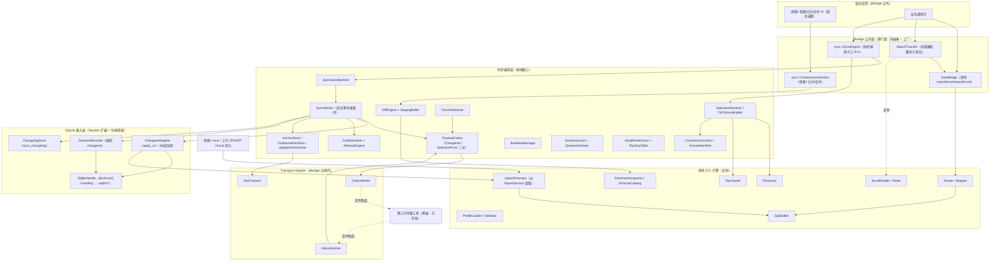
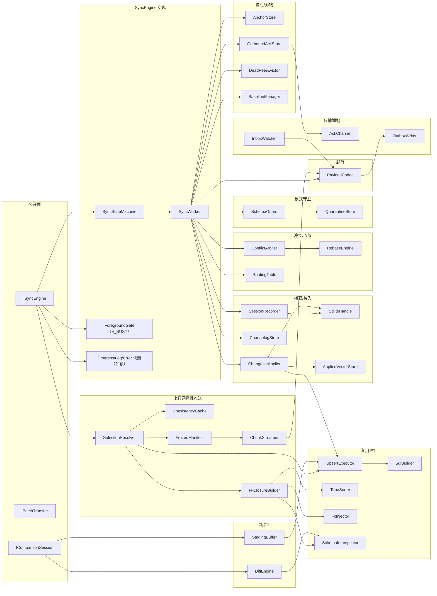
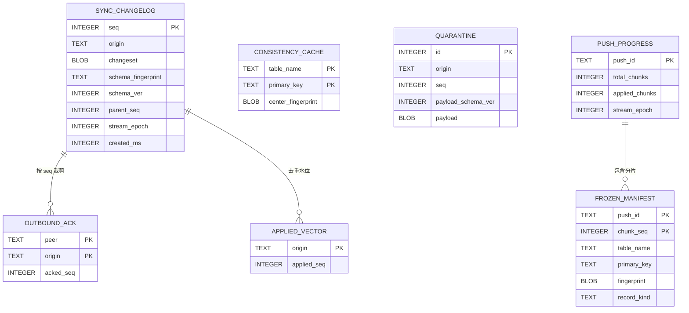
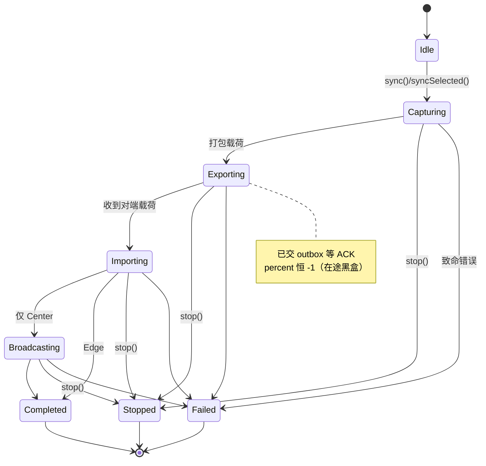
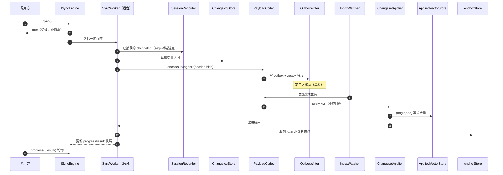
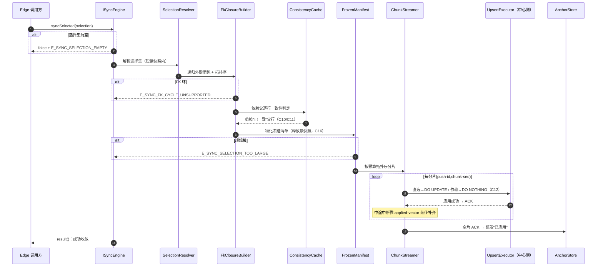
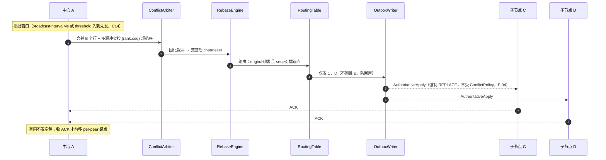
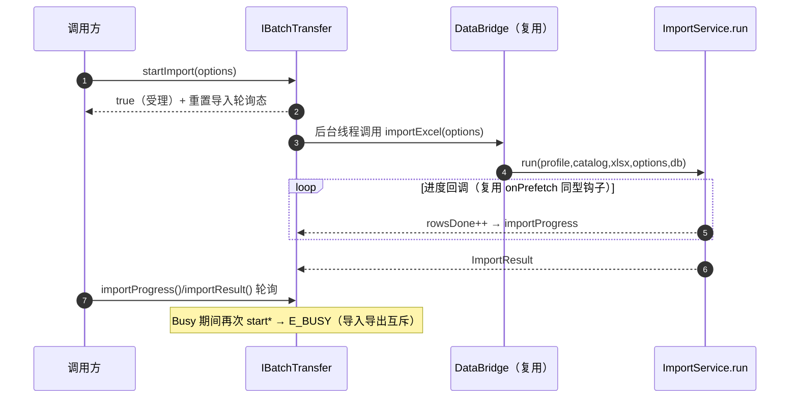
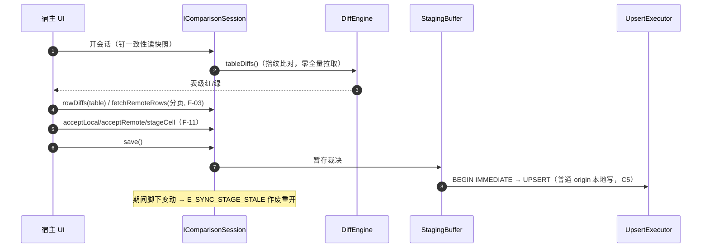
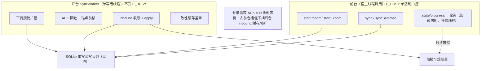

# SQLite 同步工具设计文档

> 版本：v0.1（草案）
> 日期：2026-06-24
> 对应需求：`specs/SQLite-同步工具-需求文档.md` v0.4（FR-1~FR-17、共识 C1~C17、Codex 整改 F-01~F-20）
> 定位：本文是需求文档的**实现侧设计**——在**现有 dbridge 库**之上做增量集成，不重写既有 ETL 通道。所列接口为可落地契约，C++ 类与文件布局为实现蓝图。

---

## 0. 文档目的与范围

| 项 | 说明 |
|---|---|
| 目的 | 把需求文档的 FR/共识落成**可编码的模块、接口、数据模型与流程**；明确"复用什么、新增什么、怎么分层、怎么并发"。 |
| 范围 | 同步引擎（星型增量 + 上行选择性推送 + 下行自动广播）、场景 2 比对/合并、精简批量导入导出门面。 |
| 非范围 | DDL/Schema 传播、CRDT、分布式共识、第三方传输工具本身、宿主 GUI（沿用需求 §1.3 非目标）。 |
| 读者 | 实现工程师、评审者；阅读前置为需求文档 v0.4。 |

### 0.1 现状基线（来自代码库探查）

| 现状事实 | 对设计的影响 |
|---|---|
| `DataBridge` 为 PImpl（`std::unique_ptr<detail::DataBridgePrivate> d_`） | 新门面以**组合**方式复用 `DataBridge`，不改其公开签名 |
| `DataBridgePrivate` 持 `QSqlDatabase db_`（UUID 连接名）、`SchemaCatalog catalog_`、`QHash<QString,ProfileSpec> profiles_`、无状态 `ImportService/ExportService/AutoProfileBuilder` | 同步引擎复用同一连接与 catalog；服务无状态便于复用 |
| 真正的 UPSERT 落库循环**埋在** `ImportService.cpp:683-731`（`SqlBuilder::buildUpsert` → prepared → exec → commit/rollback） | **需提取独立 `UpsertExecutor`**，作为 DRY 写库收敛点 |
| `SchemaIntrospector` 已用 `PRAGMA foreign_key_list` 解析外键（`FkInfo{refTable,fromColumn,toColumn}`） | 外键依赖闭包/拓扑序**直接复用** |
| `TopoSorter::sort` 针对 `RouteSpec`（Kahn 算法） | 行级/表级闭包拓扑需**新增一个面向表图的变体**，算法复用 |
| `dbridge::err` 为 `inline constexpr const char*` 字符串常量 | `E_SYNC_*` 沿用同一风格 |
| **全库无 `sqlite3*` 句柄穿透；系统 Qt QSQLITE 未启用 `SQLITE_ENABLE_SESSION`/`PREUPDATE_HOOK`** | **最高优先级可行性闸门**：必须先解决 SQLite 构建与句柄穿透（见 §13.1、阶段 0） |
| Qt 5.12 / C++17 / 静态库 `libdbridge`，3rdparty 仅 QXlsx | 同步模块以同标准编入同一静态库 |

---

## 1. 设计目标与约束

| 约束 | 设计落实 |
|---|---|
| **KISS** | 公开面只暴露纯抽象接口 + 工厂；编排细节藏在实现层；纯轮询、无回调（本期）。 |
| **DRY** | 写库收敛到 `UpsertExecutor`；外键/拓扑/schema 复用既有件；上行/下行/场景2 复用同一传输底座与事务通道。 |
| **YAGNI** | 多域跨桥、CRDT、加密、回调通知均不实现，仅留扩展位。 |
| **SOLID** | SRP=每模块一职责（§3 职责表）；OCP/DIP=纯抽象接口 + 工厂 + 策略点（ConflictPolicy/TransportAdapter）；ISP=8+8 精简接口不臃肿。 |
| **函数 ≤150 行** | 大流程（apply/选择性推送）拆分为分阶段小函数（§5、§7 流程对应可拆点）。 |
| **参数 ≤7** | 多参装配统一走 **Builder**（`SyncConfig::Builder` / `SyncSelection::Builder`），接口方法参数恒 ≤3。 |
| **Builder 模式** | 所有"装配类"配置经内部 Builder 链式构造，接口不暴露实现依赖。 |
| **单一职责 / 无重复代码** | §3.2 每模块"不做的事"明确边界；四处写库不重复实现。 |
| **循序最小可落地** | §11 分阶段：阶段 0 可行性闸门 → 两节点最小同步 → 星型 → 门面 → 场景2 → 加固。 |

---

## 2. 设计总览

### 2.1 在现有库上的增量定位

一句话：**保留并复用现有 ETL（Profile→映射→校验→Upsert），在其旁新增"同步编排层 + SQLite 接入层 + 传输适配层"与三个公开门面（ISyncEngine / IBatchTransfer / IComparisonSession），写库统一收敛回 ETL 的事务通道。**

### 2.2 总体分层架构



**分层原则**：公开面薄（只契约不实现）、编排层厚（同步语义集中）、接入层窄（只做句柄穿透与原生 Session API）、传输层在边界外黑盒。横切关注点（Logger / Errors / Config Builder）贯穿各层。

### 2.3 关键设计决策

| 决策 | 选型 | 理由 / 对应原则 |
|---|---|---|
| 公开面形态 | 纯抽象类 + `createXxx()` 工厂 | DIP：调用方不依赖实现；可替换、可测（OCP/DIP） |
| 配置装配 | Builder 链式 | 参数 ≤7、可读、可演进（KISS） |
| 写库收敛 | 提取 `UpsertExecutor`，import/场景2 save/上行 UPSERT 三路共用 | DRY、SRP |
| 变更捕获 | 短命 session + 提交前同 事务写 changelog | 崩溃零窗口（F-01）；原生增量 |
| 下行 vs 上行 | 下行 = 原生 changeset apply；上行 = `SelectionPushPayload` + UPSERT | 载荷二分（F-02），语义清晰 |
| 并发 | 前台 `E_BUSY` 单活动 + 后台单写者 worker | C15：中心常驻多职不被门面锁死 |
| 冲突 | 自动路径走 origin 优先级规范序；上行人工走"直选 DO UPDATE / 依赖 DO NOTHING" | C7/C12，去 per-row 赢家记忆 |
| 句柄穿透 | `QSqlDriver::handle()` 强转 `sqlite3*`，封进 `SqliteHandle` | 唯一与 Qt 耦合点，集中可控（SRP） |

---

## 3. 模块分解与职责

### 3.1 组件依赖图



### 3.2 模块职责表（SRP：每模块"做什么 / 不做什么"）

| 模块 | 做 | 不做 |
|---|---|---|
| **ISyncEngine 实现（SyncEngine）** | 装配各组件、暴露 8+1 接口、维护前台门控与可观测快照 | 不直接操作 `sqlite3*`、不实现状态流转细节 |
| **SyncStateMachine** | 驱动 `Idle→Capturing→Exporting→Importing→Broadcasting→终态`，保证幂等与不可逆 | 不做 I/O、不仲裁 |
| **SyncWorker** | 后台单写者循环：串行执行 capture/apply/broadcast/ack | 不做前台门控、不渲染 |
| **ForegroundGate** | 前台单活动闸门，重入返回 `E_BUSY` | 不拦截后台管线 |
| **SqliteHandle** | `db.driver()->handle()` 取 `sqlite3*`，集中托管原生句柄 | 不录制、不应用（只提供句柄） |
| **SessionRecorder** | 绑定 `sqlite3*` 录制短命 session changeset | 不决定起止时机（状态机驱动）、不解析冲突 |
| **ChangelogStore** | 持久化 `sync_changelog`（seq/origin/指纹/版本/父引用）| 不仲裁、不传输 |
| **PayloadCodec** | 序列化/反序列化两类载荷、压缩、校验、版本 | 不决定发给谁、不落库 |
| **ChangesetApplier** | 在同一 `sqlite3*` 上 `apply_v2` + 冲突回调；幂等 | 不仲裁来源、不传输 |
| **UpsertExecutor**（提取） | 统一 UPSERT 落库（`DO UPDATE`/`DO NOTHING`）+ 事务边界 | 不解析 Profile、不读 Excel |
| **AppliedVectorStore** | 按 `(origin,seq)` 幂等去重 | 不发 ACK |
| **AnchorStore / OutboundAckStore** | 接收端/发送端位点分层（F-05）| 不混用彼此状态 |
| **ConflictArbiter** | 按 `(origin 优先级, seq)` 规范序仲裁（C7）| 不广播、不固化序 |
| **RebaseEngine** | rebaser 固化裁决、重写权威序广播 | 不做首次冲突判定 |
| **RoutingTable** | 对端拓扑/origin 优先级/防回声路由 | 不仲裁内容 |
| **BaselineManager** | 冷启动/缺口/迁移后构建基线快照 | 不做增量 |
| **SchemaGuard / QuarantineStore** | 版本比较、指纹兜底、隔离+重放 | 不传播 DDL |
| **DeadPeerEvictor** | 三维阈值软告警→硬逐出、outbox 坍缩 | 不删对端数据 |
| **SelectionResolver / FkClosureBuilder** | 解析上行选择集、递归外键闭包、拓扑序 | 不落库（交 UpsertExecutor）、不 UI |
| **ConsistencyCache / FrozenManifest / ChunkStreamer** | 依赖一致性剪枝、冻结清单、分片续传 | 不仲裁、不渲染 |
| **DiffEngine / StagingBuffer** | 场景2 比对、内存暂存合并 | 不落库（交 UpsertExecutor）、不渲染 |
| **TransportAdapter（Outbox/Inbox/Ack）** | 写出/监听文件制品、收发 ACK 信号 | 不搬运文件、不解码业务语义 |
| **IBatchTransfer 实现（BatchTransfer）** | 在 `DataBridge` 上包非阻塞调度 + 轮询 | 不重写 ETL |

> **DRY 写库收敛**：Excel 导入、场景 2 save、上行选择性推送三路 UPSERT 全部走 `UpsertExecutor + 事务通道`；下行自动增量走原生 `ChangesetApplier`。两条写通道（UPSERT / 原生 apply）共享同一 `BEGIN/COMMIT` 事务包裹，不另起重复实现。

---

## 4. 接口设计（精简可用 · 头文件级契约）

### 4.1 命名空间、导出宏、文件布局

- 同步类型与门面置于 `dbridge::sync`；`IBatchTransfer` 置于 `dbridge`（与 `DataBridge` 同域，强调"导入导出门面"归属）。
- 导出宏 `DBRIDGE_EXPORT`（现有，由生成的 `Export.h` 提供）。
- 错误码沿用 `dbridge::err`（`inline constexpr const char*`）。

```
include/dbridge/
  IBatchTransfer.h          # 8+3 批量导入导出门面 + 工厂
  sync/
    SyncTypes.h             # 枚举/struct（State/Progress/Result/Error/Log）
    SyncConfig.h            # SyncConfig + Builder
    SyncSelection.h         # SyncSelection + Builder + RecordRef
    ISyncEngine.h           # 8+1 同步门面 + 工厂
    IComparisonSession.h    # 场景2 对比/合并 + 工厂
  Errors.h                  # 追加 E_SYNC_* / W_SYNC_*
```

### 4.2 八个同步接口 —— `ISyncEngine`（`dbridge::sync`）

> 用户硬性要求的 8 个核心方法（①初始化 ②同步 ③停止 ④状态 ⑤进度 ⑥日志 ⑦错误 ⑧结果）+ FR-17 增补 ⑨ `syncSelected`（上行人工选择性推送）。纯轮询、纯抽象、工厂构造。

```cpp
namespace dbridge { namespace sync {

class DBRIDGE_EXPORT ISyncEngine {
public:
    virtual ~ISyncEngine() = default;

    // ① 初始化接口：装载配置、校验拓扑/模式指纹、准备 outbox/inbox。
    virtual bool initialize(const SyncConfig& config, QString* err = nullptr) = 0;

    // ② 同步接口：非阻塞启动一轮同步（常规/下行触发）；Busy → false + E_BUSY。
    virtual bool sync(QString* err = nullptr) = 0;

    // ③ 停止同步接口：协作中止 → 回滚 → 终态 Stopped。
    virtual bool stop(QString* err = nullptr) = 0;

    // ④ 获取同步状态接口：状态机快照（加锁值拷贝）。
    virtual SyncState state() const = 0;

    // ⑤ 获取同步进度接口：进度快照（Exporting/等 ACK 阶段 percent 恒 -1）。
    virtual SyncProgress progress() const = 0;

    // ⑥ 获取同步日志接口：累计日志快照。
    virtual QList<SyncLogEntry> logs() const = 0;

    // ⑦ 获取同步错误接口：累计错误快照。
    virtual QList<SyncError> errors() const = 0;

    // ⑧ 获取同步结果接口：本轮结果汇总（终态后有效）。
    virtual SyncResult result() const = 0;

    // ⑨ 上行人工选择性推送（FR-17）：非阻塞；空选择/悬挂父/FK 环/超规模分别回填错误码。
    virtual bool syncSelected(const SyncSelection& selection, QString* err = nullptr) = 0;
};

DBRIDGE_EXPORT std::unique_ptr<ISyncEngine> createSyncEngine();

}} // namespace dbridge::sync
```

**契约要点**：

| 方法 | 阻塞性 | 失败语义 | 备注 |
|---|---|---|---|
| `initialize` | 阻塞（轻） | `E_SYNC_INIT` / `E_SYNC_SESSION_UNAVAILABLE` | 校验 Session 扩展可用性 |
| `sync` / `syncSelected` | 非阻塞受理 | `E_BUSY`（前台单活动） | 实际工作在 SyncWorker |
| `stop` | 非阻塞 | — | 在 chunk/阶段边界协作中止 |
| `state/progress/logs/errors/result` | 非阻塞 | — | 加锁值拷贝快照，任意线程可轮询 |

### 4.3 八个批量导入导出接口 —— `IBatchTransfer`（`dbridge`）

> 8 个核心方法（①导入 ②导出 ③导入进度 ④导入错误 ⑤导入结果 ⑥导出进度 ⑦导出错误 ⑧导出结果）+ C9 对称增补（stop/importState/exportState）。复用现有 `DataBridge` 的 ETL 引擎（DRY），仅外包非阻塞调度 + 轮询。

```cpp
namespace dbridge {

struct TransferProgress { int percent = 0; qint64 rowsDone = 0; qint64 rowsTotal = -1; };
enum class TransferState { Idle, Running, Stopping, Completed, Stopped, Failed };

class DBRIDGE_EXPORT IBatchTransfer {
public:
    virtual ~IBatchTransfer() = default;

    // ① 导入接口（非阻塞）：复用 Types.h::ImportOptions；Busy → false + E_BUSY。
    virtual bool startImport(const ImportOptions& options, QString* err = nullptr) = 0;
    // ② 导出接口（非阻塞）：复用 Types.h::ExportOptions；导入导出互斥。
    virtual bool startExport(const ExportOptions& options, QString* err = nullptr) = 0;

    // ③ 获取导入进度接口
    virtual TransferProgress importProgress() const = 0;
    // ④ 获取导入错误接口（复用 Types.h::RowError）
    virtual QList<RowError> importErrors() const = 0;
    // ⑤ 获取导入结果接口（复用 Types.h::ImportResult）
    virtual ImportResult importResult() const = 0;

    // ⑥ 获取导出进度接口
    virtual TransferProgress exportProgress() const = 0;
    // ⑦ 获取导出错误接口
    virtual QList<RowError> exportErrors() const = 0;
    // ⑧ 获取导出结果接口（复用 Types.h::ExportResult）
    virtual ExportResult exportResult() const = 0;

    // —— C9 对称增补 ——
    virtual bool stop(QString* err = nullptr) = 0;
    virtual TransferState importState() const = 0;
    virtual TransferState exportState() const = 0;
};

// 工厂：在既有 DataBridge 之上包裹非阻塞门面（复用其 ETL 引擎）。
DBRIDGE_EXPORT std::unique_ptr<IBatchTransfer> createBatchTransfer(DataBridge& bridge);

} // namespace dbridge
```

**复用关系**：`startImport/startExport` 在后台线程调用 `DataBridge::importExcel/exportExcel`（即现有 `ImportService::run/ExportService::run`），把同步阻塞调用转为"启动 + 轮询"，进度由 ETL 内部回调（新增轻量计数钩子，复用 `onPrefetch` 同型）填充 `TransferProgress`。**不重写任何转换逻辑**。

### 4.4 配置装配（Builder 模式）

`SyncConfig::Builder` 与 `SyncSelection::Builder` 详见需求 §5.2 / §5.6（本设计原样采纳，不重复列出）。设计补充：

- 两个 Builder 的 `build(QString* err)` 做**完整性校验**：`SyncConfig` 校验 `nodeId/role/database/outbox/inbox` 必填、Edge 必填 `centerNodeId`；`SyncSelection` 校验非空（否则 `E_SYNC_SELECTION_EMPTY`）。
- Builder 内部持 PImpl 字段，`build()` 产出**不可变** `SyncConfig`/`SyncSelection`（值语义），传入引擎后不可再改 → 线程安全。

### 4.5 公共类型与场景2 接口

`SyncState/SyncProgress/PeerSyncState/SyncLogEntry/SyncError/SyncResult`、`IComparisonSession`（含 F-11 `acceptLocal/acceptRemote/stageCell`、F-03 `fetchRemoteRows`）原样采纳需求 §5.1/§5.4。

### 4.6 错误码扩展（`dbridge::err` 风格）

```cpp
namespace dbridge::err {
    // 同步区段（Error/Fatal）
    inline constexpr const char* E_SYNC_INIT                = "E_SYNC_INIT";
    inline constexpr const char* E_SYNC_SESSION_UNAVAILABLE = "E_SYNC_SESSION_UNAVAILABLE";
    inline constexpr const char* E_SYNC_SCHEMA_MISMATCH     = "E_SYNC_SCHEMA_MISMATCH";
    inline constexpr const char* E_SYNC_PAYLOAD_CORRUPT     = "E_SYNC_PAYLOAD_CORRUPT";
    inline constexpr const char* E_SYNC_GAP                 = "E_SYNC_GAP";
    inline constexpr const char* E_SYNC_SELECTION_EMPTY     = "E_SYNC_SELECTION_EMPTY";
    inline constexpr const char* E_SYNC_FK_CLOSURE_MISSING  = "E_SYNC_FK_CLOSURE_MISSING";
    inline constexpr const char* E_SYNC_FK_CYCLE_UNSUPPORTED= "E_SYNC_FK_CYCLE_UNSUPPORTED";
    inline constexpr const char* E_SYNC_SELECTION_TOO_LARGE = "E_SYNC_SELECTION_TOO_LARGE";
    inline constexpr const char* E_SYNC_PUSH_SCHEMA_MOVED   = "E_SYNC_PUSH_SCHEMA_MOVED";
    inline constexpr const char* E_SYNC_PEER_DEAD           = "E_SYNC_PEER_DEAD";
    inline constexpr const char* E_SYNC_STAGE_STALE         = "E_SYNC_STAGE_STALE";
    inline constexpr const char* E_BUSY                     = "E_BUSY";
    // 告警区段（Warning）
    inline constexpr const char* W_SYNC_BASELINE_LARGE      = "W_SYNC_BASELINE_LARGE";
    inline constexpr const char* W_SYNC_UNTRACKED_CHANGE    = "W_SYNC_UNTRACKED_CHANGE";
    inline constexpr const char* W_SYNC_PEER_LAGGING        = "W_SYNC_PEER_LAGGING";
    inline constexpr const char* W_SYNC_PUSH_ROW_DRIFTED    = "W_SYNC_PUSH_ROW_DRIFTED";
    inline constexpr const char* W_SYNC_CONCURRENT_MANUAL_PUSH = "W_SYNC_CONCURRENT_MANUAL_PUSH";
}
```

---

## 5. 关键内部组件设计

### 5.1 SqliteHandle —— 句柄穿透（唯一 Qt 耦合点）

```cpp
// 在已打开的 QSqlDatabase 上取底层 sqlite3*；失败返回 nullptr。
class SqliteHandle {
public:
    static sqlite3* of(QSqlDatabase& db);  // db.driver()->handle() → QVariant → sqlite3*
    static bool sessionAvailable(sqlite3* h); // 编译期/运行期探测 Session 扩展
};
```

- 现状全库无此能力，**新增此一处**集中托管，其余模块只依赖 `sqlite3*`，不直接碰 Qt 驱动（SRP + 降低耦合面）。
- `initialize` 时调用 `sessionAvailable`，不可用即 `E_SYNC_SESSION_UNAVAILABLE`，**拒绝进入同步模式，不静默降级**。

### 5.2 SessionRecorder / ChangelogStore（FR-1，崩溃零窗口）

```cpp
class SessionRecorder {
public:
    bool begin(sqlite3* h, const QStringList& syncTables, QString* err); // create+attach
    bool sealInto(ChangelogStore& store, qint64* outSeq, QString* err);  // changeset() → 同事务写 changelog
    void abort();                                                        // 释放 session
};
```

- **关键时序（F-01）**：业务变更完成后、`COMMIT` 之前调用 `sqlite3session_changeset()` 取 BLOB，并在**同一 SQLite 事务内**经 `ChangelogStore` 写入，再随业务一并 `COMMIT` → "已提交" 与 "已落 changelog" 是同一原子提交，无窗口。

### 5.3 PayloadCodec（F-02 载荷二分）

```cpp
struct PayloadHeader { QString origin; qint64 seq; QString schemaFingerprint;
                       qint64 schemaVer; qint64 parentSeq; QString routeTag;
                       qint64 streamEpoch; };          // 公共头（F-13 含 epoch）
enum class PayloadKind { Changeset, SelectionPush };

class PayloadCodec {
public:
    QByteArray encodeChangeset(const PayloadHeader&, const QByteArray& changeset);
    QByteArray encodeSelectionPush(const PayloadHeader&, const SelectionPushBody&);
    bool decode(const QByteArray&, PayloadHeader*, PayloadKind*, QByteArray* body, QString* err);
};
```

- `ChangesetPayload` body = 压缩 changeset；`SelectionPushPayload` body = 冻结清单 + 行快照 + `recordKind` + `push-id` + `chunk-seq`。
- 任一公共头字段缺失 → `E_SYNC_PAYLOAD_CORRUPT`。

### 5.4 UpsertExecutor（DRY 收敛点 · 从 ImportService 提取）

```cpp
enum class UpsertMode { DoUpdate, DoNothing };   // 直选记录 / 依赖父行（C12）
class UpsertExecutor {
public:
    // 在已开启事务的 db 上执行一批 payload 的 UPSERT；prepared 缓存复用。
    bool apply(QSqlDatabase& db, const QVector<RoutePayload>& payloads,
               UpsertMode mode, ErrorCollector* errors);
};
```

- **重构**：把 `ImportService.cpp:683-731` 的 UPSERT 循环（`SqlBuilder::buildUpsert` → prepared → bind → exec → commit/rollback）抽成此类；`ImportService`、场景2 `StagingBuffer::save`、上行 `syncSelected` 三处共用。
- `SqlBuilder::buildUpsert` 小幅扩展：依赖父行强制 `ON CONFLICT DO NOTHING`（C12）。
- 事务边界（`BEGIN/COMMIT/ROLLBACK`）由调用方（SyncWorker/ImportService）统一持有，`UpsertExecutor` 只在事务内执行（SRP）。

### 5.5 SelectionResolver / FkClosureBuilder / ConsistencyCache / FrozenManifest / ChunkStreamer（上行链路）

```cpp
class FkClosureBuilder {
public:
    // 复用 SchemaIntrospector 的 Fk 图 + Kahn 拓扑；FK 环 → E_SYNC_FK_CYCLE_UNSUPPORTED。
    bool build(const SyncSelection&, const SchemaCatalog&,
               QVector<RecordRef>* topoOrdered, QString* err);
};
class ConsistencyCache {                       // C10/C11
public:
    bool isConsistent(const RecordRef&, const QByteArray& localFingerprint) const;
    void stampFromAuthoritative(const RecordRef&, const QByteArray& fp); // 仅下行/基线喂养
    void invalidateTable(const QString& table); // 本地迁移即作废（C17）
};
```

- `FrozenManifest`：短读快照内一次性算闭包 → 持久化 `(表,主键)+指纹` 列表 → 释放读快照（C16，护 WAL）。
- `ChunkStreamer`：按 `pushChunkBudgetBytes` 拓扑序分片（父片不晚于子片），每片幂等 `(push-id, chunk-seq)`，支持续传（C13）。
- 指纹：本地自比强哈希（C11），跨节点不要求一致。

### 5.6 冲突与收敛（C7/C12）

```cpp
class ConflictArbiter {  // 自动路径：按 (origin 优先级 rank, seq) 规范序应用
public:
    QVector<Change> canonicalOrder(const QVector<Change>& conflicting,
                                   const RoutingTable& routes);
};
class RebaseEngine {     // rebaser 固化裁决、重写权威序广播；下游 AuthoritativeApply（F-04）
public:
    QByteArray rebaseForPeer(const QByteArray& mergedChangeset, const QString& peer);
};
```

### 5.7 并发：SyncWorker + ForegroundGate（C15）

- `ForegroundGate`：原子标志，前台 `sync/syncSelected/startImport/startExport` 重入 → `E_BUSY`。
- `SyncWorker`：单线程后台 loop，串行处理 inbound apply / ACK / 下行攒批广播 / 缓存盖章；**所有写排同一 SQLite 单写者队列**，天然无写写并发；后台不受 `E_BUSY` 约束。

---

## 6. 数据模型与持久化

> 同步元数据存于**本地库的专用表**（`__sync_*` 前缀，不参与业务同步）。



**关键约束**：`sync_changelog` 截断水位 = `min(所有活跃 peer 的 OUTBOUND_ACK.acked_seq)`，死对端逐出后该 peer 退出水位计算（FR-10）；`APPLIED_VECTOR` 与 `OUTBOUND_ACK` **分属接收/发送两侧、不混用**（F-05）。

---

## 7. 关键流程

### 7.1 同步状态机（FR-11）



### 7.2 一轮自动增量同步



### 7.3 上行人工选择性推送 `syncSelected`（FR-17 / C10-C17）



### 7.4 下行自动广播 + rebase + 防回声（FR-9 / C14 / F-04）



### 7.5 批量导入（非阻塞 + 轮询）



### 7.6 场景2 比对/合并（FR-12/13/14 + F-03/F-11）



---

## 8. 并发模型与线程



- **前台**：用户主动操作，单活动闸门防重入串库。
- **后台**：常驻 worker，inbound/广播/ACK/缓存为引擎职责，不被前台占用阻塞。
- **写串行**：所有写（前台 capture、后台 apply、广播打包）入同一队列 → SQLite 单写者天然无并发冲突。
- 读取（getter）返回**加锁值拷贝快照**，UI 线程可安全轮询。

---

## 9. DRY 复用映射

| 新组件 | 复用的现有件 | 复用方式 |
|---|---|---|
| `UpsertExecutor` | `SqlBuilder::buildUpsert` + `ImportService` 写库循环 | 提取为独立类，三路共用 |
| `FkClosureBuilder` | `SchemaIntrospector`（`foreign_key_list`/`FkInfo`）、`TopoSorter`（Kahn）、`FkInjector` | 取 FK 图 + 拓扑序 + 注入父键 |
| `BatchTransfer` | `DataBridge::importExcel/exportExcel`（即 `ImportService/ExportService.run`） | 组合 + 后台线程 + 轮询 |
| `DiffEngine` / `StagingBuffer` | `SchemaIntrospector`、`UpsertExecutor` | 内省取键 + save 走 UPSERT |
| 进度回调 | `ImportService::onPrefetch` 同型计数钩子 | 注入 lambda 填 `TransferProgress` |
| 同步元数据连接 | `DataBridgePrivate::db_`（同一 `QSqlDatabase`） | 复用连接与 `SchemaCatalog` |
| 错误归集 | `ErrorCollector` | 累积 `RowError` / `SyncError` |

---

## 10. 可扩展性设计（OCP / DIP 扩展点）

| 扩展点 | 抽象 | 现期实现 | 未来扩展 |
|---|---|---|---|
| 传输 | `TransportAdapter`（Outbox/Inbox/Ack 接口） | 文件制品 + QFileSystemWatcher | 消息队列/对象存储适配 |
| 冲突策略 | `ConflictPolicy` + 冲突回调 | SourceWins + origin rank | 自定义裁决插件 |
| 选择解析 | `SelectionResolver` 抽象 | 主键集合 / WHERE 谓词 | 复杂谓词 DSL（§13 待定） |
| 拓扑 | 单域星型 `RoutingTable` | 中心 + 子节点 | 多域跨桥（预留位） |
| 一致性判定 | `ConsistencyCache` | 本地指纹缓存 | 清单握手（§13 增强项） |
| 通知 | 纯轮询 | getter 快照 | 回调/信号（YAGNI 延后） |

---

## 11. 循序最小可落地（分阶段 → 组件/文件交付）


| 阶段 | 目标 | 关键交付组件/文件 |
|---|---|---|
| **0 闸门** | 验证 Session 扩展 + 句柄穿透 + rebaser + 目录契约 | `SqliteHandle`、最小录制/应用/rebase 验证程序；SQLite 构建方案锁定（§13.1）。**不过闸门不进阶段1** |
| **1** | 两节点双向最小增量同步 | `SessionRecorder`、`ChangelogStore`、`PayloadCodec`、`Outbox/Inbox/Ack`、`ChangesetApplier`、`AppliedVectorStore`、`AnchorStore`、`ISyncEngine` 8 接口骨架 |
| **2** | 星型广播 + 防回声 + 上行选择性推送 | `RoutingTable`、`ConflictArbiter`、`RebaseEngine`、`SelectionResolver`、`FkClosureBuilder`、`ConsistencyCache`、`FrozenManifest`、`ChunkStreamer`、`syncSelected` |
| **3** | 精简导入导出门面 | `UpsertExecutor`（提取）、`IBatchTransfer` 实现 + `createBatchTransfer` |
| **4** | 场景2 对比/合并 | `DiffEngine`、`StagingBuffer`、`IComparisonSession` 实现 |
| **5** | 加固 | `BaselineManager`、`SchemaGuard`/`QuarantineStore`、`DeadPeerEvictor`、故障注入、2Mbps 实测 |

---

## 12. 目录结构与文件布局（新增）

```
include/dbridge/
  IBatchTransfer.h
  sync/{SyncTypes.h, SyncConfig.h, SyncSelection.h, ISyncEngine.h, IComparisonSession.h}
  Errors.h                       # 追加 E_SYNC_*/W_SYNC_*
src/
  batch/BatchTransfer.{h,cpp}
  sync/
    SyncEngine.{h,cpp}  SyncWorker.{h,cpp}  SyncStateMachine.{h,cpp}  ForegroundGate.h
    capture/{SqliteHandle.h, SessionRecorder.{h,cpp}, ChangelogStore.{h,cpp}}
    payload/PayloadCodec.{h,cpp}
    transport/{OutboxWriter.{h,cpp}, InboxWatcher.{h,cpp}, AckChannel.{h,cpp}}
    apply/{ChangesetApplier.{h,cpp}, UpsertExecutor.{h,cpp}, AppliedVectorStore.{h,cpp}}
    conflict/{ConflictArbiter.{h,cpp}, RebaseEngine.{h,cpp}, RoutingTable.{h,cpp}}
    anchor/{AnchorStore.{h,cpp}, OutboundAckStore.{h,cpp}}
    baseline/BaselineManager.{h,cpp}
    schema/{SchemaGuard.{h,cpp}, QuarantineStore.{h,cpp}}
    peer/DeadPeerEvictor.{h,cpp}
    selection/{SelectionResolver.{h,cpp}, FkClosureBuilder.{h,cpp},
               ConsistencyCache.{h,cpp}, FrozenManifest.{h,cpp}, ChunkStreamer.{h,cpp}}
    diff/{DiffEngine.{h,cpp}, StagingBuffer.{h,cpp}, ComparisonSession.{h,cpp}}
```

- `UpsertExecutor` 提取后，`ImportService` 改为调用它（一次重构，回归测试守护）。
- CMake/qmake：新增源文件编入 `libdbridge`；同步模块需 `-DSQLITE_ENABLE_SESSION -DSQLITE_ENABLE_PREUPDATE_HOOK`（见 §13.1）。

---

## 13. 关键风险与权衡

### 13.1 【最高】SQLite Session 扩展构建与句柄穿透

- **现状**：系统 Qt 的 QSQLITE 驱动所用 SQLite **几乎肯定未启用** `SQLITE_ENABLE_SESSION`，且全库无句柄穿透。
- **方案**：在 `3rdparty/` 引入 **SQLite amalgamation**，以 `-DSQLITE_ENABLE_SESSION -DSQLITE_ENABLE_PREUPDATE_HOOK` 编译，并让 Qt 驱动链接到该 SQLite（或自带 QSQLITE 驱动重编）；`SqliteHandle` 经 `QSqlDriver::handle()` 取 `sqlite3*`。
- **闸门**：阶段 0 必须先在目标产物上跑通"录制 changeset + apply_v2 + rebaser"，否则触发降级/换路（如触发器 CDC 兜底）。**这是全设计的可行性前提。**

### 13.2 其它

| 风险 | 对策 |
|---|---|
| `UpsertExecutor` 提取引入回归 | 提取前补 `ImportService` 回归测试（现有 tests/ 守护），先红后绿 |
| 2Mbps 低带宽 | changeset 压缩 + 一致性剪枝 + 攒批合并 + 分片续传 |
| 大闭包/长推送 | 冻结清单（护 WAL）+ 硬上限 `E_SYNC_SELECTION_TOO_LARGE` + 分片可续 |
| FK 环 | `E_SYNC_FK_CYCLE_UNSUPPORTED`（本期仅无环）|
| 量化阈值未定 | 随需求 §13 R5 设计阶段定值 |

---

## 14. 需求 → 设计追溯

| 需求条目 | 设计落点 |
|---|---|
| 8 同步接口（FR-11/§5.3） | §4.2 `ISyncEngine` ①~⑧ |
| 8 批量导入导出接口（FR-15/§5.5） | §4.3 `IBatchTransfer` ①~⑧ |
| FR-1 短命 session/changelog | §5.2 SessionRecorder/ChangelogStore |
| FR-2 同步表选择/外部写检测 | §5.1 SqliteHandle + SchemaGuard |
| FR-3 载荷（C/F-02 二分） | §5.3 PayloadCodec |
| FR-4 文件传输/ACK | §3.1 TransportAdapter |
| FR-5/6 应用/仲裁 | §5.4 UpsertExecutor + §5.6 ConflictArbiter |
| FR-7 schema 版本/隔离 | §5（SchemaGuard/QuarantineStore） |
| FR-8 基线/增量 | §5 BaselineManager |
| FR-9 广播/rebase/防回声 | §7.4 RebaseEngine/RoutingTable |
| FR-10 死对端逐出 | §3.2 DeadPeerEvictor |
| FR-16/17 触发模型/上行选择性推送 | §4.2 ⑨ + §5.5 + §7.3 |
| C1-C17 / F-01-F-20 | 分散落 §5–§8（逐条见各组件标注） |
| 8 接口 + Builder + DRY + 分阶段 | §4 + §9 + §11 |

---

> 本设计文档与需求文档 v0.4 一一对应；实现以阶段 0 可行性闸门为先决条件。后续如阶段 0 结论调整 SQLite 构建路径，§13.1 与 §5.1 需同步修订。
